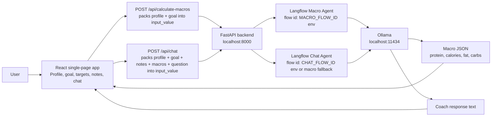
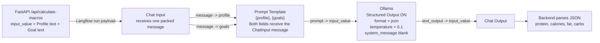
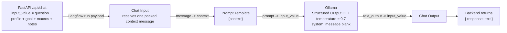
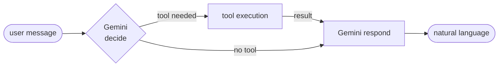

# Research: GitHub Open-Source Knowledge

Source: 40 repos, 287 knowledge files extracted.

## [AI-multi-agentic-consensus-fitness-trainer-] DIAGNOSTIC.md

# API Configuration Diagnostic

## Your API Keys Status

✅ All API keys are loaded from `.env` file

## Common Issues & Solutions

### Perplexity API
**Error**: `400 Bad Request` or `Invalid model`

**Solution**: 
- Check your Perplexity API key format (should start with `pplx-`)
- Verify you have credits/quota available
- Try using model name: `sonar` or `sonar-pro` instead of `llama-3.1-sonar-large-128k-online`

### Gemini API  
**Error**: `404 models/gemini-... is not found`

**Solution**:
- Your API key format looks correct (starts with `AIzaSy`)
- The model name might need to be: `gemini-pro` (older) or check Google AI Studio for available models
- Make sure you're using the correct API (v1 vs v1beta)

### Claude API
**Error**: `404 model not found`

**Solution**:
- Check your Anthropic API key format (should start with `sk-ant-`)
- Verify you have API access (some accounts need approval)
- Try model names without date suffix: `claude-3-5-sonnet` or `claude-3-sonnet`

## Quick Test

Run this to test each API individually:
```bash
python -c "
import asyncio
from llms.perplexity import PerplexityClient
from llms.gemini import GeminiClient  
from llms.claude import ClaudeClient

async def test():
    p = PerplexityClient()
    g = GeminiClient()
    c = ClaudeClient()
    
    print('Testing Perplexity...')
    r1 = await p.chat('test')
    print(f'Perplexity: {r1.get(\"answer\", \"ERROR\")[:50]}')
    
    print('Testing Gemini...')
    r2 = await g.generate('test')
    print(f'Gemini: {r2.get(\"answer\", \"ERROR\")[:50]}')
    
    print('Testing Claude...')
    r3 = await c.messages('test')
    print(f'Claude: {r3.get(\"answer\", \"ERROR\")[:50]}')

asyncio.run(test())
"
```

## Next Steps

1. **Check API Documentation**: Visit each provider's docs for current model names
2. **Verify API Keys**: Make sure keys are active and have credits
3. **Check API Status**: Some APIs might be down or have rate limits

The app will work with just 1 working API key, but you'll get better results with all 3.


---

## [AI-multi-agentic-consensus-fitness-trainer-] QUICKSTART.md

# FitMentor AI - Quick Start Guide

## 🚀 Quick Setup (5 minutes)

### Step 1: Install Dependencies
```bash
pip install -r requirements.txt
```

### Step 2: Set Up Environment Variables
Create a `.env` file in the root directory with:

```env
# LLM API Keys (At least ONE is required, but all 3 recommended for best results)
PERPLEXITY_API_KEY=pplx-your-key-here
GOOGLE_API_KEY=your-gemini-key-here
ANTHROPIC_API_KEY=sk-ant-your-key-here

# Database (Required for persistence)
SUPABASE_URL=https://your-project.supabase.co
SUPABASE_KEY=your-anon-key-here

# YouTube (Optional - for video links)
YOUTUBE_API_KEY=your-youtube-key-here
```

**Where to get API keys:**
- **Perplexity**: https://www.perplexity.ai/settings/api (free tier available)
- **Google Gemini**: https://makersuite.google.com/app/apikey (free tier available)
- **Anthropic Claude**: https://console.anthropic.com/ (free credits available)
- **Supabase**: https://supabase.com/dashboard (create project, then Settings > API) - Optional

**Important**: You need at least ONE API key for the app to work. Having all 3 gives you the multi-LLM consensus feature (the main selling point of this app).

### Step 3: Set Up Database (Optional but Recommended)

1. Create a Supabase project at https://supabase.com
2. Go to SQL Editor
3. Run the SQL from `database/schema.sql`
4. Copy your project URL and anon key to `.env`

**Note**: The app will work without Supabase, but data won't persist between sessions.

### Step 4: Run the App
```bash
streamlit run app.py
```

The app will open in your browser at `http://localhost:8501`

## 🎯 First Steps

1. **Onboarding**: Click "Start Free" and answer 3 quick questions
2. **Ask Questions**: Try asking:
   - "How much protein do I need?"
   - "Create a workout plan for me"
   - "What's the best way to lose weight?"
3. **View Results**: See confidence scores, evidence citations, and video links
4. **Track Progress**: Log your weight, workouts, and meals

## 🧪 Testing Without All API Keys

The app will work with partial API keys, but you'll get reduced functionality:
- **No Perplexity**: Won't get research citations, one less model for consensus
- **No Gemini**: One less model for consensus
- **No Claude**: One less model for consensus
- **No Supabase**: Data won't persist (works in session only) - This is OK!
- **No YouTube**: No video links (app still works)

**Minimum**: You need at least 1 LLM API key. The app works best with all 3.

## 🐛 Troubleshooting

**"Module not found" errors:**
```bash
pip install -r requirements.txt
```

**Supabase "proxy" error:**
If you see `Client.__init__() got an unexpected keyword argument 'proxy'`:
```bash
pip uninstall supabase supabase-auth supabase-functions gotrue -y
pip install supabase==2.8.1 gotrue==2.8.1 httpx==0.24.1
```
This is a version compatibility issue. The app will work without Supabase (local mode).

**API errors:**
- Check your `.env` file has correct keys
- Verify API keys are valid and have credits
- Check internet connection

**Database errors:**
- Verify Supabase URL and key in `.env`
- Make sure you ran the schema.sql in Supabase SQL Editor
- Check that your Supabase project is active
- App works without database (just no persistence)

## 📝 Next Steps

- Customize the onboarding questions
- Add more exercises to `data/exercises.json`
- Add more recipes to `data/recipes.json`
- Customize safety rules in `agents/safety_checker.py`
- Deploy to Streamlit Cloud for public access

## 🎉 You're Ready!

The app is production-ready. All core features are implemented:
- ✅ Multi-LLM consensus
- ✅ Confidence scores
- ✅ Evidence citations
- ✅ YouTube videos
- ✅ Progress tracking
- ✅ Safety flagging

Enjoy your AI fitness coach! 💪


---

## [AI-multi-agentic-consensus-fitness-trainer-] README.md

# FitMentor AI

Your AI Personal Trainer backed by 3 AI models for maximum accuracy.

## Setup

1. Install dependencies:
```bash
pip install -r requirements.txt
```

2. Copy `.env.example` to `.env` and fill in your API keys:
```bash
cp .env.example .env
```

3. Set up Supabase:
   - Create a new Supabase project
   - Run the SQL schema from `database/schema.sql`
   - Copy your Supabase URL and anon key to `.env`

4. Run the app:
```bash
streamlit run app.py
```

## Features

- Multi-LLM consensus validation (Perplexity + Gemini + Claude)
- Confidence scores for every answer
- Evidence citations with research links
- YouTube exercise/recipe videos
- Progress tracking (weight, workouts, meals, measurements)
- Safety auto-flagging system

## API Keys Required

- Perplexity API key
- Google Gemini API key
- Anthropic Claude API key
- Supabase URL and key (optional - app works without it, but data won't persist)
- YouTube API key (optional, for video search)

## Troubleshooting

**Supabase initialization errors:**
If you see `TypeError: Client.__init__() got an unexpected keyword argument 'proxy'`, try:
```bash
pip install httpx==0.24.1 --upgrade
pip install supabase==2.3.4 --upgrade
```

Or simply run without Supabase - the app will work in session-only mode (data won't persist between restarts).


---

## [AI-multi-agentic-consensus-fitness-trainer-] README.md

# LLM Gateway Server

A centralized server for managing all LLM API calls. Run this in Docker to:
- Keep API keys secure (not in the Streamlit app)
- Centralize LLM management
- Easy deployment and scaling

## Quick Start

### Option 1: Docker Compose (Recommended)

1. Create `.env` file with your API keys:
```bash
cd llm_gateway
cp .env.example .env
# Edit .env with your actual API keys
```

2. Start the gateway:
```bash
docker-compose up -d
```

3. Check health:
```bash
curl http://localhost:8000/health
```

### Option 2: Run Locally

```bash
cd llm_gateway
pip install -r requirements.txt

# Set environment variables
export PERPLEXITY_API_KEY=your_key
export GOOGLE_API_KEY=your_key
export ANTHROPIC_API_KEY=your_key

# Run server
python server.py
```

## API Endpoints

### Health Check
```
GET /health
```
Returns status and which API keys are configured.

### Individual LLM Calls
```
POST /llm/perplexity
POST /llm/gemini
POST /llm/claude
```

Request body:
```json
{
  "query": "What exercises help build muscle?",
  "user_context": {
    "age": 25,
    "primary_goal": "Build Muscle",
    "injuries": "Bad shoulder"
  }
}
```

### Consensus (All 3 LLMs)
```
POST /llm/consensus
```

Calls all 3 LLMs in parallel and returns merged response with consensus score.

## Using with Streamlit App

Update your app to use the gateway:

```python
from llm_gateway.client import LLMGatewayClient

# Initialize client
gateway = LLMGatewayClient("http://localhost:8000")

# Get consensus response
response = await gateway.get_consensus(
    query="How do I build muscle?",
    user_context=user_profile
)
```

Or set the environment variable:
```bash
export LLM_GATEWAY_URL=http://localhost:8000
```

## Docker Commands

```bash
# Build and start
docker-compose up -d --build

# View logs
docker-compose logs -f

# Stop
docker-compose down

# Rebuild after changes
docker-compose up -d --build
```

## Security Notes

- API keys are stored in the Docker container's environment, not in code
- The gateway should be behind a firewall in production
- Add authentication for production use (e.g., API key header)


---

## [AI-multi-agentic-consensus-fitness-trainer-] README.md

# FitMentor MCP Server (Docker)

A containerized MCP server for LLM API calls.

## Quick Start

### 1. Build and Run

```bash
cd mcp_server
docker-compose up -d --build
```

### 2. Check Health

```bash
curl http://localhost:8000/health
```

Should return:
```json
{"status": "healthy", "perplexity": true, "gemini": true, "claude": true}
```

### 3. Configure Cursor

Update `~/.cursor/mcp.json`:

```json
{
  "mcpServers": {
    "fitmentor-llm": {
      "url": "http://localhost:8000"
    }
  }
}
```

Then restart Cursor.

## API Endpoints

| Endpoint | Method | Description |
|----------|--------|-------------|
| `/health` | GET | Health check & API key status |
| `/tools` | GET | List available tools |
| `/tools/call_perplexity` | POST | Call Perplexity |
| `/tools/call_gemini` | POST | Call Gemini |
| `/tools/call_claude` | POST | Call Claude |
| `/tools/get_consensus` | POST | Call all 3 & merge |
| `/mcp/tools/call` | POST | MCP-compatible tool call |

## Example Requests

### Get Consensus
```bash
curl -X POST http://localhost:8000/tools/get_consensus \
  -H "Content-Type: application/json" \
  -d '{
    "query": "What is the best protein intake for muscle building?",
    "user_profile": {
      "primary_goal": "Build Muscle",
      "weight": 180,
      "fitness_experience": "Intermediate"
    }
  }'
```

### Call Single LLM
```bash
curl -X POST http://localhost:8000/tools/call_claude \
  -H "Content-Type: application/json" \
  -d '{"query": "How many calories should I eat to lose weight?"}'
```

## Docker Commands

```bash
# Start
docker-compose up -d

# View logs
docker-compose logs -f

# Stop
docker-compose down

# Rebuild after changes
docker-compose up -d --build
```

## Update Streamlit App

To use the MCP server from your Streamlit app, set:

```bash
export LLM_GATEWAY_URL=http://localhost:8000
streamlit run app.py
```

The app will automatically use the Docker MCP server instead of direct API calls.


---

## [Athlytics] NEWS.md

# Athlytics 1.0.5

## Robustness and documentation updates

* ACWR, EWMA ACWR, and exposure calculations now avoid treating unavailable
  pre-export history as zero-load rest days. EWMA also uses the corrected
  half-life mapping and overlapping moving-block bootstrap confidence bands.

* Stream-based EF, decoupling, and PB calculations are more robust with ZIP
  exports, POSIXct stream timestamps, missing activity filenames, and activity
  streams with pauses, distance plateaus, or GPS bounce-backs.

* Local Strava parsing is more tolerant of duplicate CSV headers, TCX timestamps
  ending in `Z`, and TCX/GPX extension fields that use alternate namespace
  prefixes for heart rate, cadence, or power.

* Public examples and documentation now match the current offline ZIP workflow:
  examples pass explicit `activity_type` values, stream-based functions show
  `export_dir`, PB output documents `time_basis`, and ACWR wording uses
  descriptive bands rather than injury-risk claims.

* Regression tests were expanded across ACWR/EWMA, EF, decoupling, PBs, local
  activity loading, XML stream parsing, cohort-reference plotting, and public
  documentation wording.

## CI and data-import diagnostics

* **`pkgcheck` now runs after the multi-platform `R-CMD-check` workflow.**
  The workflow uses the current `ropensci-review-tools/pkgcheck-action`
  entrypoint, checks out the repository explicitly with `actions/checkout@v5`,
  and skips the action's internal checkout. The report is treated as advisory so
  rOpenSci/goodpractice recommendations remain visible without overriding the
  already-green R CMD check gate.

* **`load_local_activities()` now fails earlier with a clearer Strava export
  schema message.** CSV files with localized or otherwise missing required
  columns now report the missing English Strava columns and point users to the
  Strava language setting before they request a fresh export.

## Major analysis-quality fixes

* **`calculate_ef()` stream path now uses continuous-block steady-state
  detection.** Previously EF was computed as the median ratio across every
  scattered point whose rolling CV cleared `steady_cv_threshold`, so an
  interval workout with three short "steady islands" could silently pass
  the `min_steady_minutes` gate. The stream path now mirrors
  `calculate_decoupling()`: it uses `rle()` to find contiguous steady
  runs and only accepts activities whose *longest* run lasts at least
  `min_steady_minutes`. New output columns `steady_duration_minutes`,
  `n_steady_blocks`, and `sampling_interval_seconds` make the accepted
  block auditable; new status code `"insufficient_steady_duration"`
  distinguishes this from the old `"non_steady"`.

* **`gap_hr` stream-path fallback is now explicit.** When the stream has
  no grade-adjusted channel the function still falls back to plain
  speed/HR, but the returned row now records this via
  `ef_metric_requested = "gap_hr"`, `ef_metric_used = "speed_hr"`, and
  the new status string `"gap_stream_unavailable_fallback_to_speed"`.
  Downstream consumers that need strict GAP semantics can now filter on
  these columns instead of assuming the `ef_metric` argument equals the
  metric actually computed.

* **Rolling windows are now time-based, not row-based.** `calculate_ef()`,
  `calculate_decoupling()`, and `flag_quality()` previously assumed 1 Hz
  sampling (`window_size <- 300` rows). The effective window silently
  rescaled on 0.5 Hz smart-recording or multi-Hz streams. A new internal
  `estimate_sampling_interval()` helper reads `diff(time)` and the three
  functions now target wall-clock windows; the observed interval is
  exposed as `sampling_interval_seconds` on EF/decoupling output and as
  `attr(result, "sampling_interval_seconds")` on flag_quality output.

* **`flag_quality()` HR / power jump thresholds honour their "per-second"
  documentation.** `max_hr_jump = 10` is now compared against
  `|dHR/dt|` (bpm / s) rather than raw sample-to-sample differences; the

---

## [Athlytics] README.md

<p align="center">
  
</p>

<h1 align="center">Athlytics</h1>

<p align="center">
  <!-- Group 1: CRAN release status -->
  <a href="https://cran.r-project.org/package=Athlytics"></a>
  <a href="https://cran.r-project.org/package=Athlytics"></a>
  <a href="https://CRAN.R-project.org/view=SportsAnalytics"></a>
  <br>
  <!-- Group 2: CI/CD, Reviews & Licenses -->
  <a href="https://github.com/ropensci/Athlytics/actions/workflows/R-CMD-check.yml"></a>
  <a href="https://github.com/ropensci/software-review/issues/728"></a>
  <a href="https://docs.ropensci.org/Athlytics/"></a>
  <a href="https://app.codecov.io/gh/ropensci/Athlytics"></a>
  <a href="https://www.repostatus.org/#active"></a>
  <a href="https://opensource.org/licenses/MIT"></a>
</p>

<p align="center">
  <strong>Current release installs directly from CRAN with <code>install.packages("Athlytics")</code>.</strong>
</p>


## Overview

**Athlytics** is a research-oriented R package for the longitudinal analysis of endurance training. It operates entirely on **local [Strava](https://www.strava.com/) exports** (or FIT/TCX/GPX files), avoiding API dependencies to ensure **privacy** and long-term **reproducibility**.

> **What is Strava?** [Strava](https://www.strava.com/) is a popular fitness tracking platform used by millions of athletes worldwide to record and analyze their running, cycling, and other endurance activities. Users can export their complete activity history for offline analysis.

The package standardizes the workflow from data ingestion and quality control to model estimation and uncertainty quantification. Implemented endpoints include **acute-to-chronic workload ratio (ACWR)**, **aerobic efficiency (EF)**, and **cardiovascular decoupling (pa:hr)**, alongside personal-best and exposure profiles suitable for **single-subject** and **cohort** designs. All functions return tidy data, facilitating statistical modeling and figure generation for academic reporting.

## Key Features

* **Reproducible by design** - Fully offline; no API keys. Deterministic pipelines suitable for longitudinal studies.
* **Sports-science metrics** - Implements ACWR, EF, and decoupling workflows commonly used in exercise physiology; integrated **QC** checks.
* **Uncertainty-aware** - Functions return confidence intervals or reference bands where implemented, enabling transparent inference.
* **Cohort support** - Built-in helpers for multi-athlete datasets and percentile-band references.
* **Tidy outputs** - Consistent, analysis-ready tibbles for downstream modeling and figure pipelines.


## 📦 Installation

**Install the current CRAN release**

Athlytics is now available directly from CRAN. For most users, this is the
recommended installation path:

```r
install.packages("Athlytics")
```

The CRAN release includes the offline Strava export workflow, ZIP-aware stream
parsing, ACWR/EWMA/exposure robustness fixes, EF and decoupling stream
diagnostics, cohort-referen

---

## [Athlytics] PULL_REQUEST_TEMPLATE.md

## Description
<!-- Provide a clear and concise description of your changes -->

Fixes #(issue number)

## Type of change
<!-- Please check the relevant option(s) -->

- [ ] Bug fix (non-breaking change which fixes an issue)
- [ ] New feature (non-breaking change which adds functionality)
- [ ] Breaking change (fix or feature that would cause existing functionality to not work as expected)
- [ ] Documentation update
- [ ] Performance improvement
- [ ] Code refactoring
- [ ] Test coverage improvement

## Changes Made
<!-- List the specific changes in this PR -->

- 
- 
- 

## Testing
<!-- Describe the tests you ran to verify your changes -->

- [ ] All existing tests pass (`devtools::test()`)
- [ ] Added new tests for new functionality
- [ ] Tested manually with real Strava data
- [ ] R CMD check passes with no errors, warnings, or notes
- [ ] Code coverage maintained or improved

### Test results
```r
# Paste relevant test output here
```

## Documentation
<!-- Check all that apply -->

- [ ] Updated function documentation (roxygen2)
- [ ] Updated README (if applicable)
- [ ] Updated NEWS.md
- [ ] Updated vignettes (if applicable)
- [ ] All examples run successfully

## Code Quality
<!-- Ensure your code meets quality standards -->

- [ ] My code follows the style guidelines of this project
- [ ] I have performed a self-review of my own code
- [ ] I have commented my code, particularly in hard-to-understand areas
- [ ] My changes generate no new warnings or errors
- [ ] I have checked for and resolved any merge conflicts

## Dependencies
<!-- If your changes affect dependencies -->

- [ ] No new dependencies added
- [ ] New dependencies added (list below with justification)
  - Package: 
  - Reason: 

## Breaking Changes
<!-- If this is a breaking change, describe the impact and migration path -->

**Does this PR introduce breaking changes?**
- [ ] Yes
- [ ] No

If yes, please describe:
- What breaks: 
- How to migrate: 

## Additional Notes
<!-- Any additional information, context, or screenshots -->

## Checklist for Reviewers
<!-- For maintainers reviewing this PR -->

- [ ] Code follows project conventions
- [ ] Tests are adequate and pass
- [ ] Documentation is complete and accurate
- [ ] Changes are backwards compatible (or breaking changes are justified and documented)
- [ ] NAMESPACE and DESCRIPTION are updated if needed
- [ ] NEWS.md is updated

---

**Note:** By submitting this pull request, I confirm that my contribution is made under the terms of the MIT License and I have read and agree to the [Code of Conduct](CODE_OF_CONDUCT.md).


---

## [Athlytics] bug_report.md

---
name: Bug report
about: Report a bug in Athlytics
title: '[BUG] '
labels: bug
assignees: ''

---

**Describe the bug**
A clear and concise description of what the bug is.

**To Reproduce**
Steps to reproduce the behavior:
1. Load data with '...'
2. Run function '....'
3. See error

**Minimal reproducible example**
```r
# Please provide a minimal reproducible example
library(Athlytics)

# Your code here
```

**Expected behavior**
A clear and concise description of what you expected to happen.

**Actual behavior**
What actually happened instead.

**Error message**
```
Paste the complete error message here
```

**System information:**
 - OS: [e.g., Windows 11, macOS 14.0, Ubuntu 22.04]
 - R version: [e.g., 4.3.2]
 - Athlytics version: [e.g., 1.0.0]
 - Installation source: [CRAN or GitHub]

**Session Info**
<details>
<summary>Click to expand</summary>

```r
# Please run sessionInfo() and paste the output here
sessionInfo()
```
</details>

**Additional context**
Add any other context about the problem here (e.g., size of dataset, specific activity types, etc.)

**Data Privacy Note**
Please do NOT share any personal training data or identifiable information in this issue.


---

## [Athlytics] documentation.md

---
name: Documentation improvement
about: Suggest improvements to documentation, examples, or vignettes
title: '[DOCS] '
labels: documentation
assignees: ''

---

**Which documentation needs improvement?**
- [ ] Function documentation (Rd files)
- [ ] README
- [ ] Vignettes
- [ ] Website (pkgdown)
- [ ] Code comments
- [ ] Other: ___________

**Location**
Please specify where the documentation issue is:
- Function name: 
- File path: 
- URL: 

**Current documentation (if applicable)**
Paste or describe the current documentation that needs improvement.

**Suggested improvement**
Describe what should be added, clarified, or corrected.

**Why is this improvement needed?**
Explain how this would help users understand or use Athlytics better.

**Additional context**
Add any other context, examples, or references here.


---

## [Athlytics] feature_request.md

---
name: Feature request
about: Suggest an idea for Athlytics
title: '[FEATURE] '
labels: enhancement
assignees: ''

---

**Problem or motivation**
What problem would this feature solve?

**Proposed solution**
Describe the feature you'd like to see.

**Alternatives considered**
Other approaches you've evaluated.

**Use case**
How would this feature be used? What problem does it solve?
- For single-athlete analysis?
- For cohort/team analysis?
- For research purposes?

**Expected function signature (if applicable)**
```r
# Example of how you envision using this feature
result <- new_function(
  data = activities,
  parameter1 = value1,
  parameter2 = value2
)
```

**Additional context**
Any other relevant information.

**References**
If this feature is based on published research or methodology, please cite the relevant papers:
- Author et al. (Year). Title. Journal. DOI: ...

**Implementation considerations**
Are you willing to contribute to implementing this feature? (optional)
- [ ] Yes, I can help with implementation
- [ ] Yes, I can help with testing
- [ ] Yes, I can help with documentation
- [ ] I can provide example data for testing (de-identified)


---

## [Athlytics] paper.md

---
title: 'Athlytics: Reproducible Scientific Workflows for Cohort Analysis of Endurance Training Using Local Strava Exports'
tags:
  - R
  - sports science
  - endurance
  - Strava
  - cohort analysis
  - reproducibility
  - ACWR
  - cardiovascular decoupling
authors:
  - name: Zhiang He
    orcid: 0009-0009-0171-4578
    affiliation: 1
affiliations:
  - name: Medical Artificial Intelligence Innovation Center, Shanghai East Hospital, Tongji University, Shanghai, China
    index: 1
date: 13 June 2026
bibliography: paper.bib
version: 1.0.5
license: MIT
---

# Summary

Athlytics is an R package for reproducible, offline analysis of endurance-training data exported from Strava. It reads local ZIP and CSV exports and provides a pipeline for import, quality control, cohort summaries, and visualization of metrics including acute-to-chronic workload ratios (ACWR) [@gabbett2016], aerobic efficiency, and cardiovascular decoupling (pa:hr). The package is designed for analyses that need to be repeatable without OAuth credentials, API quotas, or changing service availability.

# Statement of Need

Researchers and coaches working with wearable data often need to combine API clients, file parsers, quality-control scripts, and metric-specific code before analysis can begin. This is especially fragile for cohort-scale studies, where authentication, rate limits, and inconsistent export formats can obstruct reproducible workflows. Athlytics fills this gap by offering one research-oriented R workflow for local Strava export archives, from raw XML/FIT/CSV-derived activity data to physiological indicators and cohort reference bands. Its primary audience is sports scientists, sports epidemiologists, and endurance coaches who need auditable, programmatic analyses across one or more athletes.

# Related Work

We provide a direct feature comparison to highlight the capabilities essential for reproducible, cohort-scale research.

| Feature (research-relevant) | **Athlytics** | rStrava [@rStrava] | trackeR [@trackeR_jss] | activatr [@activatr] | ACWR [@ACWR] | injurytools [@injurytools] |
| :--- | :---: | :---: | :---: | :---: | :---: | :---: |
| **Offline archives; No OAuth/tokens/quotas** | ✓ | ✕ (API) | ✓ | ✓ | ✓ (tabular) | ✓ (tabular) |
| **API-limited (OAuth, scope, rate-limits)** | ✕ | ✓ | ✕ | ✕ | ✕ | ✕ |
| **End-to-end pipeline (Import→QC→Models→Plot)** | ✓ | ✕ | **Partial** (parsing/viz) | **Partial** (parsing/pace) | ✕ | ✕ |
| **Built-in metrics (ACWR/EF/decoupling)** | ✓ | ✕ | ✕ | ✕ | **Partial** (ACWR only) | ✕ |
| **Steady-state guards & HR-coverage checks** | ✓ | ✕ | ✕ | ✕ | ✕ | ✕ |
| **Uncertainty (ACWR-EWMA confidence bands)** | ✓ | ✕ | ✕ | ✕ | ✕ | ✕ |
| **Cohort benchmarking (percentile bands)** | ✓ | ✕ | **Partial** (summaries only) | ✕ | ✕ | **Partial** (for injury/exposure) |
| **Diagnostic outputs (status codes/fields)** | ✓ | ✕ | ✕ | ✕ | ✕ | ✕ |

Compared with existing R tools, Athlytics combines local Strava export ingestion, quality-control checks, ACWR/EF/decoupling workflows, uncertainty summaries, and cohort reference bands in a single offline workflow.

# Software Description

-   **Offline Data Parsing:** Operates directly on local Strava ZIP exports. Using `.tcx` and `.gpx` parsers through `xml2` plus optional `.fit` parsing through `FITfileR` [@FITfileR], activity streams are loaded on demand.
-   **Physiological & Load Metrics:** Supports multiple load tracking algorithms including HRSS (TRIMP-based) and TSS approximations. Calculates core metrics such as cardiovascular decoupling (pa:hr), Efficiency Factor (EF), and automatically tracks Personal Bests (PBs) using distance-based best-effort search over activity streams.
-   **Signal Processing & Quality Control:** Automatically filters implausible HR, power, and velocity samples and identifies steady-state output segments using a rolling coefficient of variation (CV) algorithm to support valid physiological comparisons.
-   **Uncertainty Quantification:** Provides confid

---

## [Data-Driven-Cycling-and-Workout-Prediction] Readme.md

# Data-Driven Cycling and Workout Prediction

In this repo I'll share how I turned data from my bike exercises into a Machine Learning based smart bot leveraging Microsoft Bot Framework and Microsoft Teams, which helps me achieve more with my training and be motivated all the time.

## Overview

I started cycling with a foldable bike at end of January 2020 and I fell in love with cycling. I also love working with data so I've recorded all my rides to [Strava](www.strava.com) with [Withings Steel HR](https://www.withings.com/us/en/steel-hr) smart watch. 🚴🏻🚴🏻

At the end of May I upgraded my city bike to a Gravel bike. I had great time with my new bike with outdoor activities until autumn.


After exercising outside with nice weather, for cold weather I setup a pain-cave at my home for virtual rides on [Zwift](www.zwift.com) using [Elite Arion AL13 roller](https://www.elite-it.com/en/products/home-trainers/rollers/arion) with [Misuro B+ sensor](https://www.elite-it.com/en/products/home-trainers/sensors/misuro-b). Zwift is a virtual environment where you connect with your 3D avatar to ride with other athletes real-time.


My Zwift account is connected with Strava to collect all my ride data, and I’ve completed **“3700km”** so far combining outdoor and indoor activities 🎉🎉

I've decided to analyze my data and after analyzing I've decided to take this to the next level with my engineering capabilities.

This repo shows how to analyze your Strava data and visualize it using Jupyter Notebooks. Furthermore, this project aims to predict potential workout days and distance to find an optimal workout routine using your own data. This digital personal trainer can be used as a workout companion.

This project first started as a data discovery of existing bulk data on Jupyter Notebook. During data exploration phase I saw some patterns and thought that, these patterns could help me get back in shape again. Shortly after, I've decided to build a predictive model to predict my workout, `ride type` and  `distance` values. To use the prediction model within a bot framework, the model is exported as pickle file, a FastAPI based app serves the model in Python and a chat bot on Microsoft Teams calling this API help me to provide some inputs and then retrieve prediction.


## Data Discovery - Highlights

Let's have a look at some highlights I achieved so far, here are some highlights about my data.

1. In 1 year, I've completed around **3700 km** including outdoor and indoor workout activities. Around 1/3 are virtual rides on Zwift.

    

2. In 2019, I gained some fat, but as a result of my physical activities and some healthy food, I lost ~13kgs (~28lbs) during this time.

    

3. I love below weekly graph showcasing all important life events happened in one year.

    * Jan-Mar: A lot of a passion for workout
    * April-June: Pandemic and lockdown in Turkey
    * June-December: Enjoying riding outdoor and indoor
    * December: new year break challenge #Rapha500
    * Jan: Blessed with a new family member :)
    * Jan - March: Trying to find my old routine again, last but not least decided to build a digital personal trainer.

    

4. So far, my longest distance in one ride is 62km, and I love this graph showing my performance over time;

    

## Correlation

While I was checking ride types, I realized that after a certain point I only switched to Indoor Virtual Ride and I wanted to see if there's a correlation between selecting indoor rides and the weather, specifically with `Wind` and `Temperature`. For that I used a Weather API to retrieve Weather condition during my workouts and results were c

---

## [Data-Driven-Cycling-and-Workout-Prediction] README.md

# CyclingBot

Bot Framework v4 echo bot sample.

This bot has been created using [Bot Framework](https://dev.botframework.com), it shows how to create a simple bot that accepts input from the user and echoes it back.

## Prerequisites

- [.NET Core SDK](https://dotnet.microsoft.com/download) version 3.1

  ```bash
  # determine dotnet version
  dotnet --version
  ```

## To try this sample

- In a terminal, navigate to `CyclingBot`

    ```bash
    # change into project folder
    cd # CyclingBot
    ```

- Run the bot from a terminal or from Visual Studio, choose option A or B.

  A) From a terminal

  ```bash
  # run the bot
  dotnet run
  ```

  B) Or from Visual Studio

  - Launch Visual Studio
  - File -> Open -> Project/Solution
  - Navigate to `CyclingBot` folder
  - Select `CyclingBot.csproj` file
  - Press `F5` to run the project

## Testing the bot using Bot Framework Emulator

[Bot Framework Emulator](https://github.com/microsoft/botframework-emulator) is a desktop application that allows bot developers to test and debug their bots on localhost or running remotely through a tunnel.

- Install the Bot Framework Emulator version 4.5.0 or greater from [here](https://github.com/Microsoft/BotFramework-Emulator/releases)

### Connect to the bot using Bot Framework Emulator

- Launch Bot Framework Emulator
- File -> Open Bot
- Enter a Bot URL of `http://localhost:3978/api/messages`

## Deploy the bot to Azure

To learn more about deploying a bot to Azure, see [Deploy your bot to Azure](https://aka.ms/azuredeployment) for a complete list of deployment instructions.

## Further reading

- [Bot Framework Documentation](https://docs.botframework.com)
- [Bot Basics](https://docs.microsoft.com/azure/bot-service/bot-builder-basics?view=azure-bot-service-4.0)
- [Activity processing](https://docs.microsoft.com/en-us/azure/bot-service/bot-builder-concept-activity-processing?view=azure-bot-service-4.0)
- [Azure Bot Service Introduction](https://docs.microsoft.com/azure/bot-service/bot-service-overview-introduction?view=azure-bot-service-4.0)
- [Azure Bot Service Documentation](https://docs.microsoft.com/azure/bot-service/?view=azure-bot-service-4.0)
- [.NET Core CLI tools](https://docs.microsoft.com/en-us/dotnet/core/tools/?tabs=netcore2x)
- [Azure CLI](https://docs.microsoft.com/cli/azure/?view=azure-cli-latest)
- [Azure Portal](https://portal.azure.com)
- [Language Understanding using LUIS](https://docs.microsoft.com/en-us/azure/cognitive-services/luis/)
- [Channels and Bot Connector Service](https://docs.microsoft.com/en-us/azure/bot-service/bot-concepts?view=azure-bot-service-4.0)


---

## [DataScienceProjects] README.md

## Overview

In this repository, you will find the source code to various projects I have been working on or still work-in-progress. The majority of the projects are accompanied by a Medium blog posts at [tuannguyen-doan.medium.com](https://tuannguyen-doan.medium.com/). I published almost exclusively on Towards Data Science publication through Medium's Partnership program so please check out these articles as a way to support me and my future projects. Alternatively, you can also find my blog posts at my personal website [here](https://tuangauss.github.io/).

My interests lie in the intersection of statistical techniques, data visualization and sports (especially football). All the codes are written entirely in Python or R. I don't have a strong preference or attempt to make a concerted effort to code in a specific language/platform. The decision is mostly based on how specific functionalities needed for a project are supported (scraping in Python and data processing with dplyr piping in R).

### I. Statistical application:

#### The statistics of modern football:
A collection of projects that explore the intricate statistical aspect of the Beautiful Game

- [Empirical Bayes and penalty taking ability](https://towardsdatascience.com/men-of-steel-finding-the-best-penalty-takers-with-empirical-bayes-estimation-aa0e126fb08b) - Using Bayesian statistics to make meaningful comparison between players across Europe.
- [Poisson process and match prediction](https://towardsdatascience.com/o-jogo-bonito-predicting-the-premier-league-with-a-random-model-1b02fa3a7e5a) - Here we learn about the Poisson process and how a random model outperforms football experts with its prediction.
- [The mathematics of football betting strategies](https://towardsdatascience.com/making-big-bucks-with-a-data-driven-sports-betting-strategy-6c21a6869171) - With the Poisson model and some additional help from mathematical research, can we beat the bookies?
- [Fisher vs Neyman-Person debate and Paul the Octopus](https://towardsdatascience.com/what-can-an-octopus-tell-us-about-the-biggest-debate-in-statistical-theory-f017295d781f) - We went over the theory (or many theories) of hypothesis testings and see how they apply to the psychic ability of Paul the Octopus.

#### Statistical theory and its application:

- [Bayes theorem and a probabilistic argument for God](https://towardsdatascience.com/a-bayesian-quest-to-find-god-b30934972473) - Bayes theory and how people have been using it to justify the necessary existence of God.
- [Dating with probability theory](https://towardsdatascience.com/probability-theory-and-the-optimal-dating-strategy-for-2018-2b75b26fb0b) - Here we explore what probability theory has to say about the most optimal strategy to find the love of your life.
- [Bayes theorem and why it matters to my workout routine](https://towardsdatascience.com/how-bayesian-statistics-convinced-me-to-hit-the-gym-fa737b0a7ac) - A lightweight introduction to Bayes' theorem and how it helps convince me to hit the gym.
- [The Rule of Three and its application](https://towardsdatascience.com/the-rule-of-three-calculating-the-probability-of-events-that-have-not-yet-occurred-106144dc2c39) - A short introduction of the Rule of Three and how we can apply it to calculate the probability of events that have yet to happen. Application in voting, vaccine development, product quality monitoring, etc.
- [Lindy's effect](https://towardsdatascience.com/a-statistical-rule-to-optimize-your-life-the-lindys-effect-96d2c75b080d) - A (slightly) mathematical description of the Lindy's effect and how one can use it as a guide for life.
- [Normal Distribution with High Dimensionality](https://towardsdatascience.com/disney-movies-were-right-we-are-all-special-and-statistically-so-3bb56e79ab71) - A statistical investigation into the myth of the "average Joe."
- [Mark-Recapture method](https://medium.com/towards-data-science/the-statistical-theory-behind-why-your-instagram-posts-have-so-

---

## [Edge-AI-Gait-Classification] README.md

# Edge-AI-Gait-Classification
Deployed an optimized Convolutional Neural Network (CNN) using TensorFlow Lite Micro on a Cortex-M4,  for real-time gait classification (Walking, Running, Limping). BLE data pipeline for remote clinical monitoring, facilitating objective biomechanical analysis for post-surgery rehabilitation and injury prevention


---

## [FitAI-Pro-Multi-Agent-AI-Fitness-Coaching-Platform] README.md

# AI Fitness Orchestrator 🏋️

Multi-agent fitness platform with RAG, Egyptian Arabic fine-tuning, video generation, and automated weekly plans.

## Architecture

```
User (Streamlit)  ──►  FastAPI  ──►  LangGraph Agent Graph
                                          │
                          ┌───────────────┼───────────────┐
                          │               │               │
                    Supervisor       RAG Retrieval    (routes to)
                          │               │               │
                    ┌─────┴─────┐         │          ┌────┴────┐
                 Fitness     Nutrition  Qdrant     Motivation  RAG
                 Agent        Agent    (BGE-M3)    Agent      Answer
                (GPT-4o)   (GPT-3.5)           (Llama 3B)
                          │
                    PostgreSQL + Redis + Celery
```

## Quick Start

### Step 1 — Prerequisites
- Docker Desktop: https://www.docker.com/products/docker-desktop
- Git: https://git-scm.com

### Step 2 — Clone & Configure
```bash
git clone <your-repo-url>
cd ai-fitness-platform
cp .env.example .env
```

Open `.env` and set at minimum ONE of:
- `OPENAI_API_KEY` from https://platform.openai.com
- `GROQ_API_KEY` (FREE) from https://console.groq.com

### Step 3 — Launch
```bash
chmod +x start.sh
./start.sh
```

### Step 4 — Open
- **Streamlit UI**: http://localhost:8501
- **API Docs**: http://localhost:8000/docs
- **Qdrant**: http://localhost:6333/dashboard
- **n8n**: http://localhost:5678 (admin/admin123)

## Import n8n Workflow
1. Open http://localhost:5678
2. Settings → Import from File → select `n8n/workflow.json`
3. Activate the workflow

## Fine-Tune on Google Colab
1. Run: `python finetuning/prepare_dataset.py`
2. Upload `finetuning/fitness_arabic_dataset.jsonl` to Colab
3. Copy the `COLAB_CODE` from `prepare_dataset.py` into Colab cells
4. Runtime → Change runtime type → T4 GPU → Run All
5. Download `motivation_ar.gguf` → place in `models/`

## Services
| Service    | Port | Purpose              |
|------------|------|----------------------|
| Streamlit  | 8501 | User interface       |
| FastAPI    | 8000 | API backend          |
| PostgreSQL | 5432 | Main database        |
| Qdrant     | 6333 | Vector search (RAG)  |
| Redis      | 6379 | Celery task queue    |
| n8n        | 5678 | Weekly automation    |

## Stop
```bash
docker-compose down
```

## Wipe all data
```bash
docker-compose down -v
```


---

## [FitAgent] MANUAL_QA_CHECKLIST.md

# FitAgent Manual QA Checklist

Use this checklist while testing in Simulator, then repeat the device-only items
on a real iPhone and Apple Watch. Only tick a box after you personally verify it.
If a report feature is not implemented yet, leave it unticked and add a note or
issue.

## Build And Backend

- [ ] iOS Debug build succeeds in Xcode.
- [ ] iOS Release/archive build succeeds with signing configured.
- [ ] `/health` returns `200 OK` from Azure App Service.
- [ ] `/ai` `coach_quick` returns a real GPT-5.5 coaching answer.
- [ ] `/ai` `parse_food` returns valid JSON with `needs_confirmation: true`.
- [ ] Backend rejects empty messages.
- [ ] Backend rejects unsupported task names.
- [ ] Backend rate limiting works when request volume exceeds the configured limit.
- [ ] Backend does not expose Azure keys in source, logs, or app bundle.
- [ ] Release iOS app points to the Azure backend URL.
- [ ] Debug iOS app can use local backend or `FITAGENT_API_BASE_URL` override.

## iPhone Simulator Smoke Test

- [ ] Fresh install launches to the black FitAgent landing screen.
- [ ] Landing screen shows the centered FitAgent dumbbell logo.
- [ ] Continue with Apple checks iCloud/CloudKit account status.
- [ ] If iCloud is unavailable in Simulator, Continue Setup Locally appears and opens first-time setup.
- [ ] First-time setup opens before the five-tab app shell.
- [ ] Finish Setup enters the five-tab app shell and opens Today as the home page.
- [ ] Bottom tabs show Today, Log, Coach, Progress, and Profile.
- [ ] Today tab renders without layout overlap.
- [ ] Log tab renders food, sleep, measurement, and workout sections.
- [ ] Coach tab renders existing assistant message and input bar.
- [ ] Progress tab renders biceps and waist charts.
- [ ] Profile tab renders editable profile, targets, Apple Health, and iCloud sections.
- [ ] App state persists after force quitting and reopening the simulator app.

## Onboarding And Profile

- [ ] Landing screen matches the black Apple-style layout with FitAgent name, centered logo, and bottom account button.
- [ ] App icon uses the real dumbbell asset.
- [ ] User can link/check Apple iCloud account status.
- [ ] User can continue locally for simulator testing when iCloud is unavailable.
- [ ] User can complete first-time profile setup.
- [ ] First-time profile setup appears only until Finish Setup is completed.
- [ ] Completed setup skips onboarding on the next app launch.
- [ ] User can edit name.
- [ ] User can edit primary goal.
- [ ] User can edit sex/activity/training level.
- [ ] User can edit height and weight.
- [ ] User can edit calorie target.
- [ ] User can edit protein target.
- [ ] User can edit hydration target.
- [ ] User can edit sleep target.
- [ ] User can edit dietary preferences.
- [ ] User can edit gym/equipment access.
- [ ] Edited profile values persist after app restart.
- [ ] AI-guided conversational onboarding works. Report target; currently not fully implemented.
- [ ] Manual profile setup includes all report fields. Report target; currently partial.

## Today Dashboard

- [ ] Today summary shows calories remaining.
- [ ] Today summary shows protein remaining.
- [ ] Today summary shows sleep duration.
- [ ] Calories metric progress displays correctly.
- [ ] Protein metric progress displays correctly.
- [ ] Sleep metric progress displays correctly.
- [ ] Recovery metric displays correctly.
- [ ] Activity metric displays active energy and exercise minutes.
- [ ] Steps metric displays step count.
- [ ] Next Best Action changes based on protein gap, sleep, and workout state.
- [ ] Sync Apple Health button does not crash in simulator.
- [ ] Dashboard labels sleep source.
- [ ] Dashboard shows source and last sync metadata. Report target; currently partial.
- [ ] Water, fiber, carbs, fat, sleep, activity, and recovery rings/cards all exist. Report target; currently partial.

## Food Logging

- [ ] User can type a meal into the food text box.
- [ ] Dictate button requests 

---

## [FitAgent] PRIVACY.md

# FitAgent Privacy Notes

FitAgent handles health, nutrition, workout, sleep, and body measurement data.

## Data Stored on Device

- Profile and goals
- Food logs and nutrition estimates
- Workouts and sets
- Body measurements
- Sleep logs
- Chat history and AI memories

The iOS app stores this data locally first. The Profile screen can back up and
restore the current private app snapshot through the user's CloudKit private
database.

## Data Sent to the Backend

The app sends only the text and context needed for the selected AI task. Raw
audio is not sent to the backend. Speech recognition happens on device through
Apple's Speech framework.

## Data Not Stored in the App

- Azure Foundry API keys
- Raw microphone audio recordings
- Backend secrets

## Before App Store Release

Add a public privacy policy URL, complete App Store privacy nutrition labels,
verify HealthKit permission copy on a real device, and add account/data deletion
flows if public accounts are introduced.


---

## [FitAgent] README.md

# FitAgent Starter

A production-grade starter scaffold for an Apple-native AI fitness, nutrition, sleep, recovery, and workout app.

This ZIP contains:

- `ios/FitAgent.xcodeproj` — iOS SwiftUI project you can open in Xcode.
- `ios/FitAgent` — SwiftUI app, app state, local persistence, HealthKit service, Speech-to-Text service, CloudKit placeholder, and Azure backend client.
- `watchOS/` — watchOS companion SwiftUI source files to add as a Watch App target after the iOS app is running.
- `backend/` — FastAPI backend that keeps Azure Foundry credentials off the iPhone app.
- `SETUP_XCODE.md` — step-by-step Xcode setup.
- `SETUP_AZURE.md` — step-by-step Azure/FastAPI setup.
- `MANUAL_QA_CHECKLIST.md` — report-aligned checklist for simulator, device, backend, HealthKit, CloudKit, and Watch verification.
- `PRIVACY.md` and `SECURITY.md` — launch notes for handling health data and backend secrets.

## What this starter already includes

- Dark-mode-first SwiftUI UI with 5 tabs: Today, Log, Coach, Progress, Profile.
- Mock nutrition/recovery dashboard based on the FitAgent product concept.
- Native iOS speech-to-text flow: mic → transcript → editable text → send.
- HealthKit permission request service and sample daily health import hooks.
- API client that calls your own backend instead of calling Azure Foundry directly.
- Backend route policies for GPT-5.5 task types: food parsing, coach chat, meal suggestions, recovery analysis, weekly review.
- Structured food parsing with server-side JSON validation and in-app confirmation before saving.
- Manual logging for sleep, biceps/waist/body measurements, and simple set-based workouts.
- Azure App Service production URL support in Release builds.
- No Azure Foundry keys inside the iOS app.

## Important reality check

This is now a stronger MVP codebase, but App Store production still requires real-device HealthKit/Watch testing, Apple Developer signing, privacy review, full CloudKit record sync, nutrition database licensing, crash reporting, and a public user-auth model such as Sign in with Apple.

Start by running the iOS app, then connect the backend, then add HealthKit, then add CloudKit, then add the Watch target.


---

## [FitAgent] SECURITY.md

# FitAgent Security Notes

## Backend Secrets

Azure Foundry credentials must stay in Azure App Service application settings,
Key Vault, or local `.env` files that are ignored by git. Never put Azure keys in
the iOS app bundle.

## Backend Controls

The FastAPI backend includes:

- task allow-listing
- request size checks
- context size checks
- in-memory rate limiting
- configurable CORS
- safe Azure error messages
- optional `X-FitAgent-Api-Key` gate for non-local deployments

For a public App Store release, add Sign in with Apple or another real user auth
flow. An app API key embedded in a mobile client can slow casual abuse but is not
a durable security boundary.

## Reporting Issues

For private development, rotate exposed keys immediately and redeploy the Azure
App Service after updating settings.


---

## [FitAgent] SETUP_AZURE.md

# FitAgent Azure Backend Setup

The iOS app must not store Azure Foundry credentials. This backend keeps secrets server-side and exposes narrow app endpoints.

## 1. Local backend setup

From the ZIP root:

```bash
cd backend
python3.11 -m venv .venv
source .venv/bin/activate
pip install -r requirements.txt
cp .env.example .env
```

Use Python 3.11 or 3.12 for local/backend deployment. The pinned backend stack
does not install cleanly on Python 3.14 yet.

Edit `.env`:

```env
AZURE_OPENAI_ENDPOINT=https://YOUR-RESOURCE.cognitiveservices.azure.com
AZURE_OPENAI_API_KEY=YOUR_KEY
AZURE_OPENAI_DEPLOYMENT=gpt-5.5
AZURE_OPENAI_API_VERSION=2024-12-01-preview
AZURE_OPENAI_API_STYLE=deployment
AZURE_OPENAI_AUTH_MODE=api_key
AZURE_OPENAI_SEND_TEMPERATURE=false
CORS_ORIGINS=http://localhost,http://127.0.0.1
APP_ENV=local
```

Use the base Foundry endpoint from the deployment screen, for example
`https://machaaxkumar-8118-resource.cognitiveservices.azure.com`. Do not paste
the key into source files.

Then run:

```bash
uvicorn app.main:app --reload --host 0.0.0.0 --port 8000
```

Test:

```bash
curl -s http://127.0.0.1:8000/health
```

Test `/ai` as one line:

```bash
curl -i -X POST "http://127.0.0.1:8000/ai" -H "Content-Type: application/json" -d '{"task":"coach_quick","message":"I finished a chest and triceps workout. Give me a short recovery plan.","context":{"goal":"fat loss","experience":"beginner"}}'
```

Or with line continuations, do not leave blank lines after `\`:

```bash
curl -i -X POST "http://127.0.0.1:8000/ai" \
  -H "Content-Type: application/json" \
  -d '{"task":"coach_quick","message":"I finished a chest and triceps workout. Give me a short recovery plan.","context":{"goal":"fat loss","experience":"beginner"}}'
```

## 2. Deploy to Azure App Service later

Recommended Azure services:

- Azure App Service or Azure Container Apps for this FastAPI backend.
- Azure Key Vault for secrets.
- Managed Identity for the backend where possible.
- Application Insights for logs/monitoring.

Set these Azure App Service application settings:

```text
AZURE_OPENAI_ENDPOINT=https://machaaxkumar-8118-resource.cognitiveservices.azure.com
AZURE_OPENAI_API_KEY=<your Foundry key>
AZURE_OPENAI_DEPLOYMENT=gpt-5.5
AZURE_OPENAI_API_VERSION=2024-12-01-preview
AZURE_OPENAI_API_STYLE=deployment
AZURE_OPENAI_AUTH_MODE=api_key
AZURE_OPENAI_SEND_TEMPERATURE=false
APP_ENV=production
CORS_ORIGINS=https://fitagent-ios-agfnbjbkgcadh8dx.eastus2-01.azurewebsites.net
RATE_LIMIT_REQUESTS=60
RATE_LIMIT_WINDOW_SECONDS=60
```

Keep `AZURE_OPENAI_SEND_TEMPERATURE=false` for GPT-5.5. Azure rejects non-default
temperature values for this model family.

If you enable `FITAGENT_APP_API_KEY`, clients must send it as
`X-FitAgent-Api-Key`. Do not treat that as a long-term App Store security model;
real public launch should use Sign in with Apple or another user auth flow.

## 3. Endpoint policies

The backend defines task policies in:

```text
backend/app/ai_policies.py
```

Current default uses `gpt-5.5` for everything, with different `reasoning_effort` and token caps per task.

## 4. Foundry API style

This backend uses the Azure OpenAI v1-style `/chat/completions` endpoint because it is straightforward for a first implementation. If you prefer the Responses API later, keep the iOS contract the same and only change the backend implementation.

## 5. Security todo before public launch

Before App Store/public use, add:

- User authentication, probably Sign in with Apple.
- Rate limiting.
- Request validation.
- Abuse protection.
- Logging without storing sensitive health details.
- Key Vault instead of `.env` secrets.
- HTTPS-only backend URL.
- Privacy policy and data deletion workflow.


---

## [FitAgent] SETUP_XCODE.md

# FitAgent Xcode Setup

## 1. Open the project

1. Unzip `FitAgentStarter.zip`.
2. Open `ios/FitAgent.xcodeproj` in Xcode.
3. In the top toolbar, choose an iPhone simulator first, for example **iPhone 16 Pro**.
4. Press **Cmd + B** to build.
5. Press **Cmd + R** to run.

The current Xcode project contains one target/scheme:

```text
FitAgent
```

That means the iPhone app can run immediately. The Watch source is included
under `watchOS/`, but a Watch target must be added before Apple Watch simulator
testing.

## 2. Set bundle identifier and signing

1. Click the blue project icon `FitAgent` in the left navigator.
2. Select the `FitAgent` target.
3. Open **Signing & Capabilities**.
4. Turn on **Automatically manage signing**.
5. Select your Apple Developer Team.
6. Change the Bundle Identifier if needed, for example:

```text
com.pavan.fitagent
```

If Xcode says the bundle identifier is already used, change it to something unique:

```text
com.pavan0417.fitagent
```

## 3. Capabilities to enable

In **Signing & Capabilities**, add these capabilities:

- HealthKit
- iCloud → CloudKit
- Background Modes, only later if needed

For CloudKit:

1. Enable iCloud.
2. Check **CloudKit**.
3. Create/select a container, for example:

```text
iCloud.com.pavan.fitagent
```

Then update `FitAgent.entitlements` if your container name differs.

## 4. Speech-to-text permissions

The project already includes these `Info.plist` keys:

- `NSSpeechRecognitionUsageDescription`
- `NSMicrophoneUsageDescription`

When you tap the mic button in Coach or food logging, iOS will ask for permission.

## 5. HealthKit permissions

The project already includes:

- `NSHealthShareUsageDescription`
- `NSHealthUpdateUsageDescription`
- HealthKit service code

HealthKit works best on a real iPhone. Some data may not exist in the simulator.

## 6. Connect the backend URL

Open:

```text
ios/FitAgent/Services/APIClient.swift
```

The app now chooses the backend automatically:

```swift
#if DEBUG
http://127.0.0.1:8000
#else
https://fitagent-ios-agfnbjbkgcadh8dx.eastus2-01.azurewebsites.net
#endif
```

For local iOS simulator, `127.0.0.1` usually points to your Mac, so this should work with the local FastAPI backend.

For physical iPhone testing in Debug, set the `FITAGENT_API_BASE_URL` environment variable in the Xcode scheme to your Mac's local network IP or your Azure App Service URL:

```text
FITAGENT_API_BASE_URL=https://fitagent-ios-agfnbjbkgcadh8dx.eastus2-01.azurewebsites.net
```

To use Azure while testing in the iPhone simulator:

1. In Xcode, open **Product → Scheme → Edit Scheme**.
2. Select **Run → Arguments**.
3. Under **Environment Variables**, add:

```text
FITAGENT_API_BASE_URL=https://fitagent-ios-agfnbjbkgcadh8dx.eastus2-01.azurewebsites.net
```

4. Run the app and test Coach or Parse Food.

## 7. Simulate the iPhone app

1. Select the `FitAgent` scheme.
2. Select an iPhone simulator, for example **iPhone 16 Pro**.
3. Press **Cmd + R**.
4. Complete onboarding.
5. Test the tabs in this order:

```text
Today → Log → Coach → Progress → Profile
```

Use `MANUAL_QA_CHECKLIST.md` and tick only the items you verify manually.

Simulator limitations:

- HealthKit may have little or no realistic data.
- Speech/microphone behavior can differ from a physical iPhone.
- CloudKit requires iCloud account configuration in the simulator.

## 8. Add watchOS target after iOS app runs

This ZIP includes watch source under `watchOS/`, but the generated Xcode project focuses on the iOS app first.

To add the Watch app:

1. In Xcode: **File → New → Target**.
2. Choose **watchOS → Watch App for iOS App**.
3. Product name: `FitAgentWatch`.
4. Interface: SwiftUI.
5. Language: Swift.
6. Xcode will create a Watch target and scheme.
7. Add the existing files `watchOS/FitAgentWatchApp.swift` and `watchOS/WatchHomeView.swift` to the new Watch target.
8. Remove or ignore the generated placeholder Watch view files.
9. Build the Watch target.
10. Add WatchConnectivity/shared app group

---

## [Fitness-App] README.md

# AI Fitness Coach — Compound AI System

A production-grade AI backend that acts as a hyper-personalized 
fitness and mentality coaching engine. Built with FastAPI, 
LlamaIndex, and Groq LLM.

## Architecture

This project combines multiple AI patterns into one system:

- **Agentic RAG** — LlamaIndex RouterQueryEngine dynamically routes 
  queries to the correct knowledge base
- **LLM Generation** — Groq LLM generates personalized meal plans 
  and training programs from calculated targets
- **Deterministic Logic** — Pure Python calculators for TDEE, macros,
  and training volume — no AI involved in the math

## Features

- `/coach` — Agentic RAG endpoint that routes fitness and mentality 
  questions to the correct knowledge base
- `/diet-plan` — Generates a fully personalized meal plan based on 
  user stats, goal, intensity, budget, and number of meals
- `/training-program` — Generates a weekly training program based on 
  available time, days, goal, and equipment
- Streamlit UI for interactive testing

## Tech Stack

- **FastAPI** — REST API framework
- **LlamaIndex** — Agentic RAG and vector search
- **Groq** — LLM inference (llama-3.3-70b-versatile)
- **HuggingFace Embeddings** — Local embeddings (BAAI/bge-small-en-v1.5)
- **Pydantic** — Request validation and DTOs
- **Streamlit** — Frontend UI
- **Phoenix** — LLM observability and tracing

## Project Structure
```
agentic-fitness-api/
├── data/
│   ├── fitness_and_diet/    # Nutrition and gym progression data
│   ├── mentality/           # Motivational quotes and mindset data
│   └── general/             # Fallback scope definition
├── ai_core.py               # Agentic RAG router
├── calculator.py            # TDEE, macro, volume calculators
├── diet_builder.py          # LLM meal plan generator
├── program_builder.py       # LLM training program generator
├── schemas.py               # Pydantic DTOs
├── main.py                  # FastAPI endpoints
└── app.py                   # Streamlit UI
```

## Setup

1. Clone the repository
2. Create a virtual environment and activate it
```
   python -m venv venv
   venv\Scripts\activate
```
3. Install dependencies
```
   pip install fastapi uvicorn llama-index python-dotenv groq
   pip install llama-index-llms-groq llama-index-embeddings-huggingface
   pip install streamlit arize-phoenix openinference-instrumentation-llama-index
```
4. Create a `.env` file with your API keys
```
   GROQ_API_KEY=your_key_here
   API_NINJAS_KEY=your_key_here
```
5. Run the FastAPI server
```
   uvicorn main:app --reload
```
6. In a separate terminal run the Streamlit UI
```
   streamlit run app.py
```
7. Open `http://localhost:8501` for the UI
8. Open `http://127.0.0.1:8000/docs` for the API docs

## API Endpoints

| Method | Endpoint | Description |
|--------|----------|-------------|
| POST | `/coach` | Ask fitness or mentality questions |
| POST | `/diet-plan` | Generate personalized meal plan |
| POST | `/training-program` | Generate weekly training program |

## How The Routing Works

The `/coach` endpoint uses LlamaIndex's `RouterQueryEngine` with 
`LLMSingleSelector`. When a query arrives the LLM reads the tool 
descriptions and decides which knowledge base to search before 
generating an answer. This is Agentic RAG — retrieval plus 
decision making.
```


---

## [FitnessForge] README.md

# FitnessForge

A full-stack multi-agent AI fitness web application. Users can enter their profile, goals, and nutrition targets, then chat with an AI coach that knows everything about you. The system uses a FastAPI backend to feed profile context into two Langflow agents and generates responses using Ollama with a local LLM.

## Stack

- **Frontend:** React, Vite, Typescript, Tailwind CSS
- **Backend:** FastAPI (Python 3.13)
- **AI:** Langflow with Ollama local LLM
- **LLM:** llama3.1:8b via Ollama

## Architecture

The app runs two Langflow agents:

1. **Macro Calculator** -- Takes your profile and goal, returns JSON with protein, calories, fat, and carbs.
2. **Chatbot Coach** -- Takes your profile, goals, notes, macro results, and question packed into one context string, returns natural language coaching.

Data flows: React -> FastAPI -> Langflow -> Ollama -> back up the chain.

```
frontend/    React SPA (Vite dev server on :5173)
backend/     FastAPI server on :8000
langflow/    Flow exports for the two agents
```

## Setup

### Prerequisites

- Python 3.13
- Node.js 20+
- Langflow 1.9+
- Ollama with llama3.1:8b (or any other local LLM)

### Backend

Create .venv virtual environment
```bash
python -m venv .venv
.venv\Scripts\activate
```

Install requirements
```bash
pip install -r requirements.txt
```

Run backend
```bash
uvicorn backend.main:app --reload
```


### Frontend

```bash
cd frontend
npm install
npm run dev
```

### Environment (.env)

```
LANGFLOW_URL=http://localhost:7860
LANGFLOW_API_KEY=
MACRO_FLOW_ID=<uuid>
CHAT_FLOW_ID=<uuid>
```

### Langflow

Start Langflow (either langflow run OR the Langflow app) create two flows (or import from `langflow/`), copy the flow IDs into `.env`.

- Macro flow: ChatInput -> Prompt Template -> Ollama (structured output, JSON format) -> ChatOutput
- Chat flow: ChatInput -> Prompt Template -> Ollama (temperature 0.7) -> ChatOutput


---

## [FitnessForge] README.md

# FitnessForge Langflow Charts

These charts describe the current working architecture. They intentionally show the backend's packed `input_value` payloads, because the frontend does not call Langflow directly.

## Overall Architecture



## Macro Calculator Agent



## Fitness Chatbot Agent



## Source Files

- `charts/architecture.mmd`
- `charts/architecture.svg`
- `charts/macro-agent.mmd`
- `charts/macro-agent.svg`
- `charts/chat-agent.mmd`
- `charts/chat-agent.svg`

The importable Langflow flow definitions remain in `macro_flow.json` and `chat_flow.json`.


---

## [FitnessJS] README.md

# FitnessJS

**FitnessJS** is a library of exercise physiology and healthcare equations for transforming basic health data.  FitnessJS compiles bodybuilding competition formulas, aerobic performance models, and body composition equations, giving developers back their time and the freedom to develop the application they envision.

## Resources
- [Website](https://dpfens.github.io/FitnessJS)
- [Home](https://github.com/dpfens/FitnessJS/wiki)
- [Enums](https://github.com/dpfens/FitnessJS/wiki/Enums)
- [Balance](https://github.com/dpfens/FitnessJS/wiki/Balance)
- [Cardio](https://github.com/dpfens/FitnessJS/wiki/Cardio)
- [Composition](https://github.com/dpfens/FitnessJS/wiki/Composition)
- [Convert](https://github.com/dpfens/FitnessJS/wiki/Convert)
- [METs](https://github.com/dpfens/FitnessJS/wiki/Mets)
- [Model](https://github.com/dpfens/FitnessJS/wiki/Model)
- [Sport](https://github.com/dpfens/FitnessJS/wiki/Sport)
- [Strength](https://github.com/dpfens/FitnessJS/wiki/Strength)
- [Test Protocols](https://github.com/dpfens/FitnessJS/wiki/Test_Protocols)

## Installing
FitnessJS is written using [Typescript](https://www.typescriptlang.org/). To install, download the [latest release](https://github.com/dpfens/FitnessJS/archive/master.zip) and include it in your markup:

```html
<script type="text/javascript" src="fitness.js"></script>
```
Or for the minified version:

```html
<script type="text/javascript" src="fitness.min.js"></script>
```

## Browser Support
FitnessJS is written in TypescriptTypescript, so developers can recompile the library to target specific versions of ECMAScript, module loaders and more. Typescript includes a full list of compiler options on the [compiler options](https://www.typescriptlang.org/docs/handbook/compiler-options.html). Modifications to the Typescript compiler configuration can be made in `src/tsconfig.json`. To recompile:

```shell
cd src
tsc
```
and the compiled (but not minified) version will be built in the `dist` folder. 

## Support
Please raise potential bugs on [Github](https://github.com/dpfens/FitnessJS/issues).


---

## [GarminExport] README.md

# Garmin Export & Analytics Dashboard

A comprehensive tool for exporting Garmin Connect activity data and visualizing it through an interactive dashboard. This project allows you to download your complete Garmin activity history, including health metrics, training readiness, and GPS tracks, with intelligent incremental updates that only download missing data.

## Features

### 📊 Data Export

- **Complete Activity History**: Export all activities from Garmin Connect to CSV
- **Health Metrics**: Sleep, stress, body battery, resting heart rate, and daily steps
- **Training Readiness**: Training readiness scores and status
- **GPS Tracks**: Download GPS tracks (GPX/TCX format) for activities with location data
- **Incremental Updates**: Only downloads missing data on subsequent runs (delta updates)
- **Parallel Processing**: Fast downloads using multiple concurrent workers (3-5x speedup)

### 📈 Interactive Dashboard

- **Key Metrics**: Total activities, duration, distance, calories, and average heart rate
- **Highlights**: Personal records including longest run, highest HR, fastest speed, most elevation, etc.
- **Visualizations**:
  - Volume trends over time
  - Activity mix (pie chart)
  - Intensity vs duration scatter plots
  - Year-over-year comparisons
  - Month-by-month comparisons with filtering
- **Advanced Filtering**: Filter by date range and activity type
- **Raw Data Table**: View and export filtered activity data

## Installation

### Prerequisites

- Python 3.7 or higher
- Garmin Connect account

### Setup

1. **Clone or download this repository**

2. **Create a virtual environment** (recommended):

```bash
python -m venv venv
source venv/bin/activate  # On Windows: venv\Scripts\activate
```

3. **Install dependencies**:

```bash
pip install -r requirements.txt
```

4. **Configure Environment Variables (Optional)**:
   Create a `.env` file in the project root to store your credentials:

   ```env
   GARMIN_USER=your_email@example.com
   GARMIN_PASSWORD=your_password
   # Or use PASSWORD=your_password
   ```

   This allows you to run the script without manually entering credentials every time.

## Usage

### Exporting Data

#### Basic Export

Run the main export script:

```bash
python main.py
```

You'll be prompted to choose what to export:

1. **Activities with health metrics** - Exports activities with health data for activity days only
2. **Daily health data** - Exports health metrics for ALL days (including rest days without activities)
3. **Both** - Exports both datasets

**Activities Export** (`garmin_stats.csv`):

- Fetches all activities from Garmin Connect
- Downloads health metrics for each activity date
- Downloads training readiness data
- Downloads GPS tracks (if available)

**Daily Health Data Export** (`garmin_daily_health.csv`):

- Exports health metrics for every day in the specified date range
- Includes sleep, stress, body battery, resting heart rate, and steps
- Includes training readiness scores
- Useful for analyzing rest days and overall health trends

#### Advanced Export (Programmatic)

**Export Activities:**

```python
from garmin_export import export_garmin_data

export_garmin_data(
    username="your_username",
    password="your_password",
    output_file="garmin_stats.csv",
    gps_tracks_dir="gps_tracks",  # Optional: directory for GPS track files
    max_workers=5  # Optional: number of parallel workers (default: 5)
)
```

**Export Daily Health Data (All Days):**

```python
from garmin_export import export_daily_health_data

export_daily_health_data(
    username="your_username",
    password="your_password",
    output_file="garmin_daily_health.csv",
    start_date="2000-01-01",  # Optional: start date
    end_date=None,  # Optional: end date (default: today)
    max_workers=5  # Optional: number of parallel workers (default: 5)
)
```

#### Incremental Updates

Both export functions support incremental updates and automatically detect existing data:

**Activities Export** only downl

---

## [Marathon] README.md

[](https://app.travis-ci.com/iROCKBUNNY/Marathon)
[](https://marathon.irockbunny.com/)
[](/blob/master/LICENSE)
[](https://github.com/iROCKBUNNY/Marathon/commits/master)

```
    _/      _/                              _/     _/
   _/_/  _/_/   _/_/_/ _/  _/_/   _/_/_/ _/_/_/_/ _/_/_/     _/_/   _/_/_/
  _/  _/  _/ _/    _/ _/_/     _/    _/   _/     _/    _/ _/    _/ _/    _/
 _/      _/ _/    _/ _/       _/    _/   _/     _/    _/ _/    _/ _/    _/
_/      _/   _/_/_/ _/         _/_/_/     _/_/ _/    _/   _/_/   _/    _/
```

# Marathon
My Personal Marathon Training Plans and Timing Results


---

## [Marathon-App] README.md

# Marathon Training App
Training recommendations app using **Streamlit** for marathon runners based on Dublin Marathon 2016 data from the running app **Strava** as part of my internship with **Insight Centre for Data Analytics**.  

## Getting started
Streamlit is an open-source Python library that makes it easy to build beautiful custom web-apps for machine learning and data science. You can find more information about it [here](https://www.streamlit.io/).
1. Install using the command **pip install streamlit**.
2. Open a python text editor and import streamlit like any other library. [My favorite text editor is VS Code](https://code.visualstudio.com/).
3. Copy the code in the file **"advancedapp.py"** in the folder **"Streamlit"** into your text editor. 
4. Run the script in your terminal using **streamlit run advancedapp.py**
5. The app will open up in your browser!

##### Note: If you have different marathon data not from Strava this won't work as the dataframe attributes will be different. You must change the name of the pickle file being read in the code if its a different one.

## App Features & Algorithm
### Overall
The app analyses the user's training pattern and asks the user for their marathon goal time. The user's training data is graphed, then its is compared and contrasted with the training data of runners who acheived the specified goal time as well as having a similar training pattern to the user based on number of runs and gap between the runs.

### Specific features
1. **User's training displayed**  
* The user's training data for the past weeks is graphed based on attributes such as pace, distance, gap and number of runs.
  
* The user is also given an expected marathon finish time if they keep up the same training pattern.
  

2. **Specifying a Goal Time**  
* The user can then specify a goal time that they want to achieve. An algorithm is ran here by the app to find runners who acheived this goal time and have a similar training pattern to the user. They are called ***neighbours***.  
* The algorithm consists of 2 steps:  
  * Find runners who finished the marathon within 5 minutes of the user's specified goal time.
  * Out of those runners find the KNN (K nearest neighbours) to the user based on number of runs and the gap between the runs, thus having a similar training pattern.
  

3. **Comparison and Recommednation**  
* Now all the neighbours' data is averaged and is graphed alongside the data of the user based on attributes such as: average pace, average distance, total distance, gap & number of runs. After each illustration recommendations are given to the user on how they can improve their training to make it more like that of the other runners.  
* Below are only two of five illustrations:  

  

4. **Comparison with a Random Neighbour**  
* The app then compares the user's training data to the training data of one of the neighbours picked at random to put things more into prespective in case the user prefers to replicate the training of that user.   
* Below is just one of multiple comparative illustrations between the user and random neighbour:  
  

5. **Shuffling the Random Neighbour**
* A button can be pressed to compare the user's data with the data of another random neighbour. The shuffle button can be pressed as often as the user likes and it will keep finding another random neighbour.  


6. **Ending**
* At the bottom of the app a list of useful links is present.  

## Remaining Folders in this Repository
### Dash  
* This includes all the trials to build the webapp/dashboard using Dash.  
* Files:  
 * **Trial.py:** First attempt at using Dash.
 * **Trial2.py:** Attempt at formatting a Dash webapp.
 * **App.py:** First attempt of runn

---

## [Marathon-App] readme.md

## This includes all the trials to build a webapp/dashboard with Dash.

**Trial.py:** First attempt at using Dash.  
**Trial2.py:** Attempt at formatting a Dash webapp.   
**App.py:** First attempt of running app.  
**App2.py:** Redo of the first attempt.  
**App3.py:** Final app that was meant to be a copy of the streamlit app.


---

## [MotrpacRatTrainingPhysiologyData] NEWS.md

# MotrpacRatTrainingPhysiologyData 2.0.0

-   Update appearance of pre-post plots to include arrowheads and replace asterisks with p-values.
-   Remove `FIBER_COUNTS_MVT` dataset, as it did not provide value and introduced confusion.
-   Fix post-training lean mass values.
-   Fix a few absolute and relative VO2max values.
-   Rename Supplementary Tables to S3 and S4.
-   Moved repository from PNNL-Comp-Mass-Spec to MoTrPAC organization.

# MotrpacRatTrainingPhysiologyData 0.1.0

-   Initial version.


---

## [MotrpacRatTrainingPhysiologyData] README.md

# MotrpacRatTrainingPhysiologyData

<!-- badges: start -->


[](https://github.com/PNNL-Comp-Mass-Spec/MotrpacRatTrainingPhysiologyData/actions/workflows/R-CMD-check.yaml)


<!-- badges: end -->

## Table of Contents

* [Overview](#overview)
  * [About This Package](#about-this-package)
  * [About MoTrPAC](#about-motrpac)
* [Installation](#installation)
* [Getting Help](#getting-help)
* [Acknowledgements](#acknowledgements)
* [Data Use Agreement](#data-use-agreement)

***

## Overview

### About This Package

This package contains all input data, analysis steps (in the form of vignettes), and results for **"Physiological Adaptations to Progressive Endurance Exercise Training in Adult And Aged Rats: Insights from The Molecular Transducers of Physical Activity Consortium (MoTrPAC)"**, published in Function (<https://doi.org/10.1093/function/zqae014>). This includes data from both male and female Fischer 344 (F344) rats that were either sedentary or completed an endurance exercise training intervention. Training began at 6 or 18 months of age and lasted for a duration of 1, 2, 4, or 8 weeks.

The [data-raw/](https://github.com/MoTrPAC/MotrpacRatTrainingPhysiologyData/tree/master/data-raw) directory contains R scripts that detail how most of the exported datasets were created. For data objects that end in `"_STATS"` or `"_EMM"`, please refer to the appropriate vignette. Vignettes contain all details of the statistical analyses while the online-only articles generate most of the manuscript figures. Vignettes and articles can be viewed on the [pkgdown website](https://motrpac.github.io/MotrpacRatTrainingPhysiologyData/) under the "Articles" tab. This website also includes data and function documentation and news regarding new releases.

**Vignettes:**

* Statistical analyses of baseline body composition and VO2max testing measures
* Statistical analyses of mean fiber area by muscle and fiber type
* Statistical analysis of fiber counts by muscle and fiber type
* Statistical analyses of muscle-specific measures 
* Statistical analyses of plasma clinical analytes
* Statistical analyses of post- vs. pre-training body composition and VO2max testing measures
* Statistical analysis of weekly total body mass

**Articles:**

* Plots of plasma clinical analytes
* Plots of baseline measures
* Plots of fiber area by muscle and fiber type
* Plots of muscle fiber type percentages
* Plots of muscle measures
* Plots of post - pre differences
* Plots of tissue dissection times
* Plots of weekly body mass and blood lactate


### About MoTrPAC

MoTrPAC is a national research consortium designed to discover and perform preliminary characterization of the range of molecular transducers (the "molecular map") that underlie the effects of physical activity in humans. The program's goal is to study the molecular changes that occur during and after exercise and ultimately to advance the understanding of how physical activity improves and preserves health. The six-year program is the largest targeted NIH investment of funds into the mechanisms of how physical activity improves health and prevents disease. See [motrpac.org](https://www.motrpac.org/) and [motrpac-data.org](https://motrpac-data.org/) for more details.

## Installation

You can install the development version of MotrpacRatTrainingPhysiologyData like so:

``` r
if (!require("devtools", quietly = TRUE))
    install.packages("devtools")

devtools::install_github("MoTrPAC/MotrpacRatTrainingPhysiologyData")
```

## Getting Help

For questions, bug reporting, and data requests for this package, please [submit a new issue](http

---

## [NeuroFit] README.md

# neurofit_app

A new Flutter project.

## Getting Started

This project is a starting point for a Flutter application.

A few resources to get you started if this is your first Flutter project:

- [Lab: Write your first Flutter app](https://docs.flutter.dev/get-started/codelab)
- [Cookbook: Useful Flutter samples](https://docs.flutter.dev/cookbook)

For help getting started with Flutter development, view the
[online documentation](https://docs.flutter.dev/), which offers tutorials,
samples, guidance on mobile development, and a full API reference.


---

## [NeuroFit] details.md

# Details

Date : 2025-06-28 06:37:26

Directory /Users/jorgerangel/Documents/dev/NeuroFit/neurofit_app

Total : 73 files,  4188 codes, 646 comments, 582 blanks, all 5416 lines

[Summary](results.md) / Details / [Diff Summary](diff.md) / [Diff Details](diff-details.md)

## Files
| filename | language | code | comment | blank | total |
| :--- | :--- | ---: | ---: | ---: | ---: |
| [README.md](/README.md) | Markdown | 10 | 0 | 7 | 17 |
| [analysis\_options.yaml](/analysis_options.yaml) | YAML | 3 | 22 | 4 | 29 |
| [android/app/build.gradle](/android/app/build.gradle) | Groovy | 32 | 6 | 7 | 45 |
| [android/app/src/debug/AndroidManifest.xml](/android/app/src/debug/AndroidManifest.xml) | XML | 3 | 4 | 1 | 8 |
| [android/app/src/main/AndroidManifest.xml](/android/app/src/main/AndroidManifest.xml) | XML | 34 | 11 | 1 | 46 |
| [android/app/src/main/res/drawable-v21/launch\_background.xml](/android/app/src/main/res/drawable-v21/launch_background.xml) | XML | 4 | 7 | 2 | 13 |
| [android/app/src/main/res/drawable/launch\_background.xml](/android/app/src/main/res/drawable/launch_background.xml) | XML | 4 | 7 | 2 | 13 |
| [android/app/src/main/res/values-night/styles.xml](/android/app/src/main/res/values-night/styles.xml) | XML | 9 | 9 | 1 | 19 |
| [android/app/src/main/res/values/styles.xml](/android/app/src/main/res/values/styles.xml) | XML | 9 | 9 | 1 | 19 |
| [android/app/src/profile/AndroidManifest.xml](/android/app/src/profile/AndroidManifest.xml) | XML | 3 | 4 | 1 | 8 |
| [android/build.gradle](/android/build.gradle) | Groovy | 16 | 0 | 3 | 19 |
| [android/gradle.properties](/android/gradle.properties) | Properties | 3 | 0 | 1 | 4 |
| [android/gradle/wrapper/gradle-wrapper.properties](/android/gradle/wrapper/gradle-wrapper.properties) | Properties | 5 | 0 | 1 | 6 |
| [android/settings.gradle](/android/settings.gradle) | Groovy | 21 | 0 | 5 | 26 |
| [images/logo.svg](/images/logo.svg) | XML | 15 | 0 | 1 | 16 |
| [ios/Podfile](/ios/Podfile) | Ruby | 32 | 3 | 10 | 45 |
| [ios/Runner/AppDelegate.swift](/ios/Runner/AppDelegate.swift) | Swift | 12 | 0 | 2 | 14 |
| [ios/Runner/Assets.xcassets/AppIcon.appiconset/Contents.json](/ios/Runner/Assets.xcassets/AppIcon.appiconset/Contents.json) | JSON | 122 | 0 | 1 | 123 |
| [ios/Runner/Assets.xcassets/LaunchImage.imageset/Contents.json](/ios/Runner/Assets.xcassets/LaunchImage.imageset/Contents.json) | JSON | 23 | 0 | 1 | 24 |
| [ios/Runner/Assets.xcassets/LaunchImage.imageset/README.md](/ios/Runner/Assets.xcassets/LaunchImage.imageset/README.md) | Markdown | 3 | 0 | 2 | 5 |
| [ios/Runner/Base.lproj/LaunchScreen.storyboard](/ios/Runner/Base.lproj/LaunchScreen.storyboard) | XML | 36 | 1 | 1 | 38 |
| [ios/Runner/Base.lproj/Main.storyboard](/ios/Runner/Base.lproj/Main.storyboard) | XML | 25 | 1 | 1 | 27 |
| [ios/Runner/Runner-Bridging-Header.h](/ios/Runner/Runner-Bridging-Header.h) | C++ | 1 | 0 | 1 | 2 |
| [ios/RunnerTests/RunnerTests.swift](/ios/RunnerTests/RunnerTests.swift) | Swift | 7 | 2 | 4 | 13 |
| [lib/classes.dart](/lib/classes.dart) | Dart | 10 | 0 | 5 | 15 |
| [lib/constants.dart](/lib/constants.dart) | Dart | 233 | 0 | 32 | 265 |
| [lib/main.dart](/lib/main.dart) | Dart | 25 | 1 | 4 | 30 |
| [lib/screens/home\_page.dart](/lib/screens/home_page.dart) | Dart | 23 | 0 | 5 | 28 |
| [lib/screens/onboarding/info\_page.dart](/lib/screens/onboarding/info_page.dart) | Dart | 122 | 24 | 7 | 153 |
| [lib/screens/onboarding/login\_page.dart](/lib/screens/onboarding/login_page.dart) | Dart | 205 | 1 | 6 | 212 |
| [lib/screens/onboarding/onboarding\_screen.dart](/lib/screens/onboarding/onboarding_screen.dart) | Dart | 206 | 28 | 30 | 264 |
| [lib/screens/onboarding/onboarding\_steps/basic\_info.dart](/lib/screens/onboarding/onboarding_steps/basic_info.dart) | Dart | 124 | 47 | 6 | 177 |
| [lib/screens/onboarding/onboarding\_steps/challenges\_support.dart](/lib/screens/onboarding/onboarding_steps/challenges_support.dart) | Dart | 124 | 1 | 9 | 134 |
| [lib/screens/onboarding/onboarding\_steps/dietary\

---

## [NeuroFit] diff-details.md

# Diff Details

Date : 2025-06-28 06:37:26

Directory /Users/jorgerangel/Documents/dev/NeuroFit/neurofit_app

Total : 0 files,  0 codes, 0 comments, 0 blanks, all 0 lines

[Summary](results.md) / [Details](details.md) / [Diff Summary](diff.md) / Diff Details

## Files
| filename | language | code | comment | blank | total |
| :--- | :--- | ---: | ---: | ---: | ---: |

[Summary](results.md) / [Details](details.md) / [Diff Summary](diff.md) / Diff Details

---

## [NeuroFit] diff.md

# Diff Summary

Date : 2025-06-28 06:37:26

Directory /Users/jorgerangel/Documents/dev/NeuroFit/neurofit_app

Total : 0 files,  0 codes, 0 comments, 0 blanks, all 0 lines

[Summary](results.md) / [Details](details.md) / Diff Summary / [Diff Details](diff-details.md)

## Languages
| language | files | code | comment | blank | total |
| :--- | ---: | ---: | ---: | ---: | ---: |

## Directories
| path | files | code | comment | blank | total |
| :--- | ---: | ---: | ---: | ---: | ---: |

[Summary](results.md) / [Details](details.md) / Diff Summary / [Diff Details](diff-details.md)

---

## [NeuroFit] results.md

# Summary

Date : 2025-06-28 06:37:26

Directory /Users/jorgerangel/Documents/dev/NeuroFit/neurofit_app

Total : 73 files,  4188 codes, 646 comments, 582 blanks, all 5416 lines

Summary / [Details](details.md) / [Diff Summary](diff.md) / [Diff Details](diff-details.md)

## Languages
| language | files | code | comment | blank | total |
| :--- | ---: | ---: | ---: | ---: | ---: |
| Dart | 16 | 2,196 | 355 | 194 | 2,745 |
| C++ | 16 | 540 | 131 | 189 | 860 |
| XML | 11 | 485 | 53 | 13 | 551 |
| CMake | 8 | 461 | 0 | 92 | 553 |
| JSON | 4 | 248 | 0 | 4 | 252 |
| Groovy | 3 | 69 | 6 | 15 | 90 |
| Ruby | 2 | 65 | 4 | 20 | 89 |
| Swift | 6 | 55 | 7 | 21 | 83 |
| YAML | 2 | 29 | 75 | 18 | 122 |
| HTML | 1 | 19 | 15 | 5 | 39 |
| Markdown | 2 | 13 | 0 | 9 | 22 |
| Properties | 2 | 8 | 0 | 2 | 10 |

## Directories
| path | files | code | comment | blank | total |
| :--- | ---: | ---: | ---: | ---: | ---: |
| . | 73 | 4,188 | 646 | 582 | 5,416 |
| . (Files) | 3 | 39 | 75 | 25 | 139 |
| android | 12 | 143 | 57 | 26 | 226 |
| android (Files) | 3 | 40 | 0 | 9 | 49 |
| android/app | 8 | 98 | 57 | 16 | 171 |
| android/app (Files) | 1 | 32 | 6 | 7 | 45 |
| android/app/src | 7 | 66 | 51 | 9 | 126 |
| android/app/src/debug | 1 | 3 | 4 | 1 | 8 |
| android/app/src/main | 5 | 60 | 43 | 7 | 110 |
| android/app/src/main (Files) | 1 | 34 | 11 | 1 | 46 |
| android/app/src/main/res | 4 | 26 | 32 | 6 | 64 |
| android/app/src/main/res/drawable | 1 | 4 | 7 | 2 | 13 |
| android/app/src/main/res/drawable-v21 | 1 | 4 | 7 | 2 | 13 |
| android/app/src/main/res/values | 1 | 9 | 9 | 1 | 19 |
| android/app/src/main/res/values-night | 1 | 9 | 9 | 1 | 19 |
| android/app/src/profile | 1 | 3 | 4 | 1 | 8 |
| android/gradle | 1 | 5 | 0 | 1 | 6 |
| android/gradle/wrapper | 1 | 5 | 0 | 1 | 6 |
| images | 1 | 15 | 0 | 1 | 16 |
| ios | 9 | 261 | 7 | 23 | 291 |
| ios (Files) | 1 | 32 | 3 | 10 | 45 |
| ios/Runner | 7 | 222 | 2 | 9 | 233 |
| ios/Runner (Files) | 2 | 13 | 0 | 3 | 16 |
| ios/Runner/Assets.xcassets | 3 | 148 | 0 | 4 | 152 |
| ios/Runner/Assets.xcassets/AppIcon.appiconset | 1 | 122 | 0 | 1 | 123 |
| ios/Runner/Assets.xcassets/LaunchImage.imageset | 2 | 26 | 0 | 3 | 29 |
| ios/Runner/Base.lproj | 2 | 61 | 2 | 2 | 65 |
| ios/RunnerTests | 1 | 7 | 2 | 4 | 13 |
| lib | 15 | 2,193 | 334 | 187 | 2,714 |
| lib (Files) | 4 | 840 | 1 | 90 | 931 |
| lib/screens | 11 | 1,353 | 333 | 97 | 1,783 |
| lib/screens (Files) | 1 | 23 | 0 | 5 | 28 |
| lib/screens/onboarding | 10 | 1,330 | 333 | 92 | 1,755 |
| lib/screens/onboarding (Files) | 5 | 875 | 280 | 58 | 1,213 |
| lib/screens/onboarding/onboarding_steps | 5 | 455 | 53 | 34 | 542 |
| linux | 9 | 325 | 37 | 92 | 454 |
| linux (Files) | 1 | 104 | 0 | 25 | 129 |
| linux/flutter | 4 | 105 | 9 | 27 | 141 |
| linux/runner | 4 | 116 | 28 | 40 | 184 |
| macos | 7 | 480 | 6 | 27 | 513 |
| macos (Files) | 1 | 33 | 1 | 10 | 44 |
| macos/Flutter | 1 | 6 | 3 | 4 | 13 |
| macos/Runner | 4 | 434 | 0 | 9 | 443 |
| macos/Runner (Files) | 2 | 23 | 0 | 7 | 30 |
| macos/Runner/Assets.xcassets | 1 | 68 | 0 | 1 | 69 |
| macos/Runner/Assets.xcassets/AppIcon.appiconset | 1 | 68 | 0 | 1 | 69 |
| macos/Runner/Base.lproj | 1 | 343 | 0 | 1 | 344 |
| macos/RunnerTests | 1 | 7 | 2 | 4 | 13 |
| test | 1 | 3 | 21 | 7 | 31 |
| web | 2 | 54 | 15 | 6 | 75 |
| windows | 14 | 675 | 94 | 188 | 957 |
| windows (Files) | 1 | 89 | 0 | 20 | 109 |
| windows/flutter | 4 | 124 | 9 | 29 | 162 |
| windows/runner | 9 | 462 | 85 | 139 | 686 |

Summary / [Details](details.md) / [Diff Summary](diff.md) / [Diff Details](diff-details.md)

---

## [NeuroFit] README.md

# Launch Screen Assets

You can customize the launch screen with your own desired assets by replacing the image files in this directory.

You can also do it by opening your Flutter project's Xcode project with `open ios/Runner.xcworkspace`, selecting `Runner/Assets.xcassets` in the Project Navigator and dropping in the desired images.

---

## [Nutrition-Energy-Exercise-Agent-NEXA-] Readme.md

# 🏋️‍♂️ Fitness Agent  
### AI-Powered Personal Fitness & Nutrition Assistant

Fitness Agent is an **agent-based AI fitness platform** that combines **calorie tracking, nutrition analysis, and personalized fitness coaching** using **LangChain** and **LangGraph**.  
It acts as a virtual fitness companion that understands user context, remembers preferences, and provides data-driven health insights through intelligent decision flows.

This project is designed with **industry-grade architecture**, making it suitable for **SaaS MVPs, AI agents research, and production-ready fitness applications**.

---

## ✨ Features

### 🧠 Agentic AI System
- Multi-agent architecture using **LangChain + LangGraph**
- Tool nodes, validation nodes, and routing logic
- Memory & persona handling for contextual conversations
- Human-in-the-loop checkpoints for reliability

### 🍎 Calorie & Nutrition Tracking
- Meal logging (breakfast, lunch, dinner, snacks)
- Automatic calorie calculation
- Macro & micronutrient breakdown
- Daily summaries and historical tracking

### 🏃 Personalized Fitness Intelligence
- Goal-based recommendations (fat loss, muscle gain, maintenance)
- Habit and consistency analysis
- Adaptive suggestions based on user history

### 🗂️ Long-Term Memory
- Stores user preferences and fitness data
- Semantic search using vector databases
- Context persistence across sessions

### ⚙️ Scalable Backend Architecture
- FastAPI-based backend
- Modular and extensible agent design
- Easy integration with external fitness and health APIs

---

## 🏗️ Architecture Overview
- **User**
  - **Frontend (Streamlit / UI)**
      - **Agent Router (LangGraph)**
        - Calorie Tracking Agent
        - Nutrition Analysis Agent
        - Fitness Recommendation Agent
        - Validation / Safety Agent
        - Memory Agent
      - **Tools**
        - Calorie & Nutrition Calculators
        - Database Utilities
      - **Vector Database**
        - FAISS / Chroma
      - **User Data Store**
        - AgentKB
        - user_dataKB


---

## 🧰 Tech Stack

| Layer | Technology |
|------|-----------|

| AI / Agents | LangChain, LangGraph, LLMs |
| Memory | FAISS / Chroma |
| Data Processing | Pandas, NumPy |
| Frontend | Streamlit (optional) |

---


---

## 🚀 Getting Started


```bash
git clone https://github.com/your-username/fitness-agent.git
cd fitness-agent

python -m venv venv

source venv/bin/activate   # Windows: venv\Scripts\activate

pip install -r requirements.txt

streamlit run app-user.py
streamlit run app-coach.py

```

## 📌 Use Cases

    AI Personal Trainer

    Calorie & Nutrition Tracking App

    Fitness SaaS MVP

    Agentic AI Learning Project

    Health Analytics Platform

## 🔮 Roadmap

    Wearable & health API integration

    Workout planning & exercise tracking

    Computer vision-based form correction

    Advanced diet planning

    Mobile app & cloud deployment

## 🤝 Contributing

    Contributions are welcome!
    Open an issue or submit a pull request for improvements or new features.


---

## [Resource-Folder] README.md

# Resource Folder
BSA's Resource Folder's is here to provide you with everything you'll need to complete a sports analytics project.

This is currently a work in progress...

## Download a specific file (Recommended)
If you don't want to download this entire folder as a zip, here are some steps to download a specific file:
1. Go to the file you want to download.
2. Click it to view the contents within the GitHub UI.
3. In the top right, **right click** the `Raw` button.
4. Save as...   

##  Download Whole Folder
1.  Click on the `clone or download` button.
2. Click on the `Download ZIP` button.


# Navigating this Folder
Each folder that has a file will have a corresponding README document. This document will give extra detail about all the files in that folder for your reference.


### Scrapers
Learn more about web scraping in R, or Python.

### Language Resources
Get links to free online sources we have approved as great introductions, textbooks, and tutorials for learning languages.

### Examples/Workshops
Get some previous Python or R examples or workshops we have done in the past as a reference for your own project.

### Data
Get data by Sport, or get links to access data from online for free.

### Etc
Some random files we think are helpful. If you are a BSA Team member, there's an informational doc intended for you.

## Questions?
Please email bruinsportsanalyticsclub@gmail.com if you have issues or questions.


---

## [Resource-Folder] README.md

# Basketball Data Guide

### 15_16_nba.zip
    Contains play by play data of each regular season and playoff basketball game of the 2015-2016 season. Data supplied by Prof. Almohalwas

### 2017-2018 NBA POE Data
    Massive data guide for all player data (profiles, comparisons, pickup comps machine, rookie data, offense/defense leaderboard) and team data (profiles, overall strength, leaderboard, styles) (Not BSA compiled)

### NBA_Team.xlsx
    Team data from 1980-2017. Contains season avg stats like TS%,Pace,ORTG,W,L,STL,MP,OppFT,OppFGA,etc.

### all_stars.csv
    NBA All Star data

### regular_season_players.csv
    Scraped BBRef data

---

## [Resource-Folder] README.md

NFL Data 2017 - Three CSV files with offensive player data for the 2017 NFL season. Each row contains player stats for an individual game.

Common variables
Name: Player'92s name
Pos: Player'92s position
Team: Player'92s team
Week: Week of season game was played
Date: Date of game played
Opp: Opponent
Home: 1=Home game, 0=Away game
Result: W=Win, L=Loss
Score: Team points-Opponent points
Played: 1=Played in game, 0=Did not play
Started: 1=Started game, 0=Did not start
FumLost: Fumbles lost

ul qb17.csv - Quarterback data
ulnone Completions: Passes completed
Attempts: Passes attempted
Yards: Passing yards
TDs: Passing touchdowns
INTs: Interceptions
Sacks: Number of times sacked
RushAtt: Rushing attempts
RushYds: Rushing yards
RushTDs: Rushing touchdowns

ul rb17.csv, wrte17.csv - Running back, wide receiver, and tight end data
ulnone RushAtt - Rushing attempts
RushYds - Rushing yards
RushLong - Longest single run in yards, ending in '92T'92 indicates touchdown was scored
RushTDs - Rushing touchdowns
Receptions - Receptions (passes caught)
RecYds - Receiving yards
RecLong - Longest single catch in yards, ending in '92T'92 indicates touchdown was scored
RecTDs - Receiving touchdowns

---

## [Resource-Folder] BSA_Team_Notes.md

## BSA Team Help

## Data Journalism Team
Here are some helpful tips for getting started on some data journalism articles:

1. What data do I have?

- Basketball-reference.com, baseball-reference.com, etc.
- http://harvardsportsanalysis.org/links-2/
- https://opendata.stackexchange.com/questions/9818/open-sports-data
- https://public.tableau.com/en-us/s/blog/2014/03/where-find-sports-data
- Personally contact companies for access
- Check out BSA's Resource Folder of course!

2. Idea time!
- Topical idea?
- Reflection on past event?
- A product a coach could use for the athletes?
- Trying to predict something before it happens?
- Keep an idea book with you, and try to come up with 2 ideas a day!

3. Partners
- Is this task too big for you to handle? Need a skilled programmer? A writer? Ask around in the meetings or on the data journalism channel
- Create a group via text, slack, messenger and discuss your project idea and the steps needed to complete in time.
- Assign tasks for each person to complete, and set up weekly meetings to discuss progress and review peer’s work

4. Schedule your work appropriately!
- Set aside 2-4 hours a week to work and explore through a project!
- Sticking to the schedule will pay off in the long run

5. Submit
Things to keep in mind:
- Email or share a google/word doc to bruinsportsanalyticsclub@gmail.com
- Make sure that the cover photo is large!
- For youtube videos, make sure to specify the embed link!
- Work together with blog chair to complete a finished project
- Share and publish on Facebook/Twitter. If you have a lot of articles, consider creating your own website for job purposes!

Awesome articles to use as benchmark:
- http://www.bruinsportsanalytics.com/wawrinka (In-depth pieces)
- http://www.bruinsportsanalytics.com/wsoccer18 (traditional DJ articles)

Blurb: *First/Third Person*
Unless you have good reason, we shall try to write our articles in the third person.

*Sources*
- State which data source you used at the end of the article. Ex: "Source: basketball-reference.com"
- For created visuals or cover photos, also state the source. Ex: "Allen Berezovsky/Getty Images". Make sure your cover photo is large and of high-quality.

**Try NOT to report just simple statistics!**

We can do better than pointing out a pitcher has a low ERA at the moment, see 538 for further exploration on topics. We are an analytics club for a reason.

**For larger articles**

Title it: "An In-Depth Analysis of _____"

**Links**

If you have a side story which you mention which could be worth the reader's time, please embed the link!

**Great 538 Articles**
https://fivethirtyeight.com/features/the-chris-paul-conundrum/

https://fivethirtyeight.com/features/can-an-nhl-player-finally-score-50-goals-in-50-games-again/

## Research Team

**Look at some SLOAN Papers**
http://www.sloansportsconference.com/wp-content/uploads/2017/02/1505.pdf

http://www.sloansportsconference.com/wp-content/uploads/2017/02/1625.pdf

**Gathering Your Idea**
- Contact your teammate(s) and set up an hour to discuss over messenger or in-person different ideas to pursue.
- Ask yourself who your audience is for this research:
  - Front Office?
  - Fans? (Most likely will not be submitted for a journal, unless novel idea)
  - Players?
  - Coach/Team Manager?
- Choose ideas that are obtainable. Here is a link to papers/posters submitted to SLOAN. These are more wide-ranging than you are likely to work towards (which is ok)
- Check out our resource folder or website for inspiration

**Prepping For What's Ahead**
- Set up a weekly time to meet up in-person/skype/messenger to discuss next steps or general project points throughout the quarter.
- First first few weeks:
  - Gather your idea
  - Find data sources to help you solve your problem. (Let us know if you want us to buy data for you, it's what our funds are for)
  - Understand what technologies you plan on using (R, Python, Excel, SQL)
  - Sketch general timeline (including interim report 

---

## [Resource-Folder] SA_Resource_Links.md

## Links for Resources

### Online Data Sources

http://harvardsportsanalysis.org/links-2/

https://public.tableau.com/en-us/s/blog/2014/03/where-find-sports-data

https://github.com/fivethirtyeight/data

https://www.basketball-reference.com/

https://www.baseball-reference.com/

**See Online Languages Resources Folder for language help**

### General

Learn domain knowledge about the sport you are interested in

https://medium.com/the-basketball-dictionary/drop-part-i-42add19791f1
https://cleaningtheglass.com/

### Jobs

Teamworkonline is the one-stop shop for getting a job in the sports analytics industry.

https://www.teamworkonline.com/

Look at team directory, get a name, find an email. Ex:

http://www.nba.com/sixers/front-office-directory

### Second Spectrum Links

https://www.ted.com/talks/rajiv_maheswaran_the_math_behind_basketball_s_wildest_moves

(Ted Talk)

http://pr.nba.com/nba-announces-multiyear-partnership-sportradar-second-spectrum/

NBA contract

http://www.espn.com/nba/playoffs/2016/story/_/id/15530589/what-advanced-tracking-data-reveals-nba-shooters

*If interested in Second Spectrum*

https://www.secondspectrum.com/careers.html


---

## [Resource-Folder] Online_Language_Resources.md

## Language Resources

**Any Language**

[Data Camp](https://www.datacamp.com/?utm_source=adwords_ppc&utm_campaignid=1565610606&utm_adgroupid=64773273252&utm_device=c&utm_keyword=data%20camp&utm_matchtype=e&utm_network=g&utm_adpostion=1t1&utm_creative=295213453154&utm_targetid=kwd-298095775602&utm_loc_interest_ms=&utm_loc_physical_ms=9032520&gclid=EAIaIQobChMIwKG11fHF3wIVVRh9Ch3RJQhiEAAYASAAEgK59vD_BwE)

    Learn data science online for R, Python, SQL, Spark, Git, and shell. BSA recommends a paid account if you want to work in industry!

**R**

[R for Data Science](https://r4ds.had.co.nz/)
    
    Beautiful online textbook with each chapter teaching you anything from basics, data visualization (ggplot2 highly recommend), project workflows, model building, and more. FREE

[R Cookbook](http://www.bagualu.net/wordpress/wp-content/uploads/2015/10/R_Cookbook.pdf)
    
    Easy textbook covering the core skills you’ll need with R
    - Data Structures, Transformations, Graphics, Linear Regression and ANOVA, and Time Series Analysis

[Download RStudio](https://www.rstudio.com/products/rstudio/download/)
    
    How to download RStudio

[Selector Gadget](https://chrome.google.com/webstore/detail/selectorgadget/mhjhnkcfbdhnjickkkdbjoemdmbfginb?hl=en)
    
    Chrome extension to help with scraping data into R. It’s as easy as clicking on the data frames


**Python**

[Python Data Science Handbook](https://jakevdp.github.io/PythonDataScienceHandbook/)
    
    Great online textbook to use python for data science. It assumes a basic knowledge of python. Only 5 chapters!
    - Jupyter/IPython, NumPy, Data Manipulation w/Pandas, Matplotlib, and Machine Learning

[The Python Tutorial](https://docs.python.org/3/tutorial/)
    
    Core Python tutorial. Somewhat lengthy but each topic is explained very well to give a solid foundation. Everything you need to know about Python. 

[Install Jupyter](http://jupyter.readthedocs.io/en/latest/install.html)
    
    How to install Jupyter, and get your Jupyter Notebook started.


**SQL**

[SQL Language Introduction W3 Schools](https://www.w3schools.com/sql/sql_intro.asp)
    
    Short < 2hr course on SQL, learning its syntax, grabbing data, creating data tables, primary/foreign key practice.

**Excel**

[Excel Data Analysis for Dummies](http://excelpro.ir/wp-content/uploads/2015/12/Excel-Data-Analysis-for-Dummies.pdf)
    
    Easy introduction to using Excel. Covers:
    - Excel Tables, grabbing data, cleaning, PivotTables/Charts, Statistics Funs, Modeling, and Visualizations


---

## [Resource-Folder] README.md

# Scraper README

### all_star_clfr.ipynb

- Small Python Webscraping example written by Konner Macias. The example scrapes a dataframe from BasketballReference.com and cleans

### BBALLREF-PLAYER-ID-SCRAPE.R

- Creates dataframe of all Basketball Reference player IDs along with birth location for every player ever. Written by Ashwin Ghadiyaram from the Sports Analytics Club at North Carolina State University (Not BSA written, may have errors)

### BBALLREF-SHOT-SCRAPE-2000-to-2018-ONLY.R

- Creates dataframe of shot charts from 2000-2018. Written by Ashwin Ghadiyaram from the Sports Analytics Club at North Carolina State University (Not BSA written, may have errors)

### Online Scraper List

- Beginning list of github links to 3rd party scrapers like NFL ScrapR, Baseball Hack Day, etc.

### Scraping-html-tables.pdf

- R scraping tutorials on rvest, XML, RCurl, obtaining URLs, and scraping HTML tables into clean data frames. (Not BSA written)

### Useful Scraping Tutorials

- Links to scraping tutorials using helpful libraries like Selenium, mainly Python links as of now.


---

## [Resource-Folder] Scraping_Tutorials.md

# Scraping Tutorials in R and Python

**Python**

https://www.dataquest.io/blog/web-scraping-tutorial-python

	This is a great starting tutorial to familiarize yourself with the basics of web scraping with python and the beautiful soup library. 

https://elitedatascience.com/python-web-scraping-libraries

	Good introduction to several other libraries that perform much more specific tasks, in my experience Selenium is the most useful. 

http://thiagomarzagao.com/2013/11/12/webscraping-with-selenium-part-1

	Excellent guide for web scraping with Selenium. Very thorough but it does require a good knowledge of python.

In my experience these three links were more than enough to build several basic web scraping tools. If you want to format your data to a spreadsheet in google drive the below link will help.

https://developers.google.com/drive/api/v3/quickstart/python
	
    Practice making requests on a REST API in Python

**R**

https://www.youtube.com/watch?v=OJGgufiZU_w

	A video from Miles Chen that details how to web scrape using R. Miles Chen is a statistics professor here at UCLA, and his youtube channel has other great content as well. 

---

## [RunningCoach] SPEC.md

# Strava Coach - Specification Document

## 1. Project Overview

**Project Name:** StravaCoach  
**Type:** Android Mobile Application  
**Core Functionality:** A Strava clone that allows users to upload .FIT workout files, stores them locally, and provides AI-powered running coach analysis and feedback.

## 2. Technology Stack & Choices

| Component | Choice |
|-----------|--------|
| Language | Kotlin 1.9.x |
| Min SDK | 26 (Android 8.0) |
| Target SDK | 34 |
| Architecture | MVVM + Clean Architecture |
| Database | Room (SQLite) |
| DI | Hilt |
| Async | Kotlin Coroutines + Flow |
| UI | Jetpack Compose + Material 3 |
| Navigation | Jetpack Navigation Compose |
| File Picker | Android Storage Access Framework |
| FIT Parsing | FitSDK (Garmin FIT protocol) |
| AI Coach | Local rules-based analysis engine |

## 3. Feature List

### F1: .FIT File Upload
- User selects .fit file from device storage
- Parse FIT file to extract workout data
- Extract: timestamp, position, distance, speed, heart rate, cadence

### F2: Run Data Storage
- Store parsed workout in local SQLite via Room
- Store: date, duration, distance, avg pace, avg HR, max HR, elevation gain
- List all stored workouts

### F3: Run Detail View
- Display detailed stats for a single run
- Show: map (if GPS data), pace chart, heart rate zones

### F4: AI Running Coach Analysis
- Analyze run metrics (pace, HR, distance)
- Provide feedback based on:
  - Pace consistency
  - Heart rate zone distribution
  - Training load assessment
  - Recovery recommendations
  - Improvement suggestions

### F5: Run History
- List all past runs
- Sort by date (newest first)
- Show summary stats per run

## 4. UI/UX Design Direction

- **Visual Style:** Material Design 3 with dynamic theming
- **Color Scheme:** Orange/Red primary (athletic feel), dark mode support
- **Layout:** Bottom navigation with 3 tabs:
  1. **Home** - Recent runs + quick upload
  2. **History** - All runs list
  3. **Coach** - AI insights and tips
- **Upload Flow:** FAB (floating action button) for quick .fit upload

## 5. Data Models

### RunEntity
- id (Long, PK)
- startTime (Long - epoch millis)
- duration (Long - seconds)
- distance (Double - meters)
- avgPace (Double - sec/km)
- maxPace (Double - sec/km)
- avgHeartRate (Int)
- maxHeartRate (Int)
- elevationGain (Double - meters)
- coachFeedback (String)
- fileName (String)

### RunDetailEntity
- id (Long, PK)
- runId (Long, FK)
- timestamp (Long)
- latitude (Double)
- longitude (Double)
- altitude (Double)
- heartRate (Int)
- speed (Double)

## 6. AI Coach Analysis Rules

| Metric | Condition | Feedback |
|--------|-----------|----------|
| Pace | CV < 10% | "Great pace consistency!" |
| Pace | CV > 20% | "Try to maintain steadier pace" |
| HR Zone 1-2 | > 70% | "Good aerobic base building" |
| HR Zone 4-5 | > 30% | "High intensity - ensure proper recovery" |
| Distance | > 10km | "Long run - remember to taper" |
| Recovery | Last 3 hard days | "Consider rest day - accumulated fatigue" |


---

## [RunningCoachingApp] README.rst

=======================
Vendored library policy
=======================

To simplify Bleach development, we're now vendoring certain libraries that
we use.

Vendored libraries must follow these rules:

1. Vendored libraries must be pure Python--no compiling.
2. Source code for the libary is included in this directory.
3. License must be included in this repo and in the Bleach distribution.
4. Requirements of the library become requirements of Bleach.
5. No modifications to the library may be made.


Adding/Updating a vendored library
==================================

Way to vendor a library or update a version:

1. Update ``vendor.txt`` with the library, version, and hash. You can use
   `hashin <https://pypi.org/project/hashin/>`_.
2. Remove all old files and directories of the old version.
3. Run ``pip_install_vendor.sh`` and check everything it produced in including
   the ``.dist-info`` directory and contents.
4. Update the bleach minor version in the next release.


Reviewing a change involving a vendored library
===============================================

Way to verify a vendored library addition/update:

1. Pull down the branch.
2. Delete all the old files and directories of the old version.
3. Run ``pip_install_vendor.sh``.
4. Run ``git diff`` and verify there are no changes.


NB: the current ``vendor.txt`` was generated with pip 20.2.3, which might be necessary to reproduce the dist-info


Removing/Unvendoring a vendored library
=======================================

A vendored library might be removed for any of the following reasons:

* it violates the vendoring policy (e.g. an incompatible license
  change)
* a suitable replacement is found
* bleach has the resources to test and QA new bleach releases against
  multiple versions of the previously vendored library

To unvendor a library:

1. Remove the library and its hashes from ``vendor.txt``.
2. Remove library files and directories from this directory.
3. Run ``install_vendor.sh`` and check the previously vendored library including
   the ``.dist-info`` directory and contents is not installed.
4. Update the bleach minor version in the next release.


---

## [RunningCoachingApp] AUTHORS.rst

Credits
=======

``html5lib`` is written and maintained by:

- James Graham
- Sam Sneddon
- Łukasz Langa
- Will Kahn-Greene


Patches and suggestions
-----------------------
(In chronological order, by first commit:)

- Anne van Kesteren
- Lachlan Hunt
- lantis63
- Sam Ruby
- Thomas Broyer
- Tim Fletcher
- Mark Pilgrim
- Ryan King
- Philip Taylor
- Edward Z. Yang
- fantasai
- Philip Jägenstedt
- Ms2ger
- Mohammad Taha Jahangir
- Andy Wingo
- Andreas Madsack
- Karim Valiev
- Juan Carlos Garcia Segovia
- Mike West
- Marc DM
- Simon Sapin
- Michael[tm] Smith
- Ritwik Gupta
- Marc Abramowitz
- Tony Lopes
- lilbludevil
- Kevin
- Drew Hubl
- Austin Kumbera
- Jim Baker
- Jon Dufresne
- Donald Stufft
- Alex Gaynor
- Nik Nyby
- Jakub Wilk
- Sigmund Cherem
- Gabi Davar
- Florian Mounier
- neumond
- Vitalik Verhovodov
- Kovid Goyal
- Adam Chainz
- John Vandenberg
- Eric Amorde
- Benedikt Morbach
- Jonathan Vanasco
- Tom Most
- Ville Skyttä
- Hugo van Kemenade
- Mark Vasilkov


---

## [RunningCoachingApp] README.md

Extensions allow extending the debugger without modifying the debugger code. This is implemented with explicit namespace
packages.

To implement your own extension:

1. Ensure that the root folder of your extension is in sys.path (add it to PYTHONPATH) 
2. Ensure that your module follows the directory structure below
3. The ``__init__.py`` files inside the pydevd_plugin and extension folder must contain the preamble below,
and nothing else.
Preamble: 
```python
try:
    __import__('pkg_resources').declare_namespace(__name__)
except ImportError:
    import pkgutil
    __path__ = pkgutil.extend_path(__path__, __name__)
```
4. Your plugin name inside the extensions folder must start with `"pydevd_plugin"`
5. Implement one or more of the abstract base classes defined in `_pydevd_bundle.pydevd_extension_api`. This can be done
by either inheriting from them or registering with the abstract base class.

* Directory structure:
```
|--  root_directory-> must be on python path
|    |-- pydevd_plugins
|    |   |-- __init__.py -> must contain preamble
|    |   |-- extensions
|    |   |   |-- __init__.py -> must contain preamble
|    |   |   |-- pydevd_plugin_plugin_name.py
```

---

## [RunningCoachingApp] datasetcard_template.md

---
# For reference on dataset card metadata, see the spec: https://github.com/huggingface/hub-docs/blob/main/datasetcard.md?plain=1
# Doc / guide: https://huggingface.co/docs/hub/datasets-cards
{{ card_data }}
---

# Dataset Card for {{ pretty_name | default("Dataset Name", true) }}

<!-- Provide a quick summary of the dataset. -->

{{ dataset_summary | default("", true) }}

## Dataset Details

### Dataset Description

<!-- Provide a longer summary of what this dataset is. -->

{{ dataset_description | default("", true) }}

- **Curated by:** {{ curators | default("[More Information Needed]", true)}}
- **Funded by [optional]:** {{ funded_by | default("[More Information Needed]", true)}}
- **Shared by [optional]:** {{ shared_by | default("[More Information Needed]", true)}}
- **Language(s) (NLP):** {{ language | default("[More Information Needed]", true)}}
- **License:** {{ license | default("[More Information Needed]", true)}}

### Dataset Sources [optional]

<!-- Provide the basic links for the dataset. -->

- **Repository:** {{ repo | default("[More Information Needed]", true)}}
- **Paper [optional]:** {{ paper | default("[More Information Needed]", true)}}
- **Demo [optional]:** {{ demo | default("[More Information Needed]", true)}}

## Uses

<!-- Address questions around how the dataset is intended to be used. -->

### Direct Use

<!-- This section describes suitable use cases for the dataset. -->

{{ direct_use | default("[More Information Needed]", true)}}

### Out-of-Scope Use

<!-- This section addresses misuse, malicious use, and uses that the dataset will not work well for. -->

{{ out_of_scope_use | default("[More Information Needed]", true)}}

## Dataset Structure

<!-- This section provides a description of the dataset fields, and additional information about the dataset structure such as criteria used to create the splits, relationships between data points, etc. -->

{{ dataset_structure | default("[More Information Needed]", true)}}

## Dataset Creation

### Curation Rationale

<!-- Motivation for the creation of this dataset. -->

{{ curation_rationale_section | default("[More Information Needed]", true)}}

### Source Data

<!-- This section describes the source data (e.g. news text and headlines, social media posts, translated sentences, ...). -->

#### Data Collection and Processing

<!-- This section describes the data collection and processing process such as data selection criteria, filtering and normalization methods, tools and libraries used, etc. -->

{{ data_collection_and_processing_section | default("[More Information Needed]", true)}}

#### Who are the source data producers?

<!-- This section describes the people or systems who originally created the data. It should also include self-reported demographic or identity information for the source data creators if this information is available. -->

{{ source_data_producers_section | default("[More Information Needed]", true)}}

### Annotations [optional]

<!-- If the dataset contains annotations which are not part of the initial data collection, use this section to describe them. -->

#### Annotation process

<!-- This section describes the annotation process such as annotation tools used in the process, the amount of data annotated, annotation guidelines provided to the annotators, interannotator statistics, annotation validation, etc. -->

{{ annotation_process_section | default("[More Information Needed]", true)}}

#### Who are the annotators?

<!-- This section describes the people or systems who created the annotations. -->

{{ who_are_annotators_section | default("[More Information Needed]", true)}}

#### Personal and Sensitive Information

<!-- State whether the dataset contains data that might be considered personal, sensitive, or private (e.g., data that reveals addresses, uniquely identifiable names or aliases, racial or ethnic origins, sexual orientations, religious beliefs, political opinions, financial or health data, etc.). If efforts wer

---

## [RunningCoachingApp] modelcard_template.md

---
# For reference on model card metadata, see the spec: https://github.com/huggingface/hub-docs/blob/main/modelcard.md?plain=1
# Doc / guide: https://huggingface.co/docs/hub/model-cards
{{ card_data }}
---

# Model Card for {{ model_id | default("Model ID", true) }}

<!-- Provide a quick summary of what the model is/does. -->

{{ model_summary | default("", true) }}

## Model Details

### Model Description

<!-- Provide a longer summary of what this model is. -->

{{ model_description | default("", true) }}

- **Developed by:** {{ developers | default("[More Information Needed]", true)}}
- **Funded by [optional]:** {{ funded_by | default("[More Information Needed]", true)}}
- **Shared by [optional]:** {{ shared_by | default("[More Information Needed]", true)}}
- **Model type:** {{ model_type | default("[More Information Needed]", true)}}
- **Language(s) (NLP):** {{ language | default("[More Information Needed]", true)}}
- **License:** {{ license | default("[More Information Needed]", true)}}
- **Finetuned from model [optional]:** {{ base_model | default("[More Information Needed]", true)}}

### Model Sources [optional]

<!-- Provide the basic links for the model. -->

- **Repository:** {{ repo | default("[More Information Needed]", true)}}
- **Paper [optional]:** {{ paper | default("[More Information Needed]", true)}}
- **Demo [optional]:** {{ demo | default("[More Information Needed]", true)}}

## Uses

<!-- Address questions around how the model is intended to be used, including the foreseeable users of the model and those affected by the model. -->

### Direct Use

<!-- This section is for the model use without fine-tuning or plugging into a larger ecosystem/app. -->

{{ direct_use | default("[More Information Needed]", true)}}

### Downstream Use [optional]

<!-- This section is for the model use when fine-tuned for a task, or when plugged into a larger ecosystem/app -->

{{ downstream_use | default("[More Information Needed]", true)}}

### Out-of-Scope Use

<!-- This section addresses misuse, malicious use, and uses that the model will not work well for. -->

{{ out_of_scope_use | default("[More Information Needed]", true)}}

## Bias, Risks, and Limitations

<!-- This section is meant to convey both technical and sociotechnical limitations. -->

{{ bias_risks_limitations | default("[More Information Needed]", true)}}

### Recommendations

<!-- This section is meant to convey recommendations with respect to the bias, risk, and technical limitations. -->

{{ bias_recommendations | default("Users (both direct and downstream) should be made aware of the risks, biases and limitations of the model. More information needed for further recommendations.", true)}}

## How to Get Started with the Model

Use the code below to get started with the model.

{{ get_started_code | default("[More Information Needed]", true)}}

## Training Details

### Training Data

<!-- This should link to a Dataset Card, perhaps with a short stub of information on what the training data is all about as well as documentation related to data pre-processing or additional filtering. -->

{{ training_data | default("[More Information Needed]", true)}}

### Training Procedure

<!-- This relates heavily to the Technical Specifications. Content here should link to that section when it is relevant to the training procedure. -->

#### Preprocessing [optional]

{{ preprocessing | default("[More Information Needed]", true)}}


#### Training Hyperparameters

- **Training regime:** {{ training_regime | default("[More Information Needed]", true)}} <!--fp32, fp16 mixed precision, bf16 mixed precision, bf16 non-mixed precision, fp16 non-mixed precision, fp8 mixed precision -->

#### Speeds, Sizes, Times [optional]

<!-- This section provides information about throughput, start/end time, checkpoint size if relevant, etc. -->

{{ speeds_sizes_times | default("[More Information Needed]", true)}}

## Evaluation

<!-- This section describes the evaluation protocols and prov

---

## [RunningCoachingApp] README.md

# Implementation Notes for Internationalization of Jupyter Notebook

The implementation of i18n features for jupyter notebook is still a work-in-progress:

- User interface strings are (mostly) handled
- Console messages are not handled (their usefulness in a translated environment is questionable)
- Tooling has to be refined

However…

## How the language is selected ?

1. `jupyter notebook` command reads the `LANG` environment variable at startup,
   (`xx_XX` or just `xx` form, where `xx` is the language code you're wanting to
   run in).

Hint: if running Windows, you can set it in PowerShell with `${Env:LANG} = "xx_XX"`.
if running Ubuntu 14, you should set environment variable `LANGUAGE="xx_XX"`.

2. The preferred language for web pages in your browser settings (`xx`) is
   also used. At the moment, it has to be first in the list.

## Contributing and managing translations

### Requirements

- _pybabel_ (could be installed `pip install babel`)
- _po2json_ (could be installed with `npm install -g po2json`)

**All i18n-related commands are done from the related directory :**

```
cd notebook/i18n/
```

### Message extraction

The translatable material for notebook is split into 3 `.pot` files, as follows:

- _notebook/i18n/notebook.pot_ - Console and startup messages, basically anything that is
  produced by Python code.
- _notebook/i18n/nbui.pot_ - User interface strings, as extracted from the Jinja2 templates
  in _notebook/templates/\*.html_
- _noteook/i18n/nbjs.pot_ - JavaScript strings and dialogs, which contain much of the visible
  user interface for Jupyter notebook.

To extract the messages from the source code whenever new material is added, use the
`pybabel` command:

```shell
pybabel extract -F babel_notebook.cfg -o notebook.pot --no-wrap --project Jupyter .
pybabel extract -F babel_nbui.cfg -o nbui.pot --no-wrap --project Jupyter .
pybabel extract -F babel_nbjs.cfg -o nbjs.pot --no-wrap --project Jupyter .
```

After this is complete you have 3 `.pot` files that you can give to a translator for your favorite language.

### Messages compilation

After the source material has been translated, you should have 3 `.po` files with the same base names
as the `.pot` files above. Put them in `notebook/i18n/${LANG}/LC_MESSAGES`, where `${LANG}` is the language
code for your desired language ( i.e. German = "de", Japanese = "ja", etc. ).

_notebook.po_ and _nbui.po_ need to be converted from `.po` to `.mo` format for
use at runtime.

```shell
pybabel compile -D notebook -f -l ${LANG} -i ${LANG}/LC_MESSAGES/notebook.po -o ${LANG}/LC_MESSAGES/notebook.mo
pybabel compile -D nbui -f -l ${LANG} -i ${LANG}/LC_MESSAGES/nbui.po -o ${LANG}/LC_MESSAGES/nbui.mo
```

_nbjs.po_ needs to be converted to JSON for use within the JavaScript code, with _po2json_, as follows:

```
po2json -p -F -f jed1.x -d nbjs ${LANG}/LC_MESSAGES/nbjs.po ${LANG}/LC_MESSAGES/nbjs.json
```

When new languages get added, their language codes should be added to _notebook/i18n/nbjs.json_
under the `supported_languages` element.

### Tips for Jupyter developers

The biggest "mistake" I found while doing i18n enablement was the habit of constructing UI messages
from English "piece parts". For example, code like:

```javascript
var msg = "Enter a new " + type + "name:";
```

where `type` is either "file", "directory", or "notebook"....

is problematic when doing translations, because the surrounding text may need to vary
depending on the inserted word. In this case, you need to switch it and use complete phrases,
as follows:

```javascript
var rename_msg = function (type) {
  switch (type) {
    case "file":
      return _("Enter a new file name:");
    case "directory":
      return _("Enter a new directory name:");
    case "notebook":
      return _("Enter a new notebook name:");
    default:
      return _("Enter a new name:");
  }
};
```

Also you need to remember that adding an "s" or "es" to an English word to
create the plural form doesn't translate well.

---

## [RunningCoachingApp] README.md

# README FIRST

Please do not add new templates for nbconvert here.

In order to speed up the distribution of nbconvert templates and make it
simpler to share such contributions, we encourage [sharing those links on our
wiki
page](https://github.com/ipython/ipython/wiki/Cookbook:%20nbconvert%20templates).


---

## [RunningCoachingApp] README.md

## Template skeleton

This directory contains the template skeleton files.

Do not modify the contents of the `../latex/skeleton` folder. Instead,
if you need to, make modifications to the files in this folder and then run
`make` to generate the corresponding latex skeleton files in the
`../latex/skeleton` folder.

If you would like to share your resulting templates with others, we encourage
[sharing those links on our wiki
page](https://github.com/ipython/ipython/wiki/Cookbook:%20nbconvert%20templates).


---

## [RunningCoachingApp] README.rst

==================================
A guide to masked arrays in NumPy
==================================

.. Contents::

See http://www.scipy.org/scipy/numpy/wiki/MaskedArray (dead link)
for updates of this document.


History
-------

As a regular user of MaskedArray, I (Pierre G.F. Gerard-Marchant) became
increasingly frustrated with the subclassing of masked arrays (even if
I can only blame my inexperience). I needed to develop a class of arrays
that could store some additional information along with numerical values,
while keeping the possibility for missing data (picture storing a series
of dates along with measurements, what would later become the `TimeSeries
Scikit <http://projects.scipy.org/scipy/scikits/wiki/TimeSeries>`__
(dead link).

I started to implement such a class, but then quickly realized that
any additional information disappeared when processing these subarrays
(for example, adding a constant value to a subarray would erase its
dates). I ended up writing the equivalent of *numpy.core.ma* for my
particular class, ufuncs included. Everything went fine until I needed to
subclass my new class, when more problems showed up: some attributes of
the new subclass were lost during processing. I identified the culprit as
MaskedArray, which returns masked ndarrays when I expected masked
arrays of my class. I was preparing myself to rewrite *numpy.core.ma*
when I forced myself to learn how to subclass ndarrays. As I became more
familiar with the *__new__* and *__array_finalize__* methods,
I started to wonder why masked arrays were objects, and not ndarrays,
and whether it wouldn't be more convenient for subclassing if they did
behave like regular ndarrays.

The new *maskedarray* is what I eventually come up with. The
main differences with the initial *numpy.core.ma* package are
that MaskedArray is now a subclass of *ndarray* and that the
*_data* section can now be any subclass of *ndarray*. Apart from a
couple of issues listed below, the behavior of the new MaskedArray
class reproduces the old one. Initially the *maskedarray*
implementation was marginally slower than *numpy.ma* in some areas,
but work is underway to speed it up; the expectation is that it can be
made substantially faster than the present *numpy.ma*.


Note that if the subclass has some special methods and
attributes, they are not propagated to the masked version:
this would require a modification of the *__getattribute__*
method (first trying *ndarray.__getattribute__*, then trying
*self._data.__getattribute__* if an exception is raised in the first
place), which really slows things down.

Main differences
----------------

 * The *_data* part of the masked array can be any subclass of ndarray (but not recarray, cf below).
 * *fill_value* is now a property, not a function.
 * in the majority of cases, the mask is forced to *nomask* when no value is actually masked. A notable exception is when a masked array (with no masked values) has just been unpickled.
 * I got rid of the *share_mask* flag, I never understood its purpose.
 * *put*, *putmask* and *take* now mimic the ndarray methods, to avoid unpleasant surprises. Moreover, *put* and *putmask* both update the mask when needed.  * if *a* is a masked array, *bool(a)* raises a *ValueError*, as it does with ndarrays.
 * in the same way, the comparison of two masked arrays is a masked array, not a boolean
 * *filled(a)* returns an array of the same subclass as *a._data*, and no test is performed on whether it is contiguous or not.
 * the mask is always printed, even if it's *nomask*, which makes things easy (for me at least) to remember that a masked array is used.
 * *cumsum* works as if the *_data* array was filled with 0. The mask is preserved, but not updated.
 * *cumprod* works as if the *_data* array was filled with 1. The mask is preserved, but not updated.

New features
------------

This list is non-exhaustive...

 * the *mr_* function mimics *r_* for masked arrays.
 * the *anom* method returns th

---

## [RunningCoachingApp] README.md

<!---
  Licensed to the Apache Software Foundation (ASF) under one
  or more contributor license agreements.  See the NOTICE file
  distributed with this work for additional information
  regarding copyright ownership.  The ASF licenses this file
  to you under the Apache License, Version 2.0 (the
  "License"); you may not use this file except in compliance
  with the License.  You may obtain a copy of the License at

    http://www.apache.org/licenses/LICENSE-2.0

  Unless required by applicable law or agreed to in writing,
  software distributed under the License is distributed on an
  "AS IS" BASIS, WITHOUT WARRANTIES OR CONDITIONS OF ANY
  KIND, either express or implied.  See the License for the
  specific language governing permissions and limitations
  under the License.
-->

The ORC and JSON files come from the `examples` directory in the Apache ORC
source tree:
https://github.com/apache/orc/tree/main/examples


---

## [RunningCoachingApp] README.md

# Test datasets

## Obtaining / creating test datasets

If a test dataset can be created in code, do that instead. If it is used in a
single test, create the test dataset as part of that test. If it is used in
more than a single test, add it to `pyogrio/tests/conftest.py` instead, as a
function-scoped test fixture.

If you need to obtain 3rd party test files:

-   add a section below that describes the source location and processing steps
    to derive that dataset
-   make sure the license is compatible with including in Pyogrio (public domain or open-source)
    and record that license below

Please keep the test files no larger than necessary to use in tests.

## Included test datasets

### Natural Earth lowres

`naturalearth_lowres.shp` was copied from GeoPandas.

License: public domain

### GPKG test dataset with null values

`test_gpkg_nulls.gpkg` was created using Fiona backend to GeoPandas:

```
from collections import OrderedDict

import fiona
import geopandas as gp
import numpy as np
from pyogrio import write_dataframe

filename = "test_gpkg_nulls.gpkg"

df = gp.GeoDataFrame(
    {
        "col_bool": np.array([True, False, True], dtype="bool"),
        "col_int8": np.array([1, 2, 3], dtype="int8"),
        "col_int16": np.array([1, 2, 3], dtype="int16"),
        "col_int32": np.array([1, 2, 3], dtype="int32"),
        "col_int64": np.array([1, 2, 3], dtype="int64"),
        "col_uint8": np.array([1, 2, 3], dtype="uint8"),
        "col_uint16": np.array([1, 2, 3], dtype="uint16"),
        "col_uint32": np.array([1, 2, 3], dtype="uint32"),
        "col_uint64": np.array([1, 2, 3], dtype="uint64"),
        "col_float32": np.array([1.5, 2.5, 3.5], dtype="float32"),
        "col_float64": np.array([1.5, 2.5, 3.5], dtype="float64"),
    },
    geometry=gp.points_from_xy([0, 1, 2], [0, 1, 2]),
    crs="EPSG:4326",
)

write_dataframe(df, filename)

# construct row with null values
# Note: np.nan can only be used for float values
null_row = {
    "type": "Fetaure",
    "id": 4,
    "properties": OrderedDict(
        [
            ("col_bool", None),
            ("col_int8", None),
            ("col_int16", None),
            ("col_int32", None),
            ("col_int64", None),
            ("col_uint8", None),
            ("col_uint16", None),
            ("col_uint32", None),
            ("col_uint64", None),
            ("col_float32", np.nan),
            ("col_float64", np.nan),
        ]
    ),
    "geometry": {"type": "Point", "coordinates": (4.0, 4.0)},
}

# append row with nulls to GPKG
with fiona.open(filename, "a") as c:
    c.write(null_row)
```

NOTE: Reading boolean values into GeoPandas using Fiona backend treats those
values as `None` and column dtype as `object`; Pyogrio treats those values as
`np.nan` and column dtype as `float64`.

License: same as Pyogrio

### OSM PBF test

This was downloaded from https://github.com/openstreetmap/OSM-binary/blob/master/resources/sample.pbf

License: [Open Data Commons Open Database License (ODbL)](https://opendatacommons.org/licenses/odbl/)

### Test files for geometry types that are downgraded on read

`line_zm.gpkg` was created using QGIS to digitize a LineString GPKG layer with Z and M enabled. Downgraded to LineString Z on read.
`curve.gpkg` was created using QGIS to digitize a Curve GPKG layer. Downgraded to LineString on read.
`curvepolygon.gpkg` was created using QGIS to digitize a CurvePolygon GPKG layer. Downgraded to Polygon on read.
`multisurface.gpkg` was created using QGIS to digitize a MultiSurface GPKG layer. Downgraded to MultiPolygon on read.

License: same as Pyogrio


---

## [RunningCoachingApp] AUTHORS.md

[Matthew Rocklin](http://matthewrocklin.com)    [@mrocklin](http://github.com/mrocklin/)

[John Jacobsen](http://eigenhombre.com)         [@eigenhombre](http://github.com/eigenhombre/)

Erik Welch                                      [@eriknw](https://github.com/eriknw/)

John Crichton                                   [@jcrichton](https://github.com/jcrichton/)

Han Semaj                                       [@microamp](https://github.com/microamp/)

[Graeme Coupar](https://twitter.com/obmarg)     [@obmarg](https://github.com/obmarg/)

[Leonid Shvechikov](http://brainstorage.me/shvechikov)  [@shvechikov](https://github.com/shvechikov)

Lars Buitinck                                   [@larsmans](http://github.com/larsmans)

José Ricardo                                    [@josericardo](https://github.com/josericardo)

Tom Prince                                      [@tomprince](https://github.com/tomprince)

Bart van Merriënboer                            [@bartvm](https://github.com/bartvm)

Nikolaos-Digenis Karagiannis                    [@digenis](https://github.com/digenis/)

[Antonio Lima](https://twitter.com/themiurgo)   [@themiurgo](https://github.com/themiurgo/)

Joe Jevnik                                      [@llllllllll](https://github.com/llllllllll)

Rory Kirchner                                      [@roryk](https://github.com/roryk)

[Steven Cutting](http://steven-cutting.github.io) [@steven_cutting](https://github.com/steven-cutting)

Aric Coady                                      [@coady](https://github.com/coady)


---

## [RunningCoachingApp] DESCRIPTION.rst

python-webencodings
===================

This is a Python implementation of the `WHATWG Encoding standard
<http://encoding.spec.whatwg.org/>`_.

* Latest documentation: http://packages.python.org/webencodings/
* Source code and issue tracker:
  https://github.com/gsnedders/python-webencodings
* PyPI releases: http://pypi.python.org/pypi/webencodings
* License: BSD
* Python 2.6+ and 3.3+

In order to be compatible with legacy web content
when interpreting something like ``Content-Type: text/html; charset=latin1``,
tools need to use a particular set of aliases for encoding labels
as well as some overriding rules.
For example, ``US-ASCII`` and ``iso-8859-1`` on the web are actually
aliases for ``windows-1252``, and an UTF-8 or UTF-16 BOM takes precedence
over any other encoding declaration.
The Encoding standard defines all such details so that implementations do
not have to reverse-engineer each other.

This module has encoding labels and BOM detection,
but the actual implementation for encoders and decoders is Python’s.


---

## [Smart-Run] README.md

<h1 align="center">
  <p>
    
  </p>
</h1>

# 🏃 Smart Run

Smart Run (Smart Run Coach) is a cross-platform fitness application for **Android and iOS** designed to make outdoor running safer, smarter, and more adaptive.

The app combines **real-time GPS tracking**, **performance metrics**, and **AI-assisted insights** to help runners monitor distance, time, pace, speed, and calories burned during a run. Beyond basic tracking, Smart Run integrates **Google Gemini AI** as a virtual running coach, analyzing performance in real time to help prevent overexertion and encourage sustainable running habits.


## 💡 Why Smart Run?

Every year, millions of people decide to start running — motivated by fitness goals, New Year resolutions, or the desire for a healthier lifestyle. While motivation is powerful, it often comes without guidance.

Many runners push themselves too hard, ignore early signs of fatigue, or lack awareness of their physical limits, especially during outdoor runs. Most running apps focus on recording distance and time after the fact, but they rarely help runners understand how their body is responding during the run itself. This gap can lead to overexertion, poor recovery habits, and in extreme cases, serious health risks caused by pushing beyond safe limits.

Smart Run was built to explore a different approach: a running experience that doesn’t just track movement, but actively analyzes effort in real time. By combining live GPS data, performance metrics, and AI-powered analysis, Smart Run acts as a virtual running coach — helping runners pace themselves, recognize when to rest, and build safer, more sustainable running habits.

The long-term vision of Smart Run is to evolve beyond software-only insights by integrating with physical health sensors, such as heart-rate monitoring devices, to provide even deeper, real-time understanding of a runner’s condition and wellbeing.

---

# Screencast

https://github.com/user-attachments/assets/4b133ec8-5e11-43e4-85ab-62e748a53b64

*📌 **Demo note:** This app relies on real GPS and device sensors. The demo was recorded on an emulator and does not reflect accurate distance, pace, or calorie tracking.  
For the full experience, run Smart Run on a physical device.


# How to run the project

> ⚠️ **Use Physical Device for Better Experience**

## Prerequisites

To build for iOS/Android, use a **macOS** device with [Android Studio](https://developer.android.com/studio), [Xcode](https://developer.apple.com/xcode/), [JDK](https://www.oracle.com/java/technologies/downloads/), and the [KMP](https://kotlinlang.org/docs/multiplatform-plugin-releases.html) & [Kotlin](https://kotlinlang.org/docs/releases.html#update-to-a-new-release) plugins installed—follow this [setup guide](https://www.jetbrains.com/help/kotlin-multiplatform-dev/multiplatform-create-first-app.html#set-up-the-environment) first.

## API Setup

### 1. Gemini API Key
Create a new **Gemini API Key** [here](https://aistudio.google.com/). A default model is already selected.

### 2. Google Maps API Key
Go to the [Google Cloud Console](https://console.cloud.google.com/), create a project, and enable the **Maps SDK for Android** and **Maps SDK for iOS**. Create your API key under the **Credentials** section.

## Local Configuration

Create a `local.properties` file in the root directory of the project and add your keys as follows:

```properties
geminiApiKey=your-gemini-api-key
googleMapAPiKey=your-google-maps-api-key

```

## Features

### 🏃 Run Tracking
- Start, pause, resume, and stop running sessions  
- Real-time distance and duration tracking  
- Current and average speed calculation  
- Current and average pace (min/km)  
- Background tracking for uninterrupted runs  

### 🗺️ Route & Map Visualization
- Live route tracking on native maps  
- Real-time polyline

---

## [SportsScienceAnalytics] README.md

# SportsScienceAnalytics
This is a fullstack mini-side project to demo a lightweight sports science analytics application, it uses react + vite, react hooks, django, sql, and is easily deployable to AWS free tier EC2 instance.  This repo also includes general deployment instructions. Below is a demo.


The app is very simple and demonstrates a very basic sports science analytics app.  Currently the data analytics computes a score based on the average heartrate.  Data processing is done on the backend using Python's pandas and numpy libraries.

Link to sample data for testing: https://github.com/akirademoss/fitbit-heartrate-data
## Prerequisites
You will need to have node.js installed, additionally this was made with python3.7.  If you have a newer version and the project is not building you will need to install python3.7 on your machine.

## Backend Django Setup

#### Setting up the virtual environment
```
mclovin@mclovin-Z97MX-Gaming-5:~/Desktop/SportsScienceAnalytics$ cd backend
mclovin@mclovin-Z97MX-Gaming-5:~/Desktop/SportsScienceAnalytics/backend$ python3 -m venv .venv
mclovin@mclovin-Z97MX-Gaming-5:~/Desktop/SportsScienceAnalytics/backend$ source .venv/bin/activate
```

#### Installing requirements from requirements.txt and run the server
```
(.venv) mclovin@mclovin-Z97MX-Gaming-5:~/Desktop/SportsScienceAnalytics/backend$ pip3 install -r ./requirements.txt
(.venv) mclovin@mclovin-Z97MX-Gaming-5:~/Desktop/SportsScienceAnalytics/backend$ python3 manage.py runserver
```

## Frontend React Setup

#### Project uses React + Vite - To get frontend up and running use the following commands

```
mclovin@mclovin-Z97MX-Gaming-5:~/Desktop/SportsScienceAnalytics$ cd frontend
mclovin@mclovin-Z97MX-Gaming-5:~/Desktop/SportsScienceAnalytics/frontend$ npm install
mclovin@mclovin-Z97MX-Gaming-5:~/Desktop/SportsScienceAnalytics/frontend$ npm run dev
```

# When running on AWS EC2 instance use following commands

## EC2 instance 
when setting up choose EC2 free tier, Ubuntu newest version, you can create a custom security group and ssh key so you can ssh into the terminal.  Below are instructions for after you have SSHed into the terminal to test and make sure things are running.

## On Ubuntu 20.02+ will need Python 3.7 for this project install on ec2 instance

```
ubuntu@ip:~$ sudo apt install software-properties-common
ubuntu@ip:~$ sudo add-apt-repository ppa:deadsnakes/ppa
ubuntu@ip:~$ sudo apt update
ubuntu@ip:~$ sudo apt install python3.7
ubuntu@ip:~$ sudo apt-get install python3.7-venv
```

## Backend Django Setup

#### Setting up the virtual environment
```
ubuntu@ip:~/SportsScienceAnalytics$ cd backend
ubuntu@ip:~/SportsScienceAnalytics/backend$ python3.7 -m venv .venv
ubuntu@ip:~/SportsScienceAnalytics/backend$ source .venv/bin/activate
```

#### Installing requirements from requirements.txt and run the server
```
(.venv) ubuntu@ip:~/SportsScienceAnalytics/backend$ pip3 install -r ./requirements.txt
(.venv) ubuntu@ip:~/SportsScienceAnalytics/backend$ python3 manage.py runserver 0.0.0.0:8000
```

## Frontend React Setup

#### Project uses React + Vite - To get frontend up and running use the following commands

```
ubuntu@ip:~/SportsScienceAnalytics$ cd frontend
ubuntu@ip:~/SportsScienceAnalytics/frontend$ npm install
ubuntu@ip:~/SportsScienceAnalytics/frontend$ npm run dev -- --host
```

## Verify your inbound roles in your security group are configured properly - see picture below
Your security group acts as a virtual firewall for your EC2 instance - to test that your setup is working on your EC2 instance you need to configure your inbound rules properly and include the ports that your frontend and backend communicate on.  In this app our frontend is on port 5173 and our backend is on port 8000. I have masked my details for security but configure to your specific IP address.  Yours will populate when sel

---

## [StravaDataAnalysis] README.md

# StravaDataAnalysis
This repository extracts data from the Strava API, which is downstream of Garmin devices, stores it locally (encrypted), and generates visualizations.

If other people start using this, I'll try and streamline this process as much as I can.

[](http://unlicense.org/)
[](https://www.codefactor.io/repository/github/c-wilkinson/stravadataanalysis)
[](https://app.codacy.com/gh/c-wilkinson/StravaDataAnalysis?utm_source=github.com&utm_medium=referral&utm_content=c-wilkinson/StravaDataAnalysis&utm_campaign=Badge_Grade)
[](https://github.com/c-wilkinson/StravaDataAnalysis/actions/workflows/test-code.yml)
[](https://github.com/c-wilkinson/StravaDataAnalysis/actions/workflows/generate-stats.yml)
[](https://github.com/c-wilkinson/StravaDataAnalysis/actions/workflows/codeql-analysis.yml)

## Generated Content
📅 Stats last updated on: **2026-06-14 05:27:49**

🏃‍♂️ Most recent run: 0 years, 1 months, 7 days, 11 hours and 14 minutes


.
Combines your Strava data, coach's plan, weather, and goals to suggest your next workout.

---

## Prerequisites

### Lemonade (local LLM server)

Balboa runs on your local machine using Lemonade to serve the LLM. Install it first:

```bash
# macOS
brew install lemonade

# Or download from: https://github.com/lemonade-sdk/lemonade/releases
```

Then pull the recommended model and start the server:

```bash
lemonade pull Qwen3-8B-GGUF
lemonade load Qwen3-8B-GGUF
```

Verify it's running:
```bash
curl http://localhost:13305/v1/models
```

> **Don't want to run locally?** Set `LLM_PROVIDER=claude` in `.env` and use your Anthropic API key instead. Lemonade is not needed in that case.

---

## Setup

### 1. Clone and install dependencies
```bash
git clone https://github.com/yourname/balboa.git
cd balboa
python -m venv .venv
source .venv/bin/activate    # Windows: .venv\Scripts\activate
pip install -r requirements.txt
```

### 2. Configure `.env`
```bash
cp .env.example .env
```
Then fill in your values:
```env
# --- LLM ---
LLM_PROVIDER=lemonade          # or "claude" to use Anthropic API
ANTHROPIC_API_KEY=             # only needed if LLM_PROVIDER=claude

# --- Strava ---
STRAVA_CLIENT_ID=              # from strava.com/settings/api
STRAVA_CLIENT_SECRET=          # from strava.com/settings/api
STRAVA_REFRESH_TOKEN=          # auto-filled after running scripts/strava_auth.py

# --- Location ---
HOME_CITY=Seattle, WA          # your city, used for weather forecast

# --- Coach plan (optional) ---
COACH_SHEET_URL=               # Google Sheets URL shared as "anyone with link can view"
```

### 3. Connect Strava (one-time)

Register a free API app at [strava.com/settings/api](https://www.strava.com/settings/api):
- **Website**: `http://localhost`
- **Authorization Callback Domain**: `localhost`

Then run the auth flow:
```bash
python scripts/strava_auth.py
```
A browser opens → click Authorize → your refresh token is saved to `.env` automatically.

### 4. Sync your Strava activities (one-time)
```bash
python scripts/sync.py --full
```
This fetches your full activity history and stores it locally in `data/activities/` by year.
Subsequent syncs are incremental and fast.

### 5. Set up shell alias
```bash
echo 'alias balboa="/path/to/.venv/bin/python /path/to/main.py"' >> ~/.zshrc
source ~/.zshrc
```

---

## Running

```bash
balboa
# or
.venv/bin/python main.py
```

Balboa checks for new Strava activities automatically on startup (every 24h).
Type `sync` anytime in the chat to force a sync.

---

## What you can ask

```
what should my next workout be?      → Strava + coach plan + weather + goals
what does my coach have this week?   → full weekly breakdown with exercise lists
what are my best times?              → all-time PRs from your full activity history
how have my runs been lately?        → recent activity summary + weekly mileage
find running races near me in June   → live web search for local events
what's the weather this week?        → 3-day forecast for your city
save my goals: sub 3:30 marathon     → saves to data/goals.md
give kudos to my friends             → kudos to top friends via shared clubs
```

---

## Standalone scripts

```bash
# Sync Strava activities
python scripts/sync.py                # incremental (new activities only)
python scripts/sync.py --full         # full all-time sync

# Build top friends list (who kudoses you most)
python scripts/build_friends.py       # incremental update
python scripts/build_friends.py --full  # full rebuild

# Give daily kudos
python scripts/daily_kudos.py         # give kudos (max 50/day)
python scripts/daily_kudos.py --dry-run  # preview without giving
```

---

## Coach Plan — Expected Google Sheet Structure

Share the sheet as **"Anyone with the link can view"** and set `COACH_SHEET_URL` in `.env`.

```
| Monday exercises | Friday e

---

## [awesome-injury-prevention-science] README.md

# Awesome Injury Prevention Science [](https://awesome.re)

> A curated, peer-reviewed collection of resources on sports injury prevention — covering biomechanics, load management, neuromuscular training, and evidence-based protocols. For athletes, coaches, and sport scientists.

**Disclaimer**: This list is for educational and research purposes only. It does not constitute medical advice. Consult a qualified healthcare professional for assessment and treatment of injuries.

Injury is the leading cause of unplanned training interruption. This list focuses on *prevention science* — the RCT-level evidence for what actually works — not rehabilitation protocols or clinical diagnosis.

**Scope**: Resources must focus on injury prevention (not treatment) with peer-reviewed evidence. Anecdotal protocols without mechanistic justification are excluded.

---

## Contents

- [Epidemiology — Understanding the Problem](#epidemiology--understanding-the-problem)
- [Load Management & ACWR](#load-management--acwr)
- [Running Injury Prevention](#running-injury-prevention)
- [Knee Injury Prevention (ACL & Patellofemoral)](#knee-injury-prevention-acl--patellofemoral)
- [Hamstring Injury Prevention](#hamstring-injury-prevention)
- [Ankle Sprain Prevention](#ankle-sprain-prevention)
- [Shoulder & Rotator Cuff Prevention](#shoulder--rotator-cuff-prevention)
- [Stress Fractures & Bone Health](#stress-fractures--bone-health)
- [Neuromuscular Training Programs](#neuromuscular-training-programs)
- [Strength Training as Injury Prevention](#strength-training-as-injury-prevention)
- [Flexibility, Mobility & Tissue Quality](#flexibility-mobility--tissue-quality)
- [Return-to-Sport Criteria](#return-to-sport-criteria)
- [Relative Energy Deficiency (RED-S) & Injury Risk](#relative-energy-deficiency-red-s--injury-risk)
- [Tools & Calculators](#tools--calculators)
- [Open-Access Journals & Guidelines](#open-access-journals--guidelines)
- [Contributing](#contributing)

---

## Epidemiology — Understanding the Problem

Before preventing injuries, understanding their incidence, distribution, and etiology is essential.

- **Running Injury Incidence — Systematic Review** — van Gent, R.N., et al. (2007). Incidence and determinants of lower extremity running injuries in long distance runners: a systematic review. *British Journal of Sports Medicine*, 41(8), 469–480. [DOI:10.1136/bjsm.2006.033548](https://doi.org/10.1136/bjsm.2006.033548) — 19.4–79.3% of runners sustain injury per year; most common: knee, foot/ankle, lower leg.
- **Team Sport Injury Rates** — Ekstrand, J., et al. (2011). Injury incidence and injury patterns in professional football. *British Journal of Sports Medicine*, 45(7), 553–558. [DOI:10.1136/bjsm.2009.060582](https://doi.org/10.1136/bjsm.2009.060582) — 2 injuries per 1,000h of exposure; training vs. match rate ratio 1:6.
- **Overuse vs. Traumatic Injury Distribution** — 50–65% of sports injuries are overuse-related (cumulative load), not acute traumatic events. Prevention strategies must address both mechanisms separately. *(Bahr, R., & Maehlum, S., 2004)*
- **Injury Risk Factors — Classification** — Meeuwisse, W.H. (1994). Assessing causation in sport injury. *Clinical Journal of Sport Medicine*, 4(3), 166–170. — Intrinsic factors (anatomy, strength imbalance) vs. extrinsic factors (surface, equipment, training load); seminal risk factor model.
- **Economic Cost of Sports Injuries** — Conservative estimates: sports injuries cost the US healthcare system > $30B/year. Prevention programs with > 50% reduction in injury rate represent 10:1 ROI. *(Emery, C.A., 2010)*

---

## Load Management & ACWR

Training load management is currently the highest-evidence intervention for preventing overuse injuries.

- **Acute:Chronic Workload Ratio (ACWR)** — Hulin, B.T., et al. (2016). The acute:chronic workload ratio predicts injury: high chronic workload may decrease injury risk in elite rugby league players. *British J

---

## [cadence-coach] README.md


# Cadence Coach
A cadence training app for Fitbit OS. The app uses haptic feedback to train a runner to run at their target cadence.

### Description
Train yourself to run at your optimal cadence with Cadence Coach! Running at your optimal cadence can help reduce overstriding and decrease the impact forces on your muscles and bones, minimizing your risk of injury.


 - Go for a comfortable run to find your base cadence.
 - Set your target 5-10% higher and work towards your final goal incrementally.
 - Adjust your target cadence with the physical buttons on the side of your tracker.
 - Use the upper button to increase your target cadence and the lower button to decrease.
 - The app uses haptic feedback to alert you of your performance in relation to your target.
 - A Morse Code-like vibration pattern of "Dash" indicates that you are running above your target cadence while a pattern of "Dot Dot" indicates that you are below.
 - There is a built-in 3 steps-per-minute tolerance.

Remember not to increase your cadence too quickly to avoid injury.

### Version
v1.3.0

### Development
Want to contribute? Great! Fork and submit a pull request!

### License
This application is licensed under the [Apache License 2.0](./LICENSE)


---

## [cardiorounds] AGENTS.md

# AGENTS.md

## Project Notes

- The app lives in `app/` and is a Flutter/Dart project. Run Dart and Flutter
  commands from that directory unless the task explicitly targets repo-level
  files.
- Keep business logic outside widgets when practical, and cover it with focused
  unit tests under `app/test/`.
- Do not edit generated output or build artifacts unless the user explicitly
  asks for regeneration.

## Web Platform

- Web is a UI playground and fast iteration target, not a production build.
  Bluetooth and file-system features show fake data or a popup.
- Do not hide UI behind `kIsWeb` guards — always show the controls. So the
  layout and flow are still testable in a browser.

## Logging

- App logging is centralized in `app/lib/core/app_logger.dart`; use
  `appLog(tag, message)` instead of ad hoc `print` or `debugPrint` calls.
- Keep logger policy values as named constants near the top of
  `app_logger.dart`. Do not hide retention counts, byte limits, file names, or
  timing thresholds as literals in the middle of methods.
- When changing logger retention behavior, update or add tests in
  `app/test/app_logger_test.dart`.
- Preserve a useful export window for user support logs. Small limits such as a
  few hundred lines are usually too short for Bluetooth and workout-session
  debugging.
- File-backed logging should be best-effort and must not break app flows if log
  persistence fails.


---

## [cardiorounds] README.md

# Cardio rounds

An open source heart rate monitoring app. With charts, zones, and analysis
designed for treadmill running, interval training and BJJ rounds.

## Features

- Local data storage, no sign-in, no ads, all private
- Simple, easy to use UI
- Beautiful charts
- Start a workout, stop a workout, keep recording recovery for 2 minutes after
  the workout is done.
- Enter your resting heart rate, and max heart rate for zone calculations
- See your max heart rate, zones chart, how much time you spent in each zone
- See your rate of recovery
- Compare your historical stats
- Export your data for backup or analysis
- Open source, no lock in, no subscription


---

## [cardiorounds] README.md

# Launch Screen Assets

You can customize the launch screen with your own desired assets by replacing
the image files in this directory.

You can also do it by opening your Flutter project's Xcode project with
`open ios/Runner.xcworkspace`, selecting `Runner/Assets.xcassets` in the Project
Navigator and dropping in the desired images.


---

## [cardiorounds] app-building-strategy.md

# App Building Strategy

These are the default conventions and architectural patterns for building this
Flutter app.

This document is meant for non-trivial app work: creating features, changing
architecture, touching persistence, adding platform integrations, or making
broad UI decisions. For tiny edits, follow the surrounding code style.

Follow these conventions unless the existing code or the task gives a clear
reason not to. If you deviate, leave a short note in the implementation or PR
explaining why.

---

## Core Principles

1. **Preserve user data.** Database filenames, schema migrations, and
   backup/restore behavior must be treated carefully.
2. **Keep intent documented.** Code shows how something works; design docs
   explain why it works that way.
3. **Prefer feature-based organization.** Code that changes together should live
   together.
4. **Keep business logic pure.** Logic should be testable without Flutter,
   Riverpod, widgets, or platform APIs.
5. **Use reactive data flow.** Database-backed UI should update automatically
   from Drift streams through Riverpod.
6. **Design for phone, tablet, and web from the start.** Do not assume portrait
   phone is the only layout.
7. **Make slow actions visible.** Any operation that may take noticeable time
   needs feedback.
8. **Centralize fragile choices.** App name, database filename, theme colors,
   emoji style, permissions, and platform setup should not be scattered.

---

## Repo Layout

The Flutter project lives in `app/`, not at the repo root. This keeps `docs/`,
`README.md`, and any future sibling code (firmware, scripts, shared Dart
packages) cleanly separated from Flutter-generated platform folders.

```text
.
├── app/                   ← Flutter project (pubspec.yaml, lib/, android/, ios/, web/)
├── docs/
│   └── design/
└── README.md
```

Run all Flutter commands from inside `app/`:

```bash
cd app
flutter pub get
flutter run
flutter analyze
dart run build_runner build
```

Target platforms are **android**, **ios**, and **web**. Web is kept for
hot-reload iteration on static UI; it cannot exercise the BT or recording flow.
Desktop platforms (windows, macos, linux) were removed; add back with
`flutter create --platforms=windows .` (from inside `app/`) if ever needed.

## Design Docs

Maintain a `docs/design/` folder alongside the code. This is where product and
architecture intent lives.

Suggested files:

```text
docs/design/
  README.md                 ← what this folder is and how to use it
  app-building-strategy.md  ← this file
  data-model.md             ← entities, fields, nullability, derived fields
  screens.md                ← screens, interactions, edge cases
  tech-stack.md             ← dependency choices and rejected alternatives
  todo.md                   ← ordered implementation tasks, MVP first

docs/development.md         ← how to run, test, build, and release
```

### todo.md

This file tracks what remains to be built, in priority order. It is the single
source of truth for "what's next."

Remove tasks when they are completed.

Add a task when you discover work that isn't captured yet.


---

## [cardiorounds] data-model.md

# Data Model

How we store, and query data to make the app reliable and fast.

```sql
CREATE TABLE athletes (
  id INTEGER PRIMARY KEY,
  name TEXT NOT NULL,
  resting_heartrate INTEGER,        -- NULL until the user sets it
  max_heartrate INTEGER,            -- NULL until the user sets it; zone colors stay locked while NULL
  created_at_ms INTEGER NOT NULL
);

CREATE TABLE devices (
  id INTEGER PRIMARY KEY,
  platform_id TEXT NOT NULL UNIQUE, -- MAC on Android, UUID on iOS
  name TEXT NOT NULL,
  last_connected_at_ms INTEGER NOT NULL
);

CREATE TABLE activities (
  id INTEGER PRIMARY KEY,
  athlete_id INTEGER NOT NULL,
  device_id INTEGER,               -- NULL if device was deleted
  started_at_ms INTEGER NOT NULL,
  duration_ms INTEGER NOT NULL,

  name TEXT,                       -- optional user-supplied title
  note TEXT,
  sport_type TEXT,
  shape_start INTEGER,             -- 0-9 load value for the first third of the session
  shape_mid   INTEGER,             -- 0-9 load value for the middle third
  shape_end   INTEGER,             -- 0-9 load value for the final third

  created_at_ms INTEGER NOT NULL,
  updated_at_ms INTEGER NOT NULL,

  FOREIGN KEY (device_id) REFERENCES devices(id) ON DELETE SET NULL
);

CREATE TABLE samples (
  activity_id INTEGER NOT NULL,
  t_ms INTEGER NOT NULL,

  hr INTEGER,              -- bpm; NULL means signal was lost at this timestamp
  -- lat_e7 INTEGER,          -- latitude * 10,000,000
  -- lon_e7 INTEGER,          -- longitude * 10,000,000
  -- altitude_cm INTEGER,     -- meters * 100
  -- speed_cm_s INTEGER,      -- m/s * 100
  -- cadence INTEGER,

  PRIMARY KEY (activity_id, t_ms),
  FOREIGN KEY (activity_id) REFERENCES activities(id) ON DELETE CASCADE
) WITHOUT ROWID;

-- WITHOUT ROWID tables use the PRIMARY KEY as their clustered B-tree, so this
-- index is redundant. Kept here explicitly to document that queries on
-- (activity_id, t_ms) are always fast.
CREATE INDEX samples_activity_time_idx
ON samples(activity_id, t_ms);

CREATE TABLE markers (
  id INTEGER PRIMARY KEY,
  activity_id INTEGER NOT NULL,
  t_ms INTEGER NOT NULL,
  duration_ms INTEGER,             -- NULL = point marker; non-NULL = span marker
  kind TEXT NOT NULL,
  name TEXT,                       -- optional short label or note

  FOREIGN KEY (activity_id) REFERENCES activities(id) ON DELETE CASCADE
);

CREATE INDEX markers_activity_time_idx
ON markers(activity_id, t_ms);
```

### Marker kinds

A marker with `duration_ms = NULL` is a point in time. A marker with a non-NULL
`duration_ms` spans a time range from `t_ms` to `t_ms + duration_ms`.

| Kind       | Type  | Description                                                                                                                                 |
| ---------- | ----- | ------------------------------------------------------------------------------------------------------------------------------------------- |
| `workout`  | span  | The effort window. Overrides `started_at_ms` / `duration_ms` for display and analysis. At most one per activity; enforced in the DAO layer. |
| `round`    | span  | A single round or effort period, placed by the user or auto-detected.                                                                       |
| `recovery` | span  | A detected recovery event (e.g. Z5 → Z3 drop).                                                                                              |
| `moment`   | point | Freeform tap during recording, with optional `name`.                                                                                        |

### Settings storage

`max_heartrate` and `resting_heartrate` are stored on the `athletes` row. The UI
in v0 treats the app as single-athlete (one implicit athlete is created on first
launch), but the DB is intentionally designed for multiple athletes to avoid a
painful migration later.

### Load score window

The load score (extra beats above resting HR) is computed over the `workout`
span marker w

---

## [cardiorounds] ideas.md

Here’s a consolidated product/design/algorithm prompt for the future
implementation agent.

Build a heart-rate-based workout analysis system focused primarily on Brazilian
Jiu-Jitsu (BJJ), but flexible enough for interval-style sports and workouts.

The goal is NOT to build a medical app or generic cardio tracker. The goal is to
build a “session dynamics analyzer” that helps athletes understand:

- pacing
- fatigue
- recovery
- workload
- endurance
- session shape
- trends over time

The app should feel:

- insightful
- athlete-focused
- visually satisfying
- coach-like
- grounded in the user’s own historical data

Avoid fake scientific precision and avoid over-medicalizing the experience.

---

# Core Philosophy

The shape of effort over time is more important than calories or average heart
rate.

The app should emphasize:

- how effort evolved
- how recovery evolved
- how the athlete paced themselves
- how this session compares to their own history

The system should prefer:

- relative comparisons to the athlete’s own baseline
- broad trends
- interpretable metrics
- psychologically meaningful summaries

over:

- rigid physiological claims
- universal optimization scores
- pseudo-scientific “readiness” systems

---

# Core Session Concepts

The system should analyze workouts as:

- time-series heart rate data
- segmented effort periods (“rounds”)
- beginning/middle/end pacing
- recovery events

The system should support:

- rolling analysis
- historical comparisons
- session fingerprints
- derived insights

---

# Primary Metrics

## 1. Load Score

A weighted “area under the curve” style workload score.

Count how many heart beats were above the resting heart rate.

If the resting heart rate is 80 bpm, and the workout was 10 minutes, with 180
bpm, that means the extra beat count was 180-80 = 100 per minute so total extra
beats was 100 x 10 = 1000 beats load.

---

## 2. Recovery Metrics

The app should detect recovery events after hard effort periods.

The exact algorithm can evolve later.

Conceptually:

- detect transitions from sustained high effort toward lower zones
- distinguish clean recoveries from prolonged sustained effort
- reject fake recoveries where HR lingers high too long
- reject noisy zone flickers

Potential metrics:

- Typical recovery
- Best recovery
- Recovery trend across session
- Recovery degradation over time

A useful recovery metric:

- time from sustained Z5 to sustained Z3
- or similar multi-zone drop timing

Important:

- only count valid recovery events
- avoid counting prolonged high-zone plateaus as “recovery”

Potential UI:

- “Typical recovery: 1m 14s”
- “Best recovery: 42s”
- “Clean recoveries detected: 6”

Avoid pretending these are medically exact.

---

## 3. Round Detection

Automatically detect likely rolling rounds or effort periods.

Rounds should become first-class entities.

Possible indicators:

- sustained HR elevation
- rapid HR spikes
- recovery valleys between efforts

Each round may have:

- duration
- average HR
- peak HR
- intensity classification
- recovery afterward
- load contribution

Potential classifications:

- light
- technical
- hard
- war

The goal is to map to how athletes actually remember sessions.

---

# Session Shape Analysis

The app should divide workouts into thirds:

- beginning
- middle
- end

This is preferable to quarters because it maps better to athlete perception.

For each third:

- compute load
- compute density
- compute recovery behavior
- compare pacing

Example patterns:

- High → Medium → Low = burnout/explosive start
- Flat = steady pacing
- Low → Medium → High = strong finish

This enables:

- fade detection
- pacing insights
- endurance insights

Potential derived metrics:

- fade score
- strong finish score
- consistency score

Potential visual:

- tiny bar fingerprint like: ▇▆▃

The workout “shape” should become visually recognizable in history lists.

---

# Historical Analysis

The app should heavily emphasize comparisons to the at

---

## [cardiorounds] README.md

# Design Docs

Every file in this directory explains a feature of the app. Every such design
doc also links to files that it affects.

When changing a hand-written code file, check the `Design docs:` comment at the
top of that file and update the linked design docs if the implementation changes
the intended behavior.


---

## [cardiorounds] screens.md

# Screens

## Home screen

At the top you see the logo of the app and its name.

### First-run empty state

When the user has never recorded a workout, the home screen shows two hero
options instead of a list:

- **Start recording** — jumps straight to the confirm-record screen
- **Set up your profile** — opens Settings to enter name, max HR, and resting HR

Both options are large, visually prominent cards. The user does not need to fill
in any profile info to start recording.

### Returning user

When past workouts exist, the home screen shows a big "Start recording" button
at the top and a log of past recordings below. Each activity row shows:

▇▆▃ 2025-05-13 · 48 min · 142 avg · 181 max · 6.8k beats

Tapping a past recording opens the activity review screen for that recording.

At the bottom there is a floating nav bar with:

- Home
- Settings
- Record

## Confirm record screen

This screen handles Bluetooth HR device connection before recording starts.

A sport-type field is shown at the top (free text, pre-filled with the most
recently used sport type). The user can change it here; it can also be changed
on the activity review screen after the workout.

### Auto-connect (returning user)

If the app has a previously connected device, it immediately begins scanning and
shows a spinner with "Connecting to [Device Name]…" and a countdown. Once
connected, a "Start recording" button appears. The user can tap "Choose a
different device" at any time to open the device picker instead.

If auto-connect does not succeed within 5 seconds, the device picker opens
automatically.

### Device picker (first time or manual)

Shows a scrollable list of nearby Bluetooth HR devices found by scanning. Each
row shows the device name and signal strength. Tapping a device attempts to
connect. On success the device is saved to the `devices` table and the "Start
recording" button appears.

### States shown on this screen

- Scanning / connecting… (spinner + countdown)
- Connected — [Device Name] — ready to start
- No devices found — retry button
- Bluetooth is off — prompt to enable it

You can go back or cancel from any state.

## Interrupted recording recovery

If the app detects an activity that was started but never ended (e.g. after a
crash), it shows a prompt on launch:

> "It looks like your last recording was interrupted. Continue where you left
> off?"

**Continue** — opens the recording screen for that activity, allowing the user
to stop, review, and save or discard as usual.

**Discard** — deletes the incomplete activity.

## Recording screen

Shown while a workout is in progress. Lives at `/recording/:activityId`.

### States

TBD we might have a "recording paused" state, or a state where a label is
started and not yet ended (for exmample, if the user marks a recovery started or
a round started and has not yet ended that label).

### Display

- Live current heart rate (large, prominent); `--` on signal loss
- Elapsed time (ticking)
- A live HR chart (see Chart spec below)
- Min / avg / max heart rate
- Time-in-zone breakdown (when both max and resting HR are set in Settings)
- A stop button (requires confirmation modal); replaced by a "Recording
  recovery…" label during the recovery period
- A reconnecting banner when BT connection is lost
- Sport type — pre-filled from the picker, editable inline on review

Future live-action buttons (tap-to-mark a moment, label a round, label a
recovery period) will live here too. See Milestone 3 in `todo.md`.

Zone colors on the chart are active only when both max and resting HR are set.
Otherwise the chart uses a neutral single-color line.

### Bluetooth disconnect during recording

If the BT device disconnects mid-recording:

- Display `--` for current BPM
- Show a persistent banner: "Reconnecting to [Device Name]…"
- Continue recording; write NULL `hr` samples to preserve the time gap
- When reconnection succeeds, hide the banner and resume normal display
- If reconnection fails after a reasonabl

---

## [cardiorounds] tech-stack.md

# Tech Stack

These are the default library choices for future Flutter apps. The goal is a
boring, dependable stack that supports offline-first mobile apps, keeps the UI
snappy, and avoids custom infrastructure unless the app actually needs it.

## Default App Stack

**Flutter** is the default app framework. It gives one codebase for Android,
iOS, and optional web support.

Use Flutter **Material** widgets for the UI system. They are fast to build with,
accessible by default, and easy to customize.

Use **Riverpod** for state management. It keeps dependencies explicit, supports
testable providers, and works well with reactive UI updates.

Use **go_router** for navigation. It supports declarative routing, deep links,
browser URLs on web, and nested routes when needed.

Use **Drift** with **SQLite** for local app data. Drift provides type-safe
queries, migrations, streams, and strong offline-first behavior.

Use **drift_flutter** to open the database. It handles native SQLite bundling
and platform-specific file locations through `driftDatabase(name: ...)`. The
older `sqlite3_flutter_libs` package is now a no-op shim and is not needed
directly — `package:sqlite3` 3.x bundles native libs itself.

Use Drift's web backend when the app targets browsers. This keeps the same
database layer across mobile and web.

Use **shared_preferences** for small local settings only. It is good for simple
flags, timestamps, and lightweight preferences, not primary app data.

Use **path_provider** for app document and cache directories. It is the standard
way to find platform-specific file locations.

Use **build_runner** for code generation. It runs Drift and Riverpod generators
from one standard tool.

Use **flutter_test** for unit and widget tests. It is the default test
foundation for Flutter apps.

Use **flutter_lints** for static analysis by default. The Riverpod-specific lint
plugins (`riverpod_lint` + `custom_lint`) are desirable but their analyzer pin
currently conflicts with `drift_dev`'s analyzer pin on any Riverpod version —
both can't coexist until the ecosystem realigns. Add them later as a focused
change. `flutter_lints` covers the common cases until then.

## Persistence

Use a local database as the source of truth for user-owned app data. For most
non-trivial apps, prefer **Drift** over ad hoc JSON files or raw SQL calls.

Recommended pattern:

- Store domain data in SQLite through Drift tables and DAOs/repositories.
- Expose database reads as streams where the UI should update automatically.
- Watch those streams through Riverpod providers.
- Keep business logic outside widgets so it can be tested without Flutter.
- Use Drift migrations for every schema change after release.
- Use `shared_preferences` only for tiny settings such as feature flags,
  timestamps, onboarding state, or selected theme.

Avoid storing primary app data only in JSON files once the data can grow, be
edited incrementally, or need migrations. JSON import/export is still useful for
backup, restore, debugging, and portability.

## Navigation

Use **go_router** for app navigation by default.

Recommended pattern:

- Define route names and paths in one router file.
- Keep screen construction simple; move loading and business logic into
  providers.
- Prefer URL-friendly routes when web support is planned.
- Use route parameters for entity IDs and query parameters for transient filters
  or modes.
- Prefer hash-based routes to make web hosting simpler.

## Platform Features

Use focused Flutter plugins for standard platform integrations:

- Use **share_plus** for share sheets and exporting files.
- Use **file_picker** for choosing import files from device storage.
- Use **url_launcher** for opening external links.
- Use **path_provider** for app document and cache directories.
- Use **google_sign_in** for Google account sign-in.
- Use **extension_google_sign_in_as_googleapis_auth** when Google sign-in needs
  to authenticate Google API clients.
- Use **googleapis** 

---

## [cardiorounds] todo.md

# Todo

Implementation tasks in priority order. Delete lines that are done.

---

## Milestone 1 — Recording + Chart (MVP)

- Android: foreground service with a persistent notification to keep recording
  running while the phone is locked
- Bluetooth: handle disconnect during recording (NULL samples, reconnecting
  banner, auto-reconnect)
- Interrupted recording recovery: detect incomplete activity on launch, prompt
  user to continue or not
- Tap to tag a moment or label during recording. Tap moments: Recovery start,
  Recovery end, Round start, Round end, Note, Other.
- Show time when tapping a HR chart not just bpm
- Allow zoom when trimming chart, also it kind of is stuck sometimes and lags
  and I can't move the right handle, we should fix that and have some visual
  effect when the handle is being dragged.
- Tap-to-tag button writes a `moment` point marker during recording
- Session shape sparkline (3 block chars stored in activities.sparkline)
- Historical activity list with sparkline, load, duration
- Round detection (automatic effort period segmentation); stored as `round` span
  markers
- Recovery event detection button (Z5 → Z3 drop timing); stored as `recovery`
  span markers
- Moment-label editing on review screen: drag, resize, add, delete
- Span analysis like a recovery span would show HR slope, duration, and other
  metrics.
- Export activity data to a portable file (JSON or CSV, or some other format)
- Import from backup file
- Google Drive backup / restore
- Share individual workout via share sheet

Open questions:

- Measure GPS location and do all the related stats?


---

## [cardiorounds] zones.md

# Zones

Heart rate zones give effort a language. Instead of raw BPM, zones let the
athlete see _how hard_ each moment of a session was at a glance.

Zones are personal — they are calculated as a percentage of the athlete's max
heart rate minus resting heart rate, which the user sets in Settings.

## Zone definitions

| Zone | Name        | % of min-to-max HR | Color  | Feel                               |
| ---- | ----------- | ------------------ | ------ | ---------------------------------- |
| Z1   | Baseline    | < 60%              | gray   | Walking, warm-up, chatting         |
| Z2   | Sustainable | 60 – 70%           | blue   | Easy pace, can hold a conversation |
| Z3   | Pushing     | 70 – 80%           | green  | Steady effort, breathing harder    |
| Z4   | Hard        | 80 – 90%           | orange | Threshold, hard to speak           |
| Z5   | All Out     | > 90%              | pink   | All-out, unsustainable             |

## Without a max HR

If the user has not set a max HR, zone coloring is disabled on both the
recording screen and the workout review screen. Both show a single neutral color
for the chart line. A small prompt links to Settings to unlock zones. The
settings screen also shows this prompt prominently when max HR is absent.

A rough default (220 − age) is intentionally not used — it varies too much
between individuals and would produce misleading zone boundaries.

## Measuring Min and Max HR

We will show these ideas in a "?" button near the settings. A possible way to
measure max HR would be to warm up 10 minutes easy pace (eg 2-3 mph), then
increase the pace by 1 mph every minute. Please be careful when measuring max
HR, especially if you have any physical, medical or safety risks like heart
issues, pregnancy, etc.

Resting heart rate can be measured when you wake up, but also your casual
sitting down for 10 minutes heart rate is good enough for the purpose of this
app.

## Total beat counting

We also count the total amount of beats above resting HR to show total load
during the session.

We could show the total extra bpm, but that would be too similar to average
heart rate to be useful.


---

## [claude-running-coach] privacy-policy.md

# Privacy Policy

**Last Updated: May 18, 2026**

## Overview

Claude Running Coach is a plugin for Claude Code and Claude Desktop that provides running training plans and coaching advice. This privacy policy explains how your data is handled when using this plugin.

## Data Collection and Storage

**We do not collect, store, or process any of your personal data.**

- No training data is stored on external servers
- No workout information is retained after your conversation ends
- No personal information is collected or transmitted to third parties
- All data remains local to your Claude Code or Claude Desktop installation

## Data Access

When you use Claude Running Coach, the plugin may access your training data through:

1. **Strava Integration** (optional): If you configure the Strava MCP server, the plugin can read your Strava activities. This access is:
   - Read-only
   - Processed locally within your Claude session
   - Not stored or transmitted elsewhere
   - Controlled by your Strava account permissions

2. **Other Training Platforms**: If you provide data from Garmin, Apple Health, Polar Flow, or other platforms, this data is:
   - Only processed during your active conversation
   - Not stored or retained
   - Not transmitted to any external services

3. **Manual Entry**: Any training data you manually enter or describe conversationally is:
   - Only used within your current Claude session
   - Not stored persistently
   - Not shared with any third parties

## Third-Party Services

### Strava API

If you choose to use the optional Strava integration:
- Authentication is handled directly between you and Strava
- The plugin only requests read-only access to your activities
- Your Strava credentials are never seen or stored by Claude Running Coach
- Strava's own privacy policy applies to data stored on their platform

See [Strava's Privacy Policy](https://www.strava.com/legal/privacy) for details on how Strava handles your data.

### Claude (Anthropic)

Claude Running Coach operates within Claude Code or Claude Desktop:
- Conversations with Claude are subject to Anthropic's privacy policy
- Training data you share in conversation is processed according to Claude's standard data handling practices
- See [Anthropic's Privacy Policy](https://www.anthropic.com/privacy) for details

## Local Data

The plugin may create local files in your workspace:
- Training plan markdown files
- Training log summaries
- Coaching notes

These files:
- Remain entirely on your local machine
- Are under your control
- Can be deleted at any time
- Are not transmitted anywhere unless you choose to share them

## Your Rights

You have complete control over your data:
- You can revoke Strava API access at any time through your Strava account settings
- You can delete any local training files created by the plugin
- You can stop using the plugin at any time

## Changes to This Policy

We may update this privacy policy from time to time. Changes will be reflected in the "Last Updated" date at the top of this document.

## Contact

If you have questions about this privacy policy, please open an issue on [GitHub](https://github.com/ColinEberhardt/claude-running-coach).

## Summary

**In short:** Claude Running Coach does not collect, store, or process your data. All training analysis happens locally within your Claude session, and no information is retained or transmitted to external servers.


---

## [claude-running-coach] README.md

# Claude Running Race Coach

An AI-powered running coach built for [Claude Code](https://code.claude.com/) and [Claude Desktop](https://claude.ai/download) using the [Skills framework](https://code.claude.com/docs/skills). This project demonstrates how to combine Claude's capabilities with specialized training knowledge and training data to provide personalized running coaching assistance. Distributed as a plugin for easy installation.

**For usage instructions, see [running-race-coach/README.md](running-race-coach/README.md).**

## Overview

Claude Running Race Coach uses Claude Code's Skills framework to provide intelligent running coaching that includes:
- Evidence-based training plan generation
- Multi-platform training data integration (Strava, Garmin, manual entry, conversational)
- Weekly training analysis and coaching feedback
- Scientific pace calculation and workout planning

## Project Structure

```
claude-coach/
├── running-race-coach/         # Main plugin package
│   ├── README.md              # User-facing documentation
│   └── skills/                # Skill definitions
│       ├── training-plan/     # Training plan generation skill
│       │   ├── SKILL.md       # Skill definition and workflow
│       │   ├── references/    # Coaching guides and principles
│       │   │   └── coaches-guide.md
│       │   └── scripts/       # Pace and distance calculators
│       │       ├── calculate_paces.py
│       │       └── interval_calculator.py
│       ├── strava-sync/       # Strava data synchronization skill
│       │   └── SKILL.md       # Sync workflow and formatting
│       ├── training-dashboard/ # Training progress visualization
│       │   └── SKILL.md       # Dashboard generation workflow
│       └── running-coach/     # Weekly coaching analysis skill
│           └── SKILL.md       # Coaching workflow and principles
├── training-log/              # Generated weekly training summaries
├── coaching-log/              # Coaching session notes
├── training-plan.md          # Generated training plans
├── package.py                # Plugin packaging script
└── README.md                 # This file
```

## Skills Architecture

This project leverages Claude Code's [Skills framework](https://code.claude.com/docs/skills), which allows Claude to follow structured workflows for specific domains. Each skill is a combination of:

### 1. Skill Definition (`SKILL.md`)

Each `SKILL.md` file defines:
- **Invocation patterns**: Keywords and phrases that trigger the skill
- **Workflow steps**: Structured process Claude follows
- **Best practices**: Domain-specific knowledge and principles
- **Tool usage**: When to use Python scripts or MCP servers
- **Output format**: How to structure the results

### 2. Reference Documentation

The `references/` directory contains in-depth knowledge that Claude loads into context when needed. For example:
- **coaches-guide.md**: Comprehensive training principles, periodization strategies, and workout guidelines

### 3. Executable Tools

Python scripts in the `scripts/` directories provide:
- **calculate_paces.py**: Calculates training pace zones from race goal times
- **interval_calculator.py**: Computes total distances for interval workouts

These are executed via Claude Code's terminal integration.

### 4. Integration with MCP Servers

Skills can leverage Model Context Protocol (MCP) servers for external data:
- **Strava MCP server**: Fetches activity data, athlete info, and statistics
- Extensible to other platforms (Garmin, Apple Health, etc.)

## How It Works

### Training Plan Generation

When a user requests a training plan:
1. **training-plan** skill is invoked
2. Claude gathers requirements (race distance, goal time, current mileage, race date)
3. Executes `calculate_paces.py` to determine training zones
4. Applies periodization principles from `coaches-guide.md`
5. Generates structured markdown training plan
6. Uses `interval_calculator.py` to calculate workout distances
7. Saves plan to

---

## [claude-running-coach] README.md

# Claude Running Race Coach

An AI-powered running coach that provides personalized training plans, analyzes your workouts, and offers evidence-based coaching guidance. Built for [Claude Code](https://code.claude.com/) and [Claude Desktop](https://claude.ai/download) using the [Skills framework](https://code.claude.com/docs/skills). Packaged as a plugin for easy installation.

## Features

- **Training Plan Generation**: Create personalized 5K, 10K, Half Marathon, and Marathon training plans with scientifically-backed progression and pacing
- **Flexible Data Input**: Works with multiple training data sources:
  - **Strava** (automatic sync via MCP server)
  - **Other platforms** (Garmin Connect, Apple Health, Polar Flow, etc.)
  - **Manual logs** (create markdown files directly)
  - **Conversational** (describe your training verbally)
- **Weekly Training Logs**: Generate detailed markdown summaries of your workouts, including lap-by-lap analysis for interval sessions
- **Weekly Coaching Sessions**: Compare actual training against planned workouts, analyze performance metrics, and receive personalized coaching feedback
- **Pace Calculation**: Scientific training pace zones calculated from your race goals
- **Evidence-Based Coaching**: Built on established training principles and progressive overload strategies

## Requirements

- [Claude Code](https://code.claude.com/) or [Claude Desktop](https://claude.ai/download)
- Python 3.8+ (for pace calculation and interval distance scripts)
- Training data from any source (Strava, Garmin, manual entry, etc.)
- **Optional**: Strava MCP server for automatic Strava sync

## Setup

### 1. (Optional) Configure Strava MCP Server

If you want automatic Strava sync, add the Strava MCP server to your Claude Code configuration (`~/.claude/config.json`):

```json
{
  "mcpServers": {
    "strava": {
      "command": "npx",
      "args": ["-y", "@anthropic-ai/mcp-server-strava"]
    }
  }
}
```

**Note**: This step is optional. You can use Claude Coach without Strava by:
- Manually creating training log files in the `training-log/` folder
- Providing data from other platforms (Garmin, Apple Health, etc.)
- Describing your training conversationally

### 2. (Optional) Connect Your Strava Account

If using Strava sync, Claude will prompt you to authenticate with Strava when you first use the strava-sync skill. Follow the authorization flow in your browser.

## Usage

### Generate a Training Plan

Ask Claude to create a training plan:

```
Create a 12-week half marathon training plan. My race is on March 15th,
I'm currently running 25 miles per week, and my goal is to finish in 1:35:00.
```

Claude will use the `training-plan` skill to generate a comprehensive markdown training plan with:
- Calculated training pace zones
- Phase-by-phase progression
- Week-by-week workout schedules
- Distance-based interval workouts
- Tapering strategy

### Sync Your Training Data

You have multiple options for getting your training data into Claude Coach:

#### Option 1: Sync from Strava (Automatic)

Download and summarize your recent Strava activities:

```
Sync my last week of training from Strava
```

The `strava-sync` skill will:
- Fetch your recent activities from Strava
- Generate a markdown summary with weekly totals
- Include detailed lap analysis for workout runs
- Save to the `training-log/` directory

#### Option 2: Use Other Platforms

Export data from Garmin Connect, Apple Health, Polar Flow, or other platforms and share it with Claude. Claude will help format it into training log files.

```
I have my training data from Garmin Connect - can you help me create a training log?
```

#### Option 3: Manual Entry

Create training log files manually in the `training-log/` folder using markdown format (see the strava-sync skill output for format examples).

#### Option 4: Conversational

Simply describe your training verbally:

```
This week I ran 5 miles easy on Monday at 8:00 pace, did a threshold workout
on We

---

## [claude-running-coach] SKILL.md

---
name: running-coach
description: Weekly running coaching sessions that analyze training logs against the training plan, with primary focus on running and secondary analysis of cross-training activities. Works with multiple data sources including Strava, other platforms (Garmin, Apple Health, etc.), manual logs, or conversational input. Use when the athlete wants to review their training week, get coaching feedback, analyze how they performed, or check if they're on track with their training plan. Trigger phrases include "review my training", "coach me", "how did I do this week", or any request for training analysis or coaching feedback.
---

# Running Coach

Weekly coaching sessions that compare actual training against the planned training schedule, analyze performance metrics (primarily running, with complementary cross-training analysis), and provide guidance on progress and adjustments.

**Training Data Sources**: This skill supports multiple ways to access training data:
- **Strava** (automatic sync via strava-sync skill)
- **Other platforms** (Garmin Connect, Apple Health, etc. - provided by athlete)
- **Manual logs** (athlete creates/updates markdown files)
- **Conversational** (athlete describes training verbally)

## Coaching Style

**BE CONVERSATIONAL AND CHATTY!** This isn't a formal report - it's a chat between coach and athlete. Use:
- Casual language and encouragement
- Personal touches and humor where appropriate
- Genuine curiosity about their experiences
- Empathy and understanding
- Some banter to keep it light and engaging

**CRITICAL: Ask ONE question at a time.** Wait for their response before proceeding. Never bombard them with multiple questions. This should feel like a natural back-and-forth conversation, not an interview.

## Coaching Session Workflow

Follow this sequential workflow for each coaching session:

### 1. Determine the Week

Greet them warmly and check what week files exist in `training-log/` (e.g., `week-1.md`, `week-2.md`).

If they haven't specified which week:
- Suggest the most recent week with a friendly tone
- Ask ONE question: "So, which week are we diving into today? Want to chat about [most recent week], or another one?"
- Wait for their response

### 2. Determine Training Data Source

Before diving into the training log, ask where they'd like to get their training data from:

**Available Options:**
- **Strava**: Automatic sync using the strava-sync skill (requires Strava MCP connection)
- **Manual log**: They've already created/updated a training log file manually
- **Other platform**: They'll provide data from Garmin Connect, Apple Health, or other sources
- **I'll tell you**: They want to describe their training conversationally

Ask: "Where should I grab your training data from? I can sync from Strava automatically, or if you've got it in another format or want to just tell me, that works too!"

Wait for their response before proceeding.

### 3. Load Training Context

Once you know the week, read:
- `training-plan.md` - The complete training plan with weekly schedules, paces, and goals

Identify from the training plan:
- What workouts were scheduled for this week
- The prescribed paces for each workout type (Easy, Threshold, Interval, HM pace, etc.)
- The total volume planned
- The phase and focus of this week

### 4. Get or Create Training Log

Based on their data source preference from step 2:

**If using Strava:**
1. **Check for existing log**: Look for `training-log/week-X.md` for the week being reviewed
2. **Sync from Strava**: If the log doesn't exist or needs updating, use the strava-sync skill:
   - The strava-sync skill fetches the latest week's training data from Strava
   - Creates/updates the `training-log/week-X.md` file with detailed activity summaries
   - Includes lap details for workout runs and comprehensive week totals
   - Provides all metrics: distances, paces, heart rate data, elevation
3. **Read the training log**: Once synced, read `training-log/wee

---

## [claude-running-coach] SKILL.md

---
name: strava-sync
description: Downloads and syncs training data from Strava using the Strava MCP server. This is ONE option for importing training data - athletes can also use manual logs, other platforms (Garmin, Apple Health), or provide data conversationally. Use this skill specifically when the athlete wants to sync from Strava or when the running-coach indicates Strava as the chosen data source. Stores activities in the training-log folder as markdown summaries, including lap details for workout runs.
---

# Strava Training Log Sync

## Overview

This skill downloads training data from Strava using the Strava MCP server and creates weekly markdown summaries in the `training-log` folder. Each week is stored as a single markdown file with detailed activity summaries, including lap details for runs marked as workouts.

**Note**: This is a Strava-specific data import tool. The running coach system also supports:
- Other platforms (Garmin Connect, Apple Health, Polar Flow, etc.) - athlete provides data
- Manual training logs - athlete creates markdown files directly
- Conversational input - athlete describes training verbally

This skill uses MCP tools specific to Strava (`mcp__strava__*`). Similar skills could be created for other platforms using their respective APIs or MCP servers.

## Workflow

### 1. Get Week Number from User

First, ask the user to provide the training week number:

- Prompt: "Which training week would you like to sync? (e.g., 1, 2, 3)"
- Store this number as the week identifier
- The file will be saved as `week-{n}.md` where {n} is this week number

### 2. Check Strava Connection

Verify that Strava is connected:

```bash
# Check connection status
```

Use the `mcp__strava__check-strava-connection` tool to verify the connection. If not connected, use `mcp__strava__connect-strava` to authenticate.

### 3. Fetch Recent Activities

Retrieve the last 7 days of activities from Strava:

1. Use `mcp__strava__get-recent-activities` to fetch recent activities (default 30 activities)
2. Filter activities to only those from the last 7 days
3. Calculate the week date range (e.g., "2024-01-15 to 2024-01-21")

### 4. Process Each Activity

For each activity in the last week:

1. Extract key information:
   - Activity name
   - Date and time
   - Activity type (Run, Ride, Swim, etc.)
   - Distance (convert to miles or km)
   - Duration (format as HH:MM:SS)
   - Elevation gain
   - Average pace/speed
   - Average heart rate (if available)
   - Description/notes

2. Check if the activity is marked as a workout:
   - Look for the `workout_type` field in the activity data
   - For runs: workout_type 0 = default run, 1 = race, 2 = long run, 3 = workout

3. For workout or long runs, fetch lap details:
   - Use `mcp__strava__get-activity-laps` with the activity ID
   - Extract lap information:
     - Lap number
     - Distance
     - Duration
     - Average pace
     - Average heart rate
     - Elevation gain

### 5. Calculate Week Totals

**IMPORTANT**: Use Python to calculate all totals to ensure mathematical accuracy. Do NOT calculate totals manually.

Use the `mcp__ide__executeCode` tool or Bash with Python to:
1. Group activities by type (Run, Ride, Swim, etc.)
2. For each activity type, calculate:
   - Total distance
   - Total time
   - Total elevation gain
   - Activity count
3. Calculate overall totals across all activity types

Example Python calculation:
```python
from collections import defaultdict

# Given activities list
activities = [...]  # Your activities data

# Group by activity type
by_type = defaultdict(list)
for activity in activities:
    activity_type = activity['type']  # e.g., 'Run', 'Ride', 'Swim'
    by_type[activity_type].append(activity)

# Calculate totals per activity type
type_totals = {}
for activity_type, activities_of_type in by_type.items():
    total_distance = sum(a['distance'] for a in activities_of_type)  # in meters
    total_time = sum(a['moving_time'] for a in activities_of_ty

---

## [claude-running-coach] SKILL.md

---
name: training-dashboard
description: Generate a comprehensive HTML training dashboard showing progress toward half marathon training goals. Outputs a single self-contained HTML file with retro styling, ASCII charts, weekly mileage tracking, session completion rates, pace adherence, phase progress, and coaching commentary. Use when the athlete wants to see their training progress, check if they're on track, view their training statistics, or get an overview of their plan progress. Trigger phrases include "show my dashboard", "training progress", "how am I doing", "show my stats", or any request for a training overview.
---

# Training Dashboard

Generate an HTML dashboard with retro styling showing comprehensive training progress toward the half marathon goal. Outputs a single HTML file saved to `dashboard.html` that can be opened in any browser.

## Dashboard Configuration

When generating the dashboard, you will prompt the user for their preferences. If the user has previously provided preferences in the conversation, use those. Otherwise, ask for the following:

### Configuration Prompts

**1. Layout Style**

Ask: "What level of detail would you like?"
- `detailed` (default): Full metrics, large charts, extensive commentary
- `compact`: Key metrics, medium charts, brief commentary
- `ultra-compact`: Essential metrics only, small charts, minimal commentary

**2. Retro Style Theme**

Ask: "Which retro theme would you like?"
- `terminal-green` (default): Classic green phosphor CRT terminal (green on black)
- `amber-monitor`: Vintage amber monochrome display (amber on dark brown)
- `ibm-blue`: IBM mainframe blue screen (cyan on blue)
- `paper-print`: Dot matrix printer style (black on cream)

**3. Commentary Style**

Ask: "What style of coaching commentary?"
- `conversational` (default): Chatty, casual coaching style with personality
- `analytical`: Data-focused with objective observations
- `motivational`: Encouraging and uplifting focus
- `minimal`: Brief, to-the-point feedback

**4. Optional Customization**

Only ask if the user seems interested in customization:
- Chart styles (weekly mileage: `bar` | `sparkline` | `progress-bar`)
- Which sections to show/hide

### Default Configuration

If the user wants to skip configuration or says "just use defaults", use:
- Layout: `detailed`
- Theme: `terminal-green`
- Commentary: `conversational`
- Chart styles: `bar` for mileage, `timeline` for phase, `grid` for sessions
- All sections enabled

---

## Dashboard Generation Workflow

### 1. Prompt for Configuration

Before generating the dashboard, ask the user for their preferences (unless they've already specified them in the conversation):

1. Ask about layout style, theme, and commentary style (see Configuration Prompts above)
2. If the user says "default" or "just show me", use the default configuration
3. Store these preferences for the current dashboard generation
4. Present a brief summary: "Generating [detailed/compact/ultra-compact] dashboard with [theme] theme and [style] commentary..."

### 2. Load Training Data

Read these files:
- `training-plan.md` - Full 12-week plan structure, goals, paces
- `training-log/week-*.md` - All completed training logs
- Check which weeks have logs vs which are planned

Extract from training-plan.md:
- Goal: Target time, pace, distance
- Total plan duration (12 weeks)
- Phase structure (Foundation, Build, Specific, Taper)
- Weekly planned mileage and sessions
- Prescribed paces (Easy, Steady, Threshold, Interval, HM)

Extract from training logs:
- Completed weeks
- Actual mileage per week
- Actual sessions completed
- Actual paces achieved
- Activity types (Run, Ride, Walk, Workout)

### 3. Calculate Metrics

Calculate these key metrics:

**Plan Progress:**
- Current week number / Total weeks
- Current phase
- Weeks completed / Weeks remaining
- Time to race (if race date known)

**Mileage Tracking:**
- Total miles run vs total planned (for completed weeks)
- Average weekly mileage (act

---

## [claude-running-coach] SKILL.md

---
name: training-plan
description: Create personalized training plans for 5K, 10K, Half Marathon, and Marathon races. Use when the user requests a training plan for any of these distances, wants to prepare for a race, or asks for a structured running program. This skill generates comprehensive markdown training plans that include race goals, training paces, phased progression, and week-by-week workout schedules.
---

# Training Plan Creator

## Overview

This skill creates personalized, evidence-based training plans for 5K, 10K, Half Marathon, and Marathon distances. Plans are delivered as structured markdown documents with clear progression, appropriate training intensities, and race-specific preparation.

## Workflow

### 1. Gather Essential Information

Before creating a plan, collect these key details from the user:

**Required:**
- **Race distance**: 5K, 10K, Half Marathon, or Marathon
- **Race date**: When the race occurs
- **Current weekly mileage**: Average miles/km per week over the last 4 weeks
- **Available training days**: Number of days per week the athlete can train (typically 3-6)

**Recommended:**
- **Target race time**: Goal finish time or pace
- **Recent race results**: Previous race times to establish current fitness level
- **Training background**: Months/years of consistent running
- **Injury history**: Any recurring issues or limitations
- **Other constraints**: Schedule restrictions, terrain access, weather, life stress

**Handling missing information:**
- If target time is not provided, ask about recent race performance or typical training paces
- If training days are unclear, suggest 4-5 days as a reasonable starting point
- If race date creates a very short timeline (< 8 weeks for marathon), flag this concern

### 2. Calculate Training Paces

**IMPORTANT**: Use the `calculate_paces.py` script to generate training paces based on the target race time and distance. This ensures consistent and accurate pace calculations.

**How to use the pace calculator:**

The script is located at `scripts/calculate_paces.py` (relative to this skill's directory).

```bash
python3 scripts/calculate_paces.py --distance <km> --time <HH:MM:SS or MM:SS>
```

**Examples:**
```bash
# 5K in 20:00 (paces per mile by default)
python3 scripts/calculate_paces.py -d 5 -t 20:00

# 10K in 45:30
python3 scripts/calculate_paces.py -d 10 -t 45:30

# Half Marathon in 1:35:00
python3 scripts/calculate_paces.py -d 21.0975 -t 1:35:00

# Marathon in 3:30:00
python3 scripts/calculate_paces.py -d 42.195 -t 3:30:00

# For per-km paces instead of per-mile
python3 scripts/calculate_paces.py -d 10 -t 45:00 --per-km
```

**Output format:**
The script calculates six pace zones based on percentage adjustments from race pace:
- **Easy**: 120-130% of race pace (recovery and aerobic development)
- **Steady**: 110-115% of race pace (aerobic endurance, used primarily for marathon/HM)
- **Threshold**: 103-107% of race pace (comfortably hard, lactate threshold work)
- **VO₂max**: 95-98% of race pace (interval training, hard but repeatable)
- **Repetition**: 90-93% of race pace (short, fast reps for speed and economy)
- **Race**: 100% of race pace (target race effort)

**Workflow:**
1. Run `calculate_paces.py` with the user's target race distance and time
2. Copy the pace ranges from the script output into the training plan
3. Include these paces in the "Training Paces" table of the plan
4. Reference `coaches-guide.md` sections 3 and 6 for additional context on intensity definitions and how to apply these paces in workouts

**Note**: The script provides pace ranges in minute/mile format by default (use `--per-km` for minute/km format). Pace ranges account for terrain, weather conditions, and day-to-day variation. Always remind athletes that these are guidelines and should be adjusted based on how they feel.

### 3. Design the Phased Structure

Read `references/coaches-guide.md` for comprehensive guidance on plan design principles, phase structures, and dist

---

## [claude-running-coach] coaches-guide.md

## Guide to Designing Training Plans for 5K, 10K, Half Marathon, and Marathon

This guide is written as a “plan-construction framework” you can apply to athletes across ability levels. It covers (1) the overall shape of an effective plan, (2) the training paces / intensities you’ll use, and (3) high-level example structures for common plan lengths and race distances—without prescribing a single fixed plan.

---

## 1) Core Principles That Drive Plan Design

### Specificity

Training should increasingly resemble the event’s demands as race day approaches:

* **5K:** high aerobic power, speed-endurance, economy; limited but meaningful long-run focus.
* **10K:** strong aerobic base + sustained threshold; moderate long run; some speed.
* **Half:** threshold durability + aerobic volume; long runs with steady/MP-like segments; fueling practice begins.
* **Marathon:** aerobic volume, long-run specificity, marathon pace durability, fueling and fatigue resistance; cautious intensity management.

### Progressive overload with deliberate recovery

* Build stress gradually via **volume**, **frequency**, **density** (less recovery between quality), and **specific intensity**.
* Avoid increasing too many variables at once.
* Recovery is planned, not reactive: most athletes thrive on **3:1** (three build weeks, one down week) or **2:1** patterns.

### Consistency beats hero sessions

A plan should maximize “repeatability.” The best session is the one the athlete can execute well and return from.

### Individualization constraints (the practical reality)

A good plan is not “optimal in theory”; it is **viable**:

* Available days, injury history, training age, lifestyle load, terrain/weather access.
* Strength training tolerance and total stress budget.
* Ability to handle intensity (many athletes need fewer hard sessions than they want).

### Polarization and distribution (simple coaching heuristic)

For most endurance athletes: the bulk is **easy**, with a smaller but meaningful dose of **moderate-hard** work.

* Many athletes do best with ~**80–90% easy** and **10–20% quality**, but the exact distribution depends on experience, event, and time available.

---

## 2) The “Shape” of a Good Plan: Phases and Purposes

Nearly all effective plans can be viewed as moving through these phases. The durations vary by race distance and athlete background.

### Phase A — Foundation / Base (Aerobic + musculoskeletal readiness)

**Purpose**

* Build frequency and easy volume
* Improve aerobic efficiency and durability
* Develop tissue capacity for later intensity (tendons, bones, connective tissue)
* Establish strength/mobility habits

**Typical ingredients**

* Easy running, strides, short hill sprints (neuromuscular)
* Light-to-moderate long run
* Strength training 1–2x/week (general + running-specific)
* Optional gentle fartlek for athletes who need variety

**Key outputs**

* Athlete can handle consistent weekly mileage and recover well.
* Minor niggles are controlled; training is repeatable.

---

### Phase B — Build / Development (Introduce and expand “quality”)

**Purpose**

* Increase aerobic power (VO₂max development for shorter events)
* Raise lactate threshold / critical speed
* Improve running economy and efficiency
* Maintain or continue gradual volume growth

**Typical ingredients**

* One to two quality sessions per week (depending on athlete)
* Long run continues (more important as distance increases)
* Medium-long run (esp. 10K+)
* Continued strides/hills

**Key outputs**

* Improved ability to sustain faster paces with controlled effort.
* Athlete adapts to structured workouts without excessive fatigue.

---

### Phase C — Specific / Peak (Race-specific endurance and sharpening)

**Purpose**

* Target the key physiological demands of the event
* Develop pace durability (especially HM/Marathon)
* Convert fitness into race-ready specificity
* Reduce non-essential stress (manage fatigue)

**Typical ingredients**

* Race-pace work becomes 

---

## [fitness-multi-agent-plan] ASSESSMENT.md

# AI Engineering — Take-Home Project: Fitness Coaching Multi-Agent System

**Time:** 2-3 hours | **Stack:** Python, LangGraph, LangChain, any LLM provider

A **small system that works end-to-end** is a great outcome. Focus on correctness over completeness — feel free to stub or mock anything that isn't core to the architecture.

---

## The Task

Build a multi-agent fitness coaching system where a **hub agent** routes user requests to specialized sub-agents using LangGraph.

**Three routes:**

| Route | Example |
|-------|---------|
| `COACH` | "What muscles does a deadlift work?" |
| `WORKOUT_GENERATE` | "Build me a 30 min upper body session with dumbbells" |
| `WORKOUT_LOG` | "I just did 3x10 bench press at 185 lbs" |

### Routing

Routing must use **LLM structured output** (e.g. `with_structured_output()`), not regex or keyword matching.

The router should handle **ambiguous inputs** gracefully. For example:
- "I did a workout yesterday, can you adjust it?" — is this `COACH`, `WORKOUT_LOG`, or something else?
- "Bench press" — no clear intent

Include a **confidence score or fallback route** so the agent doesn't silently misroute. How you handle low-confidence is up to you (ask for clarification, default route, etc.) — make the decision explicit.

### Sub-Agents

**Workout Generator** — a tool-calling agent with:
- `search_exercises` — searches `exercises.json` by muscle groups, equipment, movement patterns
- `build_workout` — assembles a structured workout (warmup/main/cooldown) from selected exercises with sets, reps, rest

**Workout Logger** — extracts structured data from natural language:
- Parses exercise name, sets, reps, weight from conversational input
- Fuzzy-matches against the exercise dataset (user says "bench press", not "Barbell Flat Bench Press")
- Returns structured JSON log entries

### Resilience

The agent should handle failure gracefully. At minimum:
- If `search_exercises` returns **no results** (e.g. user asks for equipment not in the dataset), the agent should recover — not crash or hallucinate exercises
- If the LLM produces an **invalid tool call** (wrong exercise ID, bad schema), the system should catch it and respond meaningfully

---

## Requirements

1. Hub is a LangGraph `StateGraph` with typed state and explicit edges
2. Sub-agents are separate graphs composed into the hub (not inlined functions)
3. Tools have Pydantic input schemas with field descriptions
4. **Test at least 2 critical paths** — pick the ones that matter most and explain why you chose them
5. Include a runnable demo or transcript showing the system in action (simple web view is fine)
6. **In your README, include a short section: "How I would evaluate this system in production"** — what metrics, what failure modes to monitor, how to know it's working. A few paragraphs is fine.
7. Submit as a **public GitHub repo**


---

## Stretch Goals

- Streaming support
- Multi-turn conversation memory
- Injury avoidance using `joints_loaded` from the exercise data
- Bilateral exercise pairing (auto-include other side)
- Observability (tracing LLM calls and tool invocations — e.g. Langfuse, OpenTelemetry, or structured logging)

---

## Data

See `exercises.json` (50 exercises). Key fields: `muscle_groups`, `joints_loaded`, `movement_patterns`, `equipment_required`, `priority_tier`, `is_bilateral`, `bilateral_pair_id`.


---

## [fitness-multi-agent-plan] plan.md

# Implementation Plan — Fitness Coaching Multi-Agent System

> **Authority:** Where the PRD and README/ASSESSMENT conflict, **README/ASSESSMENT wins**.
> In practice they align; the README simply emphasizes *correctness over completeness* and
> *"stub or mock anything not core."* That principle governs every scoping decision below.

> **Status:** Planning only. No code is written yet. This file is the build contract.

---

## 0. Guiding Constraints

- **Time budget: 2–3 hours** for the 7 core requirements; **stretch goals are now mandatory**
  (see below), so plan for an extended build (~4–5h total) and still ship core-first so the
  system is runnable end-to-end before any stretch work lands.
- **Correctness over completeness.** A small system that runs end-to-end beats a broad one that doesn't.
  Even with stretch goals mandatory, core must be green before stretch work starts.
- **Stack:** Python, LangGraph, LangChain, any LLM provider.
- **Definition of done:** all 7 README requirements met **+ all 5 stretch goals implemented**
  + runnable demo + README with the "How I would evaluate this in production" section + public GitHub repo.

### The 7 core requirements (from README/ASSESSMENT — the grading rubric)
1. Hub is a LangGraph `StateGraph` with **typed state** and **explicit edges**.
2. Sub-agents are **separate graphs composed into the hub** — not inlined functions.
3. Tools have **Pydantic input schemas with field descriptions** on every field.
4. Routing uses **LLM structured output** with **confidence score or explicit fallback** (no regex/keywords).
5. **Test ≥2 critical paths**, with documented reasoning for the choice.
6. **Runnable demo or transcript** (simple web view acceptable).
7. **Public GitHub repo** + README incl. the production-evaluation section.

### The 5 mandatory stretch goals (promoted from optional → required by user)
8. **Streaming support** — token/step streaming in the demo surface.
9. **Multi-turn conversation memory** — context persists across turns.
10. **Injury avoidance** — exclude exercises by `joints_loaded` on user constraint.
11. **Bilateral exercise pairing** — auto-include the other side via `bilateral_pair_id`.
12. **Observability** — tracing/structured logging of LLM calls and tool invocations.

> README's "stretch" framing is superseded by the user's explicit instruction to treat these as
> mandatory. The README/ASSESSMENT-wins rule still governs the *core* contract (1–7); items 8–12
> are additive and must not break 1–7.

---

## 1. Tech & Project Decisions (lock these first)

| Decision | Choice | Rationale |
|---|---|---|
| LLM provider | **Anthropic Claude** (`langchain-anthropic`), model `claude-haiku-4-5` for routing/speed, `claude-sonnet-4-6` for generation | `ANTHROPIC_API_KEY` already in env per machine notes; haiku keeps routing cheap/fast |
| Structured output | `llm.with_structured_output(PydanticModel)` | Required by spec |
| Orchestration | LangGraph `StateGraph` for hub **and** each sub-agent (3 sub-graphs compiled, then added as nodes) | Satisfies req #1 & #2 explicitly |
| Tool-calling agent | LangGraph prebuilt `create_react_agent` *or* a hand-rolled tool node loop for the Workout Generator | Prebuilt is fastest path; wrap as a compiled graph so it composes into the hub |
| Fuzzy matching | `rapidfuzz` (`token_sort_ratio`) against exercise `name` field | No LLM call needed for matching; deterministic + testable |
| Demo surface | **CLI with streaming** (guaranteed) + minimal Streamlit/FastAPI view (now in-scope to showcase streaming) | CLI is lowest-risk path to req #6; streaming is mandatory (#8) |
| Config | `.env` via `python-dotenv`; `pip`/`requirements.txt` (or `uv`) | Simple, reproducible |
| Tests | `pytest`; mock the LLM where determinism matters | Req #5 |
| **Memory (#9)** | LangGraph **`MemorySaver` checkpointer** + `thread_id`; `messages` in state | Native LangGraph multi-turn; minimal code |
| **Streaming (#8)** | `graph.stream(..., stream_mode="messa

---

## [fitness-multi-agent-plan] README.md

# Fitness Coaching Multi-Agent System

A multi-agent fitness assistant built on **LangGraph**. A hub graph routes each user
message — using **LLM structured output** — to one of three independently-composed
sub-agent graphs:

| Route | Example | Sub-agent |
|-------|---------|-----------|
| `COACH` | "What muscles does a deadlift work?" | Answers fitness/exercise questions |
| `WORKOUT_GENERATE` | "Build me a 30 min upper body session with dumbbells" | Tool-calling agent (`search_exercises` + `build_workout`) |
| `WORKOUT_LOG` | "I just did 3x10 bench press at 185 lbs" | Parses + fuzzy-matches → structured JSON log |
| `CLARIFY` | "Bench press" | Asks for clarification when intent is unclear |

The original assessment prompt is in [`ASSESSMENT.md`](./ASSESSMENT.md). A full proof-of-run
is in [`transcript.md`](./transcript.md).

---

## Architecture

```
                     ┌─────────────────────────── Hub StateGraph ───────────────────────────┐
                     │                                                                       │
   user_input ──▶ router (LLM structured output → RouterDecision{route, confidence})         │
                     │        │                                                              │
                     │        ▼  conditional edge on decision.route                          │
                     │   ┌────┴─────────┬──────────────────┬─────────────┐                   │
                     │   ▼              ▼                  ▼             ▼                    │
                     │ COACH      WORKOUT_GENERATE     WORKOUT_LOG     CLARIFY                │
                     │ (graph)    (graph: ReAct +      (graph:         (node)                 │
                     │             search/build tools)  parse→fuzzy)                          │
                     │   └──────────────┴──────────────────┴─────────────┘                   │
                     │                          ▼                                            │
                     │                         END                                           │
                     │   MemorySaver checkpointer (thread_id) → multi-turn memory            │
                     └───────────────────────────────────────────────────────────────────────┘
```

- **Hub** — a `StateGraph` with **typed state** (`HubState`) and **explicit edges**
  ([`hub.py`](src/fitness_agents/hub.py), [`state.py`](src/fitness_agents/state.py)).
- **Sub-agents are separate compiled graphs** added as nodes, not inlined functions
  ([`agents/`](src/fitness_agents/agents/)).
- **Router** uses `llm.with_structured_output(RouterDecision)` — no regex/keywords
  ([`router.py`](src/fitness_agents/router.py)).
- **Tools** have Pydantic input schemas with a description on every field
  ([`schemas.py`](src/fitness_agents/schemas.py), [`tools.py`](src/fitness_agents/tools.py)).

### Project layout

```
src/fitness_agents/
  state.py          # typed hub state
  schemas.py        # Pydantic: RouterDecision, tool inputs, LogEntry, ...
  data.py           # loads exercises.json; loose filtering + rapidfuzz matching
  llm.py            # Anthropic Claude provider factory
  router.py         # structured-output router + low-confidence policy
  tools.py          # search_exercises, build_workout (resilient)
  observability.py  # structured JSON logging of decisions + tool calls
  agents/
    coach.py        # COACH sub-graph
    generator.py    # WORKOUT_GENERATE sub-graph (ReAct tool-calling)
    logger.py       # WORKOUT_LOG sub-graph (parse → fuzzy match)
  hub.py            # composes everything; MemorySaver checkpointer
app_cli.py          # streaming, multi-turn CLI demo
app_web.py          # minimal Streamlit view
tests/              # test_routing.py, test_resilience.py, test_stretch.py
```

---

## Setup

Requires Python 3.10+ and an Anthropic API key.

```bash
pip install -r requirements.txt
cp .env.example .env          # then put your key in .env
#   AN

---

## [fitness-multi-agent-plan] transcript.md

# Demo Transcript

Generated by `python _gen_transcript.py`. One persistent thread is used across all turns, so the system has multi-turn memory (#9). The JSON lines are the structured observability log (#12) emitted during each turn.

## COACH

**User:** What muscles does a deadlift work?

**Router:** `COACH` (confidence 0.95) — User is asking a straightforward educational question about which muscles are targeted by a specific exercise, which is a classic general fitness/exercise question.

**Assistant:**

## Muscles Worked in a Deadlift

**Primary movers:**
- **Hamstrings** – drive hip extension
- **Glutes** – powerful hip lockout at the top
- **Erector spinae** – keep the spine neutral under load
- **Quadriceps** – extend the knee off the floor

**Secondary/stabilizers:**
- **Trapezius & rhomboids** – keep the shoulder blades retracted
- **Lats** – keep the bar close to the body
- **Core** – brace and protect the spine
- **Forearms/grip** – hold the bar throughout

**Key form cues:**
- Neutral spine (no rounding)
- Bar stays close to your legs
- Push the floor away, don't just pull up
- Lock out with glutes, not by hyperextending the lower back

It's one of the most complete compound movements you can do, training nearly the entire posterior chain simultaneously.

<details><summary>observability log</summary>

```json
{"event": "route_decision", "route": "COACH", "confidence": 0.95, "downgraded": false, "reasoning": "User is asking a straightforward educational question about which muscles are targeted by a specific exercise, which is a classic general fitness/exercise question."}
```

</details>

---

## WORKOUT_GENERATE

**User:** Build me a 20 min upper body workout with dumbbells

**Router:** `WORKOUT_GENERATE` (confidence 0.95) — User is explicitly requesting a workout design with clear parameters: 20 minutes, upper body focus, dumbbell-only equipment.

**Assistant:**

Here's your **20-minute upper body dumbbell workout**! 💪

---

## 🏋️ Upper Body Strength — 20 Minutes | Dumbbells Only

---

### 🔥 Warm-Up (5 min)
- Dynamic mobility + light cardio *(arm circles, shoulder rolls, light movement)*

---

### 💪 Main Block
| # | Exercise | Sets | Reps | Rest |
|---|----------|------|------|------|
| 1 | **Dumbbell Neutral-Grip Bench Press** | 3 | 8–12 | 90 sec |
| 2 | **Single-Arm Chest-Supported Incline Row** | 3 | 8–12 each side | 90 sec |
| 3 | **Alternating Dumbbell Overhead Press** | 3 | 8–12 | 90 sec |

---

### 🧘 Cool-Down (5 min)
- Static stretching *(chest opener, cross-body shoulder stretch, tricep stretch)*

---

### 📝 Muscles Covered
- **Push:** Chest & Triceps (Bench Press) + Shoulders & Triceps (Overhead Press)
- **Pull:** Upper Back, Lats & Biceps (Incline Row)

### 💡 Tips
- **Bench Press:** Keep a neutral wrist and controlled tempo — 2 sec down, 1 sec up.
- **Incline Row:** Make sure to do **both sides** equally for the single-arm row.
- **Overhead Press:** Alternate arms to increase time under tension and core stability.

<details><summary>observability log</summary>

```json
{"event": "route_decision", "route": "WORKOUT_GENERATE", "confidence": 0.95, "downgraded": false, "reasoning": "User is explicitly requesting a workout design with clear parameters: 20 minutes, upper body focus, dumbbell-only equipment."}
{"event": "tool_call", "name": "search_exercises", "muscle_groups": ["chest", "back", "shoulders", "triceps", "biceps"], "equipment": ["Dumbbell"], "exclude_joints": null, "n_results": 5}
{"event": "tool_call", "name": "search_exercises", "muscle_groups": ["biceps", "back"], "equipment": ["Dumbbell"], "exclude_joints": null, "n_results": 1}
{"event": "tool_call", "name": "build_workout", "n_requested": 4, "n_main": 3, "n_errors": 1}
```

</details>

---

## WORKOUT_LOG

**User:** I just did 3x10 bench press at 185 lbs

**Router:** `WORKOUT_LOG` (confidence 0.95) — User is reporting a completed workout with specific exercise, sets, reps, and weight—a clear workout log entry.

**Assistant:**

Logged: 3x1

---

## [fitness-multi-agent-plan] README.md

# narrated-demo

Turn a `scenes.json` into a narrated 1080p MP4 walkthrough — polished dark
slides + Deepgram Aura-2 voiceover, montaged with ffmpeg. Built for project
walkthroughs, architecture explainers, and take-home / submission videos.

This is a self-contained, portable [Claude Code skill](https://docs.claude.com)
— but the scripts are plain Python + bash and run fine on their own.

## Install (as a Claude Code skill)

Copy this folder into your skills directory:

```bash
cp -r narrated-demo ~/.claude/skills/        # user-level, all projects
# or:  cp -r narrated-demo .claude/skills/    # project-level
```

Claude will pick it up by its `SKILL.md` description (ask it to "make a demo
video"). Or just run the scripts directly.

## Use it directly

```bash
export DEEPGRAM_API_KEY=...          # required for voiceover
bash scripts/build.sh assets/example-scenes.json /tmp/demo /tmp/demo/out.mp4 "My Project"
```

Output: `/tmp/demo/out.mp4` (1920×1080, H.264/AAC).

## Iterate stage-by-stage

`build.sh` is just these four steps — run them individually to avoid re-spending
TTS while you tweak slides:

```bash
HERE=scripts
# 1. render slides -> HTML
python $HERE/make_slides.py scenes.json work/slides --footer "My Project" --assets .
# 2. rasterize -> 1920x1080 PNG  (agent-browser, or headless Chrome fallback)
bash $HERE/capture_slides.sh work/slides work/frames
# 3. narration -> NN.mp3  (idempotent; re-runs skip existing clips)
python $HERE/gen_tts_deepgram.py scenes.json work/audio
# 4. montage -> MP4
FF=ffmpeg bash $HERE/build_demo.sh work/frames work/audio out.mp4
```

Re-running after editing only slides? Use `SKIP_TTS=1 bash scripts/build.sh ...`
to reuse the audio you already generated.

## Slide kinds

See `SKILL.md` for the full table and `assets/example-scenes.json` for one of
every kind (title, diagram, code, bullets, table, and — not in the example but
supported — `image` to embed a screenshot). Mixing rendered slides with real
app screenshots in one video is the intended workflow: capture your app's
screens into the frames dir as `NN-name.png`, and author matching scenes.

## Platform notes

- **Windows:** ffmpeg via WSL works well. Run the build with WSL ffmpeg and
  `/mnt/c/...` paths, e.g.
  `FF=ffmpeg wsl -d Ubuntu -- bash /mnt/c/.../scripts/build_demo.sh ...`.
  Slide capture via `agent-browser` runs natively on Windows.
- **Voices:** set `DEMO_TTS_VOICE` (e.g. `aura-2-thalia-en` for a female voice).
- **No agent-browser?** `capture_slides.sh` falls back to headless Chrome /
  Chromium; set `BROWSER_BIN` to point at a specific binary.

## Credits

The TTS (`gen_tts_deepgram.py`) and montage (`build_demo.sh`) scripts are adapted
from the `demo-video` skill's proven still-clip-per-scene pipeline. The slide
renderer (`make_slides.py`) and orchestration are original to this skill.


---

## [fitness-multi-agent-plan] SKILL.md

---
name: narrated-demo
description: >-
  Turn a JSON list of scenes into a narrated 1080p MP4 walkthrough. Renders
  polished dark slides (title, bullets, code with syntax highlighting,
  requirement/feature tables, architecture diagrams, and embedded screenshots),
  generates voiceover with Deepgram Aura-2 TTS, and montages everything with
  ffmpeg — one still per scene held for the length of its narration. Use when a
  user asks to "make a demo video", "record a walkthrough", "produce a
  submission/architecture video", "narrate these screenshots/slides", or turn a
  project into a short explainer with voiceover.
---

# narrated-demo

Author a `scenes.json`, run one command, get a narrated MP4. Each scene is one
still frame (a rendered slide or a screenshot) shown for exactly as long as its
spoken narration. Built for project walkthroughs, architecture explainers, and
take-home / submission videos.

## Requirements

- **Python 3** (stdlib only — no pip install needed for the scripts).
- **ffmpeg** on `PATH` (or set `FF=/path/to/ffmpeg`). On Windows, WSL's ffmpeg
  works: `FF=ffmpeg wsl -d Ubuntu -- bash build.sh ...` with `/mnt/c/...` paths.
- **A headless browser** to rasterize slides — `agent-browser` if installed,
  otherwise headless Chrome/Chromium (auto-detected; override with `BROWSER_BIN`).
- **`DEEPGRAM_API_KEY`** in the environment for narration.

## Quick start

```bash
export DEEPGRAM_API_KEY=...                 # required for voiceover
bash scripts/build.sh assets/example-scenes.json /tmp/demo /tmp/demo/out.mp4 "My Project"
# -> /tmp/demo/out.mp4   (1920x1080, H.264/AAC)
```

`build.sh` runs the four stages in order; you can also run them individually
(see README.md) to iterate on slides without re-spending TTS.

## The scenes.json model

An array of scene objects. `id` (zero-padded ordinal) sets play order; every
scene needs a `narration` string. Pick a `kind` per scene:

| kind | fields | use for |
|------|--------|---------|
| `title` | `title`, `subtitle?`, `kicker?` | opening / section title |
| `bullets` | `title`, `bullets[]`, `kicker?` | features, takeaways |
| `code` | `title`, `subtitle?`, `code` | show implementation (comments auto-dimmed) |
| `table` | `title`, `rows[[left, right_html]]` | requirement→file maps, comparisons |
| `diagram` | `title`, `nodes[]`, `note?` | architecture / flow (vertical) |
| `image` | `title`, `image`, `caption?` | embed a screenshot, fit-to-frame |

`image` paths resolve relative to the scenes.json directory. `table` right-cells
and accept inline HTML (e.g. `<code>hub.py</code>`). For `diagram`, each `nodes`
entry is either `{label, sub?, accent?}` or `{row:[{label,sub?}, ...]}` for a row
of leaf boxes. See `assets/example-scenes.json` for one of every kind.

## Pipeline (what build.sh does)

1. `make_slides.py scenes.json work/slides` → one `NN-name.html` per scene.
2. `capture_slides.sh work/slides work/frames` → screenshot each to `NN-name.png`
   at 1920×1080.
3. `gen_tts_deepgram.py scenes.json work/audio` → `NN.mp3` per scene (Aura-2;
   idempotent — re-runs skip existing clips).
4. `build_demo.sh work/frames work/audio out.mp4` → still-clip per scene
   (+0.4 s tail), concatenated to one MP4.

## Narration tips (for Aura-2)

- One breath-paragraph per scene, 1–3 sentences, present tense.
- Spell tricky tokens phonetically: "L L M", "A P I", "Jason" (JSON), "rapid fuzz".
- Name what's on screen, then why it matters.

## Files

- `scripts/make_slides.py` — scenes.json → styled HTML slides (the renderer).
- `scripts/capture_slides.sh` — HTML → 1920×1080 PNG (agent-browser or Chrome).
- `scripts/gen_tts_deepgram.py` — scenes.json → `NN.mp3` via Deepgram Aura-2.
- `scripts/build_demo.sh` — frames + audio → narrated MP4 (ffmpeg).
- `scripts/build.sh` — runs all four end-to-end.
- `assets/example-scenes.json` — a complete demo using every slide kind.


---

## [fitness-nutrition-agent] README.md

# FitAI Coach - localStorage Version

This folder contains the local Python API used by the React Fitness and Nutrition AI app.

## Project Structure

```text
localstorage_app/
  api_server.py # local backend that keeps the API key hidden
```

## Storage

No database is used. The app stores data in browser localStorage:

- `fitai_profile`
- `fitai_meals`
- `fitai_workouts`
- `fitai_weights`
- `fitai_checkins`
- `fitai_chat`
- `fitai_meal_plan`
- `fitai_workout_checklist`
- `fitai_theme`
- `fitai_exported_report`

## How To Open With The API

From the main project folder, run the backend:

```powershell
.\.venv\Scripts\python.exe localstorage_app\api_server.py
```

Then start the React frontend in another terminal:

```powershell
cd react_frontend
npm run dev
```

Open:

```text
http://127.0.0.1:5173
```

## API Key Note

The frontend does not include or expose an API key. The React app sends requests to `api_server.py` using `/chat` and `/tool`.
The backend reads `GEMINI_API_KEY` from the project `.env` file.

## Added UI Features

- Workout completion checklist
- Meal diary
- Simple progress charts
- Daily recommendation card
- First-time onboarding steps
- Dark mode saved in localStorage
- Achievements
- Printable weekly report


---

## [gap-app] README.md

# Running Writings grade-adjusted pace (GAP) calculator

Web app using metabolic data from flat-ground and incline/decline running to calculate metabolically equivalent paces on uphills and downhills.  

**See live version here:** [https://apps.runningwritings.com/gap-calculator/](https://apps.runningwritings.com/gap-calculator/)

---

## [garmin-ai-skill] README.md

# Garmin Data Analyzer Skill

> Analyze your Garmin Connect export data and get personalized health & fitness insights.
> 解析 Garmin Connect 导出数据，获取个性化健康与运动洞察。

[](https://opensource.org/licenses/MIT)
[](https://www.python.org/)
[]()

---

## What It Does / 功能介绍

This skill analyzes Garmin Connect export ZIP files and generates structured insights about:

- **Daily Wellness** — Steps, calories, heart rate, stress, Body Battery, SpO2, respiration
- **Sleep Quality** — Sleep stages, scores, duration, sleep stress, respiration
- **Training Status** — Training status distribution, overtraining detection
- **Fitness Assessment** — Fitness age vs chronological age, VO2 Max, BMI trends
- **Race Predictions** — 5K/10K/half marathon/marathon time predictions
- **Heart Rate Zones** — Zone configuration analysis and recommendations

本技能分析 Garmin Connect 导出 ZIP 文件，生成以下维度的结构化洞察：

- **日常健康** — 步数、卡路里、心率、压力、Body Battery、血氧、呼吸
- **睡眠质量** — 睡眠阶段、评分、时长、睡眠压力、呼吸
- **训练状态** — 训练状态分布、过度训练检测
- **体能评估** — 体能年龄、VO2 Max、BMI 趋势
- **跑步预测** — 5K/10K/半马/全马预测时间
- **心率区间** — 区间配置分析与建议

## Quick Start / 快速开始

```bash
# Analyze your Garmin data
python scripts/garmin_cli.py /path/to/your_garmin_export.zip

# Output to a specific file
python scripts/garmin_cli.py /path/to/your_garmin_export.zip -o my_report.md

# Quick summary to console
python scripts/garmin_cli.py /path/to/your_garmin_export.zip --summary

# JSON output for programmatic use
python scripts/garmin_cli.py /path/to/your_garmin_export.zip --json -o data.json
```

## How to Get Your Garmin Data / 如何获取 Garmin 数据

1. Go to [Garmin Connect](https://connect.garmin.com/)
2. Click your profile → **Account** → **Data Management**
3. Click **Request Data Export**
4. Wait for the email (usually 1-24 hours)
5. Download the ZIP file
6. Run this skill on it!

1. 访问 [Garmin Connect](https://connect.garmin.com/)
2. 点击个人资料 → **账户** → **数据管理**
3. 点击 **请求数据导出**
4. 等待邮件（通常 1-24 小时）
5. 下载 ZIP 文件
6. 用本技能分析！

## Zero Dependencies / 零依赖

This tool uses **only Python standard library** — no `pip install` needed:

- `json` — Parse Garmin JSON files
- `zipfile` — Extract export archives
- `statistics` — Compute averages and trends
- `dataclasses` — Structured data models
- `argparse` — CLI interface

## Cross-Platform / 跨平台

Works on any AI platform that can execute Python:

| Platform | How to Use |
|----------|-----------|
| **WorkBuddy** | Use Bash tool, optional SVG Widget visualization |
| **Claude Code** | Run via Bash, display Markdown directly |
| **ChatGPT** | Code Interpreter, optional matplotlib charts |
| **Cursor** | Run via terminal |
| **GitHub Copilot** | Run via terminal |

## Project Structure / 项目结构

```
garmin-data-analyzer/
├── SKILL.md                    # Skill entry point (cross-platform instructions)
├── README.md                   # This file
├── LICENSE                     # MIT License
├── scripts/
│   ├── garmin_parser.py        # Parse ZIP → structured data
│   ├── garmin_analyzer.py      # Analyze data → insights
│   ├── garmin_report.py        # Generate Markdown/summary report
│   └── garmin_cli.py           # CLI entry point
├── references/
│   ├── data_schema.md          # Garmin data format reference
│   ├── field_glossary.md       # Field name Chinese-English glossary
│   └── insight_rules.md        # Insight generation rules
└── examples/
    └── sample_report.md        # Example output report
```

## Sample Output / 示例输出

The generated report includes:

- **Overall Summary** — One-line health assessment
- **Top 5 Insights** — Most important findings sorted by severity
- **6 Analysis Modules** — Detailed metrics tables and insights per category
- **Actionable Recommendations** — What to do about each finding

Example insights:
- 🟡 "静息心率上升 — 近期 55 bpm，较之前 49 bpm 上升 11.9%"
- 🟢 "体能年龄优于实际年龄

---

## [garmin-ai-skill] SKILL.md

---
name: garmin-data-analyzer
version: 0.1.0
description: Analyze Garmin Connect export data and generate health/fitness insights
author: Colin
license: MIT
repository: https://github.com/COLINZH26/garmin-ai-skill
cross_platform: true
supported_platforms:
  - WorkBuddy
  - Claude Code
  - ChatGPT
  - Cursor
  - GitHub Copilot
---

# Garmin Data Analyzer Skill / Garmin 数据分析技能

Analyze your Garmin Connect export data to generate personalized health and fitness insights.
解析 Garmin Connect 导出数据，生成个性化健康与运动洞察。

## When to Use / 使用时机

Trigger this skill when the user:
- Mentions Garmin data, fitness tracking, or health data analysis
- Provides a Garmin Connect export ZIP file
- Asks about their health/fitness trends, sleep quality, training status, etc.
- Says "analyze my Garmin data", "解读我的 Garmin 数据", "分析运动数据"

当用户提及以下情况时触发：
- Garmin 数据、运动追踪、健康数据分析
- 提供了 Garmin Connect 导出的 ZIP 文件
- 询问健康/运动趋势、睡眠质量、训练状态等
- 说"分析我的 Garmin 数据"、"解读运动数据"

## Prerequisites / 前置条件

- Python 3.8+ (uses only standard library, no external dependencies)
- The scripts/ directory from this skill must be accessible
- User must have a Garmin Connect export ZIP file

## Steps / 执行步骤

### Step 1: Identify the ZIP File / 识别 ZIP 文件

Locate the user's Garmin Connect export ZIP file. It typically has a UUID-like name (e.g., `691cec90-d190-4e41-94f6-b90002a8b15a_1.zip`) and is 10-100MB in size.

确认用户的 Garmin Connect 导出 ZIP 文件路径。文件名通常为 UUID 格式，大小约 10-100MB。

### Step 2: Run the Analysis / 运行分析

Execute the CLI tool to parse and analyze the data:

```bash
python scripts/garmin_cli.py <path_to_zip> --output garmin_report.md
```

For a quick summary only:
```bash
python scripts/garmin_cli.py <path_to_zip> --summary
```

For JSON output (programmatic use):
```bash
python scripts/garmin_cli.py <path_to_zip> --json --output garmin_report.json
```

运行分析命令，生成报告。

### Step 3: Review the Report / 审查报告

Read the generated Markdown report file and present key findings to the user.

The report contains 6 analysis modules:
1. **Daily Wellness Overview** — Steps, calories, heart rate, stress, Body Battery, SpO2
2. **Sleep Quality Analysis** — Sleep stages, scores, duration, stress during sleep
3. **Training Status & Load** — Training status distribution, overtraining detection
4. **Fitness Assessment** — Fitness age vs chronological age, VO2 Max, BMI
5. **Running Race Predictions** — 5K/10K/Half/Marathon predictions and trends
6. **Heart Rate Zones** — Current zone configuration and recommendations

阅读生成的报告并向用户展示关键发现。

### Step 4: Present Insights / 展示洞察

Present the top insights to the user in a conversational manner. Focus on:
- The most important findings (critical/warning severity)
- Positive trends worth celebrating
- Actionable recommendations

Use the trend icons:
- 🔺 Rising / 上升
- 🔻 Falling / 下降
- ➡️ Stable / 稳定
- ⚠️ Anomaly / 异常

以对话方式向用户展示最重要的洞察，聚焦关键发现、积极趋势和可操作建议。

### Step 5: Answer Follow-up Questions / 回答后续问题

The user may ask deeper questions about specific metrics. You can:
- Re-run the CLI with `--summary` for quick reference
- Use `--json` output for programmatic analysis
- Directly analyze the parsed data for custom queries

用户可能会追问特定指标，可以用 `--json` 输出做程序化分析或直接分析解析后的数据。

## Data Format Reference / 数据格式参考

The Garmin Connect export ZIP contains JSON files organized as:

```
{zip_root}/
├── customer_data/customer.json              # User profile
├── DI_CONNECT/DI-Connect-Aggregator/
│   ├── UDSFile_*.json                       # Daily wellness summary
│   └── HydrationLogFile_*.json              # Hydration tracking
├── DI_CONNECT/DI-Connect-Wellness/
│   ├── *_sleepData.json                     # Sleep records
│   ├── *_AbnormalHrEvents.json              # Abnormal HR events
│   ├── *_fitnessAgeData.json                # Fitness age tracking
│   ├── *_heartRateZones.json                # HR zone config
│   └── *_powerZones.json                    # Power zones
├── DI_CONNECT/DI-Connect-Metrics/
│   ├── RunRacePredictions_*.json            # Race predictions
│   ├── Trai

---

## [garmin-ai-skill] sample_report.md

# Garmin 健康与运动洞察报告
# Garmin Health & Fitness Insight Report

> **用户 / User**: Colin
> **数据范围 / Data Range**: 2000-02-16 ~ 2026-06-09
> **数据天数 / Total Days**: 1477

---

## 总体评价 / Overall Summary

需要关注：存在多个健康指标异常，建议针对性改善

---

## 重点洞察 / Top Insights

### 🟡 静息心率上升 🔺
**近期静息心率 55 bpm，较之前 49 bpm 上升 11.9%**
- 建议: 可能存在过度训练、睡眠不足或压力过大，建议适当休息

### 🟡 血氧饱和度偏低 ➡️
**近期日均 SpO2 94.2%，低于正常范围（95-100%）**
- 建议: 血氧偏低可能与睡眠呼吸问题有关，建议咨询医生

### 🟡 训练不足导致体能下降 🔻
**近期 43 天处于 DETRAINING 状态，占比超过50%**
- 建议: 训练量不足导致体能下降，建议逐步恢复规律训练

### 🟡 体能年龄呈上升趋势（退化中） 🔺
**从 37.1 岁升至 39.5 岁**
- 建议: 体能水平下降，需要恢复规律训练

### 🟢 体能年龄优于实际年龄 🔺
**体能年龄比实际年轻 4.5 岁**
- 建议: 保持规律运动，持续优化


---

## 日常健康概览 / Daily Wellness Overview

**数据概况 / Data Overview**
- 总记录天数: 1477
- 分析期间: 最近30天(31天) vs 之前30天(30天)

**关键指标 / Key Metrics**

| 指标 / Metric | 数值 / Value | 单位 / Unit | 趋势 / Trend |
|---|---|---|---|
| 日均步数 | 9126 | 步 | 🔻 |
| 日均消耗 | 2548 | kcal | ➡️ |
| 活动消耗 | 494 | kcal | ➡️ |
| 静息心率 | 55 | bpm | 🔺 |
| 平均压力 | N/A | 分 | ➡️ |
| BB充电 | N/A |  | ➡️ |
| SpO2 | 94.2 | % | ➡️ |
| 呼吸频率 | N/A | 次/分 | ➡️ |

**洞察详情 / Insight Details**

#### 🟡 [注意] 静息心率上升 🔺
- 当前值: 55 bpm
- 对比值: 49 bpm
- 分析: 近期静息心率 55 bpm，较之前 49 bpm 上升 11.9%
- 建议: 可能存在过度训练、睡眠不足或压力过大，建议适当休息

#### 🟡 [注意] 血氧饱和度偏低 ➡️
- 当前值: 94.2%
- 对比值: 93.8%
- 分析: 近期日均 SpO2 94.2%，低于正常范围（95-100%）
- 建议: 血氧偏低可能与睡眠呼吸问题有关，建议咨询医生


---

## 睡眠质量分析 / Sleep Quality Analysis

**数据概况 / Data Overview**
- 总睡眠记录: 616
- 分析期间: 最近30天(10天) vs 之前30天(13天)

**关键指标 / Key Metrics**

| 指标 / Metric | 数值 / Value | 单位 / Unit | 趋势 / Trend |
|---|---|---|---|
| 平均睡眠时长 | 6h55m |  | 🔻 |
| 深睡占比 | 17.7% |  | 🔺 |
| REM占比 | 21.8% |  | ➡️ |
| 睡眠评分 | 80 | 分 | 🔻 |
| 睡眠压力 | 16.5 | 分 | ➡️ |


---

## 训练状态与负荷 / Training Status & Load

**数据概况 / Data Overview**
- 总训练记录: 1517
- 分析期间: 最近30天(47天)

**关键指标 / Key Metrics**

| 指标 / Metric | 数值 / Value | 单位 / Unit | 趋势 / Trend |
|---|---|---|---|
| 当前主导状态 | 体能下降 |  | ➡️ |
|   体能下降 | 43天 | (91%) | ➡️ |
|   无状态 | 3天 | (6%) | ➡️ |
|   STRAINED | 1天 | (2%) | ➡️ |

**洞察详情 / Insight Details**

#### 🟡 [注意] 训练不足导致体能下降 🔻
- 当前值: 体能下降
- 分析: 近期 43 天处于 DETRAINING 状态，占比超过50%
- 建议: 训练量不足导致体能下降，建议逐步恢复规律训练


---

## 体能评估 / Fitness Assessment

**数据概况 / Data Overview**
- 总记录: 571
- 时间跨度: 首次: N/A ~ 最新: N/A

**关键指标 / Key Metrics**

| 指标 / Metric | 数值 / Value | 单位 / Unit | 趋势 / Trend |
|---|---|---|---|
| 实际年龄 | 44.0 | 岁 | ➡️ |
| 体能年龄 | 39.5 | 岁 | ➡️ |
| BMI | 23.9 |  | ➡️ |
| VO2 Max | 46.7 | ml/kg/min | ➡️ |

**洞察详情 / Insight Details**

#### 🟢 [积极] 体能年龄优于实际年龄 🔺
- 当前值: 39.5岁
- 对比值: 实际44.0岁
- 分析: 体能年龄比实际年轻 4.5 岁
- 建议: 保持规律运动，持续优化

#### 🟡 [注意] 体能年龄呈上升趋势（退化中） 🔺
- 当前值: 39.5岁
- 对比值: 37.1岁
- 分析: 从 37.1 岁升至 39.5 岁
- 建议: 体能水平下降，需要恢复规律训练


---

## 跑步能力预测 / Running Race Predictions

**数据概况 / Data Overview**
- 总记录: 2545

**关键指标 / Key Metrics**

| 指标 / Metric | 数值 / Value | 单位 / Unit | 趋势 / Trend |
|---|---|---|---|
| 5K预测 | 26:52 |  | 🔻 |
| 10K预测 | 58:59 |  | ➡️ |
| 半马预测 | 2:17:22 |  | 🔺 |
| 全马预测 | 5:16:50 |  | 🔺 |


---

## 心率区间分析 / Heart Rate Zones

**数据概况 / Data Overview**
- 配置数: 2

**关键指标 / Key Metrics**

| 指标 / Metric | 数值 / Value | 单位 / Unit | 趋势 / Trend |
|---|---|---|---|
| 默认心率区间 | Z1:88-106 Z2:106-123 Z3:123-141 Z4:141-158 Z5:158+ | bpm | ➡️ |
|   最大心率 | 176 | bpm | ➡️ |
| 跑步心率区间 | Z1:88-106 Z2:106-123 Z3:123-141 Z4:141-158 Z5:158+ | bpm | ➡️ |
|   最大心率 | 176 | bpm | ➡️ |

**洞察详情 / Insight Details**

#### 🔵 [信息] 心率区间已设置 ➡️
- 当前值: 已配置
- 分析: 共 2 组心率区间配置
- 建议: 确保心率区间基于最近的心率测试结果设置，以获得准确的训练强度指导


---

*本报告由 Garmin Data Analyzer Skill 自动生成*
*Generated by Garmin Data Analyzer Skill*

*注意: 本报告仅供参考，不构成医疗建议。如有健康疑虑，请咨询专业医生。*
*Note: This report is for reference only and does not constitute medical advice. Consult a healthcare professional for health concerns.*

---

## [garmin-ai-skill] data_schema.md

# Garmin Connect Export Data Schema / Garmin 数据格式参考

## Overview / 概述

Garmin Connect allows users to export their personal data as a ZIP archive. The archive contains JSON files organized by data category. This document describes the schema of each data type.

Garmin Connect 允许用户导出个人数据为 ZIP 压缩包，内含按类别组织的 JSON 文件。

---

## File Naming Patterns / 文件命名模式

Garmin uses two naming patterns:

1. **Prefix pattern**: `{TypeName}_{StartDate}_{EndDate}_{UserID}.json`
   - Example: `UDSFile_20240101_20240401_9229716.json`
   - Used by: UDSFile, HydrationLogFile, RunRacePredictions, TrainingHistory, etc.

2. **Suffix pattern**: `{StartDate}_{EndDate}_{UserID}_{TypeName}.json`
   - Example: `2024-01-01_2024-04-01_9229716_sleepData.json`
   - Used by: sleepData, AbnormalHrEvents

3. **Single file pattern**: `{UserID}_{TypeName}.json`
   - Example: `9229716_fitnessAgeData.json`
   - Used by: fitnessAgeData, heartRateZones, powerZones

---

## UDSFile — Daily Wellness Summary / 每日健康汇总

**Location**: `DI_CONNECT/DI-Connect-Aggregator/UDSFile_*.json`
**Format**: JSON Array (each element = one day)
**Frequency**: ~3 months per file

### Key Fields

| Field | Type | Description | 中文说明 |
|-------|------|-------------|---------|
| `calendarDate` | string | Date in YYYY-MM-DD | 日历日期 |
| `totalSteps` | int | Total daily steps | 日总步数 |
| `totalKilocalories` | float | Total calories burned | 日总消耗(千卡) |
| `activeKilocalories` | float | Active calories | 活动消耗(千卡) |
| `restingHeartRate` | int | Resting heart rate | 静息心率(bpm) |
| `minHeartRate` | int | Minimum heart rate | 最低心率 |
| `maxHeartRate` | int | Maximum heart rate | 最高心率 |
| `averageSpo2Value` | float | Average SpO2 | 平均血氧(%) |
| `respiration` | float | Average respiration rate | 平均呼吸频率(次/分) |
| `floorsAscendedInMeters` | float | Floors climbed (meters) | 爬楼(米) |
| `intensityMinutes` | int | Weekly intensity minutes | 周强度分钟数 |
| `allDayStress.averageStressLevel` | float | Avg stress (0-100) | 日均压力 |
| `allDayStress.lowDuration` | int | Low stress duration (s) | 低压力时长(秒) |
| `allDayStress.mediumDuration` | int | Medium stress duration (s) | 中压力时长(秒) |
| `allDayStress.highDuration` | int | High stress duration (s) | 高压力时长(秒) |
| `bodyBatteryChargedValueAndDrainedValue.chargedValue` | int | BB charged | BB充电值 |
| `bodyBatteryChargedValueAndDrainedValue.drainedValue` | int | BB drained | BB消耗值 |
| `bodyBatteryChargedValueAndDrainedValue.HIGHEST` | int | BB highest | BB最高值 |
| `bodyBatteryChargedValueAndDrainedValue.LOWEST` | int | BB lowest | BB最低值 |

### Notes
- Empty days may contain only `{"retro": false}` — skip these
- Some fields may be null for early data periods (pre-2019)
- Body Battery and Stress data availability depends on device model

---

## sleepData — Sleep Records / 睡眠记录

**Location**: `DI_CONNECT/DI-Connect-Wellness/*_sleepData.json`
**Format**: JSON Array (each element = one sleep session)

### Key Fields

| Field | Type | Description | 中文说明 |
|-------|------|-------------|---------|
| `calendarDate` | string | Date | 日历日期 |
| `sleepStartTimestampGMT` | string | Sleep start time | 入睡时间(GMT) |
| `sleepEndTimestampGMT` | string | Sleep end time | 起床时间(GMT) |
| `deepSleepSeconds` | int | Deep sleep duration | 深睡时长(秒) |
| `lightSleepSeconds` | int | Light sleep duration | 浅睡时长(秒) |
| `remSleepSeconds` | int | REM sleep duration | REM时长(秒) |
| `awakeSleepSeconds` | int | Awake duration | 清醒时长(秒) |
| `unmeasurableSeconds` | int | Unmeasurable time | 不可测量时长(秒) |
| `sleepScores.overallScore` | int | Overall sleep score (0-100) | 睡眠总分 |
| `sleepScores.qualityScore` | int | Quality subscore | 质量子分 |
| `sleepScores.durationScore` | int | Duration subscore | 时长子分 |
| `sleepScores.recoveryScore` | int | Recovery subscore | 恢复子分 |
| `sleepScores.deepScore` | int | Deep sleep subscore | 深睡子分 |
| `sleepScores.remScore` | int | REM subscore | REM子分 |
| `sleepScores.feedback` | string | Feedback code | 反馈代码 |
| `avgSleepStress` | float | Average stress during sleep | 睡眠压力 |
| `averageRespiration` | f

---

## [garmin-ai-skill] field_glossary.md

# Garmin Data Field Glossary / Garmin 数据字段中英对照表

## A

| English | 中文 | Context |
|---------|------|---------|
| `abnormalHrEvents` | 异常心率事件 | Wellness |
| `activeKilocalories` | 活动消耗(千卡) | UDSFile |
| `acuteTrainingLoad` | 急性训练负荷 | Metrics |
| `allDayStress` | 全天压力 | UDSFile |
| `averageSpo2Value` | 平均血氧值(%) | UDSFile |
| `averageRespiration` | 平均呼吸频率 | Sleep |
| `awakeSleepSeconds` | 清醒时长(秒) | Sleep |
| `awakeCount` | 清醒次数 | Sleep |

## B

| English | 中文 | Context |
|---------|------|---------|
| `biometricVo2Max` | 生物测量最大摄氧量 | Fitness Age |
| `bmi` | 身体质量指数 | Fitness Age |
| `bodyBatteryChargedValueAndDrainedValue` | Body Battery 充/放电值 | UDSFile |

## C

| English | 中文 | Context |
|---------|------|---------|
| `calendarDate` | 日历日期 | Common |
| `chronologicalAge` | 实际年龄 | Fitness Age |
| `currentBioAge` | 当前体能年龄 | Fitness Age |

## D

| English | 中文 | Context |
|---------|------|---------|
| `deepSleepSeconds` | 深睡时长(秒) | Sleep |
| `DETRAINING` | 体能下降(停训) | Training |

## E

| English | 中文 | Context |
|---------|------|---------|
| `enduranceScore` | 耐力得分 | Metrics |

## F

| English | 中文 | Context |
|---------|------|---------|
| `fitnessAgeData` | 体能年龄数据 | Wellness |
| `fitnessLevelTrend` | 体能水平趋势 | Training |
| `floorsAscendedInMeters` | 爬楼(米) | UDSFile |
| `floorsDescendedInMeters` | 下楼(米) | UDSFile |

## H

| English | 中文 | Context |
|---------|------|---------|
| `heartRateZones` | 心率区间 | Wellness |
| `hillScore` | 爬坡得分 | Metrics |
| `highestRespiration` | 最高呼吸频率 | Sleep |
| `hydrationLogFile` | 饮水记录 | Aggregator |

## I

| English | 中文 | Context |
|---------|------|---------|
| `intensityMinutes` | 强度分钟数 | UDSFile |

## L

| English | 中文 | Context |
|---------|------|---------|
| `lactateThresholdHeartRateUsed` | 乳酸阈值心率 | HR Zones |
| `lightSleepSeconds` | 浅睡时长(秒) | Sleep |
| `lowestRespiration` | 最低呼吸频率 | Sleep |

## M

| English | 中文 | Context |
|---------|------|---------|
| `maxHeartRate` | 最高心率 | UDSFile |
| `maxHeartRateUsed` | 使用的最大心率 | HR Zones |
| `minHeartRate` | 最低心率 | UDSFile |
| `moderateIntensityMinutes` | 中等强度分钟 | UDSFile |

## N

| English | 中文 | Context |
|---------|------|---------|
| `napList` | 午睡列表 | Sleep |

## O

| English | 中文 | Context |
|---------|------|---------|
| `OVERREACHING` | 过度训练 | Training |

## P

| English | 中文 | Context |
|---------|------|---------|
| `PEAKING` | 巅峰状态 | Training |
| `PRODUCTIVE` | 高效训练 | Training |
| `powerZones` | 功率区间 | Wellness |

## R

| English | 中文 | Context |
|---------|------|---------|
| `raceTime5K` | 5K预测时间(秒) | Race Predictions |
| `raceTime10K` | 10K预测时间(秒) | Race Predictions |
| `raceTimeHalf` | 半马预测时间(秒) | Race Predictions |
| `raceTimeMarathon` | 全马预测时间(秒) | Race Predictions |
| `remSleepSeconds` | REM睡眠时长(秒) | Sleep |
| `respiration` | 呼吸频率 | UDSFile |
| `restingHeartRate` | 静息心率(bpm) | UDSFile |
| `restlessMomentCount` | 翻身次数 | Sleep |

## S

| English | 中文 | Context |
|---------|------|---------|
| `sleepScores` | 睡眠评分 | Sleep |
| `spo2SleepSummary` | 睡眠血氧摘要 | Sleep |
| `sport` | 运动类型 | HR Zones |

## T

| English | 中文 | Context |
|---------|------|---------|
| `timestamp` | 时间戳(毫秒) | Common |
| `totalKilocalories` | 总消耗(千卡) | UDSFile |
| `totalSteps` | 总步数 | UDSFile |
| `trainingMethod` | 训练方法 | HR Zones |
| `trainingReadiness` | 训练准备度 | Metrics |
| `trainingStatus` | 训练状态 | Training |

## U

| English | 中文 | Context |
|---------|------|---------|
| `UNPRODUCTIVE` | 低效训练 | Training |
| `unmeasurableSeconds` | 不可测量时长(秒) | Sleep |

## V

| English | 中文 | Context |
|---------|------|---------|
| `vigorousIntensityMinutes` | 高强度分钟 | UDSFile |
| `vo2Max` | 最大摄氧量 | Fitness Age |

## Z

| English | 中文 | Context |
|---------|------|---------|
| `zone1Floor`-`zone5Floor` | Z1-Z5心率下限(bpm) | HR Zones |


---

## [garmin-ai-skill] insight_rules.md

# Insight Rules Reference / 洞察生成规则参考

This document describes the rules used by the Garmin Data Analyzer to generate health and fitness insights.

本文档描述 Garmin 数据分析器生成健康与运动洞察所使用的规则。

---

## Rule Categories / 规则类别

### A. Daily Wellness / 日常健康

| # | Indicator | Condition | Severity | Insight | Recommendation |
|---|-----------|-----------|----------|---------|----------------|
| A1 | Resting HR | RHR increased >5% vs previous 30 days | Warning | 静息心率上升 | 可能过度训练或恢复不足，建议适当休息 |
| A2 | Resting HR | RHR decreased >3% vs previous 30 days | Positive | 静息心率下降 | 有氧能力提升标志，保持当前节奏 |
| A3 | Steps | Steps increased >20% vs previous 30 days | Positive | 日均步数显著增加 | 活动量增加是好事，注意逐步增加避免受伤 |
| A4 | Steps | Steps decreased >20% vs previous 30 days | Warning | 日均步数明显下降 | 建议增加日常步行或低强度运动 |
| A5 | Body Battery | Avg daily net BB < -5 | Warning | Body Battery 入不敷出 | 关注睡眠质量和日间压力管理 |
| A6 | Body Battery | Avg daily net BB > +5 | Positive | Body Battery 恢复良好 | 恢复良好，可以适当增加训练强度 |
| A7 | Stress | Avg stress > 50 | Warning | 平均压力偏高 | 建议增加放松活动 |
| A8 | SpO2 | Avg SpO2 < 95% | Warning | 血氧饱和度偏低 | 可能与睡眠呼吸问题有关，建议咨询医生 |

### B. Sleep Quality / 睡眠质量

| # | Indicator | Condition | Severity | Insight | Recommendation |
|---|-----------|-----------|----------|---------|----------------|
| B1 | Deep sleep % | Deep < 15% of total | Warning | 深睡比例偏低 | 保持规律作息，避免睡前咖啡因和蓝光 |
| B2 | Deep sleep % | Deep >= 20% of total | Positive | 深睡比例良好 | 继续保持良好睡眠习惯 |
| B3 | Sleep score | Score < 60/100 | Warning | 睡眠评分偏低 | 关注睡眠环境和作息规律 |
| B4 | Sleep duration | Avg < 6 hours | Warning | 睡眠时长不足 | 建议提前入睡时间 |
| B5 | Sleep stress | Avg > 25 | Info | 睡眠期间压力偏高 | 睡前放松练习有助于降低睡眠压力 |

### C. Training Status / 训练状态

| # | Indicator | Condition | Severity | Insight | Recommendation |
|---|-----------|-----------|----------|---------|----------------|
| C1 | Training status | DETRAINING > 50% of recent period | Warning | 训练不足导致体能下降 | 建议逐步恢复规律训练 |
| C2 | Training status | OVERREACHING > 3 days | Critical | 可能过度训练 | 减少训练量，增加恢复日 |
| C3 | Training status | Dominant = PEAKING | Positive | 训练状态达到巅峰 | 适合在近期参加比赛或测试 |

### D. Fitness Assessment / 体能评估

| # | Indicator | Condition | Severity | Insight | Recommendation |
|---|-----------|-----------|----------|---------|----------------|
| D1 | Fitness age | Bio age > chronological + 5 | Warning | 体能年龄显著高于实际年龄 | 增加有氧训练，提升心肺功能 |
| D2 | Fitness age | Bio age < chronological - 5 | Positive | 体能年龄远优于实际年龄 | 继续保持当前运动习惯 |
| D3 | Fitness age | Bio age < chronological | Positive | 体能年龄优于实际年龄 | 保持规律运动 |
| D4 | Fitness age trend | Bio age decreasing over time | Positive | 体能年龄呈下降趋势（改善中） | 保持训练节奏 |
| D5 | Fitness age trend | Bio age increasing over time | Warning | 体能年龄呈上升趋势（退化中） | 需要恢复规律训练 |

### E. Race Predictions / 跑步预测

| # | Indicator | Condition | Severity | Insight | Recommendation |
|---|-----------|-----------|----------|---------|----------------|
| E1 | 5K time | Time improved > 5% vs first record | Positive | 5K预测时间显著缩短 | 保持当前训练计划 |
| E2 | 5K time | Time worsened > 5% vs first record | Warning | 5K预测时间增加 | 建议恢复规律跑步训练 |

### F. Heart Rate Zones / 心率区间

| # | Indicator | Condition | Severity | Insight | Recommendation |
|---|-----------|-----------|----------|---------|----------------|
| F1 | Zone width | Zone 4 width > 25 bpm | Info | Zone 4 区间较宽 | 建议通过乳酸阈值测试调整心率区间 |
| F2 | Zones config | Zones configured | Info | 心率区间已设置 | 确保基于最新测试结果设置 |

---

## Trend Detection / 趋势检测

### Period Comparison
- **Recent period**: Last 30 days of data
- **Comparison period**: 30 days before the recent period
- **Threshold**: >5% change = significant trend

### Trend Icons
- 🔺 **Up**: Value increased significantly
- 🔻 **Down**: Value decreased significantly
- ➡️ **Stable**: No significant change
- ⚠️ **Anomaly**: Unusual pattern detected

### Special Cases
- For running race predictions, time **decreasing** = performance **improving** (trend is inverted)
- For fitness age, bio age **decreasing** = **improving** (trend is inverted)
- For resting heart rate, RHR **decreasing** = **imp

---

## [garmin-connector] README.md

# ⌚ Garmin-to-Drive Sync (Garmin Connector)

This tool automates the export of your Garmin fitness and health data into JSON files and synchronizes them directly with your Google Drive. It is specifically designed to provide a structured, long-term data foundation that can be easily integrated into **AI-powered coaching systems**, custom dashboards, or personal health analytics.

## 🚀 Features

- **Delta Load:** Only fetches new data since the last run (efficient and fast).
- **Full Synchronization:**
    - **Fitness:** Activities (ID, Date, Type, Distance, Duration, Speed, Heart Rate, Calories, Elevation).
    - **Health:** Daily statistics (Resting HR, HRV, Stress level, Sleep hours, Sleep score, Steps).
- **Cloud Connectivity:** Automatic upload and update of files in Google Drive.
- **Automation:** Runs by default every 2 hours as a background process.
- **Docker-Ready:** Easy deployment via Docker and Docker Compose.
- **Dashboard-Ready:** Includes a Streamlit dashboard service for interactive analysis.

## 🛠 Setup

### 1. Prerequisites
- A Garmin account.
- A Google Cloud project with the Drive API enabled (to get `credentials.json`).

### 2. Configuration
Create a `.env` file in the root directory (see `.env.example`):
```env
GARMIN_EMAIL=your.email@gmail.com
GARMIN_PASSWORD=your_password
INITIAL_SYNC_DAYS=90
```
`INITIAL_SYNC_DAYS` defines how many days of history should be fetched during the very first run (if no JSON export files exist yet).

### 3. Google Drive API
Place your `credentials.json` from the Google Cloud Console in the root directory. On the first run, a browser window will open for authentication to generate the `token.json`.

### 4. Start with Docker
The easiest way is using Docker Compose:

```bash
docker-compose up -d
```

The stack starts two services:
- `garmin-connector`: keeps syncing Garmin exports every 2 hours.
- `dashboard`: serves a Streamlit dashboard on port `8501`.

Open the dashboard in your browser:

`http://<your-pi-ip>:8501`

## 🧪 Local Dashboard Run (venv)

If you want to test the dashboard locally before or without Docker:

```bash
pip install -r requirements.txt
streamlit run dashboard/app.py
```

Optional: point the dashboard to another folder containing `fitness_data.json` and `health_data.json`:

```bash
export DASHBOARD_DATA_DIR=/path/to/data
streamlit run dashboard/app.py
```

## 📂 File Structure & JSON export

- `garmin_connector.py`: Entry point — Garmin API integration, JSON export, Google Drive upload, and scheduler.
- `garmin_tokens/`: Stores session tokens for Garmin (prevents constant logins).
- `token.json`: Google OAuth refresh token.

### JSON files

- **`fitness_data.json`:** `schema_version` 2 — contains `athlete` (current snapshot, including VO2 max for running/cycling, HR zones, age/weight/height, fitness age, resting heart rate, lactate-threshold heart rate, cycling FTP, `fetched_at`) as well as `activities` as before.
- **`health_data.json`:** Top-level object with `days` (array). Each day includes date, resting HR, HRV, stress, body battery, sleep fields, steps, intensity minutes, and calories.

Both files include `schema_version`, `generated_at`, and `source` metadata for tooling.

## ⚙️ Technical Notes

- **API Security Delay:** To prevent being rate-limited or blocked by the Garmin API, especially during the initial sync (more than 30 days), a "Security Delay" is automatically applied. The script waits briefly between daily health data requests to ensure a stable and safe data transfer.

## 🔒 Security
Sensitive data such as passwords, tokens, and your personal JSON exports are listed in `.gitignore` and `.dockerignore` to prevent accidental sharing.

---
*Note: This tool is intended for private use. Please respect the terms of service of the respective API providers.*


---

## [garmin-csv-plan] README.md

# Garmin Plan

[](https://github.com/Raistlfiren/garmin-csv-plan/actions)

This is a PHP implementation of the great program that mgifos created [here](https://github.com/mgifos/quick-plan). 
The intentions of the program is to parse a CSV file and create workouts in Garmin Connect.
It has the ability to:
 - Import workouts from a file into Garmin Connect
 - Prefix workouts with some text Ex.: Convert `14k, 4x 1.6k @TMP` TO `HANSON:14k, 4x 1.6k @TMP`
 - Add notes to workout steps Ex.: run: 225:00; Example notes here. ("Example notes here." will be inserted as a note to the workout step.)
 - Schedule existing workouts based upon name: Ex.: [Simple Google Sheets CSV Plan](https://docs.google.com/spreadsheets/d/1zaKw9EWnJBtkGRjJf6pAaJKeYmqWneIG5N9Giij3zm0/edit?usp=sharing) 
 - Delete workouts that are made based upon the CSV file
 - **ONLY** delete workouts (Do not import anything)  
 - Schedule workouts on Garmin Connect calendar based upon a start **OR** end date
 - Create swimming workouts by specifying the pool size as an option Ex.: `--pool-size=25yds`
 - Import **AND** schedule multiple workouts per day Ex.: [multi-events-day.csv](tests/Resource/multi-events-day.csv)
 - Nest repeated steps Ex.: [test-repeater.csv](tests/Resource/test-repeater.csv)

## Google Sheet Examples
[Example of all Workout Types](https://docs.google.com/spreadsheets/d/1AAAbfSvPshHxqMvTAfcEBTL75JEKP6daVGIYlL0gztc/edit?usp=sharing)

[Simple Google Sheets CSV Plan](https://docs.google.com/spreadsheets/d/1zaKw9EWnJBtkGRjJf6pAaJKeYmqWneIG5N9Giij3zm0/edit?usp=sharing)

[Ultra 80K Plan](https://docs.google.com/spreadsheets/d/1NcUreGyYcZzz6KmZHNcu85xU-SKuNG-_AraOQsjNRV0/edit?usp=sharing)

## Example
CONVERT THIS -

```csv
running: 2x4x2'@z5
- warmup: 20:00
- repeat: 2
   - repeat: 4
      - run: 1:00 @z5
      - recover: 2:00 @z2
   - recover: 4:00
- cooldown: 10:00
```

INTO 


AND SCHEDULED ONTO


THROUGH THIS COMMAND - 

```shell
docker-compose exec garmin-dev bin/console garmin:workout tests/Resource/all-example.csv schedule -s '2021-05-01' -r 'TriPrep: '
```

## Setting up the application to develop or run
1) Download and install [PHP](https://www.php.net/) and [composer](https://getcomposer.org/)
2) Run `composer install`
3) Put your username and password in `.env` file
4) Run the application by `./bin/console garmin:workout`

## Running the program through Docker
1) Copy the CSV file to the root directory (The file will then be copied to the Docker container)
2) `docker-compose run garmin ./bin/console garmin:workout <file.csv>`

## Usage

Specify a CSV file to create and delete workouts in Garmin connect and schedule them on the Garmin calendar.

## Examples

**You can remove the -m and -p flag by copying `.env` to `.env.local` AND updating the file with your username and password under 
`GARMIN_USERNAME` and `GARMIN_PASSWORD`.**

`GARMIN_AUTHENTICATION_FILE_PATH` in the `.env.local` file can be used to change the default path for the `garmin_credentials.json`. By default it is routed 
to the default Symfony project directory.

If you have pool workouts included in your plan, then you must specify the `--pool-size` option with the length of the pool. Ex.:
25yds
100m

```shell

# Basic example of importing workouts into Garmin
bin/console garmin:workout <file.csv> -m <garmin_email> -p <garmin_password>

# Import AND Schedule workouts into Garmin on January 1, 2020. End date is assumed based upon plan length.
# End date can be specified with the -d flag. The same can be assumed with the start date.
bin/console garmin:workout <file.csv> schedule -m <garmin_email> -p <garmin_password> -s '2020-01-01'

# Same as above but delete all previous items first, import items and schedule them, and prefix with HANSON: before all workouts
bin/console garmin:workout <file.csv

---

## [garmin-metrics-api] README.md

# 📊 Garmin Metrics API

A lightweight FastAPI server that exposes selected Garmin Connect health metrics via HTTP endpoints. Useful for daily automation or integration with tools like iOS Shortcuts.

---

## 🚀 Features

- Retrieve **VO2Max**, **HRV (Heart Rate Variability)**, **SpO2 (Blood Oxygen)**, and **Respiratory Rate**.
- Automatically filters respiratory rate by **time of day** to avoid duplicates.
- Designed to support **two data imports per day**.
- Works perfectly with **cron jobs**, **iOS Shortcuts**, or external automation tools.

---

## ⚙️ Setup

### 1. Clone the repository

```bash
git clone https://github.com/ahmosys/garmin-metrics-api.git
cd garmin-metrics-api
```

### 2. Install dependencies

```bash
pip install -r requirements.txt
```

Or manually:

```bash
pip install fastapi uvicorn garth requests python-dotenv
```

### 3. Create `.env` file

```
GARMIN_EMAIL=your@email.com
GARMIN_PASS=yourpassword
```

### 4. Run the server

#### Local Development
```bash
fastapi dev api.py
```

#### Docker Deployment
```bash
# Build the image
docker build -t garmin-metrics-api .

# Run with .env file (Recommended)
docker run -p 80:80 --env-file .env garmin-metrics-api

# Or run with direct environment variables
docker run -p 80:80 \
  -e GARMIN_EMAIL=your@email.com \
  -e GARMIN_PASS=yourpassword \
  garmin-metrics-api
```

API will be available at: `http://localhost:8000` (local) or `http://localhost:80` (Docker)

---

## 📌 Endpoints and When to Call

| Endpoint              | Description                             | When to Call           |
|-----------------------|-----------------------------------------|------------------------|
| `/vo2max`             | VO2Max from **yesterday post-activity**               | 🕙 **10:00 AM** daily  |
| `/hrv`                | HRV (VFC) from **yesterday night**            | 🕙 **10:00 AM** daily  |
| `/spo2`               | SpO2 (oxygen level) from **yesterday night**  | 🕙 **10:00 AM** daily  |
| `/respiratory_rate`   | Today's respiratory rate<br>Filtered:<br>• 00:00–12:00 → Call at 12PM<br>• 12:00–23:59 → Call at 10PM | 🕛 **12:00 AM** and 🕙 **12:00 PM** |

---

## 📱 iOS Shortcut Integration

You can call any route via `GET` request using the **"Get Contents of URL"** action.

### Example URL (local):
```
http://192.168.1.100:8000/vo2max
```

Use Automations in iOS Shortcuts to schedule:
- Morning: `vo2max`, `hrv`, `spo2`
- Midday and evening: `respiratory_rate`

---

## 📂 Project Structure

```
├── app/                    # Application package
│   ├── api/               # API routes and endpoints
│   ├── core/              # Core functionality and config
│   ├── models/            # Data models
│   ├── services/          # Business logic services
│   ├── utils/             # Utility functions
│   └── main.py            # FastAPI application entry
├── data/                  # Data storage directory
├── .env                   # Environment variables (not tracked)
├── .gitignore            # Git ignore rules
├── Dockerfile            # Docker configuration
├── main.py               # Main application file
└── requirements.txt      # Python dependencies
```

---

## 🔐 Security Note

**Never share your `.env` file or credentials**. For production, consider using OAuth tokens or secure secrets management.

---

## ✅ To Do

- [ ] Add additional metrics (sleep, stress, hydration)

---

## 📄 License

MIT


---

## [garmin-planner] README.md

# garmin-planner
Tools for importing and scheduling running training plans for your Garmin watch.

The Garmin Connect web UI is OK when you want to manage a few workout sessions, 
but when you want to manage a full training plan, it is slow and clunky.

I created this tool for my personal use because I needed a way to create training
sessions in a concise way, and be able to upload them to Garmin Connect, add them
to the training calendar and do a few operations with them.

A typical workout session will look like this:

```yaml
W03S05 Long run:
- interval: 40min @ pace2
- repeat 4:
  - interval: 15min @ 4:36
  - recovery: 3min
- cooldown: 11min @ pace1
```

Where `pace1` and `pace2` are predefined paces from the optional configuration block
at the begining of the plan file:

```yaml
config:
  paces:
    pace1: 6:00-5:07
    pace2: 5:07-4:26
    marathon: 4:40-4:35
  margins:
    faster: 0:03
    slower: 0:03
  name_prefix: '42K@3h15 '
```

Target paces and heart rates can be defined in several ways:

```yaml
config:
  heart_rates:
    max_hr: 170 # Maximum hear rate. Used to calculate most target heart rates.
    rest_hr: 45 # Resting heart rate. Used to calculate heart rate reserve (TODO).
    long_run_hr: 75-84% max_hr # HR targets based on percentages of max HR.
    lt_hr: 82-91% max_hr
    recovery_hr: 70-76% max_hr
    vo2max_hr: 93-95% max_hr
    fixed: 120 # Sample fixed heart rate. No range will be applied.
    range: 120-130 # Sample fixed range HR target.
  paces:
    marathon: 42.2km in 03:00:00
    5kpace: 5km in 19:00
    long_run: 80-85% marathon
    long_run_end: 85-90% marathon
    gen_aerobic: 80% marathon
    jog: 5:30-5:10
    strides: 3:35-3:25
  margins: # Will be added around targets with no specified range.
    faster: 0:03 # 3 seconds faster than reference pace.
    slower: 0:03 # 3 seconds slower than reference pace.
    hr_up: 5 # 5% higher than reference heart rate.
    hr_down: 5 # 5% lower than reference heart rate.
  # Prefix to add to horkout names (Advanced Marathoning plan, 18 weeks, up to 89km per week)
  name_prefix: 'AM18W89K '

# Used for testing purposes. Shows ways to indicate target paces and heart rates.
W0TS0T Test paces:
- interval: 1000m @ 04:40
- interval: 1000m @ 4:40
- interval: 1000m @ 4:4
- interval: 1000m @ 04:40-04:00
- interval: 1000m in 4min
- interval: 10km in 40:00
- interval: 42.2km in 03:00:00
- interval: 10km @ marathon
- interval: 10km @ 80% marathon
- interval: 10km @ 80-90% marathon
- interval: 10km @ long_run
- interval: 10km @ gen_aerobic
- interval: 10km @hr recovery_hr
- interval: 10km @hr 115-135
- interval: 10km @hr zone_2
```

You can also add comments that will be attached to the workout steps:

```yaml
W01S03 Hills:
- warmup: lap-button
- repeat 15:
  - interval: 20s -- Uphill on a moderate slope. Fast and relaxed, without sprinting
  - recovery: lap-button -- Recovery downhill
- cooldown: 15min @ pace1
```

And use step cempletion times instead of paces as targets:

```yaml
W02S01 Intervals:
- warmup: lap-button
- interval: 3000m in 13:48
- recovery: 120s -- Jogging
- interval: 2000m in 8:18
- recovery: 120s -- Jogging
- interval: 2000m in 8:18
- recovery: 120s -- Jogging
- interval: 1000m in 3:55
- recovery: 120s -- Jogging
- cooldown: 15min @ pace1
```

Sometimes, you need to do a workout in the abominable treadmil. I do this for hard
interval sessions where it's difficult to keep the target pace unless I am forced to.
In these cases, it is better to have a time end condition rather than a distance
end condition, because Garmin watches have a hard time estimating the distance on
a treadmill. For these cases, you can use the `--treadmill` flag to convert your
workout from distance to time end condition.

Also useful for treadmills, the tool will add in the comment of each step the target
speed in kmph by converting from pace to kmph. There are many treadmills out there
that only accept speed, and not pace.

Here is the current set of commands and options.

---

## [heartandsole] README.md

# heartandsole: Python library for analysis of running data files

[](https://pypi.org/project/heartandsole/)
[](https://github.com/aaron-schroeder/heartandsole/blob/master/LICENSE)
[](https://www.python.org/downloads/)

## Table of Contents                                                                    
- [Introduction](#introduction)
- [Dependencies](#dependencies)
- [Installation](#installation)
- [Example](#example)
- [License](#license)
- [Documentation](#documentation)
- [Contact](#contact)

## Introduction

heartandsole is designed to work with running activity files.
It reads data from `.fit`, `.tcx`, `.gpx`, and `.csv` files, converts it to
pandas data structures, then performs calculations and summarizes the data,
for example:
<!-- - running power (based on Dr. Philip Friere Skiba's GOVSS algorithm)
- average running power
- normalized running power (based on information publicly available about
  TrainingPeaks' NP® and NGP®, and Dr. Philip Friere Skiba's GOVSS algorithm)
- intensity (based on information publicly available about TrainingPeaks' IF®)
- training stress (based on information publicly available about
  TrainingPeaks' TSS® and Dr. Philip Friere Skiba's GOVSS algorithm)
- average heart rate -->
- elevation gain
- elapsed time
- timer time
- distance from GPS coordinates

## Dependencies

[Pandas](http://pandas.pydata.org/) and [NumPy](http://www.numpy.org/) are required.

A number of optional dependencies enable various features, such as
reading data from specific activity file formats and performing geospatial
calculations:

 - [fitparse](https://github.com/dtcooper/python-fitparse) allows data
   to be read in from `.fit` files.
 - [activereader](https://github.com/aaron-schroeder/activereader) allows data
   to be read in from `.tcx` and `.gpx` files.
 - [pandas-xyz](https://github.com/aaron-schroeder/pandas-xyz) allows geospatial
   calculations, like converting GPS coordinates to distance and determining
   elevation gain along a route.

## Installation

`pip install heartandsole` to install.

## Example

heartandsole provides the `Activity` class. 

Activities can be constructed manually with a required records DataFrame 
and optional summary Series and laps DataFrame, or they can be constructed
directly from various activity file formats using `Activity.from_*` class
methods.

```python
from heartandsole import Activity

# Reading from a fit file requires the fitparse package to be
# installed.
activity = heartandsole.Activity.from_fit('my_activity.fit')

# Various field accessors provide methods related to specific data fields
# commonly found in activity files.
print(activity.time.elapsed(source='records'))
print(activity.time.timer(source='summary'))

# Geospatial calculations require pandas-xyz to be installed.
print(activity.elevation.gain(source='records'))  # scalar
print(activity.distance.records_from_position())  # Series
```

## License

[](https://github.com/aaron-schroeder/heartandsole/blob/master/LICENSE)

This project is licensed under the MIT License. See
[LICENSE](https://github.com/aaron-schroeder/heartandsole/blob/master/LICENSE)
file for details.

## Documentation

The official documentation is hosted on readthedocs.io: https://heartandsole.readthedocs.io/en/stable.

## Background

My impetus for this project was to implement a version of Philip Friere Skiba's 
GOVSS algorithm (with tweaks to better align with the underlying research). 
The end result will be a free, open-source version of proprietary calculations
found in platforms like Strava and Training Peaks (eventually - bear with me).
My hope is that other runners will benefit as I have from taking these secret
algorithms out of their black box, by under

---

## [heartandsole] POST_RELEASE.md

## Post-release action checklist

Congrats, you just released your latest version. 
Here's what to do next, in case you forgot.

* Create the new changelog page
  * Copy the [whatsnew template](../docs/_templates/whatsnew.rst) to the
    [whatsnew folder](../docs/source/whatsnew), and rename to 
    `v{major}.{minor}.{patch}.rst`.
  * In the newly-created document, rename every instance of {major},
    {minor}, and {patch}.
  * In the [whatsnew index document](../docs/source/whatsnew/index.rst),
    add this document's name to the toc.

* Update the package's [`__version__`](../heartandsole/__init__.py).

* Commit directly to master, with a message like:

  ```markdown
  Version bump
  - Update `__version__`
  - Create changelog page
  ```


---

## [heartandsole] PRE_RELEASE.md

# Pre-release checklist

You are about to release the latest version.
Here's a list of things not to forget.

* [Changelog page](../docs/source/whatsnew) for this version
  * Created
  * Has entries for each change I made since last version
  * Any remaining boilerplate text is removed
  * Has the release date included ("??" replaced)
  * Previewed by running `make doc` and viewing 
    [HTML docs](../docs/build/html) in browser.

* [`__version__`](../heartandsole/__init__.py) updated appropriately from
  [latest release on PyPi](https://pypi.org/project/heartandsole/).

* Run tests one last time with `make test`. The package will have
  been tested with GH actions during each pull request, so *theoretically*
  this is redundant.

## Release template

Create a new release on GitHub, name it "heartandsole {major}.{minor}.{patch}"
and create the tag "v{major}.{minor}.{patch}".

If not inspired to write more after the changelog, refer to it in the comment
when creating the new release:

```markdown
See the [full whatsnew](https://heartandsole.readthedocs.io/en/latest/source/whatsnew/v{major}.{minor}.{patch}.html)
for a list of all the changes.
```


---

## [heartandsole] index.rst

.. module:: heartandsole

**************************
heartandsole documentation
**************************

:mod:`heartandsole` is an analysis and calculation library for record-based 
running activity files powered by :mod:`pandas` data structures.

.. toctree::
   :maxdepth: 2
   :caption: Contents:

   getting_started/install
   reference/index
   whatsnew/index

.. 
   user_guide/index


---

## [heartandsole] install.rst

.. currentmodule:: heartandsole

.. _install:

============
Installation
============

The easiest way to install pandas is to install it
from `PyPI <https://pypi.org/project/heartandsole>`__.

Instructions for installing a
`development version <https://github.com/aaron-schroeder/heartandsole>`__ are also provided.

.. _install.version:

Python version support
----------------------

Officially Python 3.7, 3.8, 3.9, 3.10, and 3.11.

Installing heartandsole
-----------------------

Installing from PyPI
~~~~~~~~~~~~~~~~~~~~

heartandsole can be installed via pip from
`PyPI <https://pypi.org/project/heartandsole>`__.

::

    pip install heartandsole

Installing from source
~~~~~~~~~~~~~~~~~~~~~~

The source code is hosted at http://github.com/aaron-schroeder/heartandsole. 
It can be checked out using git and installed like so:

::

  git clone git://github.com/aaron-schroeder/heartandsole.git
  cd heartandsole
  pip install -r requirements.txt
  pip install .


.. _install.dependencies:

Dependencies
------------

================================================================ ==========================
Package                                                          Minimum supported version
================================================================ ==========================
`NumPy <https://numpy.org>`__                                    1.15.0
`Pandas <https://pandas.pydata.org>`__                           1.0.0
================================================================ ==========================

.. _install.optional_dependencies:

Optional dependencies
~~~~~~~~~~~~~~~~~~~~~

heartandsole has some optional dependencies that are only used for specific methods.
For example, :meth:`Activity.from_tcx` requires the ``activereader`` package, while
:meth:`Activity.elevation.gain` requires the ``pandas-xyz`` package. If the
optional dependency is not installed, heartandsole will raise an ``ImportError`` when
the method requiring that dependency is called.

========================= ================== =============================================================
Dependency                Minimum Version    Notes
========================= ================== =============================================================
activereader              0.0.2              TCX/GPX file reader for :meth:`Activity.from_tcx` and 
                                             :meth:`Activity.from_gpx`
fitparse                  1.1.0              FIT file reader for :meth:`Activity.from_fit`
pandas-xyz                0.0.5              Geospatial calculations like elevation profile smoothing and
                                             determining distance between series of GPS coordinates
========================= ================== =============================================================


---

## [heartandsole] activity.rst

.. _api.activity:

========
Activity
========
.. currentmodule:: heartandsole

Constructor
-----------
.. autosummary::
   :toctree: api/

   Activity

Attributes and underlying data
------------------------------
.. autosummary::
   :toctree: api/

   Activity.records
   Activity.laps
   Activity.summary
   Activity.records_unique
   Activity.has_position
   Activity.latlons
   Activity.lonlats
   
Methods
-------
.. autosummary::
   :toctree: api/

   Activity.has_streams

IO / conversion
---------------
.. autosummary::
   :toctree: api/

   Activity.from_fit
   Activity.from_tcx
   Activity.from_gpx
   Activity.from_csv
..   Activity.to_csv

Field accessors
---------------

heartandsole provides field-specific methods under various accessors.
These are separate namespaces within :class:`Activity` that only apply
to specific data types. Each accessor works with Activity data that bears
its name:

  - In the ``records`` DataFrame, column labels must exactly match the 
    corresponding accessor name.
  - In the ``laps`` DataFrame, column labels should be of the form
    `<accessor_name>_<stat_name>` or `<stat_name>_<accessor_name>`.
  - In the ``summary`` Series, row labels should be of the form
    `<accessor_name>_<stat_name>` or `<stat_name>_<accessor_name>`.

=========================== =========================================
Data Type                   Accessor
=========================== =========================================
Datetime                    :ref:`timestamp <api.activity.timestamp>`
Time in Seconds             :ref:`time <api.activity.time>`
GPS Coordinates             :ref:`position <api.activity.position>`
Distance                    :ref:`distance <api.activity.distance>`
Speed                       :ref:`speed <api.activity.speed>`
Elevation                   :ref:`elevation <api.activity.elevation>`
Decimal Grade               :ref:`grade <api.activity.grade>`
Heart Rate                  :ref:`heartrate <api.activity.heartrate>`
Step Cadence                :ref:`cadence <api.activity.cadence>`
=========================== =========================================

Common field accessor methods/properties
~~~~~~~~~~~~~~~~~~~~~~~~~~~~~~~~~~~~~~~~

All field accessors have the following properties at ``Activity.<field>.<property>``

.. autosummary::
   :toctree: api/

   ~core.fields.base.ActivityField.stream
   ~core.fields.base.ActivityField.laps
   ~core.fields.base.ActivityField.summary

.. _api.activity.timestamp:

Timestamp field accessor
~~~~~~~~~~~~~~~~~~~~~~~~

Datetime-specific methods and attributes are provided under the
``Activity.timestamp`` accessor.

.. autosummary::
   :toctree: api/
   :template: autosummary/accessor_method.rst

   Activity.timestamp.start
   Activity.timestamp.end
   Activity.timestamp.elapsed
   Activity.timestamp.ensure_aware

.. _api.activity.time:

Time field accessor
~~~~~~~~~~~~~~~~~~~

Integer time-specific methods and attributes are provided under the
``Activity.time`` accessor.

.. autosummary::
   :toctree: api/
   :template: autosummary/accessor_method.rst

   Activity.time.records_from_timestamps
   Activity.time.elapsed
   Activity.time.timer

.. _api.activity.position:

GPS coordinate field accessors
~~~~~~~~~~~~~~~~~~~~~~~~~~~~~~

GPS coordinate-specific methods and attributes are provided under the
``Activity.lat`` and ``Activity.lon`` accessors.

.. autosummary::
   :toctree: api/
   :template: autosummary/accessor_attribute.rst

   Activity.lat.center
   Activity.lon.center

.. _api.activity.distance:

Distance field accessor
~~~~~~~~~~~~~~~~~~~~~~~

Cumulative distance-specific methods and attributes are provided under the
``Activity.distance`` accessor.

.. autosummary::
   :toctree: api/
   :template: autosummary/accessor_method.rst

   Activity.distance.total
   Activity.distance.records_from_position

.. _api.activity.speed:

Speed field accessor
~~~~~~~~~~~~~~~~~~~~

Speed-specific methods and attributes are provided under the
``Activity.spee

---

## [heartandsole] general_utility_functions.rst

.. _api.general_utility_functions:

=========================
General utility functions
=========================
.. currentmodule:: heartandsole

Time-pace conversions
---------------------
.. autosummary::
   :toctree: api/
   
   time_from_timestring
   timestring_from_time
..
   util.time_from_timestring
   util.timestring_from_time


---

## [heartandsole] index.rst

.. _api:

=============
API reference
=============

This page gives an overview of all public heartandsole objects, functions and
methods. All classes and functions exposed in ``heartandsole.*`` namespace are public.

The subpackage ``heartandsole.api`` is public as well.

..
   Some subpackages are public which include ``pandas.errors``,
   ``pandas.plotting``, and ``pandas.testing``. Public functions in
   ``pandas.io`` and ``pandas.tseries`` submodules are mentioned in
   the documentation. ``pandas.api.types`` subpackage holds some
   public functions related to data types in pandas.
   ``heartandsole.plotting``
   ``heartandsole.io``

.. warning::

    The ``heartandsole.core``, ``heartandsole.compat``, and ``heartandsole.util``
    top-level modules are PRIVATE. Stable functionality in such modules is not guaranteed.

.. toctree::
   :maxdepth: 2

   activity
   extensions
   general_utility_functions

---

## [heartandsole] index.rst

.. _release:

*************
Release notes
*************

This is the list of changes to heartandsole between each release. For full details,
see the `commit logs <https://github.com/aaron-schroeder/heartandsole/commits/>`_. 

Version 0.0
-----------

.. toctree::
  :maxdepth: 2

  v0.0.25
  v0.0.24
  v0.0.23
  v0.0.22
  v0.0.21
  v0.0.20

---

## [heartandsole] v0.0.20.rst

.. _whatsnew_0020:

What's new in 0.0.20 (June 18, 2021)
------------------------------------

Enhancements
~~~~~~~~~~~~

.. _whatsnew_0020.overhaul:

Overhaul
^^^^^^^^

Rather than document every little change, let's just pretend this is the
first release. I will document incremental changes from here!

Documentation and `README <https://github.com/aaron-schroeder/heartandsole/blob/master/README.md>`_
have been updated to explain the current features.

.. _whatsnew_0020.docs:

Documentation changes
~~~~~~~~~~~~~~~~~~~~~

- Formal documentation on readthedocs


---

## [heartandsole] v0.0.21.rst

.. _whatsnew_0021:

What's new in 0.0.21 (June 22, 2021)
------------------------------------

.. _whatsnew_0021.bug_fixes:

Bug fixes
~~~~~~~~~

- Fixed issue where subpackages were not included by setup.py.
- Position accessor :meth:`center` now returns None if the stream is
  missing rather than trying to perform operations on it.


---

## [heartandsole] v0.0.24.rst

.. _whatsnew_0024:

What's new in 0.0.24 (October 28, 2022)
---------------------------------------

These are the changes in heartandsole 0.0.24. See :ref:`release` for a full changelog
including other versions of heartandsole.

.. ---------------------------------------------------------------------------
.. _whatsnew_0024.enhancements:

Enhancements
~~~~~~~~~~~~

.. _whatsnew_0024.enhancements.route_files:

Reading route files
^^^^^^^^^^^^^^^^^^^

Activity creation methods :meth:`~heartandsole.Activity.from_fit`, 
:meth:`~heartandsole.Activity.from_gpx`, and :meth:`~heartandsole.Activity.from_tcx`
can now read route files in addition to activity files. Previously, these methods
did not know what to do when confronted with these files, which are formatted 
slightly differently.

Support and testing for Python versions 3.8+
^^^^^^^^^^^^^^^^^^^^^^^^^^^^^^^^^^^^^^^^^^^^
Rather than testing only in my local development environment and hoping
everything works in different configurations, I added a CI pipeline using
Github Actions to verify all the tests are passing in Python 3.{7-11}.

.. ---------------------------------------------------------------------------
.. _whatsnew_0024.api_breaking:

Backwards incompatible API changes
~~~~~~~~~~~~~~~~~~~~~~~~~~~~~~~~~~

.. _whatsnew_0024.api_breaking.deps:

Increased minimum versions for dependencies
^^^^^^^^^^^^^^^^^^^^^^^^^^^^^^^^^^^^^^^^^^^

For :ref:`optional libraries <install>` the general recommendation is to use the latest version.
The following table lists the lowest version per library that is currently being tested throughout the development of heartandsole.
Optional libraries below the lowest tested version may still work, but are not considered supported.

+-----------------+-----------------+---------+
| Package         | Minimum Version | Changed |
+=================+=================+=========+
| activereader    | 0.0.2           |    X    |
+-----------------+-----------------+---------+

See :ref:`install.optional_dependencies` for more.


---

## [heartandsole] v0.0.25.rst

.. _whatsnew_0025:

What's new in 0.0.25 (??)
------------------------------------------

These are the changes in heartandsole 0.0.25. See :ref:`release` for a full changelog
including other versions of heartandsole.

.. ---------------------------------------------------------------------------
.. _whatsnew_0025.enhancements:

Enhancements
~~~~~~~~~~~~

.. _whatsnew_0025.enhancements.enhancement1:

enhancement1
^^^^^^^^^^^^

.. _whatsnew_0025.enhancements.enhancement2:

enhancement2
^^^^^^^^^^^^

.. _whatsnew_0025.enhancements.other:

Other enhancements
^^^^^^^^^^^^^^^^^^
-
-

.. ---------------------------------------------------------------------------
.. _whatsnew_0025.notable_bug_fixes:

Notable bug fixes
~~~~~~~~~~~~~~~~~

These are bug fixes that might have notable behavior changes.

.. _whatsnew_0025.notable_bug_fixes.notable_bug_fix1:

notable_bug_fix1
^^^^^^^^^^^^^^^^

.. _whatsnew_0025.notable_bug_fixes.notable_bug_fix2:

notable_bug_fix2
^^^^^^^^^^^^^^^^

.. ---------------------------------------------------------------------------
.. _whatsnew_0025.api_breaking:

Backwards incompatible API changes
~~~~~~~~~~~~~~~~~~~~~~~~~~~~~~~~~~

.. _whatsnew_0025.api_breaking.deps:

Increased minimum versions for dependencies
^^^^^^^^^^^^^^^^^^^^^^^^^^^^^^^^^^^^^^^^^^^
Some minimum supported versions of dependencies were updated.
If installed, we now require:

+-----------------+-----------------+----------+---------+
| Package         | Minimum Version | Required | Changed |
+=================+=================+==========+=========+
|                 |                 |    X     |    X    |
+-----------------+-----------------+----------+---------+

For :ref:`optional libraries <install>` the general recommendation is to use the latest version.
The following table lists the lowest version per library that is currently being tested throughout the development of heartandsole.
Optional libraries below the lowest tested version may still work, but are not considered supported.

+-----------------+-----------------+---------+
| Package         | Minimum Version | Changed |
+=================+=================+=========+
|                 |                 |         |
+-----------------+-----------------+---------+

See :ref:`install.dependencies` and :ref:`install.optional_dependencies` for more.

.. _whatsnew_0025.api_breaking.other:

Other API changes
^^^^^^^^^^^^^^^^^
-
-

.. ---------------------------------------------------------------------------
.. _whatsnew_0025.deprecations:

Deprecations
~~~~~~~~~~~~
-
-

.. ---------------------------------------------------------------------------
.. _whatsnew_0025.performance:

Performance improvements
~~~~~~~~~~~~~~~~~~~~~~~~
-
-

.. ---------------------------------------------------------------------------
.. _whatsnew_0025.bug_fixes:

Bug fixes
~~~~~~~~~

Categorical
^^^^^^^^^^^
-
-

Datetimelike
^^^^^^^^^^^^
-
-

Timedelta
^^^^^^^^^
-
-

Timezones
^^^^^^^^^
-
-

Numeric
^^^^^^^
-
-

Conversion
^^^^^^^^^^
-
-

Strings
^^^^^^^
-
-

Interval
^^^^^^^^
-
-

Indexing
^^^^^^^^
-
-

Missing
^^^^^^^
-
-

MultiIndex
^^^^^^^^^^
-
-

I/O
^^^
-
-

Period
^^^^^^
-
-

Plotting
^^^^^^^^
-
-

Groupby/resample/rolling
^^^^^^^^^^^^^^^^^^^^^^^^
-
-

Reshaping
^^^^^^^^^
-
-

Sparse
^^^^^^
-
-

ExtensionArray
^^^^^^^^^^^^^^
-
-

Styler
^^^^^^
-
-

Other
^^^^^

.. ***DO NOT USE THIS SECTION***

-
-

.. ---------------------------------------------------------------------------
.. _whatsnew_0025.contributors:

Contributors
~~~~~~~~~~~~

---

## [heartandsole] whatsnew.rst

.. _whatsnew_{major}{minor}{patch}:

What's new in {major}.{minor}.{patch} (??)
------------------------------------------

These are the changes in heartandsole {major}.{minor}.{patch}. See :ref:`release` for a full changelog
including other versions of heartandsole.

.. ---------------------------------------------------------------------------
.. _whatsnew_{major}{minor}{patch}.enhancements:

Enhancements
~~~~~~~~~~~~

.. _whatsnew_{major}{minor}{patch}.enhancements.enhancement1:

enhancement1
^^^^^^^^^^^^

.. _whatsnew_{major}{minor}{patch}.enhancements.enhancement2:

enhancement2
^^^^^^^^^^^^

.. _whatsnew_{major}{minor}{patch}.enhancements.other:

Other enhancements
^^^^^^^^^^^^^^^^^^
-
-

.. ---------------------------------------------------------------------------
.. _whatsnew_{major}{minor}{patch}.notable_bug_fixes:

Notable bug fixes
~~~~~~~~~~~~~~~~~

These are bug fixes that might have notable behavior changes.

.. _whatsnew_{major}{minor}{patch}.notable_bug_fixes.notable_bug_fix1:

notable_bug_fix1
^^^^^^^^^^^^^^^^

.. _whatsnew_{major}{minor}{patch}.notable_bug_fixes.notable_bug_fix2:

notable_bug_fix2
^^^^^^^^^^^^^^^^

.. ---------------------------------------------------------------------------
.. _whatsnew_{major}{minor}{patch}.api_breaking:

Backwards incompatible API changes
~~~~~~~~~~~~~~~~~~~~~~~~~~~~~~~~~~

.. _whatsnew_{major}{minor}{patch}.api_breaking.deps:

Increased minimum versions for dependencies
^^^^^^^^^^^^^^^^^^^^^^^^^^^^^^^^^^^^^^^^^^^
Some minimum supported versions of dependencies were updated.
If installed, we now require:

+-----------------+-----------------+----------+---------+
| Package         | Minimum Version | Required | Changed |
+=================+=================+==========+=========+
|                 |                 |    X     |    X    |
+-----------------+-----------------+----------+---------+

For :ref:`optional libraries <install>` the general recommendation is to use the latest version.
The following table lists the lowest version per library that is currently being tested throughout the development of heartandsole.
Optional libraries below the lowest tested version may still work, but are not considered supported.

+-----------------+-----------------+---------+
| Package         | Minimum Version | Changed |
+=================+=================+=========+
|                 |                 |         |
+-----------------+-----------------+---------+

See :ref:`install.dependencies` and :ref:`install.optional_dependencies` for more.

.. _whatsnew_{major}{minor}{patch}.api_breaking.other:

Other API changes
^^^^^^^^^^^^^^^^^
-
-

.. ---------------------------------------------------------------------------
.. _whatsnew_{major}{minor}{patch}.deprecations:

Deprecations
~~~~~~~~~~~~
-
-

.. ---------------------------------------------------------------------------
.. _whatsnew_{major}{minor}{patch}.performance:

Performance improvements
~~~~~~~~~~~~~~~~~~~~~~~~
-
-

.. ---------------------------------------------------------------------------
.. _whatsnew_{major}{minor}{patch}.bug_fixes:

Bug fixes
~~~~~~~~~

Categorical
^^^^^^^^^^^
-
-

Datetimelike
^^^^^^^^^^^^
-
-

Timedelta
^^^^^^^^^
-
-

Timezones
^^^^^^^^^
-
-

Numeric
^^^^^^^
-
-

Conversion
^^^^^^^^^^
-
-

Strings
^^^^^^^
-
-

Interval
^^^^^^^^
-
-

Indexing
^^^^^^^^
-
-

Missing
^^^^^^^
-
-

MultiIndex
^^^^^^^^^^
-
-

I/O
^^^
-
-

Period
^^^^^^
-
-

Plotting
^^^^^^^^
-
-

Groupby/resample/rolling
^^^^^^^^^^^^^^^^^^^^^^^^
-
-

Reshaping
^^^^^^^^^
-
-

Sparse
^^^^^^
-
-

ExtensionArray
^^^^^^^^^^^^^^
-
-

Styler
^^^^^^
-
-

Other
^^^^^

.. ***DO NOT USE THIS SECTION***

-
-

.. ---------------------------------------------------------------------------
.. _whatsnew_{major}{minor}{patch}.contributors:

Contributors
~~~~~~~~~~~~

---

## [heartandsole] class.rst

{{ fullname | escape | underline}}

.. currentmodule:: {{ module }}

.. autoclass:: {{ objname }} 
   :noindex:

   
   
   .. rubric:: {{ _('Methods') }}

   .. autosummary::
   
      
      ~{{ name }}.{{ item }}
      
   
   
   

   
   
   .. rubric:: {{ _('Attributes') }}

   .. autosummary::
   
      ~{{ name }}.{{ item }}
   
   
   


---

## [hermes-agent] README.md

# hermes-agent

A small tool-calling agent loop in Python, built around the [Hermes 3](https://nousresearch.com/hermes-3) family of open models. Works with a local Ollama install or any OpenAI-compatible endpoint (Together AI, OpenRouter, …).

Ships with two surfaces:

- **`hermes`** — interactive REPL for general-purpose tool use (calculator, current time, optional file I/O, HTTP GET, shell).
- **`webhook.py`** — a FastAPI server exposing a per-user fitness coach: it takes WhatsApp-style inbound messages, estimates macros from natural-language meal descriptions, and logs them to SQLite.

## How it works

A standard agent loop: `system → user → (assistant + tool_calls → tool results)* → final assistant message`. Two providers are wired up in `agent/providers.py`:

- **Ollama** (`ollama` Python client) — for fully local runs against `hermes3` GGUF builds.
- **OpenAI-compatible** (`openai` SDK with a custom `base_url`) — for Together AI, OpenRouter, etc., e.g. `NousResearch/Hermes-3-Llama-3.1-70B-Turbo`.

Tool schemas are advertised in OpenAI function-calling format. The loop runs up to `max_turns` iterations, feeding each tool result back as a `tool` message until the model returns a final answer.

## Quick start

```bash
python -m venv .venv && source .venv/bin/activate
pip install -e .

# Option A — local Ollama
ollama pull hermes3
python main.py "what's 17! divided by 13!?"

# Option B — Together AI
cp .env.example .env   # fill in TOGETHER_API_KEY
# edit config.yaml → provider: openai
python main.py
```

Without arguments, `main.py` drops into an interactive REPL.

## Fitness agent (`webhook.py`)

A stateful per-user agent that turns free-text messages into structured macro logs.

```bash
uvicorn webhook:app --host 0.0.0.0 --port 8000 --reload
```

```bash
curl -X POST localhost:8000/message \
  -H 'Content-Type: application/json' \
  -d '{"sender": "+5215512345678", "text": "had 3 eggs and a coffee"}'
# { "reply": "Logged: 3 eggs + coffee — 240 kcal, 18g protein, 2g carbs, 17g fat ..." }
```

Tools exposed to the model (`agent/fitness_tools.py`):

| Tool | Purpose |
|---|---|
| `log_meal` | Estimate macros from a description and persist them |
| `log_weight` | Record a body-weight entry |
| `get_daily_summary` | Today's meals + totals + goal deltas |
| `get_weekly_report` | 7-day macro rollup and weight trend |
| `set_goals` | Save daily calorie/macro targets |

Conversation history (last 16 messages by default) is stored in SQLite (`db/storage.py`) and replayed on every inbound message — so the agent has continuity without re-uploading context per request.

## Configuration

`config.yaml` controls which provider/model to use, which general-purpose tools are enabled in the REPL, and fitness/logging settings. Secrets (`TOGETHER_API_KEY`, etc.) come from `.env`.

## Project layout

```
hermes-agent/
├── main.py              — REPL entry point
├── webhook.py           — FastAPI server for the fitness agent
├── config.yaml          — provider + tool config
├── agent/
│   ├── agent.py         — generic tool-calling loop
│   ├── fitness_agent.py — per-user coach with macro tools
│   ├── providers.py     — ollama / openai-compatible chat shims
│   ├── tools.py         — built-in tools (calc, time, http, shell, file I/O)
│   └── fitness_tools.py — log_meal, log_weight, summaries, goals
└── db/
    └── storage.py       — SQLite persistence (messages, meals, weights, goals)
```


---

## [home-fitness-agent] README.es.md

<div align="center">

<a href="./README.md">🇺🇸 English</a>

# fitness-coach

> Agente de entrenamiento en casa con IA, construido con Bun, TypeScript y Gemini.


</div>


Conversación natural → rutinas estructuradas, planes semanales y guía nutricional.
El agente decide cuándo usar una herramienta y cuándo responder directamente — sin configuración.

---

## demo


---

## cómo funciona


En cada mensaje, Gemini decide primero si necesita una herramienta.
Si es así, la ejecuta y usa el resultado para generar una respuesta natural.
Si no, responde directamente — manteniendo el flujo con una sola llamada adicional a la API como máximo.

---

## herramientas

| herramienta | propósito |
|---|---|
| `DailyRoutineTool` | rutina diaria por nivel, objetivo y grupo muscular |
| `WeeklyPlanTool` | plan de entrenamiento estructurado de 7 días |
| `ExerciseDetailTool` | técnica, músculos, errores comunes y variantes |
| `NutritionTipTool` | macros y alimentación según el objetivo |
| `WarmUpTool` | secuencia de activación pre-entrenamiento |
| `CoolDownTool` | rutina de estiramientos post-entrenamiento |
| `ProgressLogTool` | registra series, repeticiones y peso en un JSON local |
| `MotivationalQuoteTool` | motivación cuando el usuario la necesita |

---

## inicio rápido

**Requisitos:** [Bun](https://bun.sh) y una [API key de Gemini](https://aistudio.google.com/app/apikey).

```bash
# instalar
bun install

# configurar
cp .env-sample .env   # luego agregar GEMINI_API_KEY

# correr
bun run dev           # servidor + watcher de CSS en paralelo
```

Abre `http://localhost:3000`

> `bun run start` lanza el CLI interactivo en su lugar.

---

## estructura del proyecto

```
src/
├── ts/
│   ├── agent.ts        → loop principal del agente
│   ├── bootstrap.ts    → registro de herramientas
│   ├── server.ts       → Express + endpoint /api/chat
│   ├── index.ts        → CLI interactivo
│   ├── tools.ts        → interfaz Tool
│   └── tools/          → un archivo por herramienta
├── data/
│   └── chat-history.json
├── index.html          → estructura del chat UI
├── chat.js             → lógica del UI
└── input.css           → fuente de Tailwind
```

---

## variables de entorno

```bash
GEMINI_API_KEY=         # requerido
MODEL=                  # default: gemini-2.0-flash
TEMPERATURE=            # default: 0.7
TOP_P=                  # default: 0.9
MAX_OUTPUT_TOKENS=      # default: 2048
PORT=                   # default: 3000
```

---

<p align="center"><a href="./LICENSE">MIT</a></p>


---

## [home-fitness-agent] README.md

<div align="center">

<a href="./README.es.md">🇪🇸 Español</a>

# fitness-coach

> AI-powered home training agent built with Bun, TypeScript and Gemini.


</div>


Natural conversation → structured workouts, weekly plans and nutrition guidance.
The agent decides when to call a tool and when to respond directly — no configuration required.

---

## demo


---

## how it works



On every message, Gemini first decides whether a tool is needed.
If so, it executes it and uses the result to craft a natural response.
If not, it replies directly — keeping the flow fluid with a single extra API call at most.

---

## tools

| tool | purpose |
|---|---|
| `DailyRoutineTool` | single-day workout by level, goal and muscle group |
| `WeeklyPlanTool` | structured 7-day training plan |
| `ExerciseDetailTool` | form, muscles, common mistakes and variants |
| `NutritionTipTool` | macros and food guidance by goal |
| `WarmUpTool` | pre-workout activation sequence |
| `CoolDownTool` | post-workout stretching routine |
| `ProgressLogTool` | logs sets, reps and weight to a local JSON file |
| `MotivationalQuoteTool` | a push when the user needs it |

---

## getting started

**Prerequisites:** [Bun](https://bun.sh) and a [Gemini API key](https://aistudio.google.com/app/apikey).

```bash
# install
bun install

# configure
cp .env-sample .env   # then set GEMINI_API_KEY

# run
bun run dev           # server + CSS watcher in parallel
```

Open `http://localhost:3000`

> `bun run start` launches the interactive CLI instead.

---

## project structure

```
src/
├── ts/
│   ├── agent.ts        → core agent loop
│   ├── bootstrap.ts    → tool registration
│   ├── server.ts       → Express + /api/chat endpoint
│   ├── index.ts        → interactive CLI
│   ├── tools.ts        → Tool interface
│   └── tools/          → one file per tool
├── data/
│   └── chat-history.json
├── index.html          → chat UI markup
├── chat.js             → UI logic
└── input.css           → Tailwind source
```

---

## environment

```bash
GEMINI_API_KEY=         # required
MODEL=                  # default: gemini-2.0-flash
TEMPERATURE=            # default: 0.7
TOP_P=                  # default: 0.9
MAX_OUTPUT_TOKENS=      # default: 2048
PORT=                   # default: 3000
```

---

<p align="center"><a href="./LICENSE">MIT</a></p>


---

## [intervals-icu-mcp] CLAUDE.md

# CLAUDE.md

This file provides guidance to Claude Code (claude.ai/code) when working with code in this repository.

## Project Overview

This is an MCP (Model Context Protocol) server for Intervals.icu that provides 40+ tools, 1 resource, and 6 prompts for accessing training data, wellness metrics, and performance analysis through Claude and other LLMs.

## Development Commands

### Setup & Dependencies

```bash
# Install dependencies
make install

# Update dependencies
make update

# Setup authentication
make auth
```

### Testing & Linting

```bash
# Run all pre-release checks (same as CI)
make can-release

# Run tests
make test

# Run specific test filter
make test/athlete         # runs tests matching "athlete"

# Run tests with verbose output
make test/verbose

# Lint with ruff and pyright
make lint

# Format code
make format
```

### Running Locally

```bash
# Run the MCP server
make run
```

### Docker

```bash
# Build Docker image
make docker/build

# Run Docker container
make docker/run
```

## Architecture

### Core Components

**FastMCP Server** (`server.py`)

- Entry point that initializes the FastMCP server
- Registers all tools, resources, and prompts
- Tools are imported from `tools/` modules but registered in server.py
- Middleware is added before tools are registered

**Middleware** (`middleware.py`)

- `ConfigMiddleware` runs before every tool call
- Loads and validates Intervals.icu configuration from environment
- Injects `ICUConfig` into context state via `ctx.set_state("config", config)`
- Tools access config via `ctx.get_state("config")`

**API Client** (`client.py`)

- `ICUClient` is an async HTTP client using httpx
- Uses Basic Auth with username "API_KEY" and the API key as password
- All API methods are async and must be used with async context manager
- Handles error responses with `ICUAPIError` exceptions
- Default timeout is 30 seconds

**Authentication** (`auth.py`)

- `ICUConfig` loads credentials from `.env` file using pydantic-settings
- `load_config()` loads configuration from environment
- `validate_credentials()` checks if credentials are properly set
- Interactive setup script at `scripts/setup_auth.py`

**Response Builder** (`response_builder.py`)

- All tools return JSON with consistent structure:
  ```json
  {
    "data": {...},           // Main data payload
    "analysis": {...},       // Optional insights and computed metrics
    "metadata": {...}        // Query metadata, timestamps
  }
  ```
- `ResponseBuilder.build_response()` creates success responses
- `ResponseBuilder.build_error_response()` creates error responses
- Automatically converts datetime objects to ISO strings

**Models** (`models.py`)

- Pydantic models for all API responses
- Models include: Activity, Athlete, Wellness, Event, PowerCurve, etc.

### Tool Organization

Tools are organized into 7 categories in `tools/`:

1. **activities.py** - Query and manage activities
2. **activity_analysis.py** - Streams, intervals, best efforts
3. **athlete.py** - Profile and fitness metrics (CTL/ATL/TSB)
4. **wellness.py** - HRV, sleep, recovery metrics
5. **events.py** - Calendar queries
6. **event_management.py** - Create/update/delete events
7. **performance.py** - Power/HR/pace curves
8. **curves.py** - HR and pace curve analysis
9. **workout_library.py** - Browse workout folders and plans
10. **gear.py** - Manage gear and reminders
11. **sport_settings.py** - FTP, FTHR, pace thresholds

### Tool Pattern

All tools follow the same async pattern:

```python
async def tool_name(
    param: str,
    ctx: Context | None = None,
) -> str:
    """Tool description."""
    assert ctx is not None
    config: ICUConfig = ctx.get_state("config")

    try:
        async with ICUClient(config) as client:
            # Make API calls
            result = await client.method()

            # Build response
            return ResponseBuilder.build_response(
                data={"key": "value"},
                analysis={"insights": "..."}

---

## [intervals-icu-mcp] README.md

# Intervals.icu MCP Server


A Model Context Protocol (MCP) server for Intervals.icu integration. Access your training data, wellness metrics, and performance analysis through Claude and other LLMs.

[](https://www.python.org/downloads/)

## Overview

This MCP server provides 48 tools to interact with your Intervals.icu account, organized into 9 categories:

- Activities (10 tools) - Query, search, update, delete, and download activities
- Activity Analysis (8 tools) - Deep dive into streams, intervals, best efforts, and histograms
- Athlete (2 tools) - Access profile, fitness metrics, and training load
- Wellness (3 tools) - Track and update recovery, HRV, sleep, and health metrics
- Events/Calendar (9 tools) - Manage planned workouts, races, notes with bulk operations
- Performance/Curves (3 tools) - Analyze power, heart rate, and pace curves
- Workout Library (2 tools) - Browse and explore workout templates and plans
- Gear Management (6 tools) - Track equipment and maintenance reminders
- Sport Settings (5 tools) - Configure FTP, FTHR, pace thresholds, and zones

Additionally, the server provides:

- 1 MCP Resource - Athlete profile with fitness metrics for ongoing context
- 6 MCP Prompts - Templates for common queries (training analysis, performance analysis, activity deep dive, recovery check, training plan review, weekly planning)

## Prerequisites

- Python 3.11+ and [uv](https://github.com/astral-sh/uv), OR
- Docker

## Intervals.icu API Key Setup

Before installation, you need to obtain your Intervals.icu API key:

1. Go to https://intervals.icu/settings
2. Scroll to the **Developer** section
3. Click **Create API Key**
4. Copy the API key (you'll use it during setup)
5. Note your **Athlete ID** from your profile URL (format: `i123456`)

## Installation & Setup

### How Authentication Works

1. API Key - Simple API key authentication (no OAuth required)
2. Configuration - API key and athlete ID saved to `.env` file
3. Basic Auth - HTTP Basic Auth with username "API_KEY" and your key as password
4. Persistence - Subsequent runs reuse stored credentials

### Option 1: Using UV

```bash
# Install dependencies
cd intervals-icu-mcp
uv sync
```

Then configure credentials using one of these methods:

#### Interactive Setup

```bash
uv run intervals-icu-mcp-auth
```

This will prompt for your API key and athlete ID and save credentials to `.env`.

#### Manual Setup

Create a `.env` file manually:

```bash
INTERVALS_ICU_API_KEY=your_api_key_here
INTERVALS_ICU_ATHLETE_ID=i123456
```

### Option 2: Using Docker

```bash
# Build the image
docker build -t intervals-icu-mcp .
```

Then configure credentials using one of these methods:

#### Interactive Setup

```bash
# Create the env file first (Docker will create it as a directory if it doesn't exist)
touch intervals-icu-mcp.env

# Run the setup script
docker run -it --rm \
  -v "/ABSOLUTE/PATH/TO/intervals-icu-mcp.env:/app/.env" \
  --entrypoint= \
  intervals-icu-mcp:latest \
  python -m intervals_icu_mcp.scripts.setup_auth
```

This will prompt for credentials and save them to `intervals-icu-mcp.env`.

#### Manual Setup

Create an `intervals-icu-mcp.env` file manually in your current directory (see UV manual setup above for format).

## Claude Desktop Configuration

Add to your configuration file:

- macOS: `~/Library/Application Support/Claude/claude_desktop_config.json`
- Windows: `%APPDATA%\Claude\claude_desktop_config.json`

### Using UV

```json
{
  "mcpServers": {
    "intervals-icu": {
      "command": "uv",
      "args": [
        "run",
        "--directory",
        "/ABSOLUTE/PATH/TO/intervals-icu-mcp",
        "intervals-icu-mcp"
      ]
    }
  }
}
```

### Using Docker

```json
{
  "mcpServers": {
    "intervals-icu": {
      "command": "docker",
      "args": [
        "run",
        "-i",
        "--rm",
        "-v",
        "/ABSOLUTE/PATH/TO/inte

---

## [intervals-icu-mcp] commit.md

---
allowed-tools: Bash(git add:*), Bash(git status:*), Bash(git commit:*)
description: Analyze changes and create a high-quality git commit
---

## Context

- Current branch: !`git branch --show-current`
- Working tree status: !`git status --short --branch`
- Diff (staged + unstaged): !`git diff $(git rev-parse --verify HEAD 2>/dev/null || echo --cached)`
- Recent history (if available): !`git log --oneline -10 || echo "No commits yet"`

## Your task

Analyze the context above and:

1. Summarize the intent of the changes.
2. Create a **concise, conventional commit message** (use [Conventional Commits](https://www.conventionalcommits.org) style if possible).
3. Commit the changes `git commit -m "<generated message>"`.


---

## [marathon-trainer] README.md

Marathon Trainer
================

This program is a Java Swing program meant to provide a visual aid for your
marathon training.

Given a training plan and a marathon date, this program will provide you with
a calendar view of when you'll be training for what. Specifically, once you
enter your training plan and launch the application, it'll tell you (for
example) that today you'll be running 9 KM at a regular pace. (The paces for
the different run types are defined via the training plan.)

Requirements
--------------

Gradle 1.6+ is required to build marathon-trainer.

Building the Code
-----------------

To compile the code, run all the tests, and publish the jar into the `release`
directory, type the following:

    gradle

The default gradle task is to "clean", "build", and "copyTrainingPlans".

Setup
-----

All your different training plans should be placed into the `training-plan`
directory.

Files within the `training-plan` directory should be structured as such:

    # [half|full] [target time]
    half 2h

    # [run-type] [length or range]
    tempo 5:30
    speed 4:00-4:30
    regular 6:30

    # sunday | monday  | tuesday | wednesday | thursday    | friday | saturday
    tempo 3  | hills 1 |   rest  | regular 9 | speed 2.6 2 | long 2 | rest
    tempo 3  | hills 1 |   rest  | regular 9 | speed 2.6 3 | long 2 | rest
    tempo 3  | hills 1 |   rest  | regular 9 | speed 2.6 4 | long 2 | rest
    tempo 3  | hills 1 |   rest  | regular 9 | speed 3.2 5 | long 2 | rest

(Lines beginning with # are comments and should NOT be included in the file.)

Acceptable run types are the following:

  * Tempo
  * Regular
  * Challenge
  * Speed
  * Hills
  * Fartlek
  * Long
  * Marathon (the speed you should run at the marathon)
  * Rest

Note that the first part of the file should be the run type followed by a time
(minute:seconds) or a time range (minutes:seconds-minutes:seconds). Make sure
there are no spaces, and add a blank line in between the calibration times and
the training plan. All distances are in kilometers.


---

## [open-trainaa] ARCHITECTURE.md

# ARCHITECTURE.md

> Comprehensive architecture reference for the TRAINAA fitness coaching platform.

---

## Table of Contents

1. [Project Structure](#1-project-structure)
2. [High-Level System Diagram](#2-high-level-system-diagram)
3. [Core Components](#3-core-components)
4. [Data Stores](#4-data-stores)
5. [External Integrations](#5-external-integrations)
6. [Deployment & Infrastructure](#6-deployment--infrastructure)
7. [Security Considerations](#7-security-considerations)
8. [Development & Testing](#8-development--testing)
9. [Future Considerations](#9-future-considerations)
10. [Glossary](#10-glossary)
11. [Project Identification](#11-project-identification)

---

## 1. Project Structure

```
open-trainaa/
├── .github/
│   └── workflows/
│       ├── ci_backend.yml          # Backend lint on PRs
│       ├── ci_frontend.yml         # Frontend lint on PRs
│       ├── deploy_staging.yml      # Deploy to staging on push to main
│       ├── deploy_prod.yml         # Deploy to production + git tag
│       └── deploy_docs.yml         # MkDocs to GitHub Pages
├── docs/                           # MkDocs documentation source
│   ├── backend/
│   │   ├── api.md
│   │   ├── agent-system.md
│   │   ├── integrations.md
│   │   ├── workout-sync.md
│   │   └── docker.md
│   ├── database/
│   │   └── index.md
│   └── frontend/
│       ├── app/index.md
│       └── landing-page/index.md
├── scripts/
│   └── bump-version.sh            # Syncs version across all components
├── src/
│   ├── app/                        # React Native / Expo mobile app
│   │   ├── app/                    # Expo Router screens & layouts
│   │   │   ├── (auth)/             # Login, register, password reset
│   │   │   ├── (tabs)/             # Protected tab navigation
│   │   │   │   ├── activities/     # Activity list & detail
│   │   │   │   ├── calendar/       # Calendar & day detail
│   │   │   │   ├── workouts/       # Workout list, detail, create
│   │   │   │   ├── index.tsx       # Home / training dashboard
│   │   │   │   ├── chat.tsx        # AI coach chat
│   │   │   │   ├── settings.tsx    # App settings
│   │   │   │   ├── connect-strava.tsx
│   │   │   │   ├── connect-garmin.tsx
│   │   │   │   └── connect-wahoo.tsx
│   │   │   └── _layout.tsx         # Root layout with providers
│   │   ├── components/             # UI & feature components
│   │   │   ├── ui/                 # 41 @rn-primitives components
│   │   │   ├── settings/           # Settings section components
│   │   │   ├── training-overview/  # Training dashboard cards
│   │   │   ├── navigation/         # Sidebar (web)
│   │   │   ├── integrations/       # Provider connection UI
│   │   │   ├── ChatInterface.tsx
│   │   │   ├── ActivityMap.tsx
│   │   │   ├── WorkoutBuilder.tsx
│   │   │   ├── FeedbackDialog.tsx
│   │   │   └── ...
│   │   ├── contexts/               # React Context providers
│   │   │   ├── AuthContext.tsx
│   │   │   ├── ThemeContext.tsx
│   │   │   ├── RevenueCatContext.tsx
│   │   │   ├── LanguageContext.tsx
│   │   │   ├── AlertContext.tsx
│   │   │   └── VersionCheckContext.tsx
│   │   ├── hooks/                  # Custom React hooks
│   │   ├── services/               # API client & integration layer
│   │   ├── i18n/                   # Internationalization (en, de, es, fr)
│   │   ├── lib/                    # Colors, theme, storage helpers
│   │   ├── utils/                  # Formatters, parsers, alert utils
│   │   ├── types/                  # TypeScript definitions
│   │   ├── constants/              # App constants & version
│   │   ├── assets/                 # Images, fonts
│   │   ├── android/                # Native Android project
│   │   ├── ios/                    # Native iOS project
│   │   ├── plugins/                # Custom Expo plugins
│   │   ├── app.config.ts           # Expo config
│   │   ├── eas.json                # EAS Build profiles
│   │   ├── package.json
│   │   └── metro.config.js
│   │
│   ├── backend/                    # Pyt

---

## [open-trainaa] CLAUDE.md

# CLAUDE.md

Monorepo with 4 components. See [ARCHITECTURE.md](ARCHITECTURE.md) for full details.

## Commands

```bash
# Backend (from repo root, uses UV + Python 3.12)
./dev.sh serve                # FastAPI on :8000
./dev.sh test [args]          # pytest
./dev.sh lint                 # ruff check
./dev.sh format               # ruff format
./dev.sh bump <version>       # Sync version across all components

# Mobile app (uses bun, not npm/yarn)
cd src/app && bun start       # Expo dev server
cd src/app && bun run lint

# Landing page (uses bun)
cd src/landing && bun run dev
cd src/landing && bun run check && bun run lint
```

## Code Style & Conventions

- Backend linting: ruff (configured in `pyproject.toml`)
- Mobile/Landing linting: eslint + prettier
- All API endpoints prefixed with `/v1`
- Database migrations in `src/supabase/migrations/`
- Version source of truth: `version.config.json` (use `./dev.sh bump` to update)

## Design Rules

- No emojis in UI
- Minimalistic, clean design consistent with existing pages
- Always support both dark and light mode
- All user-facing text must use the i18n system (`react-i18next` in app, `svelte-i18n` in landing)
- Keep docs (`docs/` + `ARCHITECTURE.md`) updated when changing architecture


---

## [open-trainaa] README.md

# OPEN TRAINAA

[](https://app.trainaa.com)

TRAINAA is an open-source endurance training app based on LLMs and agent systems. 

> Bring your own OpenRouter API key and use the app for free!


[Start now on the web](https://app.trainaa.com)

or download the app:

[App Store](https://apps.apple.com/de/app/trainaa/id6758528495)

[Google Play](https://play.google.com/store/apps/details?id=com.pacerchat.app)


And dont forget to [Join our Discord](https://discord.gg/ehMPJErVRN) 

The app is in a early stage of development, so dont expect it to be perfect yet. But there is also a lot of potential and you can be part of the journey to build the best endurance training app for everybody.


To get started locally, follow the instructions in the [Getting Started Guide](https://jnkue.github.io/open-trainaa/).

## Contributing

We welcome contributions from the community! If you're interested in contributing to TRAINAA, please check out our [Contributing Guide](https://jnkue.github.io/open-trainaa/getting-started/contributing/) for guidelines on how to get involved.


## Roadmap

### First priority 

- **More integrations** —  Apple Health, Polar, Suunto, Corso etc. (Strava does not allow integration.)

- **Goal setting** — Users can set explicit goals (e.g. a target race with date, or general objectives like "stay fit" or "lose weight"). Goals are extracted from chat by the agent today; explicit goal-setting UI comes next. Goals are injected into the AI context to personalize all coaching.
- **Auto-generated training plans** — Reactive system that generates and adjusts training based on goals, training history, and completed/missed sessions without the need for constant user interaction. Includes explicit "generate training" actions so users don't have to chat for every plan update.
- **Improve training plan generation** — Include more algorithmc logic into the backend (e.g. periodization, recovery weeks, tapering) rather than relying on the LLM to figure it out. More structured prompting and post-processing to ensure valid plans.
- **Workout analytics & trends** — Personal records, volume/intensity over time, progress toward goals.

### Second priority

- **AI backend overhaul** — Migrate away from LangChain to direct SDK calls for more control, better debugging, and lower abstraction overhead. Improve prompt engineering and coaching quality.


### Backlog

- **Different trainer personalities** — Choose coaching styles (strict, encouraging, data-driven, etc.).

For a detailed roadmap a [github project](https://github.com/users/jnkue/projects/5) is set up.

## License

Distributed under the AGPL License. See LICENSE for more information.

### Trademark Notice

Permission to use the software under AGPL-3.0 does **not** include the right to use the trademarks, logo, or name "TRAINAA".


---

## [open-trainaa] PULL_REQUEST_TEMPLATE.md

## Description

<!-- What does this PR do? Why is this change needed? -->

## Type of change

- [ ] Bug fix
- [ ] New feature
- [ ] Enhancement to existing feature
- [ ] Breaking change
- [ ] Documentation update

## Checklist

- [ ] I have read the [contributing guide](../docs/getting-started/contributing.md)
- [ ] My code follows the existing code style
- [ ] I have tested my changes locally
- [ ] I have added/updated tests where applicable
- [ ] I have updated the documentation where applicable
- [ ] I have added the changes to the changelog (if applicable)
- [ ] Linting passes (`./dev.sh lint` / `bun run lint`)

## Related issues

<!-- Link any related issues, e.g. "Closes #123" -->


---

## [open-trainaa] index.md

# Welcome to the TRAINAA DEVELOPER DOCS
## Overview

TRAINAA is a multi-component application with the following main parts:

1. **Mobile App** - React Native (Expo) application
2. **Backend** - Python FastAPI server with AI agent system
3. **Database** - Supabase (PostgreSQL)

4. **Landing Page** - SvelteKit web frontend

## Quickstart

### Prerequisites

- Python 3.12+
- [uv](https://docs.astral.sh/uv/) (Python package manager)
- [Bun](https://bun.sh/) (JS runtime)


### Supabase

1. Create a Supabase project and database at [supabase.com](https://supabase.com/) or a local supabase instance with the [Supabase CLI](https://supabase.com/docs/guides/cli).

=== "Option 1: Local Supabase instance"

    ```bash
    ## Option 1 if using local supabase instance
    cd src/supabase
    supabase start
    supabase gen signing-key --algorithm ES256
    supabase migration up
    ```

=== "Option 2: Supabase Cloud"

    ```bash
    ## Option 2 if using Supabase cloud
    cd src/supabase
    supabase link --project-ref your-project-ref
    supabase migration up
    ```

### Backend Server

Create a `.env` file in the `src/backend` directory based on the provided `.env.example` and fill in the required environment variables.

Run from root directory:
```bash
./dev.sh install      # Install backend dependencies
./dev.sh serve        # Start development server
```

### App

Create a `.env` file in the `src/app` directory based on the provided `.env.example` and fill in the required environment variables.

```bash
bun install           # Install app dependencies
bun start              # Start Expo development server

# For mobile emulators
bun run android        # Start Android emulator
bun run ios           # Start iOS simulator
```


## Contributing

We welcome contributions from the community! If you're interested in contributing to TRAINAA, please check out our [Contributing Guide](getting-started/contributing.md) for guidelines on how to get involved.


## Docs

to start the docs run:

```bash

# create venv and activate it
cd docs
python -m venv .venv
source .venv/bin/activate
# install requierements from /docs/requirements.txt
pip install -r requirements.txt
cd ..
# then run from the root directory
mkdocs serve
```

---

## [open-trainaa] agent-system.md

# Agent System

LangChain-based multi-agent AI coaching system in `src/backend/agent/`.

!!! info
    I actually want to rewrite the whole agent system and move away from the LangChain agent framework

    If you have ideas or suggestions feel free to reach out in Discord or open a discussion on GitHub.


## Architecture

Multi-agent system with a central orchestrator, specialized sub-agents, custom tool ecosystem, and Anthropic Claude integration.

### Design Principles

- Modular agent architecture
- Clear agent responsibilities
- Extensible tool system
- Contextual routing

## Main Agent

Central orchestrator in `agent/main_agent.py`. Uses LangChain with Anthropic Claude models.

- Routes user queries to appropriate sub-agents
- Coordinates multi-agent workflows
- Maintains conversation context
- Applies persona characteristics

## Sub-Agents

Specialized agents in `agent/sub_agents/`.

- **Query Agent**: Handles data analysis and fitness metrics queries
- **Trainer Agent**: Provides coaching advice and generates training plans
- **Workout Management Agent**: Manages structured workouts and schedules


## Tools

Custom tools in `agent/tools/`.


### Adding Tools

1. Create tool function with LangChain decorator
2. Define input schema
3. Register with appropriate agent

## Integration

Accessed through chat WebSocket in the FASTAPI backend.


---

## [open-trainaa] api.md

# Backend API

FastAPI backend with REST and WebSocket endpoints.

## Commands

```bash
./dev.sh serve        # Start server
./dev.sh install      # Install dependencies
./dev.sh test         # Run tests
./dev.sh add <pkg>    # Add package
```


## Project Structure

```text
src/backend/api/
├── main.py           # FastAPI app entry point
├── routers/          # Endpoint routers
├── models/           # Pydantic models
└── services/         # Business logic
```
## Auto-generated API docs

- Swagger UI: `http://localhost:8000/docs`
- ReDoc: `http://localhost:8000/redoc`

## Design Patterns

- Router-based organization
- Dependency injection
- Pydantic for validation
- Async/await for I/O operations
- Centralized error handling with custom exception handlers
- CORS configured in `main.py` for allowed origins

## Endpoints

All endpoints are prefixed with `/v1`. See interactive docs at `http://localhost:8000/docs` for full reference.

### Chat

- `WS /ws/` - WebSocket chat connection (real-time AI agent interface)
- `GET/POST /chat/threads/` - Thread management

WebSocket implementation in `api/routers/chat_router.py`. JSON messages for chat interactions with the agent system.

### Activities

- `GET /activities/` - List activities
- `POST /activities/upload/` - Upload FIT files
- `GET /activities/{id}` - Activity details

### Strava

- `/strava/auth/` - OAuth flow
- `/strava/webhook/` - Webhook handling
- `/strava/activities/` - Activity sync

### AI Tools

- `/ai-tools/` - Various AI coaching endpoints

### Training Status

- `/training-status/` - Training load and metrics

### User

- `/user-attributes/` - User profile and preferences

## Authentication

Using Supabase for authentication with JWT tokens and session management. Routes require a valid Supabase JWT token in the Authorization header.

## Testing

TODO

---

## [open-trainaa] docker.md

# Docker

## Backend Container

Dockerfile in `src/backend/Dockerfile`.

## Building

```bash
cd src/backend
docker build -t trainaabackend .
```

## Running

```bash
docker run -p 8000:8000 --env-file .env trainaabackend
```

## Docker Compose

TBD - Add docker-compose configuration if needed.

```bash
# to access the running container
docker exec -i trainaabackend /bin/bash
```


---

## [open-trainaa] integrations.md

# Integrations

## Strava

!!! failure "Attention"
      This integration is not approved by Strava and therefore not used in production.

OAuth authentication, activity synchronization, webhook updates, and real-time data sync.

### Setup

1. Create Strava API application
2. Configure OAuth redirect URLs
3. Add credentials to `.env`:
   ```bash
   STRAVA_CLIENT_ID=
   STRAVA_CLIENT_SECRET=
   STRAVA_WEBHOOK_VERIFY_TOKEN=
   ```


## Garmin Connect

TODO

## Wahoo

TODO


---

## [open-trainaa] workout-sync.md

# Workout Sync System

The workout sync system provides unified, reliable synchronization of workouts and scheduled workouts to external training platforms (Wahoo, Garmin, TrainingPeaks, etc.).

## Overview

The system uses a **provider-agnostic architecture** that:
- Queues sync operations for batch processing
- Handles errors intelligently with automatic retries
- Implements rate limiting to prevent API throttling
- Makes adding new providers simple and consistent

## Architecture

```
┌─────────────────┐
│ Workouts Router │  Creates/Updates/Deletes workout
└────────┬────────┘
         │ Enqueues operation
         ▼
┌──────────────────────┐
│ workout_sync_queue   │  Database queue table
│ (provider-agnostic)  │
└──────────┬───────────┘
         │ Processed every 10min
         ▼
┌──────────────────────┐
│ WorkoutSyncService   │  Orchestrates sync
└──────────┬───────────┘
         │ Delegates to provider
         ▼
┌──────────────────────┐
│ Provider (Wahoo/     │  Calls external API
│ Garmin/etc.)         │
└──────────────────────┘
```

### Components

#### 1. Providers (`api/providers/`)
- **Base Interface** (`api/providers/base.py`) - Abstract `WorkoutSyncProvider` class
- **Wahoo Provider** (`api/providers/wahoo.py`) - Wahoo ELEMNT integration
- **Garmin Provider** (`api/providers/garmin.py`) - Garmin Connect integration

Each provider implements:
```python
async def sync_workout(user_id, workout_id, workout_data) -> bool
async def sync_scheduled_workout(user_id, scheduled_id, scheduled_data) -> bool
async def delete_workout(user_id, workout_id, provider_workout_id) -> bool
async def delete_scheduled_workout(user_id, scheduled_id, provider_scheduled_id) -> bool
```

#### 2. Sync Service (`api/services/workout_sync.py`)
Orchestrates sync operations across all providers:
- Fetches entity data from database
- Handles errors and classifies them
- Manages retry logic with exponential backoff
- Updates queue status

#### 3. Queue Table (`workout_sync_queue`)
Unified queue table for all providers:

| Column | Type | Description |
|--------|------|-------------|
| `id` | UUID | Queue entry ID |
| `user_id` | UUID | User performing the operation |
| `entity_type` | VARCHAR | `workout` or `workout_scheduled` |
| `entity_id` | UUID | ID of the workout/scheduled workout |
| `operation` | VARCHAR | `create`, `update`, or `delete` |
| `provider` | VARCHAR | `wahoo`, `garmin`, `trainingpeaks`, etc. |
| `retry_count` | INT | Number of retry attempts |
| `next_retry_at` | TIMESTAMPTZ | When to retry (exponential backoff) |
| `error_type` | VARCHAR | Error classification |
| `error_message` | TEXT | Detailed error message |
| `processed_at` | TIMESTAMPTZ | NULL = pending, timestamp = processed |

#### 4. Background Worker (`api/workers/workout_sync_worker.py`)
Scheduled job that runs every 10 minutes:
- Fetches pending queue entries
- Processes each entry sequentially (respects rate limits)
- Handles retries and permanent failures

## How It Works

### 1. Enqueueing Sync Operations

When a workout is created, updated, or deleted, the router checks if the provider is enabled and then enqueues sync operations:

```python
from api.services.workout_sync import get_sync_service

sync_service = get_sync_service()

# Only enqueue for enabled providers
if sync_service.is_provider_enabled(user_id, "wahoo"):
    asyncio.create_task(sync_service.enqueue_sync(
        user_id, "workout", workout_id, "create", "wahoo"
    ))
if sync_service.is_provider_enabled(user_id, "garmin"):
    asyncio.create_task(sync_service.enqueue_sync(
        user_id, "workout", workout_id, "create", "garmin"
    ))
```

**Why check before enqueueing?**
- Avoids creating unnecessary queue entries for disabled providers
- Keeps the queue clean and monitoring accurate
- Reduces database writes

**Sync Triggers:**
- **Workout created** → Enqueue `create` for all **enabled** providers
- **Workout updated** (workout_text changed) → Enqueue `update` for all **enabled** providers

---

## [open-trainaa] index.md

# Database

As a database supabase is used. 
Find the migrations under `src/supabase/migrations/`.

## Supabase

The following commands are used to interact with the Supabase database.

```bash
# Create a new migration
supabase migration new <migration_name>
# Apply all pending migrations
supabase migration up

# link to staging project
supabase link --project-ref <project_id>

#push the migrations to the database
supabase db push
```

## JWT

To generate a new signing key for JWT used by a local instance, use the following command:

```bash
supabase gen signing-key --algorithm ES256
```

---

## [open-trainaa] index.md

# App

React Native (Expo) app for iOS and Android.

## Commands

```bash
cd src/app
bun start              # Dev server
bun run android        # Android
bun run ios            # iOS
bun run web            # Web
bun run lint           # Lint
bun run test           # Tests
```

## Tech Stack

- Expo
- @rn-primitives (UI components)
- React Query (data fetching)
- Expo Router (navigation)
- Supabase (backend integration)

## Project Structure

```text
src/app/
├── app/
│   ├── (tabs)/           # Bottom tab navigation
│   ├── (auth)/           # Auth flow
│   ├── modal.tsx         # Modal screens
│   └── _layout.tsx       # Root layout with providers
├── components/           # UI components
├── hooks/                # Custom hooks
└── lib/                  # API client, Supabase, utils
```

## Guidelines

- Keep components minimal and clean
- Support dark/light mode (theme config in `lib/theme.ts`)
- All text must be localizable -- never hardcode user-facing strings

## Navigation

File-based routing with Expo Router. Bottom tabs for main sections, stack navigation within tabs, and modal presentation for overlays.

## State Management

- **Server state**: React Query for data fetching, caching, background updates, and optimistic updates
- **Global state**: React Context for authentication, user preferences, and theme
- **Local state**: `useState` and `useReducer` at the component level

## API Integration

- REST API client in `lib/api.ts`
- WebSocket for real-time chat
- Supabase client in `lib/supabase.ts`

## Components

Using `@rn-primitives` for base components (Button, Input, Card, Dialog, etc.). UI components reference: <https://reactnativereusables.com>

Custom components live in `components/` organized by feature.

## Troubleshooting

### Metro Bundler Issues

```bash
bun start --clear
```


---

## [open-trainaa] index.md

# Landing Page

SvelteKit web frontend.

## Tech Stack

- SvelteKit
- TailwindCSS
- bits-ui (components)

## Commands

```bash
cd src/landing
bun run dev           # Dev server


bun run build         # Build
bun run preview       # Preview build
bun run check         # Type check
bun run lint          # Lint
bun run format        # Format
```

# Deployment

## Build

```bash
bun run build
```
Outputs to `.svelte-kit/output`.

## Preview

```bash
bun run preview
```

## Deployment

Happens automatically via Cloudflare Pages on push to `main` branch.

---

## [open-trainaa] project-structure.md

# Project Structure

```
open-trainaa/
├── src/
│   ├── backend/          # FastAPI + AI agents
│   ├── app/              # React Native (Expo)
│   ├── landing/          # SvelteKit
│   └── supabase/         # Database migrations
├── docs/                 # This documentation
└── dev.sh               # Backend dev script
```

## Backend Structure

```
src/backend/
├── agent/               # AI agent system
│   ├── main_agent.py
│   ├── personas.py
│   ├── tools/
│   └── sub_agents/
├── api/
│   ├── main.py         # FastAPI app
│   └── routers/        # API endpoints
└── pyproject.toml      # Dependencies
```

## Mobile App Structure

```
src/app/
├── app/                # Expo Router pages
├── components/         # UI components
├── hooks/             # React hooks
└── lib/               # Utils, API, Supabase
```

## Landing Page Structure

```
src/landing/
├── src/routes/        # SvelteKit pages
├── src/lib/           # Components & utils
└── static/            # Assets
```


---

## [open-trainaa] GARMIN_SYNC_FIXES.md

# Garmin Workout Sync - Bug Fixes & Debugging

## Issues Fixed

### 1. Sport-Specific Target Types (CRITICAL BUG)

**Problem**: Running workouts were using POWER zones instead of HEART_RATE zones, causing Garmin API to reject them.

**Fix**: Modified [garmin_workout_converter.py:125-166](pacer/src/garmin_workout_converter.py#L125-L166) to detect sport type and use appropriate target:
- Running → `HEART_RATE`
- Cycling → `POWER`

### 2. Enum Serialization (POTENTIAL ISSUE)

**Problem**: Pydantic v2 may not properly serialize enum values without explicit mode.

**Fix**: Updated [garmin_sync.py:58](api/services/garmin_sync.py#L58) to use `mode='json'`:
```python
workout_data = garmin_workout.model_dump(mode='json', exclude_none=True)
```

This ensures enums are converted to strings before being sent to Garmin API.

### 3. Import Paths (TESTING ISSUE)

**Problem**: Circular imports prevented tests from running.

**Fix**: Changed absolute imports to relative imports:
- `from pacer.src.X` → `from .X`

### 4. Incorrect CREATE Endpoint (CRITICAL BUG)

**Problem**: Using wrong API endpoint for workout creation. The code was using `training-api/workout` for CREATE operations, but the Training API V2 documentation specifies different endpoints:
- **CREATE** uses: `workoutportal/workout/v2`
- **UPDATE/DELETE/RETRIEVE** use: `training-api/workout/{workoutId}`

**Fix**: Updated [helpers.py:261](api/routers/garmin/helpers.py#L261) to use the correct CREATE endpoint:
```python
# Before (incorrect):
"training-api/workout"

# After (correct):
"workoutportal/workout/v2"
```

This was causing 400 errors from Garmin API because the endpoint wasn't accepting the requests.

### 5. Undefined Variable `workout_name` (RUNTIME ERROR)

**Problem**: Variable `workout_name` was being accessed at line 104 before it was defined at line 129, causing runtime error: "cannot access local variable 'workout_name' where it is not associated with a value"

**Fix**: Moved workout_name definition to line 101 in [garmin_sync.py](api/services/garmin_sync.py#L101):
```python
workout = result.data
workout_name = workout.get("name", "Workout")  # Now defined before first use
```

### 6. Wrong Field Name for Scheduled Time (RUNTIME ERROR)

**Problem**: Code was looking for `scheduled_date` field, but the database table `workouts_scheduled` uses `scheduled_time` field. This caused error: "No scheduled date found" even when scheduled times existed.

**Fix**: Updated [garmin_sync.py:303](api/services/garmin_sync.py#L303) to use correct field name:
```python
# Before (incorrect):
scheduled_date = scheduled.get("scheduled_date")

# After (correct):
scheduled_time = scheduled.get("scheduled_time")
# Then convert to date format for Garmin API
scheduled_date = datetime.fromisoformat(scheduled_time).strftime("%Y-%m-%d")
```

## Debugging Added

### A. Conversion Debugging ([garmin_sync.py:103-126](api/services/garmin_sync.py#L103-L126))

Added comprehensive logging before/after conversion:
- Logs workout text being converted
- Logs full JSON structure
- Verifies segments and steps arrays are not empty
- Logs segment and step counts

**Example output:**
```
INFO: Converting workout abc123 (Easy Run) to Garmin format
DEBUG: Workout text:
running
Easy Run

- 5m Z1
- 15m Z2

INFO: Converted workout abc123 successfully
DEBUG: Workout JSON structure: {...}
INFO: Workout abc123: 1 segment(s)
INFO:   Segment 1: 2 step(s)
```

### B. API Request Debugging ([helpers.py:245-256, 292-303](api/routers/garmin/helpers.py))

Added validation and logging before sending to Garmin:
- Logs full request payload
- Validates segments exist
- Validates each segment has steps
- Logs error if steps array is empty

**Example output:**
```
INFO: Creating Garmin workout: Easy Run
DEBUG: Request payload: {...}
DEBUG:   Segment 1: 2 steps
```

## Testing Results

### Unit Tests
✅ **34/34 tests passing**
```bash
$ uv run pytest pacer/tests/test_garmin_converter.py -v
============================== 34 passed in 0.1

---

## [open-trainaa] FIT_CONVERTER_USAGE.md

# FIT File Converter Usage

The `FitFileConverter` class converts workout text files to FIT file format, which can be uploaded to fitness devices and platforms like Garmin, Wahoo, and others.

## Basic Usage

### Python API

```python
from pacer.src.txt_workout_converter import FitFileConverter

# Create converter instance
converter = FitFileConverter()

# Convert workout text to FIT file
workout_text = """cycling
Tempo Ride

Warmup
- 10m Z1

Main Set
- 20m Z3
- 5m Z1

Cooldown
- 5m Z1
"""

converter.convert_to_fit(workout_text, "tempo_ride.fit")
```

### Convert a single file

```python
converter.convert_file("workouts/my_workout.txt", "output/my_workout.fit")
```

### Convert all valid workout files

```python
converter.convert_all_valid_files(output_dir="fit_output")
```

## Command Line Usage

### Convert single file to FIT format

```bash
cd src/backend
uv run python -m pacer.src.txt_workout_converter --file workouts/my_workout.txt --format fit
```

### Convert all valid files to FIT format

```bash
cd src/backend
uv run python -m pacer.src.txt_workout_converter --all --format fit --output fit_output
```

## Features

### Supported Workout Types
- Cycling
- Running
- Swimming
- Training (strength)
- Walking

### Supported Duration Types
- Time-based: `10m`, `8m30s`, `2h30m`, `5s`, `1h`
- Distance-based: `400m`, `5km`

### Supported Intensity Types
- Zone-based: `Z1`, `Z2`, `Z3`, `Z4`, `Z5`, `Z6`, `Z7`
- Percentage FTP: `%FTP 88%`
- Percentage HR: `%HR 75%`
- Absolute Power: `Power 250W`
- Absolute Heart Rate: `HeartRate 150bpm`
- Speed: `Speed 15km/h` or `Speed 1:30/100m`
- Strength: `Strength 80%`

### FIT File Mapping

The converter maps your workout structure to FIT file format:

- **Workout Type** → FIT Sport (CYCLING, RUNNING, etc.)
- **Duration** → WorkoutStepDuration (TIME, DISTANCE, OPEN)
- **Intensity Zones** → Power/HR zones
- **Repeated Sets** → Multiple workout steps (unrolled)

## Example Conversions

### Simple Cycling Workout

Input:
```
cycling
Sweet Spot Training

Warmup
- 10m Z1
- 5m Z2

Main Set
- 20m Z3

Cooldown
- 5m Z1
```

This creates a FIT file with 4 workout steps:
1. Warm up 10min in Zone 1
2. Warm up 5min in Zone 2
3. Main 20min in Zone 3
4. Cool down 5min in Zone 1

### Interval Workout with Repetitions

Input:
```
running
5K Intervals

Warmup
- 10m Z1

3x Intervals
- 5m Z4
- 2m Z1

Cooldown
- 5m Z1
```

This creates a FIT file with 8 steps:
1. Warm up 10min in Zone 1
2-7. 3 repetitions of (5min Zone 4, 2min Zone 1)
8. Cool down 5min in Zone 1

## Technical Details

### FIT File Structure

The converter creates FIT files with:
- **FileIdMessage**: Metadata about the file
  - Manufacturer: DEVELOPMENT (255)
  - Type: WORKOUT
  - Timestamp: Current time
- **WorkoutMessage**: Overall workout information
  - Name
  - Sport
  - Number of steps
- **WorkoutStepMessage**: Individual workout steps
  - Name
  - Duration type and value
  - Intensity
  - Target type (power/HR/speed/open)
  - Target zones or values

### Zone Mapping

Power zones (based on FTP percentage):
- Zone 1: ≤60%
- Zone 2: 60-75%
- Zone 3: 75-85%
- Zone 4: 85-95%
- Zone 5: 95-105%
- Zone 6: >105%

Heart Rate zones (based on threshold HR percentage):
- Zone 1: ≤70%
- Zone 2: 70-80%
- Zone 3: 80-90%
- Zone 4: 90-95%
- Zone 5: >95%

## Requirements

The converter requires the `fit_tool` library, which is included in the project's dependencies:

```bash
cd src/backend
uv pip install -e python_fit_tool_jnkue/
```

## Limitations

1. **Repeated sets are unrolled**: FIT doesn't have native "repeat" functionality for workout steps, so repeated sets are expanded into individual steps.

2. **Single target per step**: FIT workout steps support only one target type (power, HR, or speed). If multiple targets are specified, only the first one is used.

3. **Zone approximation**: Relative percentages are mapped to discrete zones, which may not exactly match your intended values.

## Error Handling

The converter validates workout text before conve

---

## [open-trainaa] GARMIN_CONVERTER_FIX.md

# Garmin Workout Converter - Bug Fix

## Issue Description

When uploading workouts to Garmin Connect, the API was rejecting running workouts with the error:

```
400 - {"message":"Steps cannot be null or empty for workout Easy Run","error":"BadRequestException"}
```

## Root Cause

The converter was using `POWER` as the target type for ALL zone-based workouts (Z1, Z2, Z3, etc.), regardless of sport type.

This caused issues because:
- **Running workouts** should use `HEART_RATE` zones
- **Cycling workouts** should use `POWER` zones

The Garmin API rejected running workouts with power targets as invalid.

## Fix Applied

Modified the `parse_intensity()` method in [garmin_workout_converter.py](src/garmin_workout_converter.py) to determine target type based on sport:

```python
# Before (broken):
if re.match(r"^Z\d+$", intensity_str):
    zone = int(intensity_str[1:])
    target_type = GarminTargetType.POWER  # Always POWER
    # ...

# After (fixed):
if re.match(r"^Z\d+$", intensity_str):
    zone = int(intensity_str[1:])

    # Determine target type based on sport
    if sport_type == GarminSportType.RUNNING:
        target_type = GarminTargetType.HEART_RATE
    else:
        target_type = GarminTargetType.POWER
    # ...
```

## Test Results

### Before Fix
- 0 workouts successfully uploaded to Garmin
- All running workouts rejected with "Steps cannot be null or empty" error

### After Fix
- All 34 tests passing (100% success rate)
- Sport-specific target mapping verified

### Test Suite

Added comprehensive test class `TestSportSpecificTargets` with 3 new tests:

1. **test_running_uses_heart_rate_zones** - Verifies running workouts use HEART_RATE
2. **test_cycling_uses_power_zones** - Verifies cycling workouts use POWER
3. **test_explicit_heart_rate_overrides_sport_default** - Verifies explicit heart rate targets work

```bash
$ uv run pytest pacer/tests/test_garmin_converter.py -v
============================== 34 passed in 0.14s ==============================
```

## Example Outputs

### Running Workout (uses HEART_RATE)

**Input:**
```
running
Easy Run

- 5m Z1
- 15m Z2
```

**Output:**
```json
{
  "workoutName": "Easy Run",
  "sport": "RUNNING",
  "segments": [{
    "steps": [
      {
        "stepOrder": 1,
        "intensity": "RECOVERY",
        "durationType": "TIME",
        "durationValue": 300.0,
        "targetType": "HEART_RATE",  ← Correct!
        "targetValueLow": 0.5,
        "targetValueHigh": 0.6,
        "targetValueType": "PERCENT"
      },
      {
        "stepOrder": 2,
        "intensity": "ACTIVE",
        "durationType": "TIME",
        "durationValue": 900.0,
        "targetType": "HEART_RATE",  ← Correct!
        "targetValueLow": 0.6,
        "targetValueHigh": 0.7,
        "targetValueType": "PERCENT"
      }
    ]
  }]
}
```

### Cycling Workout (uses POWER)

**Input:**
```
cycling
Moderate Ride

- 10m Z2
- 20m Z3
```

**Output:**
```json
{
  "workoutName": "Moderate Ride",
  "sport": "CYCLING",
  "segments": [{
    "steps": [
      {
        "stepOrder": 1,
        "targetType": "POWER",  ← Correct!
        "targetValueLow": 0.6,
        "targetValueHigh": 0.7
      },
      {
        "stepOrder": 2,
        "targetType": "POWER",  ← Correct!
        "targetValueLow": 0.7,
        "targetValueHigh": 0.8
      }
    ]
  }]
}
```

## Additional Fixes

While fixing the main issue, also corrected import paths to use relative imports:

**Before:**
```python
from pacer.src.garmin_workout_definition import ...
from pacer.src.txt_workout_validator import ...
```

**After:**
```python
from .garmin_workout_definition import ...
from .txt_workout_validator import ...
```

This ensures the pacer package can be imported correctly in all contexts (tests, API, standalone scripts).

## Impact

✅ **Fixed:** Running workouts now upload successfully to Garmin
✅ **Maintained:** Cycling workouts continue to work correctly
✅ **Verified:** All 34 tests passing (31 original + 3 new)
✅ **Compatible:** Works with Garmi

---

## [open-trainaa] GARMIN_PERCENTAGE_FIX.md

# Garmin Workout Converter - Percentage Target Fix

## Issue Description

When uploading workouts to Garmin Connect, power and heart rate targets were showing as **0** in the Garmin device, despite sending what appeared to be correct percentage values.

### Example Problem

Workout sent to Garmin:
```json
{
  "targetType": "POWER",
  "targetValueLow": 0.5,
  "targetValueHigh": 0.6,
  "targetValueType": "PERCENT"
}
```

**Result in Garmin**: Target showed as 0 watts (essentially 0.5% and 0.6% of FTP)

## Root Cause

According to the **Garmin Training API V2 documentation** (page 11):

> **targetValueType**: "A modifier for target value is used only for HR and POWER types to express units. Valid values: **PERCENT**"

When using `targetValueType: 'PERCENT'`, Garmin expects values in the range **0-100** (percentages), not **0.0-1.0** (decimal fractions).

Our converter was sending decimal fractions:
- `0.5` with `PERCENT` = 0.5% of FTP ❌
- `0.6` with `PERCENT` = 0.6% of FTP ❌

Should have been sending:
- `50.0` with `PERCENT` = 50% of FTP ✅
- `60.0` with `PERCENT` = 60% of FTP ✅

## Fix Applied

Modified the `parse_intensity()` method in [garmin_workout_converter.py](src/garmin_workout_converter.py:148-220) to convert all percentage values from decimal (0.0-1.0) to percentage (0-100) format.

### Changes Made

1. **Zone-based targets (Z1-Z6)** - Lines 148-179:
   ```python
   # Before (broken):
   if zone == 1:
       target_low = 0.50
       target_high = 0.60
       value_type = "PERCENT"

   # After (fixed):
   if zone == 1:
       target_low = 50.0  # 50% instead of 0.50
       target_high = 60.0  # 60% instead of 0.60
       value_type = "PERCENT"
   ```

2. **Relative FTP percentages (%FTP 88%)** - Lines 181-201:
   ```python
   # Before (broken):
   target_low = percentage * 0.95  # e.g., 0.836
   target_high = percentage * 1.05  # e.g., 0.924

   # After (fixed):
   target_low = percentage * 0.95 * 100  # e.g., 83.6
   target_high = percentage * 1.05 * 100  # e.g., 92.4
   ```

3. **Relative HR percentages (%HR 75%)** - Lines 203-220:
   ```python
   # Before (broken):
   target_low = percentage * 0.95  # e.g., 0.7125
   target_high = percentage * 1.05  # e.g., 0.7875

   # After (fixed):
   target_low = percentage * 0.95 * 100  # e.g., 71.25
   target_high = percentage * 1.05 * 100  # e.g., 78.75
   ```

## Test Results

### Before Fix
- Power/HR targets displayed as 0 in Garmin devices
- Workouts technically valid but unusable

### After Fix
- **All 43 tests passing** (100% success rate)
- Correct percentage values in JSON output
- Targets display correctly in Garmin devices

### Updated Tests

Updated 5 test cases in [test_garmin_converter.py](tests/test_garmin_converter.py) to expect percentage values (0-100) instead of decimals (0.0-1.0):

```bash
$ uv run pytest pacer/tests/test_garmin_converter.py -v
============================== 43 passed in 0.18s ==============================
```

## Example Output

### Workout Input
```
cycling
Easy Endurance Ride

- 10m Z1
- 60m Z2
- 5m Z1
```

### JSON Output (Fixed)
```json
{
  "workoutName": "Easy Endurance Ride",
  "sport": "CYCLING",
  "segments": [{
    "steps": [
      {
        "stepOrder": 1,
        "intensity": "RECOVERY",
        "durationType": "TIME",
        "durationValue": 600.0,
        "targetType": "POWER",
        "targetValueLow": 50.0,     ← Correct! (50% of FTP)
        "targetValueHigh": 60.0,    ← Correct! (60% of FTP)
        "targetValueType": "PERCENT"
      },
      {
        "stepOrder": 2,
        "intensity": "ACTIVE",
        "durationType": "TIME",
        "durationValue": 3600.0,
        "targetType": "POWER",
        "targetValueLow": 60.0,     ← Correct! (60% of FTP)
        "targetValueHigh": 70.0,    ← Correct! (70% of FTP)
        "targetValueType": "PERCENT"
      }
    ]
  }]
}
```

## Impact

✅ **Fixed**: Power and heart rate targets now display correctly in Garmin devices
✅ **Maintained**: All existing tests passing
✅ **Compatible**

---

## [open-trainaa] GARMIN_SYNC_SETUP.md

# Garmin Workout Sync - Database Setup

## Overview

This document describes the database migrations required for Garmin workout sync functionality.

## Migrations

### 1. `20251029100000_garmin_workout_sync.sql`

Adds Garmin workout ID tracking to workout tables:

```sql
ALTER TABLE workouts
    ADD COLUMN IF NOT EXISTS garmin_workout_id BIGINT;

ALTER TABLE workouts_scheduled
    ADD COLUMN IF NOT EXISTS garmin_workout_id BIGINT;
```

**Note**: This migration only adds `garmin_workout_id` columns. The sync status tracking columns (`sync_status`, `last_synced_at`, `sync_error`) are shared with Wahoo sync and were created by the Wahoo migration (`20251016120000_wahoo_workout_sync.sql`).

### 2. `20251029100001_garmin_sync_queue.sql`

Creates the `garmin_sync_queue` table for batch processing of sync operations:

```sql
CREATE TABLE garmin_sync_queue (
    id UUID PRIMARY KEY DEFAULT gen_random_uuid(),
    user_id UUID NOT NULL REFERENCES auth.users(id) ON DELETE CASCADE,
    entity_type VARCHAR(50) NOT NULL CHECK (entity_type IN ('workout', 'workout_scheduled')),
    entity_id UUID NOT NULL,
    operation VARCHAR(20) NOT NULL CHECK (operation IN ('create', 'update', 'delete')),
    created_at TIMESTAMPTZ DEFAULT NOW() NOT NULL,
    processed_at TIMESTAMPTZ,
    error_message TEXT,
    retry_count INT DEFAULT 0
);
```

This follows the same pattern as the Wahoo sync queue.

## Shared Sync Status Design

### Architecture Decision

Both Wahoo and Garmin sync use **shared status columns**:
- `sync_status` - Current sync state (pending, synced, failed, disabled)
- `last_synced_at` - Timestamp of last successful sync
- `sync_error` - Error message if sync failed

While each service has its own ID column:
- `wahoo_plan_id` - Wahoo Cloud API plan ID
- `garmin_workout_id` - Garmin Training API workout ID

### Rationale

1. **Simplified Schema**: Avoids column proliferation (wahoo_sync_status, garmin_sync_status, etc.)
2. **Service Detection**: The presence of `wahoo_plan_id` or `garmin_workout_id` indicates which services a workout is synced to
3. **Most Recent Status**: The shared status columns reflect the most recent sync operation across all services
4. **Queue-Based Processing**: Both services use background queues, so all syncs will eventually complete

### Implications

- The `sync_status` field shows the most recent sync operation status (could be Wahoo or Garmin)
- To check if a workout is synced to a specific service, check for the presence of that service's ID field
- Both services will sync via their respective queues, regardless of the current sync_status value

### Example Scenario

```
Workout created:
  sync_status: 'pending'
  wahoo_plan_id: NULL
  garmin_workout_id: NULL

Wahoo sync completes:
  sync_status: 'synced'
  wahoo_plan_id: '12345'
  garmin_workout_id: NULL
  last_synced_at: 2025-10-29 20:00:00

Garmin sync completes:
  sync_status: 'synced'
  wahoo_plan_id: '12345'
  garmin_workout_id: 54321
  last_synced_at: 2025-10-29 20:01:00
```

Both services are now synced, indicated by the presence of both ID fields. The `sync_status` and `last_synced_at` reflect the most recent operation (Garmin).

## Queue Processing

The queue service optimizes operations:
- Removes redundant create→delete pairs
- Consolidates multiple updates to the same entity
- Processes deletions before creates/updates
- Handles both services independently

See `GarminSyncQueueService` in `api/services/garmin_sync_queue.py` for implementation details.

## Running Migrations

Migrations are automatically applied when deploying to Supabase:

```bash
# Local Supabase instance
cd src/supabase
supabase db push

# Or via Supabase CLI migrations
supabase db push --db-url <your-database-url>
```

For production, migrations are applied via CI/CD pipeline.

## Testing

After applying migrations, verify:

1. Tables have new columns:
```sql
SELECT column_name, data_type
FROM information_schema.columns
WHERE table_name = 'workouts'
  AND column_name IN ('g

---

## [open-trainaa] README.md

# Pacer - Workout Validator and Processor

This package provides functionality for validating and processing text-based workout definitions.

## Features

- **Workout Validator**: Validates workout text files against the defined workout format specification
- **Text Workout Converter**: Converts between different workout formats
- **Wahoo Workout Integration**: Support for Wahoo workout definitions

## Components

- `txt_workout_validator.py`: Core validation logic for text-based workout files
- `txt_workout_definition.py`: Workout definition constants and schemas
- `txt_workout_converter.py`: Conversion utilities
- `wahoo_workout_validator.py`: Wahoo-specific validation
- `wahoo_workout_definition.py`: Wahoo workout schemas

## Testing

Run the comprehensive test suite:

```bash
python tests/test_workout_validator.py
```

Available test commands:

- `python tests/test_workout_validator.py` - Run all tests
- `python tests/test_workout_validator.py --debug` - Interactive debug mode
- `python tests/test_workout_validator.py --list` - List all test files
- `python tests/test_workout_validator.py --help` - Show help

## Test Structure

- `tests/testfiles/valid/` - Contains workout files that should pass validation
- `tests/testfiles/invalid/` - Contains workout files that should fail validation

The test suite validates all files in these directories automatically.


---

## [open-trainaa] README.md

This repository is a mirror of the original [fit-tool](https://pypi.org/project/fit-tool/) project [source(bitbucket)](https://bitbucket.org/stagescycling/python_fit_tool.git/src).

The repository was created to apply minor bugfixes and add additional encoding workout samples.

## Setup
This version of fit tool can be added to your Python environment by installing from source [official instructions](https://packaging.python.org/en/latest/tutorials/installing-packages/#installing-from-a-local-src-tree).

Example Install:

```sh
# change dir to_location_of_this_readme
# the "." indicates install source from (here)
python -m pip install .
```

## Usage: Encoding a Workout
The supplied [write_workout_example.py](./examples/write_workout_example.py) mechanizes the examples found in the [FIT SDK Cookbook](https://developer.garmin.com/fit/cookbook/encoding-workout-files/).
For ease of use each example is within a function:
- `create_bike_tempo_workout`
- `create_run_800_repeats_workout`
- `create_custom_target_values`
- `create_pool_swim`

To create all examples:
```sh
cd examples/
python write_workout_example.py
```

which should produce an output message:
```sh
created: /c/your/path/to/repository/examples/Tempo_Bike_workout.fit
created: /c/your/path/to/repository/examples/Tempo_Bike_workout.csv
created: /c/your/path/to/repository/examples/800m_Repeats_workout.fit
created: /c/your/path/to/repository/examples/800m_Repeats_workout.csv
created: /c/your/path/to/repository/examples/Custom_Target_Values_workout.fit
created: /c/your/path/to/repository/examples/Custom_Target_Values_workout.csv
created: /c/your/path/to/repository/examples/Pool_Swim_workout.fit
created: /c/your/path/to/repository/examples/Pool_Swim_workout.csv
```

### Note
The generated workout files were individually checked by manually uploading the devices to a Garmin Forerunner 945.
1. connect watch to computer
2. using file explorer navigate to `/Forerunner 945/Internal Storage/GARMIN/NewFiles`
3. copy the fit file
4. disconnect watch and navigate to workout screen

One may also use the [FIT CSV Tool](https://developer.garmin.com/fit/fitcsvtool/) obtained from [SDK Download](https://developer.garmin.com/fit/download/).

## General Fit Tool README
[see: README_FIT_TOOL](./README_FIT_TOOL.md)

---

## [open-trainaa] README_FIT_TOOL.md

A library for reading and writing Garmin FIT files.

## Background

> The Flexible and Interoperable Data Transfer (FIT) protocol is designed specifically for the storing and sharing of data that originates from sport, fitness and health devices. The FIT protocol defines a set of data storage templates (FIT messages) that can be used to store information such as user profiles, activity data, courses, and workouts. It is specifically designed to be compact, interoperable and extensible.

[More info...](https://developer.garmin.com/fit/overview/)

Installation
==================

```
python3 -m pip install --upgrade pip
python3 -m pip install --upgrade fit_tool
```

Command line interface
=======================
```console
usage: fittool [-h] [-v] [-o OUTPUT] [-l LOG] [-t TYPE] FILE

Tool for managing FIT files.

positional arguments:
  FILE                  FIT file to process

optional arguments:
  -h, --help            show this help message and exit
  -v, --verbose         specify verbose output
  -o OUTPUT, --output OUTPUT
                        Output filename.
  -l LOG, --log LOG     Log filename.
  -t TYPE, --type TYPE  Output format type. Options: csv, fit.
```

### Convert file to CSV
```console
fittool oldstage.fit 
```

Library Usage
=======================

### Reading a FIT file

The following code reads all the bytes from an activity FIT file and then decodes these bytes to create a FIT file
object. We then convert the FIT data to a human-readable CSV file.

```python
from fit_tool.fit_file import FitFile


def main():
    """ The following code reads all the bytes from a FIT formatted file and then decodes these bytes to
        create a FIT file object. We then convert the FIT data to a human-readable CSV file.
    """
    path = '../tests/data/sdk/Activity.fit'
    fit_file = FitFile.from_file(path)

    out_path = '../tests/data/sdk/Activity.csv'
    fit_file.to_csv(out_path)


if __name__ == "__main__":
    main()
```

### Reading a FIT file and plotting some data
```python
import matplotlib as mpl
import matplotlib.pyplot as plt
import numpy as np
from fit_tool.fit_file import FitFile
from fit_tool.profile.messages.record_message import RecordMessage


def main():
    """ Analyze a FIT file
    """
    mpl.style.use('seaborn')

    print(f'Loading activity file...')
    app_fit = FitFile.from_file('./activity_20211102_133232.fit')
    timestamp1 = []
    power1 = []
    distance1 = []
    speed1 = []
    cadence1 = []
    for record in app_fit.records:
        message = record.message
        if isinstance(message, RecordMessage):
            timestamp1.append(message.timestamp)
            distance1.append(message.distance)
            power1.append(message.power)
            speed1.append(message.speed)
            cadence1.append(message.cadence)

    start_timestamp = timestamp1[0]
    time1 = np.array(timestamp1)
    power1 = np.array(power1)
    speed1 = np.array(speed1)
    cadence1 = np.array(cadence1)
    time1 = (time1 - start_timestamp) / 1000.0  # seconds

    #
    # Plot the data
    #
    ax1 = plt.subplot(311)
    ax1.plot(time1, power1, '-o', label='app [W]')
    ax1.legend(loc="upper right")
    plt.xlabel('Time (s)')
    plt.ylabel('Power (W)')

    plt.subplot(312, sharex=ax1)
    plt.plot(time1, speed1, '-o', label='app [m/s]')
    plt.legend(loc="upper right")
    plt.xlabel('Time (s)')
    plt.ylabel('speed (m/s)')

    plt.subplot(313, sharex=ax1)
    plt.plot(time1, cadence1, '-o', label='app [rpm]')
    plt.legend(loc="upper right")
    plt.xlabel('Time (s)')
    plt.ylabel('cadence (rpm)')

    plt.show()


if __name__ == "__main__":
    main()
```

### Writing a Workout

```python
import datetime

from fit_tool.fit_file_builder import FitFileBuilder
from fit_tool.profile.messages.file_id_message import FileIdMessage
from fit_tool.profile.messages.workout_message import WorkoutMessage
from fit_tool.profile.messages.workout_step_message import WorkoutStepMessage
from fit_tool.profi

---

## [open-trainaa] README.md

# sv

Everything you need to build a Svelte project, powered by [`sv`](https://github.com/sveltejs/cli).

## Creating a project

If you're seeing this, you've probably already done this step. Congrats!

```bash
# create a new project in the current directory
npx sv create

# create a new project in my-app
npx sv create my-app
```

## Developing

Once you've created a project and installed dependencies with `npm install` (or `pnpm install` or `yarn`), start a development server:

```bash
bun run dev

# or start the server and open the app in a new browser tab
bun run dev --open
```

## Building

To create a production version of your app:

```bash
bun run build
```

You can preview the production build with `npm run preview`.

> To deploy your app, you may need to install an [adapter](https://svelte.dev/docs/kit/adapters) for your target environment.


---

## [open-trainaa] privacy-de.md

# Datenschutzerklärung

## 1. Verantwortlicher
Verantwortlicher im Sinne der Datenschutzgesetze, insbesondere der EU-Datenschutzgrundverordnung (DSGVO), ist:

Janik Uellendahl
Thersienstr. 8
94032 Passsau
E-Mail: info@trainaa.com

Diese Datenschutzerklärung gilt für die Nutzung der mobilen Applikation **trainaa.com** (nachfolgend „App"), sowie der Webseite **trainaa.com** (nachfolgend „Webseite"), und informiert die Nutzer (nachfolgend „Nutzer" oder „Sie") über die Art, den Umfang und den Zweck der Erhebung und Verwendung personenbezogener Daten durch den Anbieter (nachfolgend „Anbieter" oder „wir").

## 2. Allgemeine Hinweise

Wir nehmen den Schutz Ihrer persönlichen Daten sehr ernst und behandeln Ihre personenbezogenen Daten vertraulich und entsprechend der gesetzlichen Datenschutzvorschriften sowie dieser Datenschutzerklärung.

Die Nutzung unserer App und Webseite ist grundsätzlich nur mit Registrierung möglich. Dabei werden verschiedene personenbezogene Daten erhoben und verarbeitet.

Personenbezogene Daten sind alle Daten, die auf Sie persönlich beziehbar sind, z. B. Name, Adresse, E-Mail-Adressen, Nutzungsverhalten, Fitnessdaten.

## 3. Rechtsgrundlagen der Datenverarbeitung

Soweit wir für Verarbeitungsvorgänge personenbezogener Daten eine Einwilligung der betroffenen Person einholen, dient Art. 6 Abs. 1 lit. a EU-Datenschutzgrundverordnung (DSGVO) als Rechtsgrundlage.

Bei der Verarbeitung von personenbezogenen Daten, die zur Erfüllung eines Vertrages, dessen Vertragspartei die betroffene Person ist, erforderlich ist, dient Art. 6 Abs. 1 lit. b DSGVO als Rechtsgrundlage.

Soweit eine Verarbeitung personenbezogener Daten zur Erfüllung einer rechtlichen Verpflichtung erforderlich ist, der unser Unternehmen unterliegt, dient Art. 6 Abs. 1 lit. c DSGVO als Rechtsgrundlage.

Ist die Verarbeitung zur Wahrung eines berechtigten Interesses unseres Unternehmens oder eines Dritten erforderlich und überwiegen die Interessen, Grundrechte und Grundfreiheiten des Betroffenen das erstgenannte Interesse nicht, so dient Art. 6 Abs. 1 lit. f DSGVO als Rechtsgrundlage für die Verarbeitung.

## 4. Erhebung und Speicherung personenbezogener Daten sowie Art und Zweck von deren Verwendung

### 4.1 Registrierung und Nutzerkonto

Bei der Registrierung für die Nutzung unserer App und Webseite werden folgende Daten erhoben:

- E-Mail-Adresse

**Rechtsgrundlage:** Die Verarbeitung erfolgt auf Grundlage von Art. 6 Abs. 1 lit. b DSGVO zur Erfüllung des Nutzungsvertrages.

**Zweck:** Die Daten werden benötigt, um Ihnen ein personalisiertes Nutzerkonto bereitzustellen und die Funktionen der App nutzen zu können.

**Speicherdauer:** Die Daten werden bis zur Löschung des Nutzerkontos gespeichert.

### 4.2 Fitness- und Aktivitätsdaten

Bei der Nutzung der App werden folgende Fitness- und Aktivitätsdaten verarbeitet:

- Trainingsaktivitäten (Laufen, Radfahren, Schwimmen, etc.)
- Trainingsdaten (Distanz, Zeit, Geschwindigkeit, Herzfrequenz, Pace, etc.)
- GPS-Daten von Trainingsaktivitäten
- FIT-Dateien von Fitnessgeräten
- Leistungsmetriken und Fortschrittsdaten

**Rechtsgrundlage:** Die Verarbeitung erfolgt auf Grundlage von Art. 6 Abs. 1 lit. a DSGVO (Einwilligung) und Art. 6 Abs. 1 lit. b DSGVO (Vertragserfüllung).

**Zweck:** Diese Daten werden verarbeitet, um Ihnen personalisierte Trainingspläne, Coaching-Funktionen und Leistungsanalysen bereitzustellen.

**Speicherdauer:** Die Daten werden gespeichert, solange Sie die App nutzen und bis zur Löschung Ihres Nutzerkontos.

### 4.3 Chat-Kommunikation mit KI-Coach

Die Kommunikation mit dem KI-gestützten Coach erfolgt über ein Chat-Interface. Dabei werden folgende Daten verarbeitet:

- Ihre Nachrichten und Anfragen
- Chat-Verlauf
- Kontext aus Ihren Fitness- und Aktivitätsdaten zur Personalisierung der Antworten

**Rechtsgrundlage:** Die Verarbeitung erfolgt auf Grundlage von Art. 6 Abs. 1 lit. b DSGVO (Vertragserfüllung) und Art. 6 Abs. 1 lit. a DSGVO (Einwilligung).

**Zweck:** Die KI-Verarbeitung ermö

---

## [open-trainaa] privacy-en.md

# Privacy Policy

## 1. Controller
The controller within the meaning of data protection laws, in particular the EU General Data Protection Regulation (GDPR), is:

Janik Uellendahl
Thersienstr. 8
94032 Passau
Email: info@trainaa.com

This privacy policy applies to the use of the mobile application **TRAINAA** (hereinafter "App"), as well as the website **trainaa.com** (hereinafter "Website"), and informs users (hereinafter "Users" or "You") about the nature, scope, and purpose of the collection and use of personal data by the provider (hereinafter "Provider" or "we").

## 2. General Information

We take the protection of your personal data very seriously and treat your personal data confidentially and in accordance with statutory data protection regulations and this privacy policy.

The use of our App and Website is generally only possible with registration. Various personal data is collected and processed in this context.

Personal data is any data that can be personally related to you, e.g., name, address, email addresses, usage behavior, fitness data.

## 3. Legal Basis for Data Processing

If we obtain consent from the data subject for processing operations of personal data, Article 6(1)(a) of the EU General Data Protection Regulation (GDPR) serves as the legal basis.

For the processing of personal data necessary for the performance of a contract to which the data subject is party, Article 6(1)(b) GDPR serves as the legal basis.

If processing of personal data is necessary for compliance with a legal obligation to which our company is subject, Article 6(1)(c) GDPR serves as the legal basis.

If processing is necessary to protect a legitimate interest of our company or a third party and the interests, fundamental rights, and freedoms of the data subject do not override that interest, Article 6(1)(f) GDPR serves as the legal basis for processing.

## 4. Collection and Storage of Personal Data and the Nature and Purpose of Its Use

### 4.1 Registration and User Account

When registering to use our App and Website, the following data is collected:

- Email address

**Legal basis:** Processing is based on Article 6(1)(b) GDPR for the performance of the usage contract.

**Purpose:** The data is required to provide you with a personalized user account and to use the functions of the App.

**Storage duration:** The data is stored until the user account is deleted.

### 4.2 Fitness and Activity Data

When using the App, the following fitness and activity data is processed:

- Training activities (running, cycling, swimming, etc.)
- Training data (distance, time, speed, heart rate, pace, etc.)
- GPS data from training activities
- FIT files from fitness devices
- Performance metrics and progress data

**Legal basis:** Processing is based on Article 6(1)(a) GDPR (consent) and Article 6(1)(b) GDPR (contract performance).

**Purpose:** This data is processed to provide you with personalized training plans, coaching functions, and performance analyses.

**Storage duration:** The data is stored as long as you use the App and until your user account is deleted.

### 4.3 Chat Communication with AI Coach

Communication with the AI-powered coach takes place via a chat interface. The following data is processed:

- Your messages and requests
- Chat history
- Context from your fitness and activity data for personalization of responses

**Legal basis:** Processing is based on Article 6(1)(b) GDPR (contract performance) and Article 6(1)(a) GDPR (consent).

**Purpose:** AI processing enables personalized training recommendations and coaching support.

**AI Processing:** To provide AI coach functions, we use external AI services. Your chat data is transmitted to and processed by these services. The providers of these services are contractually obligated to treat your data confidentially and use it exclusively for providing AI functions.

**Storage duration:** Chat histories are stored to consider context in future conversations. You can delete ind

---

## [open-trainaa] terms-de.md

# Allgemeine Geschäftsbedingungen (AGB)

für die Nutzung der Dienste **trainaa**

## 1. Geltungsbereich

Diese Allgemeinen Geschäftsbedingungen (AGB) gelten für alle Verträge und Nutzungen der mobilen Applikation **trainaa** (nachfolgend „App“) zwischen dem Betreiber
**Janik Uellendahl**
Thersienstr. 8
94032 Passau
(nachfolgend „Anbieter“ oder „wir“) und den Nutzern der App (nachfolgend „Nutzer“ oder „Sie“).
Abweichende Bedingungen des Nutzers werden nicht anerkannt, es sei denn, der Anbieter stimmt ihrer Geltung ausdrücklich schriftlich zu.
Die Nutzungsbedigungen gelten mit der Regestrierung in der App unabgänig ob sie kostenfrei oder entgeltlich verwendet wird.

## 2. Leistungsbeschreibung

(1) **trainaa** ist eine KI-gestützte Fitness-App, die Trainingspläne, Empfehlungen und Auswertungen erstellt.
(2) Für die Nutzung ist eine Registrierung erforderlich.
(3) Für die Nutzung der App ist eine aktive Internetverbindung notwendig. Der Anbieter übernimmt keine Haftung für entstehende Datenkosten.
(4) Der Funktionsumfang der App kann jederzeit angepasst oder erweitert werden. Der Anbieter ist berechtigt, einzelne Funktionen zu ändern, einzuschränken oder einzustellen.
(5) Der Betreiber behält sich das Recht vor, die App jederzeit zu aktualisieren oder zu modifizieren. Dadurch kann sich die Anforderung an das Betriebssystem ändern.
(6) Der Anbieter garantiert nicht, dass die App stets aktuell, fehlerfrei oder mit dem auf Ihrem Gerät installierten Betriebssystem kompatibel ist. Sie sind jedoch verpflichtet, angebotene Updates zu installieren, wenn Sie die App weiterhin nutzen möchten.

## 3. Vertragsabschluss und Registrierung

(1) Für die Nutzung der App ist ein persönliches Nutzerkonto erforderlich. Für dies muss die Person volljährig und uneingeschränkt geschäftsfähig sein.
(2) Mit Abschluss des Registrierungsprozesses und Bestätigung dieser AGB kommt ein Nutzungsvertrag zwischen dem Nutzer und dem Anbieter zustande.
(3) Die Registierung kann jederzeit ohne Angabe von Gründen verweigert werden.


## 4. Preise, Zahlungsabwicklung und Laufzeit

(1) Die Nutzung der App ist entgeltlich, als auch kostenfrei möglich.
(2) Wenn die Zahlung über einen externen Zahlungsdienstleister (z.B. Apple App Store, Google Play Store) erfolgt, sind die jeweils gültigen Preise und Zahlungsbedingungen in der App und im jeweiligen Store einsehbar.
(2a) Schließt der Nutzer ein kostenpflichtiges Abonnement direkt über die Website des Anbieters unter Verwendung des Zahlungsdienstleisters Stripe Payments Europe, Ltd. ab, erfolgt die Zahlungsabwicklung über Stripe. Es gelten ergänzend die Nutzungsbedingungen und Datenschutzbestimmungen von Stripe (abrufbar unter https://stripe.com/de/legal und https://stripe.com/de/privacy).
Der Vertrag kommt zustande, wenn der Nutzer im letzten Schritt des Bestellvorgangs auf die Schaltfläche „Jetzt kostenpflichtig abonnieren“ klickt und die Zahlung erfolgreich verarbeitet wird.
Der Nutzer erhält im Anschluss eine Bestätigung per E-Mail sowie eine elektronische Rechnung.
Das Abonnement verlängert sich automatisch um den jeweils angegebenen Zeitraum, sofern der Nutzer es nicht fristgerecht innerhalb der App oder über das Nutzerkonto auf der Website kündigt.
Eine Kündigung ist jederzeit mit Wirkung zum Ende des laufenden Abrechnungszeitraums möglich.
(3) Der Vertrag läuft auf unbestimmte Zeit und verlängert sich automatisch um jeweils einen Monat, sofern der Nutzer nicht innerhalb der App kündigt.
(4) Eine Kündigung durch den Anbieter ist mit einer Frist von 14 Tagen zum Monatsende möglich. Das Recht zur außerordentlichen Kündigung aus wichtigem Grund bleibt unberührt.

## 5. Gesundheitlicher Hinweis / Haftungsausschluss

(1) Die von **trainaa** bereitgestellten Inhalte, Empfehlungen und Trainingspläne dienen ausschließlich Informations- und Fitnesszwecken.
(2) **Die App ist kein Ersatz für ärztliche Behandlung, physiotherapeutische Betreuung oder Ernährungsberatung.**
(3) Vor Aufnahme oder Änderung eines Trainingsprogramms 

---

## [open-trainaa] terms-en.md

# Terms and Conditions

for the use of **trainaa.com** services

## 1. Scope

These Terms and Conditions (Terms) apply to all contracts and uses of the mobile application **trainaa.com** (hereinafter "App") between the operator
**Janik Uellendahl**
Thersienstr. 8
94032 Passau
(hereinafter "Provider" or "we") and the users of the App (hereinafter "User" or "You").
Deviating conditions of the User are not recognized unless the Provider expressly agrees to their validity in writing.
The Terms of Use apply upon registration in the App, regardless of whether it is used free of charge or for a fee.

## 2. Description of Services

(1) **trainaa.com** is an AI-powered fitness app that creates training plans, recommendations, and evaluations.
(2) Registration is required for use.
(3) An active internet connection is necessary to use the App. The Provider assumes no liability for resulting data costs.
(4) The scope of functions of the App can be adjusted or expanded at any time. The Provider is entitled to change, restrict, or discontinue individual functions.
(5) The operator reserves the right to update or modify the App at any time. This may change the operating system requirements.
(6) The Provider does not guarantee that the App is always current, error-free, or compatible with the operating system installed on your device. However, you are obligated to install offered updates if you wish to continue using the App.

## 3. Contract Formation and Registration

(1) A personal user account is required to use the App. For this, the person must be of legal age and have full legal capacity.
(2) A usage contract between the User and the Provider is concluded upon completion of the registration process and confirmation of these Terms.
(3) Registration may be refused at any time without stating reasons.

## 4. Prices, Payment Processing, and Term

(1) Use of the App is possible both for a fee and free of charge.
(2) If payment is made through an external payment service provider (e.g., Apple App Store, Google Play Store), the currently valid prices and payment conditions can be viewed in the App and in the respective store.
(2a) If the User concludes a paid subscription directly through the Provider's website using the payment service provider Stripe Payments Europe, Ltd., payment processing is handled through Stripe. Additionally, Stripe's terms of use and privacy policies apply (available at https://stripe.com/legal and https://stripe.com/privacy).
The contract is concluded when the User clicks the "Subscribe Now" button in the final step of the order process and the payment is successfully processed.
The User will subsequently receive a confirmation by email as well as an electronic invoice.
The subscription automatically renews for the respectively specified period unless the User cancels in time within the App or via the user account on the website.
Cancellation is possible at any time with effect at the end of the current billing period.
(3) The contract runs for an indefinite period and automatically renews for one month at a time unless the User cancels within the App.
(4) Cancellation by the Provider is possible with 14 days' notice to the end of the month. The right to extraordinary termination for good cause remains unaffected.

## 5. Health Notice / Disclaimer of Liability

(1) The content, recommendations, and training plans provided by **trainaa.com** serve exclusively informational and fitness purposes.
(2) **The App is not a substitute for medical treatment, physiotherapeutic care, or nutritional counseling.**
(3) Before starting or changing a training program, it is expressly recommended to consult a physician, especially in case of existing health problems.
(4) The User is obligated to observe their own physical limits and to immediately discontinue training and, if necessary, seek medical advice in case of complaints or health problems.
(5) The Provider assumes no liability for health damage resulting from use of the App, 

---

## [open-trainaa] readme.md


Test file with break:

See at https://intervals.icu/activities/i98293162
https://www.strava.com/activities/15887635500/analysis


## Make strava response and catch strems

117429 record number


11:11:46


51:54

3114 sekunden


12:03:40 nach 


We need to change the records design completely.
For every session there should be only one record with the data as array.
lap_id can be deleted.
timestamp will just be time after start_time in seconds.
The rest of the columns can stay the same in my opinion but as array.
The cange needs to be done because in the frontend it is impossible to handle so many rows.
There need to be changes in the migrations you can change the migration directly since i will reset the database.
Also in the backend for fit file parsing and strava response parsing the changes need to be done.
Also the functions calculating the heart rate load need to be adjusted.
And in the frontend espacially in the activity detail view the changes required need to be done.
And also check if anywhere else in the code the records are used and need to be adjusted.

---

## [physiology-sim] README.md

# physiology-sim

A 24-hour hackathon project. Simulates blood circulation and the activation of the sympathetic nervous system during exercise and rest.


Simulation is quite thorough: organs and blood vessels are modelled after their real-world counterparts in terms of blood circulation. For response to exercise, the following are modelled:
- intake of oxygen in the lungs, and its consumption through aerobic metabolism in organs
- production of lactic acid during anaerobic metabolism in muscles
- burning / removal of lactic acid under excess oxygen in muscles and the liver
- sensing of blood acidity (co2 + lactic acid) in the autonomous nervous system, and extrection of a neurotransmitter involved in stimulating the sympathetic nervous system, or extrection of a compound to disable the former neurotransmitter.
- effect of the neurotransmitter in different organs, for example in increasing heart and resporation rate and increasing blood flow in blood vessels.

The above are built into the system, and when combined with carefully calibrated constants they create a realistic simulation of human physiology with lots of interesting emergent properties.


---

## [physiology-sim] README.md

# Getting Started with Create React App

This project was bootstrapped with [Create React App](https://github.com/facebook/create-react-app).

## Available Scripts

In the project directory, you can run:

### `npm start`

Runs the app in the development mode.\
Open [http://localhost:3000](http://localhost:3000) to view it in your browser.

The page will reload when you make changes.\
You may also see any lint errors in the console.

### `npm test`

Launches the test runner in the interactive watch mode.\
See the section about [running tests](https://facebook.github.io/create-react-app/docs/running-tests) for more information.

### `npm run build`

Builds the app for production to the `build` folder.\
It correctly bundles React in production mode and optimizes the build for the best performance.

The build is minified and the filenames include the hashes.\
Your app is ready to be deployed!

See the section about [deployment](https://facebook.github.io/create-react-app/docs/deployment) for more information.

### `npm run eject`

**Note: this is a one-way operation. Once you `eject`, you can't go back!**

If you aren't satisfied with the build tool and configuration choices, you can `eject` at any time. This command will remove the single build dependency from your project.

Instead, it will copy all the configuration files and the transitive dependencies (webpack, Babel, ESLint, etc) right into your project so you have full control over them. All of the commands except `eject` will still work, but they will point to the copied scripts so you can tweak them. At this point you're on your own.

You don't have to ever use `eject`. The curated feature set is suitable for small and middle deployments, and you shouldn't feel obligated to use this feature. However we understand that this tool wouldn't be useful if you couldn't customize it when you are ready for it.

## Learn More

You can learn more in the [Create React App documentation](https://facebook.github.io/create-react-app/docs/getting-started).

To learn React, check out the [React documentation](https://reactjs.org/).

### Code Splitting

This section has moved here: [https://facebook.github.io/create-react-app/docs/code-splitting](https://facebook.github.io/create-react-app/docs/code-splitting)

### Analyzing the Bundle Size

This section has moved here: [https://facebook.github.io/create-react-app/docs/analyzing-the-bundle-size](https://facebook.github.io/create-react-app/docs/analyzing-the-bundle-size)

### Making a Progressive Web App

This section has moved here: [https://facebook.github.io/create-react-app/docs/making-a-progressive-web-app](https://facebook.github.io/create-react-app/docs/making-a-progressive-web-app)

### Advanced Configuration

This section has moved here: [https://facebook.github.io/create-react-app/docs/advanced-configuration](https://facebook.github.io/create-react-app/docs/advanced-configuration)

### Deployment

This section has moved here: [https://facebook.github.io/create-react-app/docs/deployment](https://facebook.github.io/create-react-app/docs/deployment)

### `npm run build` fails to minify

This section has moved here: [https://facebook.github.io/create-react-app/docs/troubleshooting#npm-run-build-fails-to-minify](https://facebook.github.io/create-react-app/docs/troubleshooting#npm-run-build-fails-to-minify)


---

## [physusp] README.md

PhysUSP
=======

A web-based java/tomcat software to estimate the energy expenditure and
energy system contributions during the exercise using the measurement
of oxygen uptake and the blood lactate accumulation.

The corresponding research paper is [Bertuzzi et al. (2016).
GEDAE-LaB: A Free Software to Calculate the Energy System
Contributions during Exercise. PLoS ONE 11 (1):
e0145733](http://journals.plos.org/plosone/article?id=10.1371/journal.pone.0145733).

You may try this software at <http://gedaelab.org>. If you want to,
it is not hard to install this on your own machine/desktop:

 * Install java, maven, and tomcat
 * Download the software source code
 * In the physusp directory (where the `pom.xml` file is), run `mvn package`
 * Copy the generated `physusp-1.0.war` file from the `target` directory
   to the `webapps` tomcat directory
 * Wait for a few seconds
 * Point your browser to <http://localhost:8080/physusp-1.0>

There is a simplistic ansible playbook to install in debian-based systems.


---

## [proper-distance-running] CLAUDE.md

## graphify

This project has a knowledge graph at graphify-out/ with god nodes, community structure, and cross-file relationships.

Rules:
- For codebase questions, first run `graphify query "<question>"` when graphify-out/graph.json exists. Use `graphify path "<A>" "<B>"` for relationships and `graphify explain "<concept>"` for focused concepts. These return a scoped subgraph, usually much smaller than GRAPH_REPORT.md or raw grep output.
- If graphify-out/wiki/index.md exists, use it for broad navigation instead of raw source browsing.
- Read graphify-out/GRAPH_REPORT.md only for broad architecture review or when query/path/explain do not surface enough context.
- After modifying code, run `graphify update .` to keep the graph current (AST-only, no API cost).


---

## [proper-distance-running] README.md

# Proper Training for Distance Running

A comprehensive guide to distance running fundamentals, designed to help runners of all levels understand the principles behind effective training.

## Overview

This repository covers the essential concepts every distance runner should know before diving into structured training plans. Whether you're training for your first 5K or preparing for a marathon, understanding these fundamentals will help you train smarter and avoid common pitfalls.

## Contents

### 1. Fundamentals
- **[Training Principles](./fundamentals/training-principles.md)** - Core concepts that govern all effective training
- **[Types of Running Workouts](./fundamentals/workout-types.md)** - Understanding easy runs, tempo runs, intervals, and long runs
- **[The Aerobic System](./fundamentals/aerobic-system.md)** - Why most of your training should be easy
- **[Recovery and Adaptation](./fundamentals/recovery.md)** - How your body actually gets faster
- **[Progression and Periodization](./fundamentals/progression.md)** - Building fitness safely over time

### 2. Key Concepts
- **[Heart Rate Zones](./concepts/heart-rate-zones.md)** - Training by effort level
- **[VO2 Max and Running Economy](./concepts/vo2max-economy.md)** - The science of running performance
- **[Lactate Threshold](./concepts/lactate-threshold.md)** - Your most important training metric
- **[The Easy/Hard Rule](./concepts/easy-hard.md)** - Why polarized training works

### 3. Recommended Training Systems

Once you understand the fundamentals, these evidence-based systems can guide your training:

- **[Jack Daniels' Running Formula](./systems/jack-daniels.md)** - VDOT-based training with specific paces
- **[McMillan Running](./systems/mcmillan.md)** - Race-specific training approaches
- **[Comparison and How to Choose](./systems/comparison.md)** - Which system is right for you

## 🚀 Quick Start Guide

### New to Structured Training?

**Start here - complete this 4-step process:**

1. **Week 1: Learn the Basics** (2-3 hours reading)
   - Read [Training Principles](./fundamentals/training-principles.md)
   - Read [The Easy/Hard Rule](./concepts/easy-hard.md)
   - Read [Heart Rate Zones](./concepts/heart-rate-zones.md)
   - **Action:** Calculate your heart rate zones using [this table](./visuals/heart-rate-zones-table.md)

2. **Week 2: Understand Your Training Paces**
   - Run a 5K time trial or use recent race time
   - Visit [McMillan Calculator](https://www.mcmillanrunning.com) OR use Jack Daniels VDOT tables
   - Write down your paces: Easy, Tempo, Interval
   - Read [Types of Workouts](./fundamentals/workout-types.md)

3. **Week 3: Choose Your System**
   - Read [Jack Daniels](./systems/jack-daniels.md) OR [McMillan](./systems/mcmillan.md)
   - Read [Comparison Guide](./systems/comparison.md) if unsure
   - Pick the system that resonates with you
   - **Tip:** Beginners → McMillan, Data-lovers → Jack Daniels

4. **Week 4: Start Training**
   - Choose a training plan for your goal race:
     - [5K Plan](./templates/12-week-5k-training-plan.md) | [10K Plan](./templates/12-week-10k-training-plan.md) | [Half Marathon](./templates/16-week-half-marathon-training-plan.md) | [Marathon](./templates/18-week-marathon-training-plan.md)
   - OR design your own using [Periodization Guide](./visuals/periodization-guide.md)
   - Track your training and adjust as needed

### Already Training?

**Use this guide to fill knowledge gaps:**

- **Struggling with easy pace?** → Read [Aerobic System](./fundamentals/aerobic-system.md) and [Easy/Hard Rule](./concepts/easy-hard.md)
- **Not improving?** → Read [Progression](./fundamentals/progression.md) and [Lactate Threshold](./concepts/lactate-threshold.md)
- **Always injured/tired?** → Read [Recovery](./fundamentals/recovery.md) and verify you're following 80/20 rule
- **Confused about workouts?** → Read [Workout Types](./fundamentals/workout-types.md)
- **Want a training plan?** → Check [Training Systems](./systems/comparison.m

---

## [proper-distance-running] SKILL.md

---
name: graphify
description: "Use for any question about a codebase, its architecture, file relationships, or project content — especially when graphify-out/ exists, where the question should be treated as a graphify query first. Turns any input (code, docs, papers, images, videos) into a persistent knowledge graph with god nodes, community detection, and query/path/explain tools."
---

# /graphify

Turn any folder of files into a navigable knowledge graph with community detection, an honest audit trail, and three outputs: interactive HTML, GraphRAG-ready JSON, and a plain-language GRAPH_REPORT.md.

## Usage

```
/graphify                                             # full pipeline on current directory → Obsidian vault
/graphify <path>                                      # full pipeline on specific path
/graphify https://github.com/<owner>/<repo>           # clone repo then run full pipeline on it
/graphify https://github.com/<owner>/<repo> --branch <branch>  # clone a specific branch
/graphify <url1> <url2> ...                           # clone multiple repos, build each, merge into one cross-repo graph
/graphify <path> --mode deep                          # thorough extraction, richer INFERRED edges
/graphify <path> --update                             # incremental - re-extract only new/changed files
/graphify <path> --directed                            # build directed graph (preserves edge direction: source→target)
/graphify <path> --whisper-model medium                # use a larger Whisper model for better transcription accuracy
/graphify <path> --cluster-only                       # rerun clustering on existing graph
/graphify <path> --no-viz                             # skip visualization, just report + JSON
/graphify <path> --html                               # (HTML is generated by default - this flag is a no-op)
/graphify <path> --svg                                # also export graph.svg (embeds in Notion, GitHub)
/graphify <path> --graphml                            # export graph.graphml (Gephi, yEd)
/graphify <path> --neo4j                              # generate graphify-out/cypher.txt for Neo4j
/graphify <path> --neo4j-push bolt://localhost:7687   # push directly to Neo4j
/graphify <path> --mcp                                # start MCP stdio server for agent access
/graphify <path> --watch                              # watch folder, auto-rebuild on code changes (no LLM needed)
/graphify <path> --wiki                               # build agent-crawlable wiki (index.md + one article per community)
/graphify <path> --obsidian --obsidian-dir ~/vaults/my-project  # write vault to custom path (e.g. existing vault)
/graphify add <url>                                   # fetch URL, save to ./raw, update graph
/graphify add <url> --author "Name"                   # tag who wrote it
/graphify add <url> --contributor "Name"              # tag who added it to the corpus
/graphify query "<question>"                          # BFS traversal - broad context
/graphify query "<question>" --dfs                    # DFS - trace a specific path
/graphify query "<question>" --budget 1500            # cap answer at N tokens
/graphify path "AuthModule" "Database"                # shortest path between two concepts
/graphify explain "SwinTransformer"                   # plain-language explanation of a node
```

## What graphify is for

Drop any folder of code, docs, papers, images, or video into graphify and get a queryable knowledge graph. Persistent across sessions, honest audit trail (EXTRACTED/INFERRED/AMBIGUOUS), community detection surfaces cross-document connections you wouldn't think to ask about.

## What You Must Do When Invoked

If the user invoked `/graphify --help` or `/graphify -h` (with no other arguments), print the contents of the `## Usage` section above verbatim and stop. Do not run any commands, do not detect files, do not default the path to `.`. Just print the Usage block and return.

**Fast path — ex

---

## [proper-distance-running] add-watch.md

# graphify reference: add a URL and watch a folder

Load this when the user ran `/graphify add <url>` or passed `--watch`. Neither is part of the default build.

## For /graphify add

Fetch a URL and add it to the corpus, then update the graph.

```bash
$(cat graphify-out/.graphify_python) -c "
import sys
from graphify.ingest import ingest
from pathlib import Path

try:
    out = ingest('URL', Path('./raw'), author='AUTHOR', contributor='CONTRIBUTOR')
    print(f'Saved to {out}')
except ValueError as e:
    print(f'error: {e}', file=sys.stderr)
    sys.exit(1)
except RuntimeError as e:
    print(f'error: {e}', file=sys.stderr)
    sys.exit(1)
"
```

Replace `URL` with the actual URL, `AUTHOR` with the user's name if provided, `CONTRIBUTOR` likewise. If the command exits with an error, tell the user what went wrong - do not silently continue. After a successful save, automatically run the `--update` pipeline on `./raw` to merge the new file into the existing graph.

Supported URL types (auto-detected):
- YouTube / any video URL → audio downloaded via yt-dlp, transcribed to `.txt` on next run (requires `pip install 'graphifyy[video]'`)
- Twitter/X → fetched via oEmbed, saved as `.md` with tweet text and author
- arXiv → abstract + metadata saved as `.md`
- PDF → downloaded as `.pdf`
- Images (.png/.jpg/.webp) → downloaded, Claude vision extracts on next run
- Any webpage → converted to markdown via html2text

---

## For --watch

Start a background watcher that monitors a folder and auto-updates the graph when files change.

```bash
python3 -m graphify.watch INPUT_PATH --debounce 3
```

Replace INPUT_PATH with the folder to watch. Behavior depends on what changed:

- **Code files only (.py, .ts, .go, etc.):** re-runs AST extraction + rebuild + cluster immediately, no LLM needed. `graph.json` and `GRAPH_REPORT.md` are updated automatically.
- **Docs, papers, or images:** writes a `graphify-out/needs_update` flag and prints a notification to run `/graphify --update` (LLM semantic re-extraction required).

Debounce (default 3s): waits until file activity stops before triggering, so a wave of parallel agent writes doesn't trigger a rebuild per file.

Press Ctrl+C to stop.

For agentic workflows: run `--watch` in a background terminal. Code changes from agent waves are picked up automatically between waves. If agents are also writing docs or notes, you'll need a manual `/graphify --update` after those waves.


---

## [proper-distance-running] exports.md

# graphify reference: extra exports and benchmark

Load this when the user passed one of the export flags (`--wiki`, `--neo4j`, `--neo4j-push`, `--svg`, `--graphml`, `--mcp`), or when the corpus is large enough for the token-reduction benchmark. Each step runs only for its own flag.

### Step 6b - Wiki (only if --wiki flag)

**Only run this step if `--wiki` was explicitly given in the original command.**

Run this before Step 9 (cleanup) so `.graphify_labels.json` is still available.

```bash
graphify export wiki
```

### Step 7 - Neo4j export (only if --neo4j or --neo4j-push flag)

**If `--neo4j`** - generate a Cypher file for manual import:

```bash
graphify export neo4j
```

**If `--neo4j-push <uri>`** - push directly to a running Neo4j instance. Ask the user for credentials if not provided:

```bash
graphify export neo4j --push bolt://localhost:7687 --user neo4j --password PASSWORD
```

Default URI is `bolt://localhost:7687`, default user is `neo4j`. Uses MERGE - safe to re-run without creating duplicates.

### Step 7b - SVG export (only if --svg flag)

```bash
graphify export svg
```

### Step 7c - GraphML export (only if --graphml flag)

```bash
graphify export graphml
```

### Step 7d - MCP server (only if --mcp flag)

```bash
python3 -m graphify.serve graphify-out/graph.json
```

This starts a stdio MCP server that exposes tools: `query_graph`, `get_node`, `get_neighbors`, `get_community`, `god_nodes`, `graph_stats`, `shortest_path`. Add to Claude Desktop or any MCP-compatible agent orchestrator so other agents can query the graph live.

To configure in Claude Desktop, add to `claude_desktop_config.json`:
```json
{
  "mcpServers": {
    "graphify": {
      "command": "python3",
      "args": ["-m", "graphify.serve", "/absolute/path/to/graphify-out/graph.json"]
    }
  }
}
```

### Step 8 - Token reduction benchmark (only if total_words > 5000)

If `total_words` from `graphify-out/.graphify_detect.json` is greater than 5,000, run:

```bash
graphify benchmark
```

Print the output directly in chat. If `total_words <= 5000`, skip silently - the graph value is structural clarity, not token compression, for small corpora.


---

## [proper-distance-running] extraction-spec.md

# graphify reference: extraction subagent prompt

Load this in Step 3 Part B when the corpus has at least one doc, paper, or image chunk. A pure-code corpus skips Part B and never reads this file. Each semantic subagent receives the prompt below verbatim (substitute FILE_LIST, CHUNK_NUM, TOTAL_CHUNKS, DEEP_MODE, and CHUNK_PATH).

```
You are a graphify extraction subagent. Read the files listed and extract a knowledge graph fragment.
Output ONLY valid JSON matching the schema below - no explanation, no markdown fences, no preamble.

Files (chunk CHUNK_NUM of TOTAL_CHUNKS):
FILE_LIST

Rules:
- EXTRACTED: relationship explicit in source (import, call, citation, "see §3.2")
- INFERRED: reasonable inference (shared data structure, implied dependency)
- AMBIGUOUS: uncertain - flag for review, do not omit

Code files: focus on semantic edges AST cannot find (call relationships, shared data, arch patterns).
  Do not re-extract imports - AST already has those.
Doc/paper files: extract named concepts, entities, citations. For rationale (WHY decisions were made, trade-offs, design intent): store as a `rationale` attribute on the relevant concept node — do NOT create a separate rationale node or fragment node. Only create a node for something that is itself a named entity or concept. Use `file_type:"rationale"` for concept-like nodes (ideas, principles, mechanisms, design patterns). `file_type` MUST be one of exactly these six values: `code`, `document`, `paper`, `image`, `rationale`, `concept`. Any other value is invalid and will be rejected.
Code files: when adding `calls` edges, source MUST be the caller (the function/class doing the calling), target MUST be the callee. Never reverse this direction. `calls` edges MUST stay within one language: a Python function cannot `calls` a JS/TS/Go/Rust/Java symbol and vice versa — cross-language call edges are phantom artifacts, never emit them.
Image files: use vision to understand what the image IS - do not just OCR.
  UI screenshot: layout patterns, design decisions, key elements, purpose.
  Chart: metric, trend/insight, data source.
  Tweet/post: claim as node, author, concepts mentioned.
  Diagram: components and connections.
  Research figure: what it demonstrates, method, result.
  Handwritten/whiteboard: ideas and arrows, mark uncertain readings AMBIGUOUS.

DEEP_MODE (if --mode deep was given): be aggressive with INFERRED edges - indirect deps,
  shared assumptions, latent couplings. Mark uncertain ones AMBIGUOUS instead of omitting.

Semantic similarity: if two concepts in this chunk solve the same problem or represent the same idea without any structural link (no import, no call, no citation), add a `semantically_similar_to` edge marked INFERRED with a confidence_score reflecting how similar they are (0.6-0.95). Examples:
- Two functions that both validate user input but never call each other
- A class in code and a concept in a paper that describe the same algorithm
- Two error types that handle the same failure mode differently
Only add these when the similarity is genuinely non-obvious and cross-cutting. Do not add them for trivially similar things.

Hyperedges: if 3 or more nodes clearly participate together in a shared concept, flow, or pattern that is not captured by pairwise edges alone, add a hyperedge to a top-level `hyperedges` array. Examples:
- All classes that implement a common protocol or interface
- All functions in an authentication flow (even if they don't all call each other)
- All concepts from a paper section that form one coherent idea
Use sparingly — only when the group relationship adds information beyond the pairwise edges. Maximum 3 hyperedges per chunk.

If a file has YAML frontmatter (--- ... ---), copy source_url, captured_at, author,
  contributor onto every node from that file.

confidence_score is REQUIRED on every edge - never omit it, never use 0.5 as a default:
- EXTRACTED edges: confidence_score = 1.0 always
- INFERRED edges: pick exactly ONE value f

---

## [proper-distance-running] github-and-merge.md

# graphify reference: GitHub clone and cross-repo merge

Load this when the user passed one or more `https://github.com/...` URLs, or named several local subfolders to merge into one graph.

### Step 0 - Clone GitHub repo(s) (only if a GitHub URL was given)

**Single repo:**
```bash
LOCAL_PATH=$(graphify clone <github-url> [--branch <branch>])
# Use LOCAL_PATH as the target for all subsequent steps
```

**Multiple repos (cross-repo graph):**
```bash
# Clone each repo, run the full pipeline on each, then merge
graphify clone <url1>   # → ~/.graphify/repos/<owner1>/<repo1>
graphify clone <url2>   # → ~/.graphify/repos/<owner2>/<repo2>
# Run /graphify on each local path to produce their graph.json files
# Then merge:
graphify merge-graphs \
  ~/.graphify/repos/<owner1>/<repo1>/graphify-out/graph.json \
  ~/.graphify/repos/<owner2>/<repo2>/graphify-out/graph.json \
  --out graphify-out/cross-repo-graph.json
```

Graphify clones into `~/.graphify/repos/<owner>/<repo>` and reuses existing clones on repeat runs. Each node in the merged graph carries a `repo` attribute so you can filter by origin.

**Multiple local subfolders (monorepo or multi-service layout):**

The skill pipeline writes all intermediate and final outputs to `graphify-out/` in the current working directory. Running the skill on each subfolder separately will clobber the same output dir. Instead, use the CLI directly for each subfolder — it places `graphify-out/` *inside* the scanned path:

```bash
graphify extract ./core/     # → ./core/graphify-out/graph.json
graphify extract ./service/  # → ./service/graphify-out/graph.json
graphify extract ./platform/ # → ./platform/graphify-out/graph.json
# Add --backend gemini|kimi|openai|deepseek|claude-cli depending on which API key you have set

# Then merge at the project root:
graphify merge-graphs \
  ./core/graphify-out/graph.json \
  ./service/graphify-out/graph.json \
  ./platform/graphify-out/graph.json \
  --out graphify-out/graph.json
```

Once `graphify-out/graph.json` exists, the fast path above takes over: any codebase question runs `graphify query` directly on the merged graph — no re-extraction, no size gate.


---

## [proper-distance-running] hooks.md

# graphify reference: commit hook and native CLAUDE.md integration

Load this when the user asked to install the post-commit hook or wire graphify into a project's CLAUDE.md.

## For git commit hook

Install a post-commit hook that auto-rebuilds the graph after every commit. No background process needed - triggers once per commit, works with any editor.

```bash
graphify hook install    # install
graphify hook uninstall  # remove
graphify hook status     # check
```

After every `git commit`, the hook detects which code files changed (via `git diff HEAD~1`), re-runs AST extraction on those files, and rebuilds `graph.json` and `GRAPH_REPORT.md`. Doc/image changes are ignored by the hook - run `/graphify --update` manually for those.

If a post-commit hook already exists, graphify appends to it rather than replacing it.

---

## For native CLAUDE.md integration

Run once per project to make graphify always-on in Claude Code sessions:

```bash
graphify claude install
```

This writes a `## graphify` section to the local `CLAUDE.md` that instructs Claude to check the graph before answering codebase questions and rebuild it after code changes. No manual `/graphify` needed in future sessions.

```bash
graphify claude uninstall  # remove the section
```


---

## [proper-distance-running] query.md

# graphify reference: query, path, explain

Load this when the user asks a question against an existing graph, or runs `/graphify path` or `/graphify explain`. The core's query stub points here for the full traversal flow.

Two traversal modes - choose based on the question:

| Mode | Flag | Best for |
|------|------|----------|
| BFS (default) | _(none)_ | "What is X connected to?" - broad context, nearest neighbors first |
| DFS | `--dfs` | "How does X reach Y?" - trace a specific chain or dependency path |

### Step 0 — Constrained query expansion (REQUIRED before traversal)

graphify's `query` CLI matches nodes via case-folded substring + IDF — there is **no stemming, no synonyms, no cross-language match** inside the binary. If the user's question uses different language or different domain vocabulary than the graph's labels (user says "обработчик" / graph says "handler"; user says "authentication" / graph says "Guardian"), the literal matcher returns 0 hits and the answer collapses to noise.

Fix this **without inventing tokens** by expanding the query against the actual graph vocabulary first:

1. Extract the token vocabulary from node labels:
```bash
$(cat graphify-out/.graphify_python) -c "
import json, re
from pathlib import Path
data = json.loads(Path('graphify-out/graph.json').read_text())
vocab = set()
for n in data['nodes']:
    for c in re.findall(r'[^\W\d_]+', n.get('label','') or '', re.UNICODE):
        parts = re.findall(r'[A-Z]+(?=[A-Z][a-z])|[A-Z]?[a-z]+|[A-Z]+', c) or [c]
        for p in parts:
            t = p.lower()
            if 3 <= len(t) <= 30:
                vocab.add(t)
Path('graphify-out/.vocab.txt').write_text('\n'.join(sorted(vocab)))
print(f'vocab: {len(vocab)} tokens')
"
```

2. Read `graphify-out/.vocab.txt`. Then for the user's question, select **up to 12 tokens from this exact list** that semantically match the query intent. Hard constraints:
   - You MUST pick only tokens present in the vocabulary file. Do NOT invent tokens.
   - If a query concept has no plausible token in the vocab, skip it — do not substitute a near-synonym from training memory.
   - If **no** vocab tokens match the query at all, output an empty list and tell the user the corpus has no relevant vocabulary for this question. Do not fabricate a search.
   - Translate cross-language: Russian "аутентификация" → look for `auth`, `credential`, `token`, `security` IFF present in vocab.
   - Morphology: "handlers" maps to `handler` IFF present; "todos" maps to `todo` IFF present.

3. Print the selection explicitly to the user before running the query, so the expansion is auditable:
```
Query expanded to (from graph vocab, N tokens): [token1, token2, ...]
```
If the list is empty, say so plainly and stop — do not proceed to traversal.

### Step 1 — Traversal

Build the **expanded query string** by joining the selected tokens with spaces. Use this string as `QUESTION` below — NOT the original user question. (The original question is preserved only for `save-result` at the end.)

```bash
graphify query "QUESTION"
# or: graphify query "QUESTION" --dfs --budget 3000
```

Answer using **only** what the graph output contains. Quote `source_location` when citing a specific fact. If the graph lacks enough information, say so - do not hallucinate edges.

After writing the answer, save it back into the graph so it improves future queries. Include the expanded tokens inside the `--answer` text (e.g. `"Expanded from original query via vocab: [tokens]. Then traversed..."`) so the next `--update` extracts the expansion history as a graph node:

```bash
$(cat graphify-out/.graphify_python) -m graphify save-result --question "ORIGINAL_QUESTION" --answer "ANSWER" --type query --nodes NODE1 NODE2
```

Replace `ORIGINAL_QUESTION` with the user's verbatim question, `ANSWER` with your full answer text (containing the expanded-token trace), `NODE1 NODE2` with the list of node labels you cited. This closes the feedback loop: the next `--update` w

---

## [proper-distance-running] transcribe.md

# graphify reference: transcribe video and audio

Load this only when `detect` reported one or more `video` files. A corpus with no video never reads this.

### Step 2.5 - Transcribe video / audio files (only if video files detected)

Skip this step entirely if `detect` returned zero `video` files.

Video and audio files cannot be read directly. Transcribe them to text first, then treat the transcripts as doc files in Step 3.

**Strategy:** Read the god nodes from `graphify-out/.graphify_detect.json` (or the analysis file if it exists from a previous run). You are already a language model — write a one-sentence domain hint yourself from those labels. Then pass it to Whisper as the initial prompt. No separate API call needed.

**However**, if the corpus has *only* video files and no other docs/code, use the generic fallback prompt: `"Use proper punctuation and paragraph breaks."`

**Step 1 - Write the Whisper prompt yourself.**

Read the top god node labels from detect output or analysis, then compose a short domain hint sentence, for example:

- Labels: `transformer, attention, encoder, decoder` → `"Machine learning research on transformer architectures and attention mechanisms. Use proper punctuation and paragraph breaks."`
- Labels: `kubernetes, deployment, pod, helm` → `"DevOps discussion about Kubernetes deployments and Helm charts. Use proper punctuation and paragraph breaks."`

Set it as `WHISPER_PROMPT` to use in the next command.

**Step 2 - Transcribe:**

```bash
GRAPHIFY_WHISPER_MODEL=base  # or whatever --whisper-model the user passed
$(cat graphify-out/.graphify_python) -c "
import json, os
from pathlib import Path
from graphify.transcribe import transcribe_all

detect = json.loads(Path('graphify-out/.graphify_detect.json').read_text(encoding=\"utf-8\"))
video_files = detect.get('files', {}).get('video', [])
prompt = os.environ.get('GRAPHIFY_WHISPER_PROMPT', 'Use proper punctuation and paragraph breaks.')

transcript_paths = transcribe_all(video_files, initial_prompt=prompt)
print(json.dumps(transcript_paths, ensure_ascii=False))
" > graphify-out/.graphify_transcripts.json
```

After transcription:
- Read the transcript paths from `graphify-out/.graphify_transcripts.json`
- Add them to the docs list before dispatching semantic subagents in Step 3B
- Print how many transcripts were created: `Transcribed N video file(s) -> treating as docs`
- If transcription fails for a file, print a warning and continue with the rest

**Whisper model:** Default is `base`. If the user passed `--whisper-model <name>`, set `GRAPHIFY_WHISPER_MODEL=<name>` in the environment before running the command above.


---

## [proper-distance-running] update.md

# graphify reference: incremental update and cluster-only

Load this only when the user passed `--update` or `--cluster-only`. A first-time full build never reads this file.

## For --update (incremental re-extraction)

Use when you've added or modified files since the last run. Only re-extracts changed files - saves tokens and time.

```bash
$(cat graphify-out/.graphify_python) -c "
import sys, json
from graphify.detect import detect_incremental, save_manifest
from pathlib import Path

result = detect_incremental(Path('INPUT_PATH'))
new_total = result.get('new_total', 0)
print(json.dumps(result, indent=2, ensure_ascii=False))
Path('graphify-out/.graphify_incremental.json').write_text(json.dumps(result, ensure_ascii=False), encoding=\"utf-8\")
deleted = list(result.get('deleted_files', []))
if new_total == 0 and not deleted:
    print('No files changed since last run. Nothing to update.')
    raise SystemExit(0)
if deleted:
    print(f'{len(deleted)} deleted file(s) to prune.')
if new_total > 0:
    print(f'{new_total} new/changed file(s) to re-extract.')
"
```

Then populate `.graphify_detect.json` so Steps 3A–6 (which read it unconditionally) see the right state for an incremental run. `files` carries the changed subset (drives Step 3A AST + Step 3B0 cache check on only what changed); `all_files` carries the full corpus for any step that needs corpus-wide context:

```bash
$(cat graphify-out/.graphify_python) -c "
import json
from pathlib import Path
r = json.loads(Path('graphify-out/.graphify_incremental.json').read_text(encoding=\"utf-8\"))
Path('graphify-out/.graphify_detect.json').write_text(json.dumps({
    'files': r.get('new_files', {}),
    'all_files': r.get('files', {}),
    'total_files': r.get('new_total', 0),
    'total_words': r.get('total_words', 0),
    'skipped_sensitive': r.get('skipped_sensitive', []),
    'needs_graph': True,
}, ensure_ascii=False), encoding=\"utf-8\")
"
```

If new files exist, first check whether all changed files are code files:

```bash
$(cat graphify-out/.graphify_python) -c "
import json
from pathlib import Path

result = json.loads(open('graphify-out/.graphify_incremental.json', encoding='utf-8').read()) if Path('graphify-out/.graphify_incremental.json').exists() else {}
code_exts = {'.py','.ts','.js','.go','.rs','.java','.cpp','.c','.rb','.swift','.kt','.cs','.scala','.php','.cc','.cxx','.hpp','.h','.kts','.lua','.toc','.f','.F','.f90','.F90','.f95','.F95','.f03','.F03','.f08','.F08'}
new_files = result.get('new_files', {})
all_changed = [f for files in new_files.values() for f in files]
code_only = all(Path(f).suffix.lower() in code_exts for f in all_changed)
print('code_only:', code_only)
"
```

If `code_only` is True: print `[graphify update] Code-only changes detected - skipping semantic extraction (no LLM needed)`, run only Step 3A (AST) on the changed files, skip Step 3B entirely (no subagents), then go straight to merge and Steps 4–8.

If `code_only` is False (any changed file is a doc/paper/image): run the full Steps 3A–3C pipeline as normal.


If no new files exist (only deletions), create an empty extraction so the merge step can prune:

```bash
if [ ! -f graphify-out/.graphify_extract.json ]; then
    echo '[graphify update] Only deletions -- creating empty extraction for merge.'
    $(cat graphify-out/.graphify_python) -c "
import json
from pathlib import Path
Path('graphify-out/.graphify_extract.json').write_text(json.dumps({'nodes':[],'edges':[],'hyperedges':[],'input_tokens':0,'output_tokens':0}), encoding='utf-8')
"
fi
```


Then:

```bash
$(cat graphify-out/.graphify_python) -c "
import json
from pathlib import Path
from graphify.build import build_merge
from graphify.detect import save_manifest

# Load new extraction and incremental state
new_extraction = json.loads(Path('graphify-out/.graphify_extract.json').read_text(encoding=\"utf-8\"))
incremental = json.loads(Path('graphify-out/.graphify_incremental.json').read_text(encoding=\"utf-8\"))
deleted = list(increm

---

## [proper-distance-running] easy-hard.md

# The Easy/Hard Rule

The most important principle in training: make your easy days easy and your hard days hard. Violating this rule is the #1 mistake runners make.

## The Principle

**Binary intensity distribution: Run either easy or hard, with very little in between.**

### The Rule:
- **Easy days:** Conversational pace, aerobic, comfortable
- **Hard days:** Challenging workouts - tempo, intervals, long runs with quality
- **Nothing in between:** Avoid "moderate" effort runs

### The Distribution:
- **70-80% of weekly mileage:** Easy
- **20-30% of weekly mileage:** Hard
- **0-10%:** Moderate (only race pace work for specific races)

**This is also called "polarized training."**

## Why This Works

### The Science:

**Easy running builds:**
- Aerobic capacity (mitochondria, capillaries)
- Fat oxidation efficiency
- Running economy through volume
- Recovery capacity

**Hard running builds:**
- VO2 max (intervals)
- Lactate threshold (tempo)
- Race-specific fitness
- Mental toughness

**Moderate running builds:**
- Fatigue
- That's it

### The Problem with Moderate Effort:

**Moderate intensity (Zone 3, "gray zone"):**
- Too hard to build aerobic base effectively
- Too easy to improve threshold or VO2 max
- Creates fatigue without clear adaptation
- Prevents recovery for next hard workout
- Limits total training volume

**It's the worst of both worlds.**

## What Elite Runners Do

### Research on Elite Training:

**Studies of Olympic and world-class runners show:**
- 80-90% of training at low intensity (easy)
- 10-20% at high intensity (hard)
- Very little at moderate intensity

Research by Stephen Seiler analyzing elite endurance athletes across multiple sports consistently demonstrates this polarized intensity distribution, showing it's a universal characteristic of world-class training.[1][2]

**Examples:**

**Kenyan distance runners:**
- Easy runs: Conversational pace, sometimes 8:00-9:00/mile
- Hard days: Intervals, tempo, races
- Race marathons at 4:50/mile

**Norwegian research (Seiler studies):**
- Elite athletes across endurance sports use 80/20 distribution
- Not just running - cross-country skiing, rowing, cycling
- Consistent pattern: polarized training works

### Why Elites Run So Much Easy:

1. **Volume matters** - can't run 100+ miles/week if it's all hard
2. **Recovery between hard sessions** - hard workouts only work if recovered
3. **Aerobic base is everything** - foundation for all other work
4. **Injury prevention** - too much intensity = breakdown

**If it works for Olympians, it works for you.**

## Common Violations

### 1. Running Easy Runs Too Hard

**What it looks like:**
- "Easy" run at 8:00/mile when easy should be 9:00/mile
- Heart rate in Zone 3 instead of Zone 2
- Can't speak in full sentences
- Feels "moderate" instead of comfortable

**Why it happens:**
- Ego ("going slow feels lazy")
- Running with faster friends
- Not understanding purpose of easy runs
- Every run feels like it should be "working"

**The cost:**
- Chronic fatigue
- Can't hit hard workout paces
- Aerobic adaptations limited
- Increased injury risk
- Stagnant improvement

**Solution:**
- Slow down (seriously, slower than you think)
- Run by effort/heart rate, not pace
- Run easy days alone if needed
- Trust the process

### 2. Running Hard Runs Too Easy

**What it looks like:**
- Tempo run at slightly slower than tempo pace
- Intervals not hard enough to stress VO2 max
- "Hard" workout in the moderate zone

**Why it happens:**
- Fear of discomfort
- Starting too fast and fading
- Not knowing actual training paces
- Lack of focus/effort

**The cost:**
- Hard workouts don't create intended adaptation
- Missing stimulus for improvement
- Accumulating fatigue without benefit

**Solution:**
- Know your training paces (use Jack Daniels VDOT or McMillan)
- Hard days should feel challenging
- Use effort, heart rate, and pace together
- Commit to the workout intensity

### 3. Every Run at "Medium"

**What it looks like:**
- All runs at

---

## [proper-distance-running] heart-rate-zones.md

# Heart Rate Zones

Training by heart rate helps you run at the right intensity for each workout. Understanding heart rate zones ensures you're easy runs are actually easy and your hard workouts are hard enough.

## Why Use Heart Rate?

**Heart rate is an objective measure of effort.**

- Pace varies with terrain, wind, temperature, fatigue
- Heart rate reflects actual physiological stress
- More consistent than pace for measuring effort
- Especially useful for beginners learning proper pacing

**Example:** 9:00/mile might be easy on flat ground but hard uphill. Your heart rate tells you the true effort level.

## Finding Your Max Heart Rate

### Method 1: Field Test (Most Accurate)

**Warm up thoroughly, then:**
1. Run hard for 3 minutes uphill
2. Jog 2 minutes recovery
3. Run hard for 3 minutes uphill (all-out)
4. Your max HR during the second effort is your max

**Note:** This is uncomfortable. Make sure you're healthy and have a training base first.

### Method 2: 220 - Age Formula

**Max HR = 220 - Your Age**

- Quick and easy
- Often inaccurate (±10-15 bpm variation)
- Better than nothing but not ideal

**Example:** 35 years old = 220 - 35 = 185 bpm estimated max

### Method 3: Check Your Watch Data

- Look at your highest recorded HR from hard efforts
- Needs several months of data
- More accurate than the formula

## The Five Heart Rate Zones

### Zone 1: Recovery/Easy (50-60% Max HR)

**Feel:** Very comfortable, can hold conversation easily

**Purpose:**
- Active recovery between hard workouts
- Warm-up and cool-down
- Recovery runs

**Duration:** 20-45 minutes

**Example (180 max HR):** 90-108 bpm

**When to Use:** Recovery days, warm-ups, cool-downs

---

### Zone 2: Aerobic/Easy (60-70% Max HR)

**Feel:** Comfortable, conversational pace

**Purpose:**
- Build aerobic base
- Most important zone for endurance
- Develop fat-burning efficiency
- Majority of training happens here

**Duration:** 30-120+ minutes

**Example (180 max HR):** 108-126 bpm

**When to Use:**
- Easy runs (most common)
- Long runs
- Most of your weekly mileage
- 70-80% of total training

**Key Point:** This should feel "too easy" if you're used to running hard.

---

### Zone 3: Tempo/Moderate (70-80% Max HR)

**Feel:** Moderate effort, can speak in short sentences

**Purpose:**
- Improve aerobic efficiency
- Transition zone between easy and hard
- Marathon race pace for many runners

**Duration:** 20-90 minutes

**Example (180 max HR):** 126-144 bpm

**When to Use:**
- Marathon pace runs
- Progressive long runs
- Some tempo work

**Warning:** Easy to drift into Zone 3 accidentally. For most training, stay below 70% or go into Zone 4 purposefully.

---

### Zone 4: Threshold/Hard (80-90% Max HR)

**Feel:** Comfortably hard, can only speak a few words

**Purpose:**
- Improve lactate threshold
- Most effective training zone for tempo work
- Build sustainable speed

**Duration:** 20-40 minutes total at this intensity

**Example (180 max HR):** 144-162 bpm

**When to Use:**
- Tempo runs
- Cruise intervals
- Lactate threshold workouts
- 10K to half marathon race pace

**Key Point:** This is your "comfortably hard" zone - sustainable but challenging.

---

### Zone 5: Maximum/VO2 Max (90-100% Max HR)

**Feel:** Very hard, can barely speak

**Purpose:**
- Improve VO2 max
- Develop speed and power
- Race-specific intensity for 5K and shorter

**Duration:** 3-8 minutes per interval (12-30 minutes total)

**Example (180 max HR):** 162-180 bpm

**When to Use:**
- Interval workouts
- 5K race pace efforts
- Hill repeats
- Speed work

**Recovery:** Need substantial recovery between intervals and after workout

---

## The 80/20 Rule and Heart Rate

**80% of training in Zones 1-2 (easy), 20% in Zones 4-5 (hard)**

**Weekly Example (5 hours total):**
- 4 hours in Zones 1-2 (easy runs, long runs)
- 1 hour in Zones 4-5 (tempo, intervals)

**Avoid Zone 3 for most training:**
- Too hard to build aerobic base
- Too easy to improve threshold
- "Moderate" training creat

---

## [proper-distance-running] lactate-threshold.md

# Lactate Threshold

Your lactate threshold is the single most important physiological marker for distance running performance. Understanding and training it is key to racing faster.

## What is Lactate Threshold?

**Lactate threshold (LT) is the exercise intensity at which lactate begins to accumulate in your blood faster than your body can clear it.**

The lactate threshold represents a metabolic inflection point and is one of the most important predictors of endurance performance.[1] It's highly trainable and responds well to targeted training interventions.[2]

### The Simple Explanation:

- At easy paces, your body produces small amounts of lactate and clears it easily
- As you run faster, lactate production increases
- At some point (your threshold), production exceeds clearance
- Lactate accumulates, muscles acidify, you slow down

**Your threshold is the pace you can sustain for roughly 60 minutes all-out.**

### Different Names, Same Concept:

- Lactate Threshold (LT)
- Anaerobic Threshold (AT)
- Functional Threshold (FTP in cycling)
- Tempo pace
- Threshold pace (T pace in Jack Daniels system)

**Note:** There are technical differences, but for practical training purposes, they're similar.

## Why Lactate Threshold Matters

### It's the Best Predictor of Distance Running Performance

**Better than VO2 max for races longer than 10K:**
- Two runners with same VO2 max but different thresholds
- Higher threshold = faster race times

**Example:**
- Runner A: VO2 max 70, threshold at 85% of VO2 max → 6:15/mile threshold pace
- Runner B: VO2 max 65, threshold at 90% of VO2 max → 6:10/mile threshold pace
- Runner B runs faster despite lower VO2 max

### Why It Matters for Racing:

**10K race:** Run at or just above threshold pace
**Half marathon:** Run at or just below threshold pace
**Marathon:** Run ~15-30 sec/mile slower than threshold pace

**Your threshold determines your race paces.**

## Physiological Details (For the Curious)

### What is Lactate?

- Byproduct of glycolysis (carbohydrate metabolism)
- Not inherently "bad" - it's actually a fuel source
- Can be converted back to energy (Cori cycle)
- Accumulation, not lactate itself, is the problem

### What Happens at Threshold:

1. **Below threshold:**
   - Lactate produced at low levels
   - Cleared efficiently
   - Can sustain for hours
   - Aerobic metabolism dominates

2. **At threshold:**
   - Lactate production = clearance
   - Can sustain ~60 minutes
   - Mix of aerobic and anaerobic
   - This is your "tempo pace"

3. **Above threshold:**
   - Lactate accumulates rapidly
   - Hydrogen ions build up (acidosis)
   - Muscles fatigue quickly
   - Can only sustain 10-30 minutes

### Key Point:

**Training raises your threshold - you can run faster before lactate accumulates.**

## Estimating Your Lactate Threshold

### Method 1: Race Performance

**Threshold pace ≈ Current best pace for 60 minutes of running**

- **From 10K time:** Threshold pace is roughly 10K pace
- **From half marathon:** Threshold is ~10-15 sec/mile faster than HM pace
- **From 5K time:** Threshold is ~15-20 sec/mile slower than 5K pace

**Example:**
- 5K time: 20:00 (6:26/mile)
- Estimated threshold: ~6:45/mile
- 10K time: 42:00 (6:46/mile)
- Threshold confirmed: ~6:45/mile

### Method 2: Jack Daniels VDOT Tables

- Input recent race time
- Tables give you T pace (threshold pace)
- Most accurate method for most runners

### Method 3: Lab Testing

**Gold standard but not necessary:**
- Treadmill test with blood lactate measurement
- Expensive ($100-300)
- Precise but not required for effective training

### Method 4: Heart Rate

**Threshold occurs at ~80-90% of max heart rate**

- Less precise than pace
- Useful for confirming effort level
- Better than nothing if you don't have race times

### Method 5: Perceived Effort

**"Comfortably hard"**
- Can speak in short phrases (3-5 words)
- Feels sustainable but challenging
- Could maintain for 45-60 minutes
- Breathing is deep but rhythmic

## Ho

---

## [proper-distance-running] vo2max-economy.md

# VO2 Max and Running Economy

Two key determinants of running performance: how much oxygen you can use (VO2 max) and how efficiently you use it (running economy). Understanding both helps you train smarter.

## VO2 Max: Your Aerobic Ceiling

### What is VO2 Max?

**VO2 max is the maximum amount of oxygen your body can use during intense exercise.**

VO₂max is considered the gold standard measure of cardiorespiratory fitness and is one of the strongest predictors of endurance performance.[1] It represents the integrated capacity of the cardiovascular, respiratory, and muscular systems to deliver and utilize oxygen.

- Measured in milliliters of oxygen per kilogram of body weight per minute (ml/kg/min)
- Represents the ceiling of your aerobic capacity
- Higher VO2 max = greater aerobic potential

**Think of it as:** The size of your engine.

### Typical VO2 Max Values

**Untrained individuals:**
- Men: 35-40 ml/kg/min
- Women: 27-30 ml/kg/min

**Trained runners:**
- Men: 55-65 ml/kg/min
- Women: 50-55 ml/kg/min

**Elite distance runners:**
- Men: 70-85+ ml/kg/min
- Women: 65-75+ ml/kg/min

**World-class examples:**
- Elite marathoners: 75-85 ml/kg/min
- Cross-country skiers (highest VO2 max athletes): 90+ ml/kg/min

### What Determines VO2 Max?

**Genetics: 50-70%**
- You can't choose your parents
- Natural ceiling is largely predetermined
- Some people respond better to training than others

**Training: 30-50%**
- Can improve 15-25% with proper training
- Biggest gains in first 1-2 years
- Diminishing returns over time

**Age:**
- Peaks in late 20s to early 30s
- Declines ~1% per year after 30 (if untrained)
- Training can slow decline significantly

**Body Composition:**
- Measured per kg of body weight
- Losing excess weight improves VO2 max/kg
- Muscle mass contributes positively

### How to Improve VO2 Max

**1. Interval Training (Most Effective)**
- 3-5 minute intervals at 5K pace or faster
- 90-100% max heart rate
- Equal or slightly shorter recovery
- Once per week during build phase

**Example Workout:**
- 5 x 1000m at 5K pace with 400m recovery jog
- 6 x 800m at 5K pace with 2 min recovery

**2. Tempo Runs**
- Less effective than intervals but still beneficial
- 20-40 minutes at threshold pace
- Improves aerobic capacity

**3. Long Runs**
- Build aerobic foundation that supports VO2 max work
- Enhance capillary density and mitochondrial function
- Essential base for harder training

**4. Consistency**
- Regular training over months and years
- Detraining occurs quickly (2-4 weeks)
- Maintenance easier than building

### VO2 Max Training Pace

**Target intensity: ~5K race pace**
- 95-100% VO2 max
- Intervals should last 3-5 minutes
- Should feel hard but sustainable for the interval

**Jack Daniels calls this "I pace" (Interval pace)**

**Too fast:** Becomes anaerobic, defeats purpose
**Too slow:** Doesn't stress VO2 max sufficiently

### Limitations of VO2 Max

**VO2 max alone doesn't predict performance.**

Examples:
- Runner A: VO2 max 70, runs 2:30 marathon
- Runner B: VO2 max 65, runs 2:25 marathon

**Why?** Runner B has better running economy and lactate threshold.

**Key insight:** VO2 max is the ceiling, but economy and threshold determine what percentage of that ceiling you can sustain.

---

## Running Economy: Your Efficiency

### What is Running Economy?

**Running economy is the energy cost of running at a given pace.**

Running economy (RE) is defined as the steady-state oxygen consumption (VO₂) required to run at a given submaximal speed.[2] It's a critical determinant of distance running performance, often distinguishing elite from sub-elite runners with similar VO₂max values.[3]

- How much oxygen you use at a specific speed
- More economical = less oxygen needed = can run faster
- Like fuel efficiency in cars: MPG for runners

**Example:**
- Runner A uses 45 ml/kg/min at 7:00/mile pace
- Runner B uses 40 ml/kg/min at 7:00/mile pace
- Runner B is more economical (uses less oxygen at same pace)

### Why

---

## [proper-distance-running] aerobic-system.md

# The Aerobic System

Understanding your aerobic system is fundamental to distance running success. This is the engine that powers every run from 5K to ultra-marathons.

## What is the Aerobic System?

The aerobic system produces energy using oxygen to break down carbohydrates and fats. Unlike anaerobic systems (which produce energy without oxygen), the aerobic system can sustain effort for hours.

**Key Point:** Distance running is an aerobic sport. Even a fast 5K is 95%+ aerobically powered.

## Why the Aerobic Base Matters

Your aerobic system determines:
- How fast you can run while staying aerobic
- How efficiently you use oxygen
- How long you can sustain effort
- How well you burn fat for fuel
- How quickly you recover

**Think of it this way:** Your aerobic system is the foundation. Everything else - speed, lactate threshold, VO2 max - is built on top of it.

## Aerobic Adaptations from Training

When you train aerobically (easy running), your body makes these adaptations:

### 1. Increased Capillary Density
- More blood vessels reach your muscle fibers
- Better oxygen delivery to working muscles
- More efficient waste removal
- Endurance training can increase capillary density by 20-50% in trained muscles[3]

### 2. Mitochondrial Growth
- Mitochondria are the "powerhouses" of cells
- More mitochondria = more aerobic energy production
- Better fat oxidation
- Aerobic training increases mitochondrial volume density and oxidative enzyme activity[4]

### 3. Increased Blood Volume
- More total blood in your system
- Greater stroke volume (blood per heartbeat)
- Lower heart rate at any given pace
- Endurance athletes can have 20-25% greater blood volume than sedentary individuals[5]

### 4. Enhanced Fat Oxidation
- Body becomes better at burning fat for fuel
- Spares glycogen (carbohydrate stores)
- Critical for marathon and longer distances
- Training increases maximal fat oxidation rates by 30-100%[6]

### 5. Improved Running Economy
- More efficient movement patterns
- Less energy wasted per mile
- Better neuromuscular coordination
- Running economy improvements of 2-8% are typical with proper training[7]

## The 80/20 Rule

**Research consistently shows: 80% of training should be easy (aerobic), 20% hard.**

This principle is supported by extensive research on elite endurance athletes. Studies by Stephen Seiler show that world-class runners, cyclists, and cross-country skiers consistently train at a polarized intensity distribution: approximately 80% low intensity, with the remaining 20% at moderate to high intensity.[1][2]

This applies to elite and recreational runners alike:
- Olympic marathoners do 80%+ of miles easy
- Fast 5K runners still do 70-80% easy running
- More easy running = better aerobic development = faster racing

### Why Not Just Run Hard All the Time?

1. **Aerobic adaptations require easy running** - You can't build capillaries and mitochondria with hard running alone
2. **Hard running creates fatigue** - Limits total training volume
3. **Injury risk increases** - Too much intensity breaks down the body
4. **Mental burnout** - Every run being hard is unsustainable

**Paradox:** You have to run slow to race fast.

## How to Build Your Aerobic Base

### Phase 1: Establish Consistency (Beginners)
- Run 3-4 days per week
- All runs should be easy, conversational pace
- Focus: Time on feet, not pace
- Duration: 4-8 weeks

### Phase 2: Build Volume (Early Intermediate)
- Gradually increase weekly mileage
- Add one long run per week
- Maintain easy effort on most runs
- Increase by no more than 10% per week
- Duration: 8-12 weeks

### Phase 3: Maintain and Add Quality (Advanced)
- Sustain consistent weekly mileage
- 80% of miles remain easy
- Add 1-2 hard workouts per week
- Ongoing throughout the year

## What Pace Should Easy Running Be?

**Answer: Slower than you think.**

### Guidelines:
- **Conversational pace** - Can speak in full sentences
- **60-75% of max heart rate** - Should feel comfortable
- *

---

## [proper-distance-running] progression.md

# Progression and Periodization

Smart progression prevents injury and maximizes gains. Periodization organizes your training into phases that build on each other toward a peak performance.

## Progressive Overload

**To improve, you must gradually increase training stress over time.**

You can progress by increasing:
1. **Volume** (total mileage)
2. **Intensity** (workout difficulty)
3. **Frequency** (days per week)

**Critical Rule: Only increase ONE variable at a time.**

## The 10% Rule

**Don't increase weekly mileage by more than 10% per week.**

### Example:
- Week 1: 20 miles
- Week 2: 22 miles (10% increase)
- Week 3: 24 miles
- Week 4: 17 miles (recovery week, -30%)
- Week 5: 25 miles (resume building)

### Why 10%?
- Tendons, ligaments, and bones adapt slower than cardiovascular system
- You might feel capable of more, but injury risk increases sharply above 10%
- Conservative progression keeps you healthy long-term

### When to Break the Rule:
- Very low mileage runners (under 15 mpw) can progress faster
- Returning to previous training levels after time off
- Even then, be cautious

## Progression Phases

### Phase 1: Build Frequency First

**Goal: Establish running habit**

- Start: 3 days per week
- Progress to: 4-5 days per week
- All runs easy, 20-30 minutes
- Focus on consistency, not mileage
- Duration: 4-8 weeks

**Example:**
- Weeks 1-2: 3 days/week, 20 min each
- Weeks 3-4: 4 days/week, 20 min each
- Weeks 5-8: 4-5 days/week, 25-30 min each

### Phase 2: Build Volume (Mileage)

**Goal: Increase aerobic capacity**

- Maintain frequency (4-5 days/week)
- Gradually increase one run per week (the long run)
- Gradually extend easy runs
- Keep all running easy/aerobic
- Follow 10% rule
- Duration: 12-16 weeks

**Example:**
- Week 1: 5 runs of 30 min = 20 miles
- Week 4: 4x30 min + 1x60 min = 25 miles
- Week 8: 4x40 min + 1x75 min = 32 miles
- Week 12: 3x40 min + 1x50 min + 1x90 min = 38 miles

### Phase 3: Add Intensity

**Goal: Develop speed and lactate threshold**

- Maintain volume (or slightly reduce)
- Replace 1-2 easy runs with quality workouts
- Start with tempo runs
- Later add intervals
- Keep other days easy
- Duration: 8-12 weeks

**Example Weekly Structure:**
- Monday: Easy 40 min
- Tuesday: Tempo workout 50 min total
- Wednesday: Easy 30 min
- Thursday: Easy 40 min
- Friday: Easy 30 min or rest
- Saturday: Long run 90 min
- Sunday: Rest
- **Total: 40 miles, 2 quality days**

### Phase 4: Race-Specific Training

**Goal: Sharpen for goal race**

- Maintain volume
- Workouts become more race-specific
- Practice goal race pace
- Simulate race conditions
- Duration: 6-10 weeks before race

### Phase 5: Taper

**Goal: Arrive fresh and ready to race**

- Reduce volume 20-50%
- Maintain some intensity to stay sharp
- Prioritize rest and recovery
- Duration: 1-3 weeks depending on race distance

## Periodization: The Big Picture

**Periodization divides training into distinct phases, each with specific goals.**

Periodization was originally developed by Soviet sports scientists and has become a cornerstone of modern endurance training.[1] The concept systematically varies training volume, intensity, and specificity to optimize performance and prevent overtraining.

### Macrocycle (6-12 months)
The entire training period from base building to goal race and recovery.

### Mesocycle (4-8 weeks)
Distinct training blocks with specific focus.

### Microcycle (1 week)
Individual training weeks.

## Classic Periodization Model

### 1. Base/Preparation Phase (12-16 weeks)

**Focus:** Build aerobic foundation

**Characteristics:**
- High volume, low intensity
- 90% easy running
- Build weekly mileage
- One long run per week
- No race-specific work

**Example Week (40 miles):**
- 5-6 easy runs
- 1 long run
- All conversational pace

### 2. Build/Development Phase (8-12 weeks)

**Focus:** Develop lactate threshold and aerobic capacity

**Characteristics:**
- Maintain volume
- Add tempo runs (1x per week)
- Still mostly

---

## [proper-distance-running] recovery.md

# Recovery and Adaptation

Recovery isn't just about rest days - it's when your body actually gets faster. Understanding recovery is key to long-term improvement and staying injury-free.

## The Training-Recovery Cycle

**Training doesn't make you faster. Recovery from training makes you faster.**

### The Cycle:
1. **Workout (Stress)** - You break down muscle tissue and deplete energy stores
2. **Recovery (Repair)** - Body repairs damage and replenishes stores
3. **Adaptation (Supercompensation)** - Body rebuilds stronger than before
4. **Ready for Next Stress** - You're now capable of handling slightly more

**If you don't allow recovery, you never get the adaptation.**

## What Happens During Recovery?

### Physical Repairs:
- **Muscle tissue repair** - Microtears from running are fixed
- **Glycogen replenishment** - Carbohydrate stores refilled
- **Inflammation reduction** - Damaged tissue heals
- **Cellular adaptations** - Mitochondria grow, capillaries form
- **Connective tissue strengthening** - Tendons and ligaments adapt

### Timeframes:
- **Easy run recovery:** 24 hours
- **Tempo run recovery:** 24-48 hours
- **Intervals/Hard workout:** 48-72 hours
- **Long run recovery:** 48-72 hours
- **Race effort:** 1 day per mile raced (e.g., 13 days for half marathon)

## Types of Recovery

### 1. Between Workouts (Micro-Recovery)

**Easy days and rest days between hard efforts.**

- Never do hard workouts on consecutive days
- Follow every hard day with 1-2 easy days
- Easy runs promote blood flow and active recovery
- Rest days allow complete recovery

**Weekly Structure Example:**
- Monday: Easy
- Tuesday: Hard (tempo or intervals)
- Wednesday: Easy or rest
- Thursday: Easy
- Friday: Easy
- Saturday: Long run
- Sunday: Rest or very easy

### 2. Within a Training Block (Meso-Recovery)

**Down weeks every 3-4 weeks.**

After 3 weeks of building volume/intensity, take a recovery week:
- Reduce mileage by 20-30%
- Keep some intensity but reduce volume of hard workouts
- Allows body to absorb training and adapt
- Prevents cumulative fatigue

**Example:**
- Week 1: 40 miles
- Week 2: 45 miles
- Week 3: 48 miles
- Week 4: 32 miles (recovery week)
- Week 5: 45 miles (resume building)

### 3. Between Training Cycles (Macro-Recovery)

**Off-season after goal races.**

- 2-4 weeks of reduced training after marathon/goal race
- Allows mental and physical reset
- Prevents burnout and overtraining
- Time to address any nagging issues

## Signs You Need More Recovery

### Physical Warning Signs:
- Elevated resting heart rate (5-10 bpm above normal)
- Poor sleep quality or insomnia
- Persistent soreness lasting 48+ hours
- Getting sick frequently
- Chronic fatigue or heavy legs
- Loss of appetite
- Slower paces at same effort

### Performance Indicators:
- Can't hit workout paces
- Times getting slower despite training
- Struggling to complete usual workouts
- Every run feels hard
- No motivation to run

### Psychological Signs:
- Dreading workouts
- Irritability or mood changes
- Loss of enjoyment in running
- Mental fatigue
- Depression or anxiety

**If you notice multiple signs, take 2-3 days completely off or do only very easy running.**

## Active vs. Passive Recovery

### Passive Recovery (Complete Rest)
- No running at all
- Use when: truly fatigued, sick, injured, or need mental break
- Benefits: maximum physical recovery

### Active Recovery (Easy Running)
- Very easy, short runs (20-40 minutes)
- Use when: between hard workouts during normal training
- Benefits: promotes blood flow, aids waste removal, maintains fitness

**For most runners, active recovery (easy running) is better than complete rest between workouts.**

## Recovery Tools and Techniques

### Essential (Free/Cheap):

**1. Sleep**
- Most important recovery tool
- 7-9 hours per night minimum; athletes may benefit from 9-10 hours[1]
- Consistent sleep schedule
- Quality matters as much as quantity
- Sleep deprivation impairs glycogen synthesis, muscle recovery, and per

---

## [proper-distance-running] training-principles.md

# Training Principles

Understanding these core principles will help you evaluate any training plan and understand why certain approaches work. These principles are grounded in exercise physiology and supported by decades of scientific research.

## The Fundamental Principles

### 1. Specificity

**Your body adapts specifically to the stress you place on it.**

- Training for a 5K requires different workouts than training for a marathon
- Running makes you better at running (cycling won't give you the same adaptations)
- The pace and duration of your training sessions should reflect your goal race

**Example:** If you want to run a faster 10K, you need to practice running at or near 10K pace, not just log slow miles.

### 2. Progressive Overload

**To improve, you must gradually increase training stress over time.**

Progressive overload is a fundamental principle of exercise science, first formally described by DeLorme in 1945 for strength training and later applied to endurance training.[1]

- Increase mileage by no more than 10% per week (the "10% rule" is supported by injury prevention research)[2]
- Add intensity carefully - don't increase both volume and intensity simultaneously
- Your body needs a reason to adapt; if training stays the same, fitness plateaus

**Common Mistake:** Doing the same 3-mile run at the same pace for months and wondering why you're not getting faster.

### 3. Adaptation

**Fitness improvements happen during recovery, not during the workout itself.**

This principle is based on Hans Selye's General Adaptation Syndrome (GAS), which describes how organisms respond to stress through alarm, resistance, and adaptation phases.[3] In endurance training, this manifests as supercompensation.

- Hard workouts create stress and damage
- Rest allows your body to repair and rebuild stronger
- This process takes 24-72 hours depending on workout intensity
- Adaptation is why you can run farther/faster over time with consistent training

**Key Insight:** The workout is the stimulus; the adaptation happens afterward.

### 4. Reversibility (Use It or Lose It)

**Fitness is lost when training stops or decreases significantly.**

Research shows that VO₂max can decline by 4-14% after 4 weeks of detraining, with measurable decreases beginning within 2 weeks.[4] The principle of reversibility underscores the importance of consistency in endurance training.

- Aerobic fitness declines within 2 weeks of inactivity
- Significant losses occur after 4-6 weeks off
- Detraining happens faster than training gains
- Consistency is more important than perfection

**Practical Application:** A moderate, consistent training plan beats an aggressive plan you can't sustain.

### 5. Individualization

**What works for one runner may not work for another.**

- Age, genetics, training history, and recovery capacity all vary
- Some runners handle high mileage well; others need more recovery
- Listen to your body and adjust generic plans to fit you
- Compare yourself to your past self, not to others

### 6. Diminishing Returns

**The more trained you become, the harder it is to improve.**

- Beginners see rapid gains with minimal training
- Advanced runners need higher volume and more sophisticated training for smaller gains
- There's a genetic ceiling to performance, but most people never reach it
- Focus on the process, not just outcomes

## Applying These Principles

### For Beginners
- Focus on consistency (3-4 runs per week)
- Build aerobic base with easy running
- Increase volume slowly before adding intensity
- Prioritize staying healthy over rapid progress

### For Intermediate Runners
- Maintain consistent base mileage
- Add structured workouts (tempo, intervals) 1-2x per week
- Use periodization to peak for goal races
- Balance stress and recovery

### For Advanced Runners
- Optimize the details (nutrition, sleep, recovery)
- Fine-tune training based on years of data
- Accept slower rate of improvement
- Focus on consistency and

---

## [proper-distance-running] workout-types.md

# Types of Running Workouts

Every training plan includes different types of runs, each serving a specific purpose. Understanding what each workout does helps you train smarter.

## The Five Main Workout Types

### 1. Easy Runs (Recovery Runs)

**Purpose:** Build aerobic base, promote recovery, accumulate volume safely

**Characteristics:**
- Conversational pace (you can speak in full sentences)
- 60-75% of max heart rate
- Should feel comfortable, even "too easy"
- Most common workout type

**Duration:** 20-90 minutes depending on fitness and training phase

**Why It Matters:**
- Builds mitochondria and capillary density
- Strengthens tendons and ligaments
- Allows you to accumulate mileage without excessive stress
- Promotes recovery between hard sessions

**Common Mistake:** Running easy runs too fast, which turns them into "junk miles" that create fatigue without the benefits of true hard training.

**Rule of Thumb:** 70-80% of your weekly mileage should be easy runs.

---

### 2. Long Runs

**Purpose:** Build endurance, mental toughness, and race-specific adaptations

**Characteristics:**
- Easy to moderate pace (slightly slower than easy run pace is fine)
- Duration-based, not pace-based
- Typically 90-180 minutes for marathoners, 60-90 minutes for shorter distances
- Usually done once per week

**Duration:** 20-30% of your weekly mileage in a single run

**Physiological Benefits:**
- Teaches body to burn fat efficiently
- Builds muscular endurance
- Strengthens running-specific muscles and connective tissue
- Improves mental resilience

**Variations:**
- **Standard Long Run:** Steady easy pace throughout
- **Progressive Long Run:** Start easy, finish at marathon pace
- **Long Run with Fast Finish:** Last 2-4 miles at tempo or marathon pace

**Key Point:** The long run builds endurance through time on feet, not fast running.

---

### 3. Tempo Runs (Threshold Runs)

**Purpose:** Improve lactate threshold - the pace you can sustain for ~60 minutes

Lactate threshold training is one of the most effective methods for improving endurance performance, as it raises the exercise intensity at which lactate begins to accumulate in the blood.[1]

**Characteristics:**
- "Comfortably hard" pace
- About 80-90% of max heart rate
- Can only speak in short phrases
- Feels controlled but challenging

**Duration:** 20-40 minutes at tempo pace (or broken into segments)

**Formats:**
- **Classic Tempo:** 20-40 minutes continuous at threshold pace
- **Cruise Intervals:** Shorter segments (e.g., 3x2 miles) with 1-2 min recovery
- **Tempo Long Run:** Sections of tempo pace embedded in a long run

**Target Pace:**
- Roughly your current 10K to half marathon race pace
- About 15-20 seconds per mile slower than 5K pace
- About 25-30 seconds per mile faster than marathon pace

**Why It's Important:**
- Improves your ability to clear lactate
- Raises the pace you can sustain aerobically
- Excellent bang-for-your-buck workout
- Highly specific to 10K-half marathon racing

**Jack Daniels calls this:** T pace (Threshold pace)
**McMillan calls this:** Tempo pace

---

### 4. Interval Training (VO2 Max Intervals)

**Purpose:** Improve maximal oxygen uptake and running economy

VO₂max intervals are designed to stress the cardiovascular system maximally, leading to improvements in maximal oxygen uptake - a key predictor of endurance performance.[2] These workouts typically elicit VO₂max within 2-3 minutes and maintain it for the duration of the interval.

**Characteristics:**
- Hard effort (5K pace or slightly faster)
- 3-5 minutes per interval
- Equal or slightly shorter recovery periods
- 90-100% max heart rate during work intervals

**Typical Workouts:**
- 5-6 x 1000m with 400m recovery
- 4-5 x 1200m with 2-3 min recovery
- 6 x 800m with 400m recovery

**Target Pace:**
- Roughly your current 5K race pace or slightly faster
- Should feel "hard but sustainable" for the interval duration
- If you can't complete the workout, you're going too fast

**Physio

---

## [proper-distance-running] comparison.md

# Comparing Training Systems

Now that you understand the fundamentals and two major training systems (Jack Daniels and McMillan), let's compare them and help you choose the right approach.

## Quick Comparison Table

| Feature | Jack Daniels | McMillan |
|---------|-------------|----------|
| **Core Metric** | VDOT | Race time input |
| **Training Paces** | 5 paces (E, M, T, I, R) | 6 paces (Recovery, Easy, Long Run, Tempo, VO2 max, Speed Form) |
| **Framework** | Pace-based phases | Three systems (Stamina, Strength, Speed) |
| **Best For** | Structured, data-driven runners | Race-focused, practical runners |
| **Complexity** | Moderate to high | Low to moderate |
| **Resources** | Book with detailed tables | Online calculator + app |
| **Scientific Foundation** | Strong academic research | Exercise science + coaching experience |
| **Flexibility** | Provides framework, user customizes | More prescriptive race plans |
| **Beginner-Friendly** | Moderate (requires book study) | High (intuitive calculator) |

## The Common Ground

### What Both Systems Agree On:

1. **80/20 training distribution**
   - 70-80% easy running
   - 20-30% quality work
   - Both emphasize aerobic base

2. **Specific training paces**
   - Use recent race times to determine paces
   - Don't guess at workout intensities
   - Each pace serves a distinct purpose

3. **Progressive phases**
   - Base building before intensity
   - Build phase adds quality
   - Race-specific phase sharpens
   - Taper before goal race

4. **Quality over quantity**
   - Hard workouts should be truly hard
   - Easy workouts should be truly easy
   - Avoid "moderate" intensity

5. **Recovery is essential**
   - Never do hard workouts consecutively
   - Recovery runs have purpose
   - Adaptation happens during rest

6. **Individualization matters**
   - Calculators provide starting points
   - Adjust based on response
   - One size doesn't fit all

**Bottom line:** The fundamentals are the same. The differences are in organization and presentation.

## Jack Daniels' Running Formula

### Strengths:

**1. Comprehensive VDOT System**
- Single metric tracks all fitness improvements
- Updates with each new race performance
- Consistent across all training paces

**2. Scientific Rigor**
- Decades of exercise physiology research
- Precise workout prescriptions
- Well-validated approach

**3. Specific Volume Limits**
- Clear guidelines for how much quality work
- Prevents overtraining from excess intensity
- Example: Max 10K worth of I pace per session

**4. Detailed Workout Examples**
- Book provides extensive workout library
- Specific recovery intervals
- Clear progressions

**5. Works for All Distances**
- 800m to marathon
- Same framework scales across goals

### Limitations:

**1. Requires Study**
- Need to read the book thoroughly
- VDOT tables can be overwhelming
- Learning curve for beginners

**2. Less Day-to-Day Structure**
- Provides pace guidelines, not complete plans
- Users must design weekly schedules
- More work to implement

**3. Can Feel Abstract**
- Five paces might seem complicated initially
- "VDOT 52" less intuitive than "10K in 42 minutes"

**4. Limited Online Resources**
- Must buy book for full tables
- Fewer free resources compared to McMillan

### Best For:

- Runners who like data and details
- Those who want to understand the "why" behind workouts
- Experienced runners comfortable customizing plans
- Runners training for multiple distances
- People who enjoy reading running science

### How to Use:

1. Buy *Daniels' Running Formula*
2. Run a race or time trial
3. Look up VDOT in tables
4. Find your training paces for E, M, T, I, R
5. Follow phase structure from book
6. Design weekly training around your schedule and life
7. Update VDOT after key races

---

## McMillan Running

### Strengths:

**1. User-Friendly Calculator**
- Free online tool
- Instant training pace results
- Very accessible for beginners

**2. Race-Specific Approach**
- Clear focus on goal 

---

## [proper-distance-running] jack-daniels.md

# Jack Daniels' Running Formula

One of the most respected and scientifically-grounded training systems in distance running. If you understand the fundamentals, Jack Daniels' system provides the structure to apply them.

## Who is Jack Daniels?

**Dr. Jack Tupper Daniels** is an exercise physiologist and legendary running coach:
- Olympic modern pentathlete (1956, 1960)
- Coach of multiple Olympic runners
- PhD in exercise physiology from University of Wisconsin-Madison
- Developed the VDOT system based on extensive research
- Author of *Daniels' Running Formula* (first published 1998, multiple editions)[1]
- Named "World's Best Running Coach" by Runner's World magazine

**Why trust this system:**
- Based on decades of peer-reviewed research and practical coaching experience
- Used by elite and recreational runners worldwide
- Scientifically validated training paces grounded in exercise physiology
- Flexible and adaptable to individual needs

## The VDOT System

### What is VDOT?

**VDOT is a measure of your current running fitness.**

- Derived from race performances
- Represents your VO2 max adjusted for running economy
- One number that determines all your training paces
- Updates as you improve

**Think of it as your "running fitness score."**

### How It Works:

1. Run a race or time trial (any distance from 1500m to marathon)
2. Look up your time in VDOT tables
3. VDOT gives you specific training paces for E, M, T, I, and R workouts
4. Train at those paces
5. Race faster
6. Recalculate VDOT with new race time
7. Repeat

**Example:**
- Run a 10K in 42:00 (6:46/mile pace)
- VDOT tables say this = VDOT 52
- VDOT 52 gives you training paces:
  - Easy: 8:02-8:47/mile
  - Marathon: 7:00/mile
  - Threshold: 6:37/mile
  - Interval: 6:10/mile
  - Repetition: 5:44/mile

### Where to Find VDOT:

- **Book:** *Daniels' Running Formula* (includes full tables)
- **Online calculators:** Many free VDOT calculators available
- **Apps:** Some training apps include VDOT calculations

## The Five Training Paces

Jack Daniels defines five specific training intensities, each serving a distinct purpose:

### 1. E Pace (Easy)

**Purpose:** Build aerobic capacity and endurance

**Characteristics:**
- Comfortable, conversational pace
- 59-74% of VO2 max
- Can sustain for hours
- Most of your weekly mileage

**When to use:**
- Easy runs (recovery and base building)
- Warm-ups and cool-downs
- Long runs (though some use M pace)

**Typical pace:** 60-90 seconds per mile slower than 5K race pace

**Volume:**
- Up to 150 minutes or 25% of weekly mileage per single run
- 70-80% of total weekly mileage at E pace

**Example (VDOT 52):** 8:02-8:47/mile

---

### 2. M Pace (Marathon)

**Purpose:** Practice goal marathon pace, build endurance

**Characteristics:**
- Sustainable for 2+ hours
- ~80% of VO2 max
- Should feel controlled, not hard
- Slightly faster than easy pace

**When to use:**
- Marathon-specific training
- Portions of long runs
- Marathon race pace practice

**Typical pace:** 20-30 seconds per mile slower than threshold pace

**Volume:**
- Up to 110 minutes or 15-18% of weekly mileage
- Primarily in marathon-specific phases

**Example (VDOT 52):** 7:00/mile

**Note:** For non-marathoners, this pace is less important. Long runs should be at E pace.

---

### 3. T Pace (Threshold/Tempo)

**Purpose:** Improve lactate threshold

**Characteristics:**
- "Comfortably hard" effort
- ~88% of VO2 max
- Pace you could sustain for ~60 minutes
- Breathing is deep but rhythmic

**When to use:**
- Tempo runs
- Cruise intervals
- Most important workout for 10K to half marathon training

**Typical pace:** Current 10K race pace (or slightly faster than half marathon pace)

**Volume:**
- Up to 60 minutes total at T pace per week
- Usually broken into 20-40 minute segments
- 10% of weekly mileage at T pace (max)

**Example workouts:**
- 20-40 minutes continuous at T pace
- 3 x 2 miles at T pace with 1 min recovery
- 2 x 3 miles at T pace with 90 sec recovery

*

---

## [proper-distance-running] mcmillan.md

# McMillan Running

A comprehensive, race-focused training system developed by coach Greg McMillan. Known for the popular McMillan Running Calculator and practical, accessible training approaches.

## Who is Greg McMillan?

**Greg McMillan** is an elite running coach and exercise scientist:
- MS in Exercise Science
- Coached runners from beginners to Olympic Trials qualifiers
- Founded McMillan Running in 1999
- Created the widely-used McMillan Running Calculator
- Author of *You (Only Faster)*

**Philosophy:** Train smarter, not just harder. Individualized, race-specific training.

## The McMillan Calculator

### What It Does:

**Input one recent race time → Get training paces for all workout types**

Similar to Jack Daniels' VDOT, but with different terminology and some unique features:

1. Enter recent race time (any distance)
2. Calculator determines current fitness level
3. Provides training paces:
   - Easy run pace
   - Long run pace
   - Tempo run pace
   - VO2 max pace
   - Speed form pace
4. Also predicts equivalent race times at other distances

**Example:**
- Input: 10K in 42:00
- Calculator provides:
  - Recovery/Easy: 8:04-8:43/mile
  - Long run: 7:44-8:14/mile
  - Tempo: 6:38-6:52/mile
  - VO2 max: 6:04-6:18/mile
  - Speed form: 5:38-5:52/mile
- Predicts: 5K in 20:15, Half in 1:32:30, Marathon in 3:05

### Where to Access:

**Free version:** mcmillanrunning.com (basic calculator)
**Paid version:** McMillan Running app and premium features

## McMillan Training Paces

### 1. Recovery Run Pace

**Purpose:** Active recovery, easy aerobic running

**Feel:** Very comfortable, can hold full conversation

**When to use:**
- Day after hard workout
- Easy days between quality sessions
- Short runs during high-mileage weeks

**Characteristics:**
- Slowest of all paces
- True recovery effort
- 60-70% of max heart rate

**Duration:** 20-45 minutes typically

**Key point:** Even easier than standard easy pace - meant for genuine recovery

---

### 2. Easy/Base Run Pace

**Purpose:** Build aerobic capacity, accumulate mileage

**Feel:** Comfortable, conversational

**When to use:**
- Most common training pace
- 70-80% of weekly mileage
- General aerobic development

**Characteristics:**
- Sustainable for hours
- Comfortable effort
- 65-75% of max heart rate

**Duration:** 30 minutes to 2+ hours

**Equivalent to:** Jack Daniels E pace

---

### 3. Long Run Pace

**Purpose:** Build endurance for goal race

**Feel:** Comfortable to moderate

**When to use:**
- Weekly long run
- Endurance-building sessions

**Characteristics:**
- Slightly faster than easy pace for many runners
- Can vary based on goal (easier for recovery long runs, faster for progressive long runs)
- 70-78% max heart rate

**Duration:** 90 minutes to 3+ hours (depending on goal race)

**McMillan variation:** Often suggests long runs faster than traditional "easy" pace, especially for marathoners

---

### 4. Tempo Run Pace

**Purpose:** Improve lactate threshold

**Feel:** "Comfortably hard"

**When to use:**
- Threshold workouts
- Most important workout for 10K-marathon training
- Once per week in quality phases

**Types:**
- **Steady tempo:** 20-40 minutes continuous
- **Cruise intervals:** Repeated tempo segments with short recovery
- **Tempo runs:** Longer sustained efforts (up to 60 minutes for advanced)

**Characteristics:**
- Can speak in short phrases
- Sustainable for 50-70 minutes
- 80-88% max heart rate

**Volume:** 20-60 minutes total at tempo pace per week

**Equivalent to:** Jack Daniels T pace, roughly 10K-half marathon race pace

---

### 5. VO2 Max Pace (Interval Pace)

**Purpose:** Improve maximal oxygen uptake

**Feel:** Hard effort

**When to use:**
- Interval workouts
- Building speed for 5K-10K
- Once every 7-14 days in quality phases

**Typical workouts:**
- 5-6 x 1000m with 2-3 min recovery
- 4-5 x 1200m with 2.5-3 min recovery
- 3-4 x 1600m with 3-4 min recovery

**Characteristics:**
- Roughly current 5K race pace
- Intervals last 3-6 mi

---

## [proper-distance-running] 12-week-10k-training-plan.md

# 12-Week 10K Training Plan (Intermediate Level)

## Plan Overview

**Target Audience:** Runners with 1+ year consistent running, 25-30 mpw base
**Goal:** 10K race in 12 weeks
**Weekly Mileage:** 30-45 miles
**Experience Required:** Comfortable running 45+ minutes continuously, completed at least one 5K race

## Before You Start

1. **Determine Your Current Fitness:**
   - Run a 5K or 10K time trial OR
   - Use recent race time (any distance)
   - Enter into McMillan or VDOT calculator

2. **Know Your Training Paces:**
   - **Easy:** Conversational pace (Zone 2, 60-70% max HR)
   - **Tempo:** Comfortably hard (~10K-HM race pace, Zone 4)
   - **Interval:** Hard effort (~5K race pace, Zone 5)
   - **Marathon Pace (MP):** Steady effort (Zone 3)

3. **Schedule Your Race:**
   - Pick your goal 10K race for Week 12
   - Optional: tune-up 5K race in Week 9

## Training Philosophy

The 10K requires a balance of stamina (aerobic base), strength (lactate threshold), and speed (VO2 max). This plan emphasizes:

- **Weeks 1-4:** Base building (volume focus)
- **Weeks 5-8:** Build phase (add tempo work)
- **Weeks 9-11:** Peak phase (tempo + intervals, race-specific)
- **Week 12:** Taper and race

**Key difference from 5K:** More emphasis on tempo runs and threshold work (10K is primarily a lactate threshold race)

## The 12-Week Plan

### Phase 1: Base Building (Weeks 1-4)

#### Week 1: Establish Base (30 miles)
- **Monday:** Easy 5 miles
- **Tuesday:** Easy 5 miles + 6x100m strides
- **Wednesday:** Easy 4 miles
- **Thursday:** Easy 6 miles
- **Friday:** Rest or easy 3 miles
- **Saturday:** Long run 10 miles easy
- **Sunday:** Rest or recovery 4 miles

#### Week 2: Build Volume (34 miles)
- **Monday:** Easy 5 miles
- **Tuesday:** Easy 6 miles + 6x100m strides
- **Wednesday:** Easy 5 miles
- **Thursday:** Easy 6 miles
- **Friday:** Rest or easy 3 miles
- **Saturday:** Long run 12 miles easy
- **Sunday:** Recovery 4 miles

#### Week 3: Peak Base Volume (38 miles)
- **Monday:** Easy 6 miles
- **Tuesday:** Easy 7 miles + 8x100m strides
- **Wednesday:** Easy 5 miles
- **Thursday:** Easy 6 miles
- **Friday:** Easy 4 miles
- **Saturday:** Long run 13 miles easy
- **Sunday:** Recovery 4 miles

#### Week 4: Recovery Week (28 miles)
- **Monday:** Rest
- **Tuesday:** Easy 6 miles
- **Wednesday:** Easy 4 miles + 6x100m strides
- **Thursday:** Easy 5 miles
- **Friday:** Rest
- **Saturday:** Long run 9 miles easy
- **Sunday:** Recovery 4 miles

---

### Phase 2: Build - Add Tempo Work (Weeks 5-8)

#### Week 5: Introduce Tempo (35 miles)
- **Monday:** Easy 5 miles
- **Tuesday:** **Tempo** - 2mi warmup + 20 min at tempo pace + 2mi cooldown = 8 miles
- **Wednesday:** Easy 5 miles
- **Thursday:** Easy 6 miles
- **Friday:** Easy 3 miles
- **Saturday:** Long run 12 miles (last 3 at marathon pace)
- **Sunday:** Recovery 4 miles

#### Week 6: Build Tempo (38 miles)
- **Monday:** Easy 6 miles
- **Tuesday:** **Tempo** - 2mi warmup + 25 min at tempo pace + 2mi cooldown = 9 miles
- **Wednesday:** Easy 5 miles + 6x100m strides
- **Thursday:** Easy 6 miles
- **Friday:** Easy 4 miles
- **Saturday:** Long run 13 miles (middle 4 at marathon pace)
- **Sunday:** Recovery 4 miles

#### Week 7: Extended Tempo (40 miles)
- **Monday:** Easy 6 miles
- **Tuesday:** **Tempo** - 2mi warmup + 4x2mi at tempo w/2min recovery + 2mi cooldown = 11 miles
- **Wednesday:** Easy 5 miles + 8x100m strides
- **Thursday:** Easy 6 miles
- **Friday:** Easy 4 miles
- **Saturday:** Long run 14 miles easy
- **Sunday:** Recovery 4 miles

#### Week 8: Recovery + Optional Race (30 miles)
- **Monday:** Rest
- **Tuesday:** Easy 6 miles
- **Wednesday:** Easy 4 miles + 6x100m strides
- **Thursday:** Easy 5 miles
- **Friday:** Rest
- **Saturday:** **OPTIONAL: 5K race** OR long run 10 miles easy
- **Sunday:** Recovery 4 miles

---

### Phase 3: Peak - Add Intervals & Race-Specific Work (Weeks 9-11)

#### Week 9: Introduce Intervals (40 miles)
- **Monday:** Easy 6 miles
- **Tuesday:** **Intervals** - 2mi warm

---

## [proper-distance-running] 12-week-5k-training-plan.md

# 12-Week 5K Training Plan (Intermediate Level)

## Plan Overview

**Target Audience:** Runners with 6+ months consistent running, 20-25 mpw base
**Goal:** 5K race in 12 weeks
**Weekly Mileage:** 25-35 miles
**Experience Required:** Comfortable running 30-40 minutes continuously

## Before You Start

1. **Determine Your Current Fitness:**
   - Run a 5K time trial OR
   - Use recent race time (any distance)
   - Enter into McMillan or VDOT calculator

2. **Know Your Training Paces:**
   - **Easy:** Conversational pace (Zone 2, 60-70% max HR)
   - **Tempo:** Comfortably hard (~10K race pace, Zone 4)
   - **Interval:** Hard effort (~5K race pace, Zone 5)
   - **Recovery:** Very easy (Zone 1-2)

3. **Schedule Your Race:**
   - Pick your goal 5K race for Week 12
   - Optional: tune-up race in Week 8

## Training Philosophy

- **Weeks 1-4:** Base building (mostly easy miles)
- **Weeks 5-8:** Build phase (add tempo work)
- **Weeks 9-11:** Peak phase (tempo + intervals)
- **Week 12:** Taper and race

## The 12-Week Plan

### Phase 1: Base Building (Weeks 1-4)

#### Week 1: Establish Base (25 miles)
- **Monday:** Rest or easy 3 miles
- **Tuesday:** Easy 5 miles
- **Wednesday:** Easy 4 miles + 6x100m strides
- **Thursday:** Easy 5 miles
- **Friday:** Rest
- **Saturday:** Long run 8 miles easy
- **Sunday:** Rest or recovery 3 miles

#### Week 2: Build Volume (27 miles)
- **Monday:** Easy 4 miles
- **Tuesday:** Easy 5 miles
- **Wednesday:** Easy 4 miles + 6x100m strides
- **Thursday:** Easy 5 miles
- **Friday:** Rest
- **Saturday:** Long run 9 miles easy
- **Sunday:** Rest or recovery 3 miles

#### Week 3: Peak Base Volume (29 miles)
- **Monday:** Easy 4 miles
- **Tuesday:** Easy 6 miles
- **Wednesday:** Easy 4 miles + 8x100m strides
- **Thursday:** Easy 5 miles
- **Friday:** Rest or easy 3 miles
- **Saturday:** Long run 10 miles easy
- **Sunday:** Rest or recovery 3 miles

#### Week 4: Recovery Week (22 miles)
- **Monday:** Rest
- **Tuesday:** Easy 5 miles
- **Wednesday:** Easy 3 miles + 6x100m strides
- **Thursday:** Easy 4 miles
- **Friday:** Rest
- **Saturday:** Long run 7 miles easy
- **Sunday:** Recovery 3 miles

---

### Phase 2: Build - Add Tempo Work (Weeks 5-8)

#### Week 5: Introduce Tempo (28 miles)
- **Monday:** Easy 4 miles
- **Tuesday:** **Tempo** - 2mi warmup + 15 min at tempo pace + 1mi cooldown = 6 miles
- **Wednesday:** Easy 4 miles
- **Thursday:** Easy 5 miles
- **Friday:** Rest
- **Saturday:** Long run 9 miles (last 2 at tempo pace)
- **Sunday:** Recovery 3 miles

#### Week 6: Build Tempo (30 miles)
- **Monday:** Easy 4 miles
- **Tuesday:** **Tempo** - 2mi warmup + 20 min at tempo pace + 1mi cooldown = 7 miles
- **Wednesday:** Easy 4 miles + 6x100m strides
- **Thursday:** Easy 5 miles
- **Friday:** Easy 3 miles
- **Saturday:** Long run 10 miles (last 3 at tempo pace)
- **Sunday:** Recovery 3 miles

#### Week 7: Tempo + Strides (32 miles)
- **Monday:** Easy 4 miles
- **Tuesday:** **Tempo** - 2mi warmup + 3x2mi at tempo w/2min recovery + 1mi cooldown = 9 miles
- **Wednesday:** Easy 4 miles + 8x100m strides
- **Thursday:** Easy 5 miles
- **Friday:** Rest or easy 3 miles
- **Saturday:** Long run 10 miles easy
- **Sunday:** Recovery 3 miles

#### Week 8: Recovery + Optional Tune-Up Race (24 miles)
- **Monday:** Rest
- **Tuesday:** Easy 5 miles
- **Wednesday:** Easy 3 miles + 6x100m strides
- **Thursday:** Easy 4 miles
- **Friday:** Rest
- **Saturday:** **OPTIONAL: 5K race** OR long run 7 miles easy
- **Sunday:** Recovery 3 miles

---

### Phase 3: Peak - Add Intervals (Weeks 9-11)

#### Week 9: Introduce Intervals (31 miles)
- **Monday:** Easy 4 miles
- **Tuesday:** **Intervals** - 2mi warmup + 6x800m at 5K pace w/400m jog + 1mi cooldown = 8 miles
- **Wednesday:** Easy 4 miles
- **Thursday:** Easy 5 miles
- **Friday:** Easy 3 miles + 6x100m strides
- **Saturday:** **Tempo** - 2mi warmup + 20 min tempo + 1mi cooldown = 7 miles
- **Sunday:** Recovery 3 miles

#### Week 10: Peak Quality (33 miles)
- **Monday:** Easy 5 miles
-

---

## [proper-distance-running] 16-week-half-marathon-training-plan.md

# 16-Week Half Marathon Training Plan (Intermediate Level)

## Plan Overview

**Target Audience:** Runners with 1-2 years consistent running, 30-35 mpw base
**Goal:** Half Marathon (13.1 miles) in 16 weeks
**Weekly Mileage:** 35-50 miles
**Experience Required:** Comfortable running 60+ minutes continuously, completed at least one 10K race

## Before You Start

1. **Determine Your Current Fitness:**
   - Run a 10K time trial OR
   - Use recent 5K or 10K race time
   - Enter into McMillan or VDOT calculator

2. **Know Your Training Paces:**
   - **Easy:** Conversational pace (Zone 2, 60-70% max HR)
   - **Marathon Pace (MP):** Steady effort (Zone 3, 70-80% max HR)
   - **Tempo:** Comfortably hard (~10K-HM race pace, Zone 4, 80-90% max HR)
   - **Interval:** Hard effort (~5K race pace, Zone 5, 90-100% max HR)
   - **Half Marathon Pace (HMP):** Goal race pace

3. **Schedule Your Race:**
   - Pick your goal half marathon for Week 16
   - Optional: tune-up 10K race in Week 12

## Training Philosophy

The half marathon is the perfect balance of speed and endurance. This plan emphasizes:

- **Weeks 1-6:** Base building (volume and aerobic development)
- **Weeks 7-12:** Build phase (tempo work and threshold development)
- **Weeks 13-15:** Peak phase (race-specific training)
- **Week 16:** Taper and race

**Key focus:** Lactate threshold development + long run endurance + race pace practice

## The 16-Week Plan

### Phase 1: Base Building (Weeks 1-6)

#### Week 1: Establish Base (35 miles)
- **Monday:** Easy 5 miles
- **Tuesday:** Easy 6 miles + 6x100m strides
- **Wednesday:** Easy 5 miles
- **Thursday:** Easy 6 miles
- **Friday:** Rest or easy 3 miles
- **Saturday:** Long run 12 miles easy
- **Sunday:** Recovery 5 miles

#### Week 2: Build Volume (38 miles)
- **Monday:** Easy 6 miles
- **Tuesday:** Easy 6 miles + 6x100m strides
- **Wednesday:** Easy 5 miles
- **Thursday:** Easy 6 miles
- **Friday:** Easy 4 miles
- **Saturday:** Long run 13 miles easy
- **Sunday:** Recovery 5 miles

#### Week 3: Increase Volume (40 miles)
- **Monday:** Easy 6 miles
- **Tuesday:** Easy 7 miles + 8x100m strides
- **Wednesday:** Easy 5 miles
- **Thursday:** Easy 6 miles
- **Friday:** Easy 4 miles
- **Saturday:** Long run 14 miles easy
- **Sunday:** Recovery 5 miles

#### Week 4: Recovery Week (30 miles)
- **Monday:** Rest
- **Tuesday:** Easy 6 miles
- **Wednesday:** Easy 4 miles + 6x100m strides
- **Thursday:** Easy 6 miles
- **Friday:** Rest
- **Saturday:** Long run 10 miles easy
- **Sunday:** Recovery 4 miles

#### Week 5: Build Again (42 miles)
- **Monday:** Easy 6 miles
- **Tuesday:** Easy 7 miles + 6x100m strides
- **Wednesday:** Easy 6 miles
- **Thursday:** Easy 7 miles
- **Friday:** Easy 4 miles
- **Saturday:** Long run 15 miles easy
- **Sunday:** Recovery 5 miles

#### Week 6: Recovery Week (32 miles)
- **Monday:** Rest
- **Tuesday:** Easy 7 miles
- **Wednesday:** Easy 5 miles + 6x100m strides
- **Thursday:** Easy 6 miles
- **Friday:** Rest
- **Saturday:** Long run 11 miles easy
- **Sunday:** Recovery 4 miles

---

### Phase 2: Build - Add Tempo & Quality (Weeks 7-12)

#### Week 7: Introduce Tempo (40 miles)
- **Monday:** Easy 6 miles
- **Tuesday:** **Tempo** - 2mi warmup + 20 min at tempo pace + 2mi cooldown = 8 miles
- **Wednesday:** Easy 5 miles
- **Thursday:** Easy 6 miles
- **Friday:** Easy 4 miles
- **Saturday:** Long run 14 miles (last 3 at marathon pace)
- **Sunday:** Recovery 5 miles

#### Week 8: Build Tempo (43 miles)
- **Monday:** Easy 6 miles
- **Tuesday:** **Tempo** - 2mi warmup + 25 min at tempo pace + 2mi cooldown = 9 miles
- **Wednesday:** Easy 6 miles
- **Thursday:** Easy 7 miles
- **Friday:** Easy 4 miles
- **Saturday:** Long run 15 miles (middle 5 at marathon pace)
- **Sunday:** Recovery 5 miles

#### Week 9: Extended Tempo (45 miles)
- **Monday:** Easy 6 miles
- **Tuesday:** **Tempo** - 2mi warmup + 5mi at tempo pace + 2mi cooldown = 11 miles
- **Wednesday:** Easy 6 miles + 6x100m strides
- **Thursday:** Easy 7 miles
- **Friday

---

## [proper-distance-running] 18-week-marathon-training-plan.md

# 18-Week Marathon Training Plan (Intermediate Level)

## Plan Overview

**Target Audience:** Runners with 2+ years consistent running, 35-40 mpw base, completed at least one half marathon
**Goal:** Marathon (26.2 miles) in 18 weeks
**Weekly Mileage:** 40-55 miles
**Experience Required:** Comfortable running 90+ minutes continuously, solid aerobic base

## Before You Start

1. **Determine Your Current Fitness:**
   - Use recent half marathon time (preferred) OR
   - Use 10K time for estimate
   - Enter into McMillan or VDOT calculator

2. **Know Your Training Paces:**
   - **Easy:** Conversational pace (Zone 2, 60-70% max HR)
   - **Marathon Pace (MP):** Goal race pace (Zone 3, 70-80% max HR)
   - **Tempo:** Comfortably hard (~10K pace, Zone 4, 80-90% max HR)
   - **Interval:** Hard effort (~5K pace, Zone 5, 90-100% max HR)

3. **Schedule Your Race:**
   - Pick your goal marathon for Week 18
   - Optional: tune-up half marathon in Week 14

4. **Medical Clearance:**
   - Marathon training is demanding
   - Consult physician if you have any health concerns
   - Build gradually, listen to your body

## Training Philosophy

The marathon is won or lost in training. Success requires:
- Strong aerobic base
- Long run progression
- Marathon pace familiarity
- Smart recovery

**Training Phases:**
- **Weeks 1-8:** Base building (focus on volume and aerobic development)
- **Weeks 9-14:** Build phase (add quality, marathon pace work)
- **Weeks 15-17:** Peak phase (race-specific training)
- **Week 18:** Taper and race

**Key Principle:** The long run is king for marathon training. Everything else supports it.

## The 18-Week Plan

### Phase 1: Base Building (Weeks 1-8)

#### Week 1: Establish Base (40 miles)
- **Monday:** Easy 6 miles
- **Tuesday:** Easy 6 miles + 6x100m strides
- **Wednesday:** Easy 5 miles
- **Thursday:** Easy 6 miles
- **Friday:** Rest or easy 4 miles
- **Saturday:** Long run 13 miles easy
- **Sunday:** Recovery 5 miles

#### Week 2: Build Volume (42 miles)
- **Monday:** Easy 6 miles
- **Tuesday:** Easy 7 miles + 6x100m strides
- **Wednesday:** Easy 5 miles
- **Thursday:** Easy 6 miles
- **Friday:** Easy 4 miles
- **Saturday:** Long run 14 miles easy
- **Sunday:** Recovery 6 miles

#### Week 3: Continue Building (45 miles)
- **Monday:** Easy 6 miles
- **Tuesday:** Easy 7 miles + 8x100m strides
- **Wednesday:** Easy 6 miles
- **Thursday:** Easy 7 miles
- **Friday:** Easy 4 miles
- **Saturday:** Long run 16 miles easy
- **Sunday:** Recovery 6 miles

#### Week 4: Recovery Week (34 miles)
- **Monday:** Rest
- **Tuesday:** Easy 7 miles
- **Wednesday:** Easy 5 miles + 6x100m strides
- **Thursday:** Easy 6 miles
- **Friday:** Rest
- **Saturday:** Long run 12 miles easy
- **Sunday:** Recovery 5 miles

#### Week 5: Build Again (46 miles)
- **Monday:** Easy 7 miles
- **Tuesday:** Easy 7 miles + 6x100m strides
- **Wednesday:** Easy 6 miles
- **Thursday:** Easy 7 miles
- **Friday:** Easy 4 miles
- **Saturday:** Long run 17 miles easy
- **Sunday:** Recovery 6 miles

#### Week 6: Continue Volume (48 miles)
- **Monday:** Easy 7 miles
- **Tuesday:** Easy 8 miles + 8x100m strides
- **Wednesday:** Easy 6 miles
- **Thursday:** Easy 7 miles
- **Friday:** Easy 4 miles
- **Saturday:** Long run 18 miles easy
- **Sunday:** Recovery 6 miles

#### Week 7: Peak Base Volume (50 miles)
- **Monday:** Easy 7 miles
- **Tuesday:** Easy 8 miles + 6x100m strides
- **Wednesday:** Easy 6 miles
- **Thursday:** Easy 8 miles
- **Friday:** Easy 5 miles
- **Saturday:** Long run 19 miles easy
- **Sunday:** Recovery 6 miles

#### Week 8: Recovery Week (38 miles)
- **Monday:** Rest
- **Tuesday:** Easy 8 miles
- **Wednesday:** Easy 5 miles + 6x100m strides
- **Thursday:** Easy 7 miles
- **Friday:** Rest
- **Saturday:** Long run 14 miles easy
- **Sunday:** Recovery 5 miles

---

### Phase 2: Build - Add Quality & Marathon Pace (Weeks 9-14)

#### Week 9: Introduce Marathon Pace (48 miles)
- **Monday:** Easy 7 miles
- **Tuesday:** Easy 7 miles + 6x100m strides
- **Wed

---

## [proper-distance-running] heart-rate-zones-table.md

# Heart Rate Zones Quick Reference

## Calculate Your Training Zones

**Step 1:** Determine your max heart rate
- Field test: 3min hard uphill, 2min jog, 3min all-out uphill
- Or estimate: 220 - your age = max HR

**Step 2:** Calculate your zones using the table below

## The Five Training Zones

| Zone | % Max HR | Effort Level | Talk Test | Primary Purpose | Time Range | Example Workouts |
|------|----------|--------------|-----------|-----------------|------------|------------------|
| **Zone 1** | 50-60% | Very Easy | Full conversation | Recovery, warm-up | 20-45 min | Recovery runs, warm-ups, cool-downs |
| **Zone 2** | 60-70% | Easy | Full conversation | Aerobic base | 30-120+ min | Easy runs, long runs (most training) |
| **Zone 3** | 70-80% | Moderate | Short sentences | Aerobic efficiency | 20-90 min | Marathon pace, some long runs |
| **Zone 4** | 80-90% | Hard | Few words | Lactate threshold | 20-40 min | Tempo runs, threshold work |
| **Zone 5** | 90-100% | Very Hard | Barely speak | VO2 max | 3-8 min intervals | Interval workouts, 5K pace |

## Example: Runner with 180 Max HR

| Zone | Heart Rate Range | When to Use |
|------|-----------------|-------------|
| Zone 1 | 90-108 bpm | Day after hard workout, easy recovery |
| Zone 2 | 108-126 bpm | **Most common** - Easy runs, base building |
| Zone 3 | 126-144 bpm | Marathon race pace, progressive long runs |
| Zone 4 | 144-162 bpm | Tempo runs (once per week) |
| Zone 5 | 162-180 bpm | Hard intervals (once per 7-14 days) |

## The 80/20 Rule Visualized

```
Weekly Training Time Distribution:

Zone 1-2 (Easy):  ████████████████ 80%
Zone 3 (Moderate): █ 5% (mostly race pace only)
Zone 4-5 (Hard):  ███ 15%
```

## Your Personal Zone Calculator

Fill in your max HR and calculate:

**Your Max HR:** _____ bpm

| Zone | Formula | Your Range |
|------|---------|------------|
| Zone 1 | Max HR × 0.50 to × 0.60 | _____ to _____ bpm |
| Zone 2 | Max HR × 0.60 to × 0.70 | _____ to _____ bpm |
| Zone 3 | Max HR × 0.70 to × 0.80 | _____ to _____ bpm |
| Zone 4 | Max HR × 0.80 to × 0.90 | _____ to _____ bpm |
| Zone 5 | Max HR × 0.90 to × 1.00 | _____ to _____ bpm |

## Quick Reference: Which Zone for Which Workout?

- **Recovery day?** → Zone 1-2
- **Easy run?** → Zone 2
- **Long run?** → Zone 2 (allow drift to low Zone 3)
- **Tempo run?** → Zone 4
- **Intervals?** → Zone 5
- **Marathon race?** → Zone 3
- **Half marathon race?** → Zone 3-4
- **10K race?** → Zone 4
- **5K race?** → Zone 5

## Common Mistakes to Avoid

❌ **Running easy runs in Zone 3** → Creates fatigue without adaptation
✅ **Keep easy runs in Zone 2** → Builds aerobic base properly

❌ **Doing hard workouts in Zone 3-4 when Zone 5 is needed** → Not hard enough for VO2 max
✅ **Make hard days truly hard (Zone 4-5)** → Clear training stimulus

❌ **Ignoring heart rate drift** → Normal for HR to rise 5-10 bpm on long runs
✅ **Allow natural drift on long efforts** → Don't slow down excessively

## Remember

- Heart rate is a **guide**, not an absolute rule
- Combine with perceived effort
- Adjust for heat, terrain, fatigue, altitude
- Track resting HR for recovery monitoring
- Lower HR at same pace over time = improving fitness


---

## [proper-distance-running] periodization-guide.md

# Training Periodization Visual Guide

## The Big Picture: Training Phases Over Time

```
MACROCYCLE (6-12 Months)
│
├─ Phase 1: BASE (12-16 weeks)
│  │ Volume: ▲▲▲ Increasing
│  │ Intensity: ▼▼ Low
│  └─ Goal: Build aerobic foundation
│
├─ Phase 2: BUILD (8-12 weeks)
│  │ Volume: ▲ Maintain/Slight increase
│  │ Intensity: ▲▲ Add tempo work
│  └─ Goal: Develop lactate threshold
│
├─ Phase 3: PEAK (6-8 weeks)
│  │ Volume: ═ Maintain
│  │ Intensity: ▲▲▲ High (tempo + intervals)
│  └─ Goal: Race-specific fitness
│
├─ Phase 4: TAPER (1-3 weeks)
│  │ Volume: ▼▼▼ Decrease 30-50%
│  │ Intensity: ▲ Some intensity to stay sharp
│  └─ Goal: Fresh for race
│
└─ Phase 5: RECOVERY (2-4 weeks)
   │ Volume: ▼▼ Low
   │ Intensity: ▼▼▼ None
   └─ Goal: Physical & mental reset
```

## Phase Breakdown by Percentage

### Weekly Mileage Distribution

| Phase | Easy (%) | Tempo (%) | Intervals (%) | Long Run (%) |
|-------|----------|-----------|---------------|--------------|
| **Base** | 80-85% | 0-5% | 0% | 15-20% |
| **Build** | 70-75% | 10-15% | 0-5% | 15-20% |
| **Peak** | 65-70% | 10-15% | 5-10% | 15-20% |
| **Taper** | 70-75% | 5-10% | 5-10% | 10-15% |
| **Recovery** | 95-100% | 0% | 0% | 5% |

## Timeline Examples by Goal Race

### 5K to 10K Training

```
Month 1-3:  BASE ████████████ (12 weeks)
            └─ Easy runs, build to 30-40 mpw

Month 4-5:  BUILD ████████ (8 weeks)
            └─ Add tempo, maintain volume

Month 6-7:  PEAK ██████ (6 weeks)
            └─ Tempo + intervals, race-specific

Week 25:    TAPER █ (1 week)
            └─ Reduce volume 40%

Week 26:    RACE DAY! 🏁

Weeks 27-30: RECOVERY ████ (4 weeks)
            └─ Easy running, reset
```

### Half Marathon Training

```
Month 1-4:  BASE ████████████████ (16 weeks)
            └─ Build to 35-45 mpw gradually

Month 5-6:  BUILD ████████ (8 weeks)
            └─ Weekly tempo runs, progressive long runs

Month 7-8:  PEAK ████████ (8 weeks)
            └─ Half marathon pace practice

Week 33-34: TAPER ██ (2 weeks)
            └─ Reduce volume 30-40%

Week 35:    RACE DAY! 🏁

Weeks 36-39: RECOVERY ████ (4 weeks)
```

### Marathon Training

```
Month 1-5:  BASE ████████████████████ (20 weeks)
            └─ Build to 40-60 mpw, long runs to 18 miles

Month 6-8:  BUILD ████████████ (12 weeks)
            └─ Tempo runs, marathon pace practice

Month 9-10: PEAK ██████████ (10 weeks)
            └─ Long runs with MP segments, peak mileage

Week 41-43: TAPER ███ (3 weeks)
            └─ Gradual volume reduction

Week 44:    RACE DAY! 🏁

Weeks 45-48: RECOVERY ████ (4 weeks)
```

## Weekly Microcycle Structure

### Base Phase Week
```
Mon: Easy ●●●●
Tue: Easy ●●●●
Wed: Easy ●●●
Thu: Easy ●●●●
Fri: Rest/Easy ●●
Sat: Long Run ●●●●●●●
Sun: Rest

Total: 80% easy, 20% long run stress
```

### Build Phase Week
```
Mon: Easy ●●●●
Tue: TEMPO ●●●●● (Zone 4)
Wed: Easy ●●●
Thu: Easy ●●●●
Fri: Easy ●●
Sat: Long Run ●●●●●●●
Sun: Rest

Total: 70% easy, 15% tempo, 15% long run
```

### Peak Phase Week
```
Mon: Easy ●●●●
Tue: INTERVALS ●●●●● (Zone 5)
Wed: Easy ●●●
Thu: Easy ●●●●
Fri: TEMPO ●●●●● (Zone 4)
Sat: Long Run w/ MP ●●●●●●●
Sun: Easy ●●●

Total: 65% easy, 15% threshold, 10% intervals, 10% long run
```

## Training Load Visualization

```
Training Load Over 24-Week Cycle:

Volume   │                    ╱────╲
(miles)  │                ╱───      ╲
         │            ╱───            ╲
         │        ╱───                  ╲__
         │    ╱───                           ╲
         │╱───                                 ╲___
         └────────────────────────────────────────────
          Base    Build    Peak    Taper  Race  Recovery

Intensity│                      ╱─╲
(%)      │                  ╱───   ╲
         │              ╱───         ╲
         │          ╱───               ╲
         │      ╱───                     ╲
         │  ╱───                           ╲___
         └────────────────────────────────────────────
          Base    Build    Peak    Taper  Race  Recovery
```

---

## [proper-distance-running-training-guidance] CLAUDE.md

## graphify

This project has a knowledge graph at graphify-out/ with god nodes, community structure, and cross-file relationships.

Rules:
- For codebase questions, first run `graphify query "<question>"` when graphify-out/graph.json exists. Use `graphify path "<A>" "<B>"` for relationships and `graphify explain "<concept>"` for focused concepts. These return a scoped subgraph, usually much smaller than GRAPH_REPORT.md or raw grep output.
- If graphify-out/wiki/index.md exists, use it for broad navigation instead of raw source browsing.
- Read graphify-out/GRAPH_REPORT.md only for broad architecture review or when query/path/explain do not surface enough context.
- After modifying code, run `graphify update .` to keep the graph current (AST-only, no API cost).


---

## [proper-distance-running-training-guidance] README.md

# Proper Training for Distance Running

A comprehensive guide to distance running fundamentals, designed to help runners of all levels understand the principles behind effective training.

## Overview

This repository covers the essential concepts every distance runner should know before diving into structured training plans. Whether you're training for your first 5K or preparing for a marathon, understanding these fundamentals will help you train smarter and avoid common pitfalls.

## Contents

### 1. Fundamentals
- **[Training Principles](./fundamentals/training-principles.md)** - Core concepts that govern all effective training
- **[Types of Running Workouts](./fundamentals/workout-types.md)** - Understanding easy runs, tempo runs, intervals, and long runs
- **[The Aerobic System](./fundamentals/aerobic-system.md)** - Why most of your training should be easy
- **[Recovery and Adaptation](./fundamentals/recovery.md)** - How your body actually gets faster
- **[Progression and Periodization](./fundamentals/progression.md)** - Building fitness safely over time

### 2. Key Concepts
- **[Heart Rate Zones](./concepts/heart-rate-zones.md)** - Training by effort level
- **[VO2 Max and Running Economy](./concepts/vo2max-economy.md)** - The science of running performance
- **[Lactate Threshold](./concepts/lactate-threshold.md)** - Your most important training metric
- **[The Easy/Hard Rule](./concepts/easy-hard.md)** - Why polarized training works

### 3. Recommended Training Systems

Once you understand the fundamentals, these evidence-based systems can guide your training:

- **[Jack Daniels' Running Formula](./systems/jack-daniels.md)** - VDOT-based training with specific paces
- **[McMillan Running](./systems/mcmillan.md)** - Race-specific training approaches
- **[Comparison and How to Choose](./systems/comparison.md)** - Which system is right for you

## 🚀 Quick Start Guide

### New to Structured Training?

**Start here - complete this 4-step process:**

1. **Week 1: Learn the Basics** (2-3 hours reading)
   - Read [Training Principles](./fundamentals/training-principles.md)
   - Read [The Easy/Hard Rule](./concepts/easy-hard.md)
   - Read [Heart Rate Zones](./concepts/heart-rate-zones.md)
   - **Action:** Calculate your heart rate zones using [this table](./visuals/heart-rate-zones-table.md)

2. **Week 2: Understand Your Training Paces**
   - Run a 5K time trial or use recent race time
   - Visit [McMillan Calculator](https://www.mcmillanrunning.com) OR use Jack Daniels VDOT tables
   - Write down your paces: Easy, Tempo, Interval
   - Read [Types of Workouts](./fundamentals/workout-types.md)

3. **Week 3: Choose Your System**
   - Read [Jack Daniels](./systems/jack-daniels.md) OR [McMillan](./systems/mcmillan.md)
   - Read [Comparison Guide](./systems/comparison.md) if unsure
   - Pick the system that resonates with you
   - **Tip:** Beginners → McMillan, Data-lovers → Jack Daniels

4. **Week 4: Start Training**
   - Choose a training plan for your goal race:
     - [5K Plan](./templates/12-week-5k-training-plan.md) | [10K Plan](./templates/12-week-10k-training-plan.md) | [Half Marathon](./templates/16-week-half-marathon-training-plan.md) | [Marathon](./templates/18-week-marathon-training-plan.md)
   - OR design your own using [Periodization Guide](./visuals/periodization-guide.md)
   - Track your training and adjust as needed

### Already Training?

**Use this guide to fill knowledge gaps:**

- **Struggling with easy pace?** → Read [Aerobic System](./fundamentals/aerobic-system.md) and [Easy/Hard Rule](./concepts/easy-hard.md)
- **Not improving?** → Read [Progression](./fundamentals/progression.md) and [Lactate Threshold](./concepts/lactate-threshold.md)
- **Always injured/tired?** → Read [Recovery](./fundamentals/recovery.md) and verify you're following 80/20 rule
- **Confused about workouts?** → Read [Workout Types](./fundamentals/workout-types.md)
- **Want a training plan?** → Check [Training Systems](./systems/comparison.m

---

## [proper-distance-running-training-guidance] SKILL.md

---
name: graphify
description: "Use for any question about a codebase, its architecture, file relationships, or project content — especially when graphify-out/ exists, where the question should be treated as a graphify query first. Turns any input (code, docs, papers, images, videos) into a persistent knowledge graph with god nodes, community detection, and query/path/explain tools."
---

# /graphify

Turn any folder of files into a navigable knowledge graph with community detection, an honest audit trail, and three outputs: interactive HTML, GraphRAG-ready JSON, and a plain-language GRAPH_REPORT.md.

## Usage

```
/graphify                                             # full pipeline on current directory → Obsidian vault
/graphify <path>                                      # full pipeline on specific path
/graphify https://github.com/<owner>/<repo>           # clone repo then run full pipeline on it
/graphify https://github.com/<owner>/<repo> --branch <branch>  # clone a specific branch
/graphify <url1> <url2> ...                           # clone multiple repos, build each, merge into one cross-repo graph
/graphify <path> --mode deep                          # thorough extraction, richer INFERRED edges
/graphify <path> --update                             # incremental - re-extract only new/changed files
/graphify <path> --directed                            # build directed graph (preserves edge direction: source→target)
/graphify <path> --whisper-model medium                # use a larger Whisper model for better transcription accuracy
/graphify <path> --cluster-only                       # rerun clustering on existing graph
/graphify <path> --no-viz                             # skip visualization, just report + JSON
/graphify <path> --html                               # (HTML is generated by default - this flag is a no-op)
/graphify <path> --svg                                # also export graph.svg (embeds in Notion, GitHub)
/graphify <path> --graphml                            # export graph.graphml (Gephi, yEd)
/graphify <path> --neo4j                              # generate graphify-out/cypher.txt for Neo4j
/graphify <path> --neo4j-push bolt://localhost:7687   # push directly to Neo4j
/graphify <path> --mcp                                # start MCP stdio server for agent access
/graphify <path> --watch                              # watch folder, auto-rebuild on code changes (no LLM needed)
/graphify <path> --wiki                               # build agent-crawlable wiki (index.md + one article per community)
/graphify <path> --obsidian --obsidian-dir ~/vaults/my-project  # write vault to custom path (e.g. existing vault)
/graphify add <url>                                   # fetch URL, save to ./raw, update graph
/graphify add <url> --author "Name"                   # tag who wrote it
/graphify add <url> --contributor "Name"              # tag who added it to the corpus
/graphify query "<question>"                          # BFS traversal - broad context
/graphify query "<question>" --dfs                    # DFS - trace a specific path
/graphify query "<question>" --budget 1500            # cap answer at N tokens
/graphify path "AuthModule" "Database"                # shortest path between two concepts
/graphify explain "SwinTransformer"                   # plain-language explanation of a node
```

## What graphify is for

Drop any folder of code, docs, papers, images, or video into graphify and get a queryable knowledge graph. Persistent across sessions, honest audit trail (EXTRACTED/INFERRED/AMBIGUOUS), community detection surfaces cross-document connections you wouldn't think to ask about.

## What You Must Do When Invoked

If the user invoked `/graphify --help` or `/graphify -h` (with no other arguments), print the contents of the `## Usage` section above verbatim and stop. Do not run any commands, do not detect files, do not default the path to `.`. Just print the Usage block and return.

**Fast path — ex

---

## [proper-distance-running-training-guidance] add-watch.md

# graphify reference: add a URL and watch a folder

Load this when the user ran `/graphify add <url>` or passed `--watch`. Neither is part of the default build.

## For /graphify add

Fetch a URL and add it to the corpus, then update the graph.

```bash
$(cat graphify-out/.graphify_python) -c "
import sys
from graphify.ingest import ingest
from pathlib import Path

try:
    out = ingest('URL', Path('./raw'), author='AUTHOR', contributor='CONTRIBUTOR')
    print(f'Saved to {out}')
except ValueError as e:
    print(f'error: {e}', file=sys.stderr)
    sys.exit(1)
except RuntimeError as e:
    print(f'error: {e}', file=sys.stderr)
    sys.exit(1)
"
```

Replace `URL` with the actual URL, `AUTHOR` with the user's name if provided, `CONTRIBUTOR` likewise. If the command exits with an error, tell the user what went wrong - do not silently continue. After a successful save, automatically run the `--update` pipeline on `./raw` to merge the new file into the existing graph.

Supported URL types (auto-detected):
- YouTube / any video URL → audio downloaded via yt-dlp, transcribed to `.txt` on next run (requires `pip install 'graphifyy[video]'`)
- Twitter/X → fetched via oEmbed, saved as `.md` with tweet text and author
- arXiv → abstract + metadata saved as `.md`
- PDF → downloaded as `.pdf`
- Images (.png/.jpg/.webp) → downloaded, Claude vision extracts on next run
- Any webpage → converted to markdown via html2text

---

## For --watch

Start a background watcher that monitors a folder and auto-updates the graph when files change.

```bash
python3 -m graphify.watch INPUT_PATH --debounce 3
```

Replace INPUT_PATH with the folder to watch. Behavior depends on what changed:

- **Code files only (.py, .ts, .go, etc.):** re-runs AST extraction + rebuild + cluster immediately, no LLM needed. `graph.json` and `GRAPH_REPORT.md` are updated automatically.
- **Docs, papers, or images:** writes a `graphify-out/needs_update` flag and prints a notification to run `/graphify --update` (LLM semantic re-extraction required).

Debounce (default 3s): waits until file activity stops before triggering, so a wave of parallel agent writes doesn't trigger a rebuild per file.

Press Ctrl+C to stop.

For agentic workflows: run `--watch` in a background terminal. Code changes from agent waves are picked up automatically between waves. If agents are also writing docs or notes, you'll need a manual `/graphify --update` after those waves.


---

## [proper-distance-running-training-guidance] exports.md

# graphify reference: extra exports and benchmark

Load this when the user passed one of the export flags (`--wiki`, `--neo4j`, `--neo4j-push`, `--svg`, `--graphml`, `--mcp`), or when the corpus is large enough for the token-reduction benchmark. Each step runs only for its own flag.

### Step 6b - Wiki (only if --wiki flag)

**Only run this step if `--wiki` was explicitly given in the original command.**

Run this before Step 9 (cleanup) so `.graphify_labels.json` is still available.

```bash
graphify export wiki
```

### Step 7 - Neo4j export (only if --neo4j or --neo4j-push flag)

**If `--neo4j`** - generate a Cypher file for manual import:

```bash
graphify export neo4j
```

**If `--neo4j-push <uri>`** - push directly to a running Neo4j instance. Ask the user for credentials if not provided:

```bash
graphify export neo4j --push bolt://localhost:7687 --user neo4j --password PASSWORD
```

Default URI is `bolt://localhost:7687`, default user is `neo4j`. Uses MERGE - safe to re-run without creating duplicates.

### Step 7b - SVG export (only if --svg flag)

```bash
graphify export svg
```

### Step 7c - GraphML export (only if --graphml flag)

```bash
graphify export graphml
```

### Step 7d - MCP server (only if --mcp flag)

```bash
python3 -m graphify.serve graphify-out/graph.json
```

This starts a stdio MCP server that exposes tools: `query_graph`, `get_node`, `get_neighbors`, `get_community`, `god_nodes`, `graph_stats`, `shortest_path`. Add to Claude Desktop or any MCP-compatible agent orchestrator so other agents can query the graph live.

To configure in Claude Desktop, add to `claude_desktop_config.json`:
```json
{
  "mcpServers": {
    "graphify": {
      "command": "python3",
      "args": ["-m", "graphify.serve", "/absolute/path/to/graphify-out/graph.json"]
    }
  }
}
```

### Step 8 - Token reduction benchmark (only if total_words > 5000)

If `total_words` from `graphify-out/.graphify_detect.json` is greater than 5,000, run:

```bash
graphify benchmark
```

Print the output directly in chat. If `total_words <= 5000`, skip silently - the graph value is structural clarity, not token compression, for small corpora.


---

## [proper-distance-running-training-guidance] extraction-spec.md

# graphify reference: extraction subagent prompt

Load this in Step 3 Part B when the corpus has at least one doc, paper, or image chunk. A pure-code corpus skips Part B and never reads this file. Each semantic subagent receives the prompt below verbatim (substitute FILE_LIST, CHUNK_NUM, TOTAL_CHUNKS, DEEP_MODE, and CHUNK_PATH).

```
You are a graphify extraction subagent. Read the files listed and extract a knowledge graph fragment.
Output ONLY valid JSON matching the schema below - no explanation, no markdown fences, no preamble.

Files (chunk CHUNK_NUM of TOTAL_CHUNKS):
FILE_LIST

Rules:
- EXTRACTED: relationship explicit in source (import, call, citation, "see §3.2")
- INFERRED: reasonable inference (shared data structure, implied dependency)
- AMBIGUOUS: uncertain - flag for review, do not omit

Code files: focus on semantic edges AST cannot find (call relationships, shared data, arch patterns).
  Do not re-extract imports - AST already has those.
Doc/paper files: extract named concepts, entities, citations. For rationale (WHY decisions were made, trade-offs, design intent): store as a `rationale` attribute on the relevant concept node — do NOT create a separate rationale node or fragment node. Only create a node for something that is itself a named entity or concept. Use `file_type:"rationale"` for concept-like nodes (ideas, principles, mechanisms, design patterns). `file_type` MUST be one of exactly these six values: `code`, `document`, `paper`, `image`, `rationale`, `concept`. Any other value is invalid and will be rejected.
Code files: when adding `calls` edges, source MUST be the caller (the function/class doing the calling), target MUST be the callee. Never reverse this direction. `calls` edges MUST stay within one language: a Python function cannot `calls` a JS/TS/Go/Rust/Java symbol and vice versa — cross-language call edges are phantom artifacts, never emit them.
Image files: use vision to understand what the image IS - do not just OCR.
  UI screenshot: layout patterns, design decisions, key elements, purpose.
  Chart: metric, trend/insight, data source.
  Tweet/post: claim as node, author, concepts mentioned.
  Diagram: components and connections.
  Research figure: what it demonstrates, method, result.
  Handwritten/whiteboard: ideas and arrows, mark uncertain readings AMBIGUOUS.

DEEP_MODE (if --mode deep was given): be aggressive with INFERRED edges - indirect deps,
  shared assumptions, latent couplings. Mark uncertain ones AMBIGUOUS instead of omitting.

Semantic similarity: if two concepts in this chunk solve the same problem or represent the same idea without any structural link (no import, no call, no citation), add a `semantically_similar_to` edge marked INFERRED with a confidence_score reflecting how similar they are (0.6-0.95). Examples:
- Two functions that both validate user input but never call each other
- A class in code and a concept in a paper that describe the same algorithm
- Two error types that handle the same failure mode differently
Only add these when the similarity is genuinely non-obvious and cross-cutting. Do not add them for trivially similar things.

Hyperedges: if 3 or more nodes clearly participate together in a shared concept, flow, or pattern that is not captured by pairwise edges alone, add a hyperedge to a top-level `hyperedges` array. Examples:
- All classes that implement a common protocol or interface
- All functions in an authentication flow (even if they don't all call each other)
- All concepts from a paper section that form one coherent idea
Use sparingly — only when the group relationship adds information beyond the pairwise edges. Maximum 3 hyperedges per chunk.

If a file has YAML frontmatter (--- ... ---), copy source_url, captured_at, author,
  contributor onto every node from that file.

confidence_score is REQUIRED on every edge - never omit it, never use 0.5 as a default:
- EXTRACTED edges: confidence_score = 1.0 always
- INFERRED edges: pick exactly ONE value f

---

## [proper-distance-running-training-guidance] github-and-merge.md

# graphify reference: GitHub clone and cross-repo merge

Load this when the user passed one or more `https://github.com/...` URLs, or named several local subfolders to merge into one graph.

### Step 0 - Clone GitHub repo(s) (only if a GitHub URL was given)

**Single repo:**
```bash
LOCAL_PATH=$(graphify clone <github-url> [--branch <branch>])
# Use LOCAL_PATH as the target for all subsequent steps
```

**Multiple repos (cross-repo graph):**
```bash
# Clone each repo, run the full pipeline on each, then merge
graphify clone <url1>   # → ~/.graphify/repos/<owner1>/<repo1>
graphify clone <url2>   # → ~/.graphify/repos/<owner2>/<repo2>
# Run /graphify on each local path to produce their graph.json files
# Then merge:
graphify merge-graphs \
  ~/.graphify/repos/<owner1>/<repo1>/graphify-out/graph.json \
  ~/.graphify/repos/<owner2>/<repo2>/graphify-out/graph.json \
  --out graphify-out/cross-repo-graph.json
```

Graphify clones into `~/.graphify/repos/<owner>/<repo>` and reuses existing clones on repeat runs. Each node in the merged graph carries a `repo` attribute so you can filter by origin.

**Multiple local subfolders (monorepo or multi-service layout):**

The skill pipeline writes all intermediate and final outputs to `graphify-out/` in the current working directory. Running the skill on each subfolder separately will clobber the same output dir. Instead, use the CLI directly for each subfolder — it places `graphify-out/` *inside* the scanned path:

```bash
graphify extract ./core/     # → ./core/graphify-out/graph.json
graphify extract ./service/  # → ./service/graphify-out/graph.json
graphify extract ./platform/ # → ./platform/graphify-out/graph.json
# Add --backend gemini|kimi|openai|deepseek|claude-cli depending on which API key you have set

# Then merge at the project root:
graphify merge-graphs \
  ./core/graphify-out/graph.json \
  ./service/graphify-out/graph.json \
  ./platform/graphify-out/graph.json \
  --out graphify-out/graph.json
```

Once `graphify-out/graph.json` exists, the fast path above takes over: any codebase question runs `graphify query` directly on the merged graph — no re-extraction, no size gate.


---

## [proper-distance-running-training-guidance] hooks.md

# graphify reference: commit hook and native CLAUDE.md integration

Load this when the user asked to install the post-commit hook or wire graphify into a project's CLAUDE.md.

## For git commit hook

Install a post-commit hook that auto-rebuilds the graph after every commit. No background process needed - triggers once per commit, works with any editor.

```bash
graphify hook install    # install
graphify hook uninstall  # remove
graphify hook status     # check
```

After every `git commit`, the hook detects which code files changed (via `git diff HEAD~1`), re-runs AST extraction on those files, and rebuilds `graph.json` and `GRAPH_REPORT.md`. Doc/image changes are ignored by the hook - run `/graphify --update` manually for those.

If a post-commit hook already exists, graphify appends to it rather than replacing it.

---

## For native CLAUDE.md integration

Run once per project to make graphify always-on in Claude Code sessions:

```bash
graphify claude install
```

This writes a `## graphify` section to the local `CLAUDE.md` that instructs Claude to check the graph before answering codebase questions and rebuild it after code changes. No manual `/graphify` needed in future sessions.

```bash
graphify claude uninstall  # remove the section
```


---

## [proper-distance-running-training-guidance] query.md

# graphify reference: query, path, explain

Load this when the user asks a question against an existing graph, or runs `/graphify path` or `/graphify explain`. The core's query stub points here for the full traversal flow.

Two traversal modes - choose based on the question:

| Mode | Flag | Best for |
|------|------|----------|
| BFS (default) | _(none)_ | "What is X connected to?" - broad context, nearest neighbors first |
| DFS | `--dfs` | "How does X reach Y?" - trace a specific chain or dependency path |

### Step 0 — Constrained query expansion (REQUIRED before traversal)

graphify's `query` CLI matches nodes via case-folded substring + IDF — there is **no stemming, no synonyms, no cross-language match** inside the binary. If the user's question uses different language or different domain vocabulary than the graph's labels (user says "обработчик" / graph says "handler"; user says "authentication" / graph says "Guardian"), the literal matcher returns 0 hits and the answer collapses to noise.

Fix this **without inventing tokens** by expanding the query against the actual graph vocabulary first:

1. Extract the token vocabulary from node labels:
```bash
$(cat graphify-out/.graphify_python) -c "
import json, re
from pathlib import Path
data = json.loads(Path('graphify-out/graph.json').read_text())
vocab = set()
for n in data['nodes']:
    for c in re.findall(r'[^\W\d_]+', n.get('label','') or '', re.UNICODE):
        parts = re.findall(r'[A-Z]+(?=[A-Z][a-z])|[A-Z]?[a-z]+|[A-Z]+', c) or [c]
        for p in parts:
            t = p.lower()
            if 3 <= len(t) <= 30:
                vocab.add(t)
Path('graphify-out/.vocab.txt').write_text('\n'.join(sorted(vocab)))
print(f'vocab: {len(vocab)} tokens')
"
```

2. Read `graphify-out/.vocab.txt`. Then for the user's question, select **up to 12 tokens from this exact list** that semantically match the query intent. Hard constraints:
   - You MUST pick only tokens present in the vocabulary file. Do NOT invent tokens.
   - If a query concept has no plausible token in the vocab, skip it — do not substitute a near-synonym from training memory.
   - If **no** vocab tokens match the query at all, output an empty list and tell the user the corpus has no relevant vocabulary for this question. Do not fabricate a search.
   - Translate cross-language: Russian "аутентификация" → look for `auth`, `credential`, `token`, `security` IFF present in vocab.
   - Morphology: "handlers" maps to `handler` IFF present; "todos" maps to `todo` IFF present.

3. Print the selection explicitly to the user before running the query, so the expansion is auditable:
```
Query expanded to (from graph vocab, N tokens): [token1, token2, ...]
```
If the list is empty, say so plainly and stop — do not proceed to traversal.

### Step 1 — Traversal

Build the **expanded query string** by joining the selected tokens with spaces. Use this string as `QUESTION` below — NOT the original user question. (The original question is preserved only for `save-result` at the end.)

```bash
graphify query "QUESTION"
# or: graphify query "QUESTION" --dfs --budget 3000
```

Answer using **only** what the graph output contains. Quote `source_location` when citing a specific fact. If the graph lacks enough information, say so - do not hallucinate edges.

After writing the answer, save it back into the graph so it improves future queries. Include the expanded tokens inside the `--answer` text (e.g. `"Expanded from original query via vocab: [tokens]. Then traversed..."`) so the next `--update` extracts the expansion history as a graph node:

```bash
$(cat graphify-out/.graphify_python) -m graphify save-result --question "ORIGINAL_QUESTION" --answer "ANSWER" --type query --nodes NODE1 NODE2
```

Replace `ORIGINAL_QUESTION` with the user's verbatim question, `ANSWER` with your full answer text (containing the expanded-token trace), `NODE1 NODE2` with the list of node labels you cited. This closes the feedback loop: the next `--update` w

---

## [proper-distance-running-training-guidance] transcribe.md

# graphify reference: transcribe video and audio

Load this only when `detect` reported one or more `video` files. A corpus with no video never reads this.

### Step 2.5 - Transcribe video / audio files (only if video files detected)

Skip this step entirely if `detect` returned zero `video` files.

Video and audio files cannot be read directly. Transcribe them to text first, then treat the transcripts as doc files in Step 3.

**Strategy:** Read the god nodes from `graphify-out/.graphify_detect.json` (or the analysis file if it exists from a previous run). You are already a language model — write a one-sentence domain hint yourself from those labels. Then pass it to Whisper as the initial prompt. No separate API call needed.

**However**, if the corpus has *only* video files and no other docs/code, use the generic fallback prompt: `"Use proper punctuation and paragraph breaks."`

**Step 1 - Write the Whisper prompt yourself.**

Read the top god node labels from detect output or analysis, then compose a short domain hint sentence, for example:

- Labels: `transformer, attention, encoder, decoder` → `"Machine learning research on transformer architectures and attention mechanisms. Use proper punctuation and paragraph breaks."`
- Labels: `kubernetes, deployment, pod, helm` → `"DevOps discussion about Kubernetes deployments and Helm charts. Use proper punctuation and paragraph breaks."`

Set it as `WHISPER_PROMPT` to use in the next command.

**Step 2 - Transcribe:**

```bash
GRAPHIFY_WHISPER_MODEL=base  # or whatever --whisper-model the user passed
$(cat graphify-out/.graphify_python) -c "
import json, os
from pathlib import Path
from graphify.transcribe import transcribe_all

detect = json.loads(Path('graphify-out/.graphify_detect.json').read_text(encoding=\"utf-8\"))
video_files = detect.get('files', {}).get('video', [])
prompt = os.environ.get('GRAPHIFY_WHISPER_PROMPT', 'Use proper punctuation and paragraph breaks.')

transcript_paths = transcribe_all(video_files, initial_prompt=prompt)
print(json.dumps(transcript_paths, ensure_ascii=False))
" > graphify-out/.graphify_transcripts.json
```

After transcription:
- Read the transcript paths from `graphify-out/.graphify_transcripts.json`
- Add them to the docs list before dispatching semantic subagents in Step 3B
- Print how many transcripts were created: `Transcribed N video file(s) -> treating as docs`
- If transcription fails for a file, print a warning and continue with the rest

**Whisper model:** Default is `base`. If the user passed `--whisper-model <name>`, set `GRAPHIFY_WHISPER_MODEL=<name>` in the environment before running the command above.


---

## [proper-distance-running-training-guidance] update.md

# graphify reference: incremental update and cluster-only

Load this only when the user passed `--update` or `--cluster-only`. A first-time full build never reads this file.

## For --update (incremental re-extraction)

Use when you've added or modified files since the last run. Only re-extracts changed files - saves tokens and time.

```bash
$(cat graphify-out/.graphify_python) -c "
import sys, json
from graphify.detect import detect_incremental, save_manifest
from pathlib import Path

result = detect_incremental(Path('INPUT_PATH'))
new_total = result.get('new_total', 0)
print(json.dumps(result, indent=2, ensure_ascii=False))
Path('graphify-out/.graphify_incremental.json').write_text(json.dumps(result, ensure_ascii=False), encoding=\"utf-8\")
deleted = list(result.get('deleted_files', []))
if new_total == 0 and not deleted:
    print('No files changed since last run. Nothing to update.')
    raise SystemExit(0)
if deleted:
    print(f'{len(deleted)} deleted file(s) to prune.')
if new_total > 0:
    print(f'{new_total} new/changed file(s) to re-extract.')
"
```

Then populate `.graphify_detect.json` so Steps 3A–6 (which read it unconditionally) see the right state for an incremental run. `files` carries the changed subset (drives Step 3A AST + Step 3B0 cache check on only what changed); `all_files` carries the full corpus for any step that needs corpus-wide context:

```bash
$(cat graphify-out/.graphify_python) -c "
import json
from pathlib import Path
r = json.loads(Path('graphify-out/.graphify_incremental.json').read_text(encoding=\"utf-8\"))
Path('graphify-out/.graphify_detect.json').write_text(json.dumps({
    'files': r.get('new_files', {}),
    'all_files': r.get('files', {}),
    'total_files': r.get('new_total', 0),
    'total_words': r.get('total_words', 0),
    'skipped_sensitive': r.get('skipped_sensitive', []),
    'needs_graph': True,
}, ensure_ascii=False), encoding=\"utf-8\")
"
```

If new files exist, first check whether all changed files are code files:

```bash
$(cat graphify-out/.graphify_python) -c "
import json
from pathlib import Path

result = json.loads(open('graphify-out/.graphify_incremental.json', encoding='utf-8').read()) if Path('graphify-out/.graphify_incremental.json').exists() else {}
code_exts = {'.py','.ts','.js','.go','.rs','.java','.cpp','.c','.rb','.swift','.kt','.cs','.scala','.php','.cc','.cxx','.hpp','.h','.kts','.lua','.toc','.f','.F','.f90','.F90','.f95','.F95','.f03','.F03','.f08','.F08'}
new_files = result.get('new_files', {})
all_changed = [f for files in new_files.values() for f in files]
code_only = all(Path(f).suffix.lower() in code_exts for f in all_changed)
print('code_only:', code_only)
"
```

If `code_only` is True: print `[graphify update] Code-only changes detected - skipping semantic extraction (no LLM needed)`, run only Step 3A (AST) on the changed files, skip Step 3B entirely (no subagents), then go straight to merge and Steps 4–8.

If `code_only` is False (any changed file is a doc/paper/image): run the full Steps 3A–3C pipeline as normal.


If no new files exist (only deletions), create an empty extraction so the merge step can prune:

```bash
if [ ! -f graphify-out/.graphify_extract.json ]; then
    echo '[graphify update] Only deletions -- creating empty extraction for merge.'
    $(cat graphify-out/.graphify_python) -c "
import json
from pathlib import Path
Path('graphify-out/.graphify_extract.json').write_text(json.dumps({'nodes':[],'edges':[],'hyperedges':[],'input_tokens':0,'output_tokens':0}), encoding='utf-8')
"
fi
```


Then:

```bash
$(cat graphify-out/.graphify_python) -c "
import json
from pathlib import Path
from graphify.build import build_merge
from graphify.detect import save_manifest

# Load new extraction and incremental state
new_extraction = json.loads(Path('graphify-out/.graphify_extract.json').read_text(encoding=\"utf-8\"))
incremental = json.loads(Path('graphify-out/.graphify_incremental.json').read_text(encoding=\"utf-8\"))
deleted = list(increm

---

## [proper-distance-running-training-guidance] easy-hard.md

# The Easy/Hard Rule

The most important principle in training: make your easy days easy and your hard days hard. Violating this rule is the #1 mistake runners make.

## The Principle

**Binary intensity distribution: Run either easy or hard, with very little in between.**

### The Rule:
- **Easy days:** Conversational pace, aerobic, comfortable
- **Hard days:** Challenging workouts - tempo, intervals, long runs with quality
- **Nothing in between:** Avoid "moderate" effort runs

### The Distribution:
- **70-80% of weekly mileage:** Easy
- **20-30% of weekly mileage:** Hard
- **0-10%:** Moderate (only race pace work for specific races)

**This is also called "polarized training."**

## Why This Works

### The Science:

**Easy running builds:**
- Aerobic capacity (mitochondria, capillaries)
- Fat oxidation efficiency
- Running economy through volume
- Recovery capacity

**Hard running builds:**
- VO2 max (intervals)
- Lactate threshold (tempo)
- Race-specific fitness
- Mental toughness

**Moderate running builds:**
- Fatigue
- That's it

### The Problem with Moderate Effort:

**Moderate intensity (Zone 3, "gray zone"):**
- Too hard to build aerobic base effectively
- Too easy to improve threshold or VO2 max
- Creates fatigue without clear adaptation
- Prevents recovery for next hard workout
- Limits total training volume

**It's the worst of both worlds.**

## What Elite Runners Do

### Research on Elite Training:

**Studies of Olympic and world-class runners show:**
- 80-90% of training at low intensity (easy)
- 10-20% at high intensity (hard)
- Very little at moderate intensity

Research by Stephen Seiler analyzing elite endurance athletes across multiple sports consistently demonstrates this polarized intensity distribution, showing it's a universal characteristic of world-class training.[1][2]

**Examples:**

**Kenyan distance runners:**
- Easy runs: Conversational pace, sometimes 8:00-9:00/mile
- Hard days: Intervals, tempo, races
- Race marathons at 4:50/mile

**Norwegian research (Seiler studies):**
- Elite athletes across endurance sports use 80/20 distribution
- Not just running - cross-country skiing, rowing, cycling
- Consistent pattern: polarized training works

### Why Elites Run So Much Easy:

1. **Volume matters** - can't run 100+ miles/week if it's all hard
2. **Recovery between hard sessions** - hard workouts only work if recovered
3. **Aerobic base is everything** - foundation for all other work
4. **Injury prevention** - too much intensity = breakdown

**If it works for Olympians, it works for you.**

## Common Violations

### 1. Running Easy Runs Too Hard

**What it looks like:**
- "Easy" run at 8:00/mile when easy should be 9:00/mile
- Heart rate in Zone 3 instead of Zone 2
- Can't speak in full sentences
- Feels "moderate" instead of comfortable

**Why it happens:**
- Ego ("going slow feels lazy")
- Running with faster friends
- Not understanding purpose of easy runs
- Every run feels like it should be "working"

**The cost:**
- Chronic fatigue
- Can't hit hard workout paces
- Aerobic adaptations limited
- Increased injury risk
- Stagnant improvement

**Solution:**
- Slow down (seriously, slower than you think)
- Run by effort/heart rate, not pace
- Run easy days alone if needed
- Trust the process

### 2. Running Hard Runs Too Easy

**What it looks like:**
- Tempo run at slightly slower than tempo pace
- Intervals not hard enough to stress VO2 max
- "Hard" workout in the moderate zone

**Why it happens:**
- Fear of discomfort
- Starting too fast and fading
- Not knowing actual training paces
- Lack of focus/effort

**The cost:**
- Hard workouts don't create intended adaptation
- Missing stimulus for improvement
- Accumulating fatigue without benefit

**Solution:**
- Know your training paces (use Jack Daniels VDOT or McMillan)
- Hard days should feel challenging
- Use effort, heart rate, and pace together
- Commit to the workout intensity

### 3. Every Run at "Medium"

**What it looks like:**
- All runs at

---

## [proper-distance-running-training-guidance] heart-rate-zones.md

# Heart Rate Zones

Training by heart rate helps you run at the right intensity for each workout. Understanding heart rate zones ensures you're easy runs are actually easy and your hard workouts are hard enough.

## Why Use Heart Rate?

**Heart rate is an objective measure of effort.**

- Pace varies with terrain, wind, temperature, fatigue
- Heart rate reflects actual physiological stress
- More consistent than pace for measuring effort
- Especially useful for beginners learning proper pacing

**Example:** 9:00/mile might be easy on flat ground but hard uphill. Your heart rate tells you the true effort level.

## Finding Your Max Heart Rate

### Method 1: Field Test (Most Accurate)

**Warm up thoroughly, then:**
1. Run hard for 3 minutes uphill
2. Jog 2 minutes recovery
3. Run hard for 3 minutes uphill (all-out)
4. Your max HR during the second effort is your max

**Note:** This is uncomfortable. Make sure you're healthy and have a training base first.

### Method 2: 220 - Age Formula

**Max HR = 220 - Your Age**

- Quick and easy
- Often inaccurate (±10-15 bpm variation)
- Better than nothing but not ideal

**Example:** 35 years old = 220 - 35 = 185 bpm estimated max

### Method 3: Check Your Watch Data

- Look at your highest recorded HR from hard efforts
- Needs several months of data
- More accurate than the formula

## The Five Heart Rate Zones

### Zone 1: Recovery/Easy (50-60% Max HR)

**Feel:** Very comfortable, can hold conversation easily

**Purpose:**
- Active recovery between hard workouts
- Warm-up and cool-down
- Recovery runs

**Duration:** 20-45 minutes

**Example (180 max HR):** 90-108 bpm

**When to Use:** Recovery days, warm-ups, cool-downs

---

### Zone 2: Aerobic/Easy (60-70% Max HR)

**Feel:** Comfortable, conversational pace

**Purpose:**
- Build aerobic base
- Most important zone for endurance
- Develop fat-burning efficiency
- Majority of training happens here

**Duration:** 30-120+ minutes

**Example (180 max HR):** 108-126 bpm

**When to Use:**
- Easy runs (most common)
- Long runs
- Most of your weekly mileage
- 70-80% of total training

**Key Point:** This should feel "too easy" if you're used to running hard.

---

### Zone 3: Tempo/Moderate (70-80% Max HR)

**Feel:** Moderate effort, can speak in short sentences

**Purpose:**
- Improve aerobic efficiency
- Transition zone between easy and hard
- Marathon race pace for many runners

**Duration:** 20-90 minutes

**Example (180 max HR):** 126-144 bpm

**When to Use:**
- Marathon pace runs
- Progressive long runs
- Some tempo work

**Warning:** Easy to drift into Zone 3 accidentally. For most training, stay below 70% or go into Zone 4 purposefully.

---

### Zone 4: Threshold/Hard (80-90% Max HR)

**Feel:** Comfortably hard, can only speak a few words

**Purpose:**
- Improve lactate threshold
- Most effective training zone for tempo work
- Build sustainable speed

**Duration:** 20-40 minutes total at this intensity

**Example (180 max HR):** 144-162 bpm

**When to Use:**
- Tempo runs
- Cruise intervals
- Lactate threshold workouts
- 10K to half marathon race pace

**Key Point:** This is your "comfortably hard" zone - sustainable but challenging.

---

### Zone 5: Maximum/VO2 Max (90-100% Max HR)

**Feel:** Very hard, can barely speak

**Purpose:**
- Improve VO2 max
- Develop speed and power
- Race-specific intensity for 5K and shorter

**Duration:** 3-8 minutes per interval (12-30 minutes total)

**Example (180 max HR):** 162-180 bpm

**When to Use:**
- Interval workouts
- 5K race pace efforts
- Hill repeats
- Speed work

**Recovery:** Need substantial recovery between intervals and after workout

---

## The 80/20 Rule and Heart Rate

**80% of training in Zones 1-2 (easy), 20% in Zones 4-5 (hard)**

**Weekly Example (5 hours total):**
- 4 hours in Zones 1-2 (easy runs, long runs)
- 1 hour in Zones 4-5 (tempo, intervals)

**Avoid Zone 3 for most training:**
- Too hard to build aerobic base
- Too easy to improve threshold
- "Moderate" training creat

---

